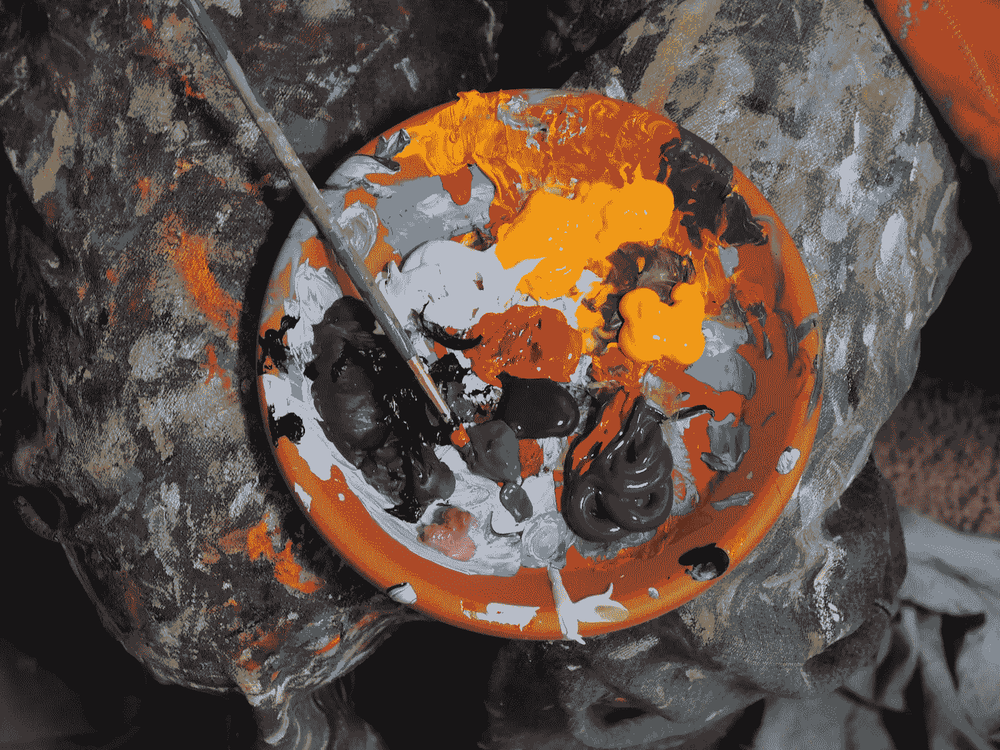
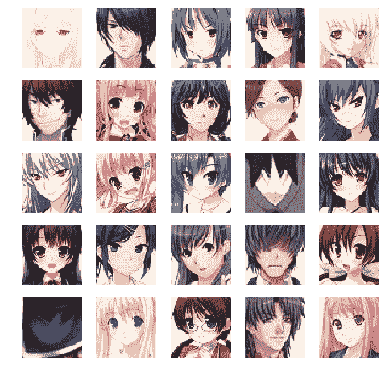
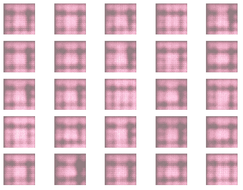
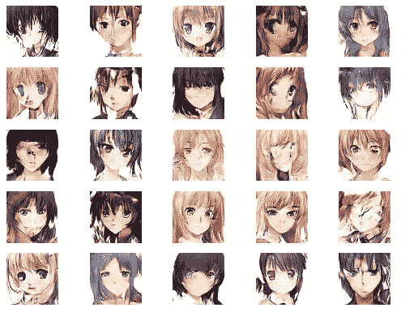

# DCGAN——在 TensorFlow 中实现深度卷积生成对抗网络——白痴开发者

> 原文：<https://medium.com/analytics-vidhya/dcgan-implementing-deep-convolutional-generative-adversarial-network-in-tensorflow-idiot-41b2ddf9eddb?source=collection_archive---------8----------------------->



来源:照片由[迈克·彼得鲁奇](https://unsplash.com/@mikepetrucci?utm_source=unsplash&utm_medium=referral&utm_content=creditCopyText)在 [Unsplash](https://unsplash.com/s/photos/painter?utm_source=unsplash&utm_medium=referral&utm_content=creditCopyText) 上拍摄

在本教程中，我们将在动漫人脸数据集上实现一个深度卷积生成对抗网络(DCGAN)。代码用 TensorFlow 2.2 和 Python 3.8 编写。

据脸书人工智能的主任 Yann LeCun 说，GAN 是“过去 10 年机器学习中最有趣的想法”

概述:

1.  什么是甘
2.  DCGAN 与香草 GAN 有何不同
3.  动漫人脸数据集
4.  履行
5.  摘要

# 甘是什么

生成对抗网络(Generative Adversarial Network)或 GAN 是一种用于生成建模的机器学习方法，由 [Ian Goodfellow](https://en.wikipedia.org/wiki/Ian_Goodfellow) 和他的同事在 2014 年设计。一个 GAN 由两个模型组成:一个生成器和一个鉴别器，这两个模型通过一个对抗过程同时训练。生成器学习生成看起来像真实图像的图像，而鉴别器学习区分真实和虚假图像。

我们训练这两个模型，直到鉴别器不能区分真实和伪造的图像。

了解更多:[甘——什么是生成性对抗网络？](https://idiotdeveloper.com/gan-what-is-generative-adversarial-network/)

# DCGAN 和香草 GAN 有什么不同？

Ian Goodfellow 开发的香草 GAN 基于密集或全连接层。DCGAN 或深度卷积生成对抗网络是生成对抗网络(GAN)的扩展，使用卷积和转置卷积层构建。拉德福德等人在论文[中首次描述了 DCGAN，该论文使用深度卷积生成对抗网络](https://arxiv.org/pdf/1511.06434.pdf)进行无监督表示学习。艾尔。

# 动漫人脸数据集

该数据集由从[www.getchu.com](https://www.kaggle.com/soumikrakshit/www.getchu.com)搜集的 21551 张动漫人脸组成，然后使用动漫人脸检测算法对其进行裁剪。为了方便起见，所有图像的大小都调整为 64 * 64。



动漫人脸数据集中的一些图片

> 下载:[动漫脸](https://www.kaggle.com/soumikrakshit/anime-faces)

# 履行

以下代码演示了深度卷积生成对抗网络(DCGAN)在动漫人脸数据集 TensorFlow 中的实现。

# 导入 TensorFlow 和其他库

```
import os
import numpy as np
import cv2
from glob import glob
from matplotlib import pyplot
from sklearn.utils import shuffle
import tensorflow as tf
from tensorflow.keras.layers import *
from tensorflow.keras.models import Model
from tensorflow.keras.optimizers import Adam
```

现在，我们定义动画图像的尺寸。

```
IMG_H = 64 
IMG_W = 64 
IMG_C = 3
```

DCGAN 中所有权重或核的权重初始化必须从均值=0.0 且标准差= 0.02 的正态分布中随机初始化。这个权重初始化器被用于卷积和转置卷积层。

```
w_init = tf.keras.initializers.RandomNormal(mean=0.0, stddev=0.02)
```

# 加载和准备数据集

**load_image** 函数获取一条图像路径并返回一个值在-1 和 1 之间的张量。它执行以下任务:

*   首先，我们读取图像路径。
*   接下来，我们读取 JPEG 图像文件并返回 uint8 张量。
*   接下来，使用任何额外的裁剪或填充来调整图像的大小。
*   图像的数据类型更改为 float 32。
*   现在，我们将图像像素值归一化到-1 到 1 的范围内。

```
def load_image(image_path):
    img = tf.io.read_file(image_path)
    img = tf.io.decode_jpeg(img)
    img = tf.image.resize_with_crop_or_pad(img, IMG_H, IMG_W)
    img = tf.cast(img, tf.float32)
    img = (img - 127.5) / 127.5
    return img
```

**tf_dataset** 函数用于为训练设置 TensorFlow 数据集管道。

```
def tf_dataset(images_path, batch_size):
    dataset = tf.data.Dataset.from_tensor_slices(images_path)
    dataset = dataset.shuffle(buffer_size=10240)
    dataset = dataset.map(load_image, num_parallel_calls=tf.data.experimental.AUTOTUNE)
    dataset = dataset.batch(batch_size)
    dataset = dataset.prefetch(buffer_size=tf.data.experimental.AUTOTUNE)

    return dataset
```

# 转置卷积块

转置卷积用于建立发生器模型。它用于增加传入特征地图的尺寸(高度和宽度)。

```
def deconv_block(inputs, num_filters, kernel_size, strides, bn=True):
    x = Conv2DTranspose(
        filters=num_filters,
        kernel_size=kernel_size,
        kernel_initializer=w_init,
        padding="same",
        strides=strides,
        use_bias=False
    )(inputs)

    if bn:
         x = BatchNormalization()(x)
         x = LeakyReLU(alpha=0.2)(x) return x
```

步长卷积用于建立鉴别器模型。

```
def conv_block(inputs, num_filters, kernel_size, padding="same", strides=2, activation=True):
    x = Conv2D(
        filters=num_filters,
        kernel_size=kernel_size,
        kernel_initializer=w_init,
        padding=padding,
        strides=strides,
    )(inputs) if activation:
         x = LeakyReLU(alpha=0.2)(x)
         x = Dropout(0.3)(x) return x
```

# 发电机

生成器获取潜在向量中的随机噪声，并将其映射到数据空间。因为我们使用 RGB 图像，所以我们的数据空间意味着创建一个 RGB 图像。

发生器从密集层或全连接层开始。之后，是一系列的转置卷积，批量归一化和泄漏 relu 激活函数。

最后，我们使用一个具有三个滤波器和 tanh 激活函数的卷积层来生成 RGB 图像。

```
def build_generator(latent_dim):
    f = [2**i for i in range(5)][::-1]
    filters = 32
    output_strides = 16
    h_output = IMG_H // output_strides
    w_output = IMG_W // output_strides noise = Input(shape=(latent_dim,), name="generator_noise_input") x = Dense(f[0] * filters * h_output * w_output, use_bias=False)(noise)
    x = BatchNormalization()(x)
    x = LeakyReLU(alpha=0.2)(x)
    x = Reshape((h_output, w_output, 16 * filters))(x) for i in range(1, 5):
        x = deconv_block(x,
            num_filters=f[i] * filters,
            kernel_size=5,
            strides=2,
            bn=True
        ) x = conv_block(x,
        num_filters=3,
        kernel_size=5,
        strides=1,
        activation=False
    )
    fake_output = Activation("tanh")(x) return Model(noise, fake_output, name="generator")
```

# 鉴别器

鉴别器是一个简单的二进制分类网络，它获取真实和伪造图像，并输出给定图像是真实还是伪造的概率。

为此，泄漏 relu 使用了一个级数步长卷积，压差为 0.3。最后，我们展平特征地图，并使用 1 个单位的全连通层。接下来，我们对完全连接的层应用 sigmoid 激活函数。

```
def build_discriminator():
    f = [2**i for i in range(4)]
    image_input = Input(shape=(IMG_H, IMG_W, IMG_C))
    x = image_input
    filters = 64
    output_strides = 16
    h_output = IMG_H // output_strides
    w_output = IMG_W // output_strides for i in range(0, 4):
        x = conv_block(x, num_filters=f[i] * filters, kernel_size=5, strides=2) x = Flatten()(x)
    x = Dense(1)(x) return Model(image_input, x, name="discriminator")
```

# 完整的 DCGAN 模型

GAN 类表示完整的 DCGAN 模型，其中定义了训练步骤。它采用鉴别器模型、生成器模式和损失函数。这里使用的损失函数是二元交叉熵。

**train_step** 函数用于训练 DCGAN 模型。训练从鉴别器开始。鉴别器首先被训练在由生成器生成的假图像上。之后，它在动画人脸数据集中的真实图像上进行训练。接下来，基于鉴别器的训练程度来训练生成器。

```
class GAN(Model):
    def __init__(self, discriminator, generator, latent_dim):
        super(GAN, self).__init__()
        self.discriminator = discriminator
        self.generator = generator
        self.latent_dim = latent_dim def compile(self, d_optimizer, g_optimizer, loss_fn):
        super(GAN, self).compile()
        self.d_optimizer = d_optimizer
        self.g_optimizer = g_optimizer
        self.loss_fn = loss_fn def train_step(self, real_images):
        batch_size = tf.shape(real_images)[0]

        for _ in range(2):
            ## Train the discriminator
            random_latent_vectors = tf.random.normal(shape=(batch_size, self.latent_dim)) 
            generated_images = self.generator(random_latent_vectors)
            generated_labels = tf.zeros((batch_size, 1)) with tf.GradientTape() as ftape:
                predictions = self.discriminator(generated_images)
                d1_loss = self.loss_fn(generated_labels, predictions)
            grads = ftape.gradient(d1_loss, self.discriminator.trainable_weights)
            self.d_optimizer.apply_gradients(zip(grads, self.discriminator.trainable_weights)) ## Train the discriminator
            labels = tf.ones((batch_size, 1)) with tf.GradientTape() as rtape:
                 predictions = self.discriminator(real_images)
                 d2_loss = self.loss_fn(labels, predictions) grads = rtape.gradient(d2_loss, self.discriminator.trainable_weights)
            self.d_optimizer.apply_gradients(zip(grads, self.discriminator.trainable_weights)) ## Train the generator
            random_latent_vectors = tf.random.normal(shape=(batch_size, self.latent_dim))
            misleading_labels = tf.ones((batch_size, 1)) with tf.GradientTape() as gtape:
                predictions = self.discriminator(self.generator(random_latent_vectors))
                g_loss = self.loss_fn(misleading_labels, predictions) grads = gtape.gradient(g_loss, self.generator.trainable_weights)
            self.g_optimizer.apply_gradients(zip(grads, self.generator.trainable_weights)) return {"d1_loss": d1_loss, "d2_loss": d2_loss, "g_loss": g_loss}
```

# 保存图像

```
def save_plot(examples, epoch, n):
    examples = (examples + 1) / 2.0
    for i in range(n * n):
        pyplot.subplot(n, n, i+1)
        pyplot.axis("off")
        pyplot.imshow(examples[i]) filename = f"samples/generated_plot_epoch-{epoch+1}.png"
    pyplot.savefig(filename)
    pyplot.close()
```

# 最后，运行代码

```
if __name__ == "__main__":
    ## Hyperparameters
    batch_size = 128
    latent_dim = 128
    num_epochs = 60
    images_path = glob("data/*") d_model = build_discriminator()
    g_model = build_generator(latent_dim) # d_model.load_weights("saved_model/d_model.h5")
    # g_model.load_weights("saved_model/g_model.h5") d_model.summary()
    g_model.summary() gan = GAN(d_model, g_model, latent_dim) bce_loss_fn = tf.keras.losses.BinaryCrossentropy(from_logits=True, label_smoothing=0.1)
    d_optimizer = tf.keras.optimizers.Adam(learning_rate=0.0002, beta_1=0.5)
    g_optimizer = tf.keras.optimizers.Adam(learning_rate=0.0002, beta_1=0.5)
    gan.compile(d_optimizer, g_optimizer, bce_loss_fn) images_dataset = tf_dataset(images_path, batch_size)

    for epoch in range(num_epochs):
        gan.fit(images_dataset, epochs=1)
        g_model.save("saved_model/g_model.h5")
        d_model.save("saved_model/d_model.h5") n_samples = 25
        noise = np.random.normal(size=(n_samples, latent_dim))
        examples = g_model.predict(noise)
        save_plot(examples, epoch, int(np.sqrt(n_samples)))
```

现在，我们将看到在第一个和最后一个时期产生的图像的变化。



第 1 时段生成的图像



在 60 年代生成的图像

因此，你可以看到在 60 个历元上训练 DCGAN 之后，生成器开始生成看起来真实的图像。

# 摘要

在本教程中，我们学习在动画人脸数据集上实现深度卷积生成对抗网络(DCGAN)。我希望在本教程之后，你将开始构建自己的 DCGANs。

还有一些问题，在下面评论我会尽力回答。更多更新。跟我来。

*   [YouTube](https://www.youtube.com/idiotdeveloper)
*   [脸书](https://facebook.com/idiotdeveloper)
*   [推特](https://twitter.com/nikhilroxtomar)
*   [Instagram](https://www.instagram.com/nikhilroxtomar)

*原载于 2020 年 7 月 24 日 https://idiotdeveloper.com*[](http://idiotdeveloper.com/dcgan-implementing-deep-convolutional-generative-adversarial-network-in-tensorflow/)**。**