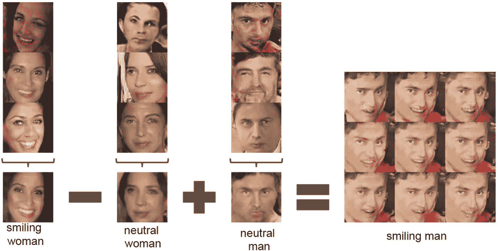
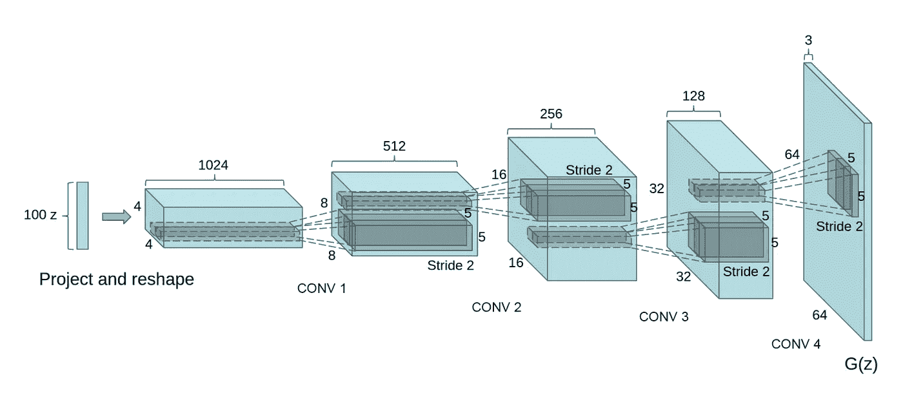
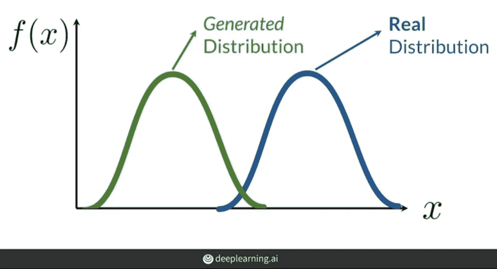

# DCGAN 教程-生成假名人图像

> 原文：<https://medium.com/analytics-vidhya/dcgan-tutorial-by-aniket-maurya-f6c137ef0053?source=collection_archive---------8----------------------->

## 这是一个初学者友好的教程，使用 PyTorch 在 CelebA 数据集上生成假名人图像。

# 什么是 DCGAN？

DCGAN(深度卷积生成对抗网络)由亚历克·拉德福德、卢克·梅茨和索史密斯·钦塔拉在 2016 年创建，用于训练深度生成对抗网络。在 [DCGAN 论文](https://arxiv.org/abs/1511.06434)中，作者训练了可以生成虚假名人图像和虚假卧室的网络。

该架构由两个网络组成——生成器和鉴别器。发电机是甘斯的心脏。它从随机噪声中产生看起来真实的假图像。

> [这篇文章可以作为 Jupyter Notebook 打开，在 CelebA 数据集上训练 DCGAN 生成虚假名人图像。](https://colab.research.google.com/github/aniketmaurya/blog/blob/master/_notebooks/2020-11-16-DCGAN.ipynb#scrollTo=vNMrpS4lf4It)

鉴别者希望真假图像分布尽可能远，而生成者希望缩小真假图像分布之间的距离。简单地说，生成器试图通过产生看起来真实的图像来欺骗鉴别器，而鉴别器试图从真实图像中捕捉假图像。



*视觉概念的矢量运算。来源:DCGAN 论文*

# 报纸上的培训详情

预处理:将图像缩放到 tanh 激活范围内，[-1，1]。使用 128 的小批量和学习率为 0.0002 的 Adam optimizer 进行训练。用正态分布μ(0，0.02)初始化的所有权重。

***作者指南*** :

*   所有的池层在鉴别器中被替换为步长卷积，在鉴别器中被替换为分数步长卷积。
*   没有使用完全连接的层或池层。
*   发生器和鉴别器中使用的批处理
*   ReLu 激活用于所有层的生成器，除了使用 tanh 的最后一层
*   鉴别器对所有层使用 LeakyReLu

**在本帖中，我将训练一个 GAN 生成名人脸。**

# 发电机

生成器由转置卷积、批量归一化和激活函数层组成。

*   首先，大小为 100 的随机噪声将被整形为 100 x1x 1(py torch 中的通道优先)。
*   它通过转置的 CNN 层，该层对输入张量进行上采样。
*   应用批量标准化。
*   如果该层不是最后一层，则应用 ReLu 激活。

第一个通道大小是 1024，然后对于 RGB 图像逐块减小到 3。最后，我们将得到一个 3x64x64 的张量，这将是我们的图像。



*来自 DCGAN 论文的发电机架构*

```
**class** **Generator(**nn**.**Module**):**

    **def** __init__**(***self***,** in_channels**=**3**,** z_dim**=**100**):**
        *super***(**Generator**,** *self***).**__init__**()**

        *self***.**gen **=** nn**.**Sequential**(**
            *self***.**create_upblock**(**z_dim**,** 1024**,** kernel_size**=**4**,** stride**=**1**,** padding**=**0**),**
            *self***.**create_upblock**(**1024**,** 512**,** kernel_size**=**4**,** stride**=**2**,** padding**=**1**),**
            *self***.**create_upblock**(**512**,** 256**,** kernel_size**=**4**,** stride**=**2**,** padding**=**1**),**
            *self***.**create_upblock**(**256**,** 128**,** kernel_size**=**4**,** stride**=**2**,** padding**=**1**),**
            *self***.**create_upblock**(**128**,** 3**,** kernel_size**=**4**,** stride**=**2**,** padding**=**1**,** final_layer**=True),**
        **)**

    **def** **create_upblock(***self***,** in_channels**,** out_channels**,** kernel_size**=**5**,** stride**=**2**,** padding**=**1**,** final_layer**=False):**
        **if** final_layer**:**
            **return** nn**.**Sequential**(**
                nn**.**ConvTranspose2d**(**in_channels**,** out_channels**,** kernel_size**,** stride**,** padding**,** bias**=False),**
                nn**.**BatchNorm2d**(**out_channels**),**
                nn**.**Tanh**()**
            **)**
        **return** nn**.**Sequential**(**
            nn**.**ConvTranspose2d**(**in_channels**,** out_channels**,** kernel_size**,** stride**,** padding**,** bias**=False),**
            nn**.**BatchNorm2d**(**out_channels**),**
            nn**.**ReLU**(True)**
        **)**

    **def** **forward(***self***,** noise**):**
        """
        noise: random vector of shape=(N, 100, 1, 1)
        """
        **assert** *len***(**noise**.**shape**)==**4**,** 'random vector of shape=(N, 100, 1, 1)'

        **return** *self***.**gen**(**noise**)**
```

# 鉴别器

鉴别器的架构与普通图像分类模型的架构相同。它包含卷积层、激活层和批处理标准化。在 DCGAN 的论文中，使用跨距而不是池来减小内核的大小。此外，网络中没有完全连接的层。使用泄漏斜率为 0.2 的泄漏 ReLU。

鉴别器想要预测假图像是假的，而真实图像是真实的。另一方面，生成器想要欺骗鉴别器，使其将生成器生成的假图像预测为真实图像。



*来源:deep learning . ai GANs specialization*

*来源:deep learning . ai GANs specialization*

```
**class** **Discriminator(**nn**.**Module**):** **def** __init__**(***self***,** im_chan**=**3**,** hidden_dim**=**32**):**
        *super***(**Discriminator**,** *self***).**__init__**()**
        *self***.**disc **=** nn**.**Sequential**(**
            *self***.**make_disc_block**(**im_chan**,** hidden_dim**),**
            *self***.**make_disc_block**(**hidden_dim**,** hidden_dim ***** 2**),**
            *self***.**make_disc_block**(**hidden_dim*****2**,** hidden_dim ***** 4**,** stride**=**1**),**
            *self***.**make_disc_block**(**hidden_dim*****4**,** hidden_dim ***** 4**,** stride**=**2**),**
            *self***.**make_disc_block**(**hidden_dim ***** 4**,** 1**,** final_layer**=True),**
        **)** **def** **make_disc_block(***self***,** input_channels**,** output_channels**,** kernel_size**=**4**,** stride**=**2**,** final_layer**=False):**
        **if** **not** final_layer**:**
            **return** nn**.**Sequential**(**
                nn**.**Conv2d**(**input_channels**,** output_channels**,** kernel_size**,** stride**),**
                nn**.**BatchNorm2d**(**output_channels**),**
                nn**.**LeakyReLU**(**0.2**)**
            **)**
        **else:**
            **return** nn**.**Sequential**(**
                nn**.**Conv2d**(**input_channels**,** output_channels**,** kernel_size**,** stride**)**
            **)** **def** **forward(***self***,** image**):**
        disc_pred **=** *self***.**disc**(**image**)**
        **return** disc_pred**.**view**(***len***(**disc_pred**),** **-**1**)**
```

根据论文定义学习率、z_dim(噪声维数)、批量和其他配置。

# 鉴频器损耗

由于鉴别器想要增加生成的和真实的分布之间的距离，我们将训练它在生成的图像被分类为真实的或者真实的图像被分类为假的时候给出高损失。

# 发电机损耗

当发生器不能欺骗鉴别器时，BCE 损失将会很高。当生成的图像被鉴别器鉴别为伪图像时，会造成很大的损失。*注意，生成器永远不知道真实图像。*

```
display_step **=** 500n_epochs **=** 50
cur_step **=** 0
mean_generator_loss **=** 0
mean_discriminator_loss **=** 0
**for** epoch **in** *range***(**n_epoch**):**
    **for** real**,** _ **in** tqdm**(**dataloader**):**
        real **=** real**.**to**(**device**)**

        *# update the discriminator*
        *# create fake images from random noise*
        disc_optimizer**.**zero_grad**()**
        noise **=** torch**.**randn**(**cur_batch_size**,** z_dim**,** 1**,** 1**,** device**=**device**)**
        fake_images **=** gen**(**noise**)**
        logits_fake **=** disc**(**fake_images**.**detach**())**
        logits_real **=** disc**(**real**)**

        disc_loss_fake **=** criterion**(**fake_logits**,** torch**.**zeros_like**(**loss_fake**))**
        disc_loss_real **=** criterion**(**real_logits**,** torch**.**ones_like**(**logits_real**))**

        disc_loss **=** **(**disc_loss_fake **+** disc_loss_real**)** **/** 2
        *# Keep track of the average discriminator loss*
        mean_discriminator_loss **+=** disc_avg_loss**.**item**()** **/** display_step

        disc_loss**.**backward**(**retain_graph**=True)**
        disc_optimizer**.**step**()**

        *# Update the generator*
        gen_optimizer**.**zero_grad**()**
        noise **=** torch**.**randn**(**cur_batch_size**,** z_dim**,** 1**,** 1**,** device**=**device**)**
        fake_images **=** gen**(**noise**)**
        logits_fake **=** disc**(**fake_images**)**

        gen_loss **=** criterion**(**logits_fake**,** torch**.**ones_like**(**logits_fake**))**
        gen_loss**.**backward**()**
        gen_optimizer**.**step**()**

        *# Keep track of the average generator loss*
        mean_generator_loss **+=** gen_loss**.**item**()** **/** display_step

        *## Visualization code ##*
        **if** cur_step **%** display_step **==** 0 **and** cur_step **>** 0**:**
            *print***(**f"Step {cur_step}: Generator loss: {mean_generator_loss}, discriminator loss: {mean_discriminator_loss}"**)**
            show_tensor_images**(**fake_images**)**
            show_tensor_images**(**real**)**
            mean_generator_loss **=** 0
            mean_discriminator_loss **=** 0
        cur_step **+=** 1
```

# 参考

[1.】[深度卷积生成对抗网络的无监督表示学习](https://arxiv.org/pdf/1511.06434.pdf)

[2.】[生成性对抗网络(GANs)专门化](https://www.coursera.org/specializations/generative-adversarial-networks-gans)

[3.】 [DCGAN 教程— PyTorch 官方](https://pytorch.org/tutorials/beginner/dcgan_faces_tutorial.html)

如果你想深入学习 GANs，我强烈推荐 Coursera 上的 [GANs 专精](https://www.coursera.org/specializations/generative-adversarial-networks-gans)。

如果你得到了一些反馈，请通过[https://twitter.com/aniketmaurya](https://twitter.com/aniketmaurya)联系我