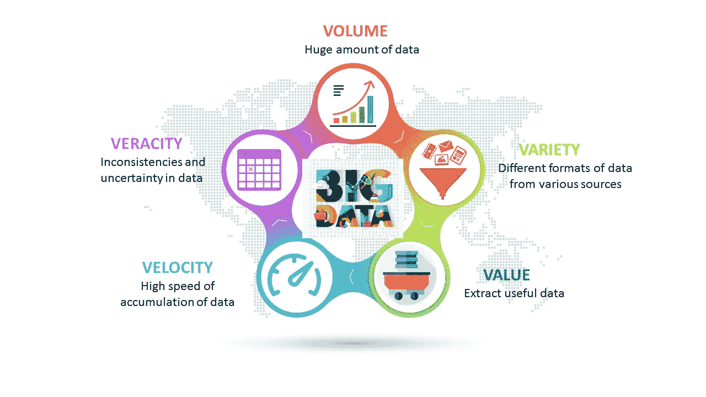

# 处理大数据分析，尤其是在医疗保健领域——零起点！

> 原文：<https://medium.com/analytics-vidhya/dealing-with-big-data-analysis-particularly-on-healthcare-domain-ground-zero-509d7de0485e?source=collection_archive---------11----------------------->

[大数据](https://www.google.com/imgres?imgurl=https%3A%2F%2Fwww.learntek.org%2Fblog%2Fwp-content%2Fuploads%2F2018%2F05%2Fbig-data-2.jpg&imgrefurl=https%3A%2F%2Fwww.learntek.org%2Fblog%2Fimportance-big-data-analytics%2F&docid=6YaBHghxTE4tpM&tbnid=-tpHikz0xzM3lM%3A&vet=10ahUKEwjEgbbs2rHmAhUkjuYKHaTVCQ8QMwiJASgRMBE..i&w=847&h=480&hl=en-IN&authuser=0&bih=529&biw=1280&q=big%20data&ved=0ahUKEwjEgbbs2rHmAhUkjuYKHaTVCQ8QMwiJASgRMBE&iact=mrc&uact=8)

> “数据将成为 21 世纪的新石油”——*我们中有多少人听过这句话？老实说，随着技术世界的最新趋势和我们在数字空间中花费的时间，每秒产生的数据量，而不是每秒产生的数据量仍然是巨大的！这适用于每一个领域和行业。医疗保健领域就是这样一个细分市场，它有巨大的潜力从定期收集的大量数据中创造奇迹。*

数据是新的石油吗？

现在，当我们谈论“**大数据**时，我们主要谈论大数据的 5 个 **V** s，如下所示:

大数据的 5v。

1.  **卷** —大数据是指持续流入和收集的用于具体分析和研究目的的大量数据。
2.  **速度** —当我们要处理大数据时，我们不仅要处理海量数据，还要应对数据流入的不断增长的速度。对于非常关键的用例，尤其是医疗保健领域，尤其是对于实时分析，速度是一个应该处理的关键组件。
3.  **多样性** —通常，收集的数据可能不是来自单一来源，可能不具有相同的性质或维度，因此在合并时，数据需要具有统一的维度，以提高分析质量。
4.  **准确性** —由于采集数据时遵循的机制，数据的准确性或真实性始终是一个问题，因此需要在实际分析开始之前进行验证，否则将导致错误的结果。
5.  **Value —** 减少噪音数据，只提取有用的！

由于医疗保健领域的变化性质，对于医疗保健应用程序，我们需要提供具有可扩展架构的可扩展系统，以处理大数据。因此，构建实际基础设施的初始投资非常重要，任何漏洞都可能造成数据丢失，甚至错误和不可靠的结果。

数据科学和大数据系统已经产生影响甚至可以产生更大影响的典型医疗保健应用:

> 1.**预测建模** —从历史医疗记录中找出有意义的预测模型，预测未来的预测。
> 
> 2.**计算表现型**——将嘈杂的电子病历转化为临床概念
> 
> 3.**患者相似性**——根据患者医疗条件的相似性形成患者群，以便可以应用相似的治疗程序。

现在进入一些细节…..

什么是预测建模？

使用各种数据科学或机器学习算法，我们可以建立预测模型或通用算法，这些模型或算法对过去的历史数据起作用，并且根据从历史数据获得的特征，可以预测未来。现在，预测建模并不总是容易的，它有自己的一系列挑战。

**预测建模的挑战:**

> 1.**数据量和健全性** —有时，数据量很大，但并不干净，可能充满了大量噪音。因此，预处理大量数据并使其可用始终是一个挑战。在运行大容量模型时，处理内存泄漏也是大多数数据科学家必须处理的问题。
> 
> 2.**预测建模管道** —对于可持续和可扩展的解决方案，准备好从数据流到模型生成以及最终模型验证的管道极其重要。对于医疗保健领域的大数据分析，管道通常如下所示:
> 
> 开始->群组构建->特征提取->交叉验证->特征选择->分类->输出->模型性能评估
> 
> 所以，在接下来的教程中，我会详细介绍每一个，但是现在，我只想向你们介绍这些概念。

预测建模流程

什么是计算表型？

它是从多个来源收集原始数据，然后提取所需的表型，最后归类到医学概念中的过程。如前所述，健康或电子医疗记录可能会非常混乱，而且以其非常原始的格式，可能没有任何用处。因此，计算表型分析只不过是一种生物医学信息学方法，用于识别具有相似健康状况的患者群体。

**典型挑战:**

由于电子病历(EMR)相当杂乱，大部分精力通常花在数据预处理步骤上。这通常包括以下内容:

> 1.处理缺失数据
> 
> 2.处理重复
> 
> 3.删除无关数据
> 
> 4.去除多余的方法或技术来收集数据。

计算表型过程涉及许多算法，有时可以是基于规则的，或者有时可以使用机器学习和深度学习模型和算法来导出。

现在，我们需要识别表型算法的各种数据源，以便开始。

计算表型数据源:

> 1.人口统计学的
> 
> 2.诊断报告
> 
> 3.药物详情
> 
> 4.实验室测试
> 
> 5.临床试验

所以，所有这些来源都是非常重要的信息来源，可以用来提出计算表型算法。

电子病历中 T2DM 病例的识别算法

什么是患者相似性？

由于医疗记录的巨大可用性，对基于**患者相似性**的疾病诊断和预后预测建模的兴趣一直在增长。精准医疗利用遗传、表型或社会心理特征为治疗目标提供患者子集的精确识别。因此，定义患者相似性度量是将患者分成具有临床意义的亚组的必要步骤。

因此，各种聚类算法被应用于相同的情况。

患者相似性

*整理笔记！*

因此，总而言之，典型的大数据算法通常会解决以下问题:

> 1.分类
> 
> 2.使聚集
> 
> 3.降维
> 
> 4.图形分析

为了在特定的医疗保健用例上提出这样的算法，需要一个可持续的基础设施。

大数据系统:

1. **Hadoop** —基于分布式磁盘的大数据系统

2. **Spark** —分布式内存系统(快得多)

[Hadoop 系统架构](https://www.google.com/url?sa=i&source=images&cd=&ved=2ahUKEwiCw6KL2rHmAhV4xzgGHekVCZ0QjRx6BAgBEAQ&url=https%3A%2F%2Fwww.ibmbigdatahub.com%2Fblog%2Fwhat-hadoop&psig=AOvVaw22TmYc2ELLzGiZLO-On5rC&ust=1576294858235730)

[火花系统架构](https://www.google.com/url?sa=i&source=images&cd=&cad=rja&uact=8&ved=2ahUKEwi0_6j12bHmAhUpyjgGHah1AxMQjRx6BAgBEAQ&url=https%3A%2F%2Fbacktobazics.com%2Fbig-data%2Fspark%2Funderstanding-apache-spark-architecture%2F&psig=AOvVaw0oT3whx967XzwsnlAuq3pT&ust=1576294805343007)

因此，大数据系统的一些关键概念和术语是:

> Hadoop -> Map-Reduce -> HDFS ->猪-> Hive -> HBase
> 
> Spark-> Apache Spark-> Spark SQL-> Spark Streaming-> MLib(ML)-> Graphx(Graph)

最后一节看起来是不是很高级？好了，不要担心，我们将在接下来的教程中详细讨论这些内容！

**参考文献:**

其中一些概念摘自佐治亚理工学院副教授孙教授的 Udacity 课程:[https://www . uda city . com/course/big-data-analytics-in-health care-ud 758](https://www.udacity.com/course/big-data-analytics-in-healthcare--ud758)以及他的 Sun labs([http://Sun lab . org/teaching/CSE 6250/spring 2019/env/env-local-docker . html # _ 1-start-the-container-with](http://sunlab.org/teaching/cse6250/spring2019/env/env-local-docker.html#_1-start-the-container-with))

*继续关注接下来的教程，详细了解这些概念，并随时告诉我你对内容的反馈，这样我就可以做得更好！*