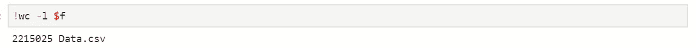
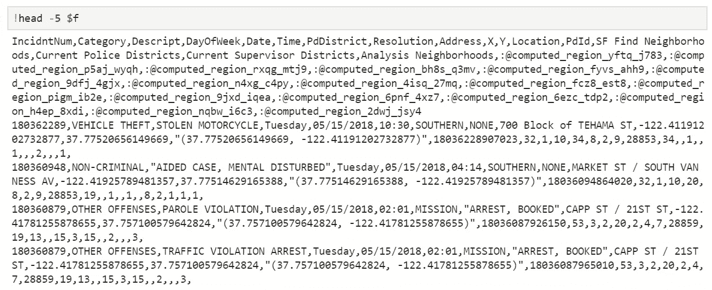
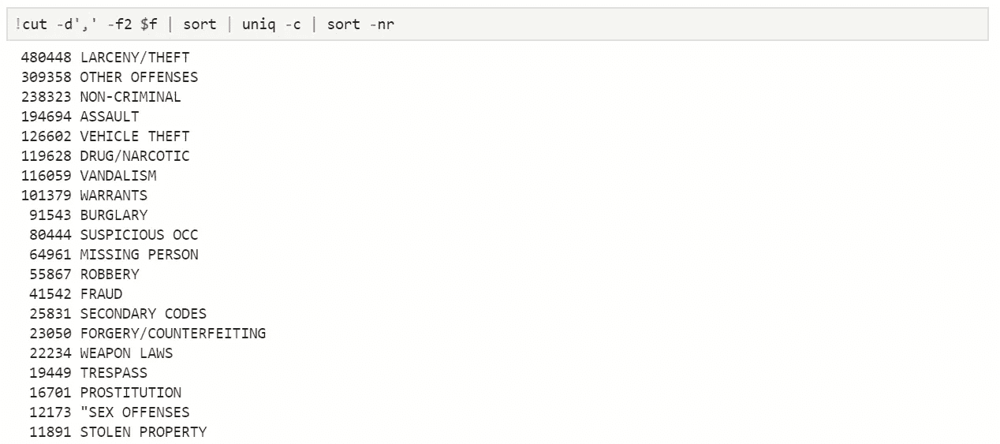
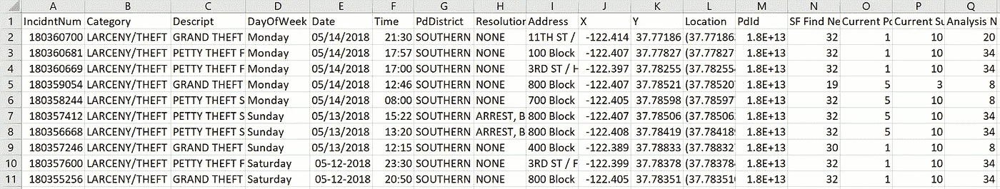

# 使用 Unix 命令在 Python 中处理大数据集

> 原文：<https://medium.com/analytics-vidhya/dealing-with-big-datasets-in-python-using-unix-commands-5d278da0e8f2?source=collection_archive---------17----------------------->


作为一名数据科学家，在您的分析过程中，您肯定会遇到比系统上的可用内存更大的大数据集。在这种情况下，一次性加载整个数据集是不可能的。例如，我的系统通常有 4GB 的空闲内存，而我处理过的一些数据集的大小超过了 4GB。对于这篇文章，作为一个例子，我决定使用一个我在以前的文章中用过的小型 CSV 数据集，即 SF 犯罪数据集。

当你发现自己在处理这样的情况时，有两个广泛的选择可以帮助你。

首先，您可以读取文件的前几行或文件的一半，在这种情况下使用 pandas 中的 read_csv 函数，并在处理数据集之前感受一下它的结构。这种方法的主要缺点是，您分析所需的数据可能不在您刚刚加载的样品中。例如，因为我只想要数据集中与特定地区和犯罪类别相对应的行；加载整个数据集的一部分对我的分析没有任何帮助。我们当然可以解决这个问题，但这是另一篇博文的内容。

第二种方法(我实际上想讨论的一种)是使用 Unix 命令按原样浏览整个文件。如果你像我在这个例子中一样在 Jupyter 笔记本上工作，它允许通过在前面加上一个“！”来运行 Unix 命令符号。因为 CSV 文件已经是结构化的，所以使用这种方法可以使浏览它的任务变得更容易。

在我进入命令之前，我只想说 Unix 为您提供了许多不同的选项来执行特定的操作。例如，您可以使用命令“grep”、“sed”甚至“awk”来提取具有特定模式的行。下面使用的命令是我在许多可用选项中挑选出来的，并发现它们是合适的。另一个人可能觉得不同的命令组合更适合他们的目的。

那么，让我们来看看我用来获取数据集信息的一些 Unix 命令。

```
wc -l <filename>
```

*   这里，wc(字数)和选项“l”一起给出了文件中的行数
*   这当然包括表头！



“wc”的输出

```
head -n <filename>
```

*   类似于 pandas 中的 head(n)函数，它给出了文件的前 n 行
*   此输出将让您对文件中的数据结构有一个大致的了解；标题将为您提供列名，前几行将为您提供每列中包含的数据类型



“头”的输出

```
cut -d’,’ -f6 <filename> | sort | uniq -c
```

*   类似于 pandas 中的 value_counts()函数，我使用这个命令获得我感兴趣的列的唯一值及其计数
*   这就是管道运营商介入的地方。管道是一种形式重定向，在这里它重定向一个命令的输出作为下一个命令的输入
*   “d”选项用于指定分隔符，在本例中为“，”
*   “f”选项用于指定字段编号(在本例中为一列)
*   然后对 cut 的输出进行排序，最后显示第 6 列中的唯一值(这里列的编号不是从 0 开始)
*   “c”选项给出了每个唯一值的计数
*   你可能想知道为什么 sort 要用在‘uniq’之前；这是因为“uniq”命令从输入中删除重复的行，并且只检测这些重复是相邻的；这是通过“排序”实现的
*   我再次使用了 sort，以降序显示计数；“n”表示数字排序(升序)，“r”表示相反的结果



“剪切、排序、唯一”的输出

```
head -1 $f > output.csv
awk -F, ‘{ if(($2 == “LARCENY/THEFT”) && ($7 == “SOUTHERN”)) { print} } $f >> output.csv
```

*   这里，第一个命令将标题行打印到输出文件，第二个命令使用条件语句选择行，并将它们打印到同一个输出文件
*   >'运算符创建一个新文件(如果它不存在)或覆盖现有文件
*   >>'运算符创建一个不存在的新文件，或者追加到现有文件中



“awk”的输出