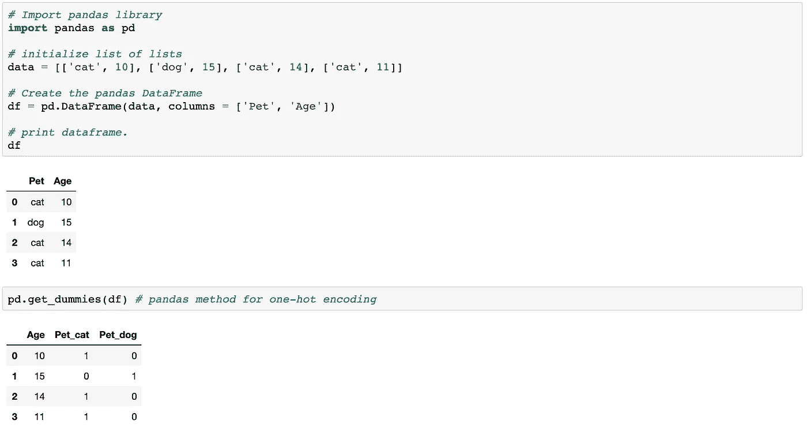
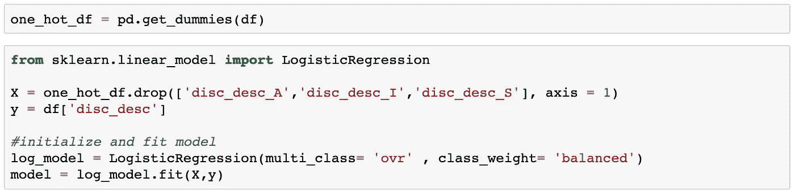
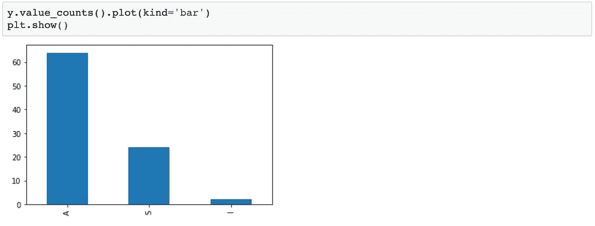
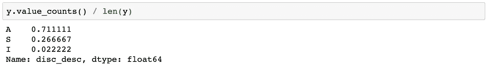
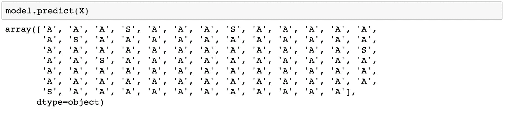
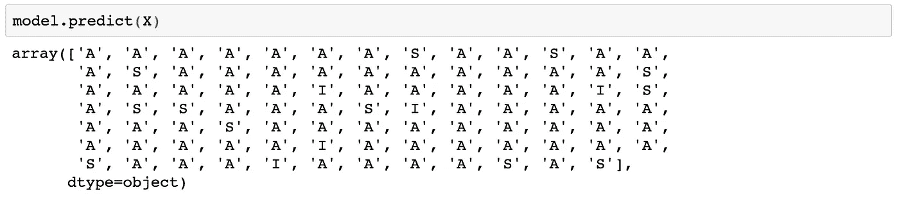
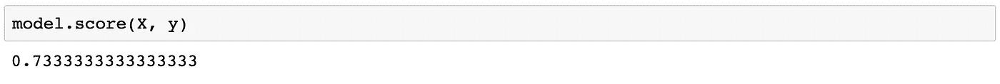

# 处理分类数据

> 原文：<https://medium.com/analytics-vidhya/dealing-with-categorical-data-942a8c8fdbad?source=collection_archive---------6----------------------->


## 用于机器学习-多目标回归

在我们的[上一节](/@mulbahkallen/exploring-linear-regression-474752ba1761)中，我们通过将单一线性回归模型改为多元线性回归模型，极大地提高了我们的 R 分数。这是通过将剩余的预测因子(特征)添加到我们的线性回归模型中并重新调整(重新训练)它来实现的。

这很容易做到，因为我们所有的额外预测因子都是数值，但如果它们不是呢？查看下面的[数据集](https://archive.ics.uci.edu/ml/datasets/Post-Operative+Patient)，注意它包含数值和分类数据。你会注意到我们的数据集大部分是分类的。

重要的是要指出，范畴变量有两种类型，名词性和序数。


有序分类变量的一个例子是**大小**记录为**小、中**或**大**即*大>中>小。* 另一方面，名义分类变量可以是注册为**猫、狗**或**鸟的**宠物**,**从机器学习模型的角度来看，猫不应包含任何小于或大于狗或鸟的内在值。

在训练我们的机器学习模型时，这种区别的重要性是显而易见的。模型无法按原样处理分类数据，分类数据必须转换成数字。危险在于我们如何去转换我们的数据。

对于顺序数据，给数据分配以下数值没有问题。

```
L - 3
M - 2 
S - 1 
```

我们的模型将考虑尺寸差异 L>M>S 与相应的 3>2>1 的内在本质。

另一方面，将 **1 的值指定给**猫**，将**的值指定给 **2** 并将**鸟**的值指定给 **3** 可能会导致我们的模型错误解释**猫、狗**和**鸟**的值，从而极大地影响我们模型的误差函数

```
[Error function](https://towardsdatascience.com/understanding-the-3-most-common-loss-functions-for-machine-learning-regression-23e0ef3e14d3) — a method of evaluating how well specific algorithm models the given data
```

对此的一个解决方案是一键编码的方法。这种方法允许我们为预测值(特征)的每个变量赋予一个二进制值，该值可以被我们的模型准确读取，而不会赋予一个变量比另一个变量更多的权重。这将看起来像下面的例子。



现在让我们把目光转回我们的原始数据集。似乎我们的目标数据类型也是分类的。此外，我们的目标不是二元的，而是多类的。同样，数据集的目的是能够预测三种情景中的**一种。根据病人目前的状况，他们应该被送到重症监护室(I)、普通医院(A)还是疗养院(S)。如果我们的目标是二进制的，一旦我们的数据集被一次性编码，我们可以再次使用线性回归模型，但是在这种情况下，这是不可能的。**

我们的下一个选择是研究逻辑回归。虽然回归这个词是在它的名字中，逻辑回归是一个真正的分类模型，而不是回归。大多数情况下，逻辑回归模型旨在解决二元分类问题，但 SciKit Learn 允许我们调整逻辑回归分类器，以处理多类目标。

在你检查并清理完你的数据集后，只需要几行代码就可以一次性编码我们的数据，初始化并拟合我们的逻辑回归模型，然后看看我们的模型表现如何。



注意我们的多类调优被设置为‘ovr ’,意思是[一个对其余的](https://en.wikipedia.org/wiki/Multiclass_classification)

将 class_weight 设置为“平衡”的原因是，当涉及到我们的目标时，值会不相称。



“平衡”模式使用 y 值来自动调整与输入数据中的类别频率成反比的权重”。

这样做是为了让我们的模型不会假设，因为 70%的目标值确实是 A，它应该只在 70%的时间里猜测 A。



请注意，当我们的逻辑回归平衡与不平衡时，会出现两个输出。我们的不平衡预测主要由 A 组成，而我们的平衡预测更准确地代表真实数据。



**不平衡**



**平衡的**

让我们看看我们的最终得分。



这里有一些事情需要考虑。我们的模型只比 A 与我们其余数据的比例预测稍好。这应该导致我们对我们的模型有点怀疑，但我们确实平衡了我们的逻辑回归模型，所以也许我们的模型是好的(80%或更高将是更好的)。从现在开始，我们的目标是回头看看是否有更好的方法来微调我们的模型并提高我们的分数。


“逻辑回归用于分类，而我们正在处理的问题是分类，逻辑回归是最简单的分类线性模型。”——Dave