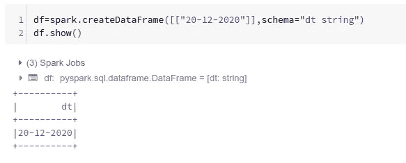
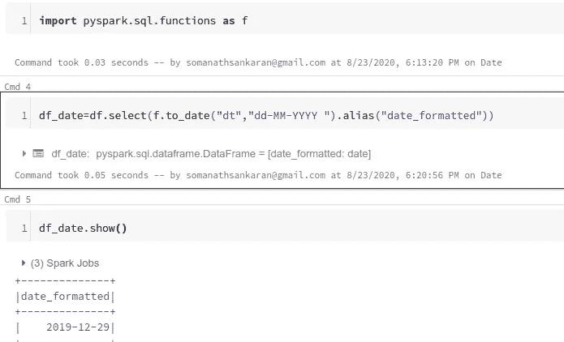
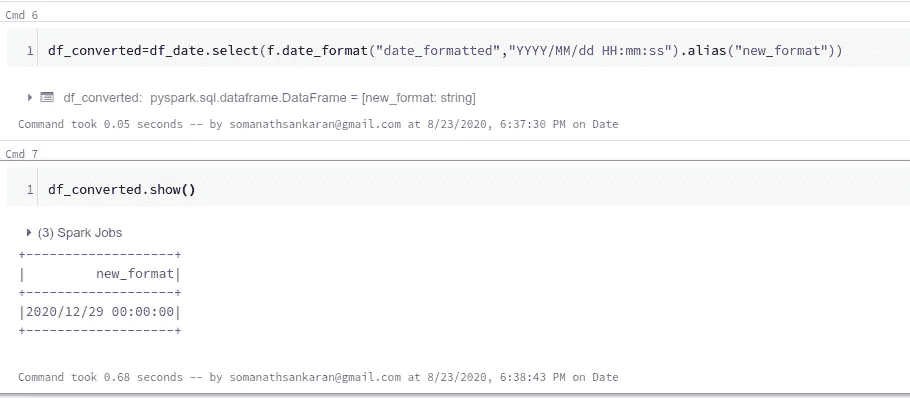
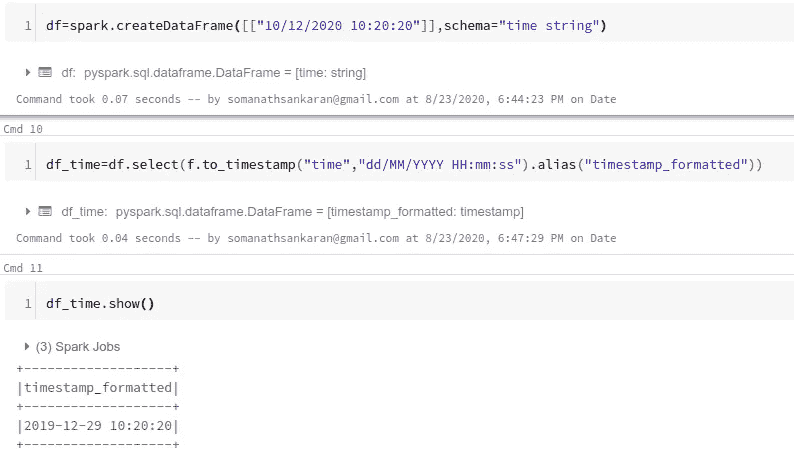
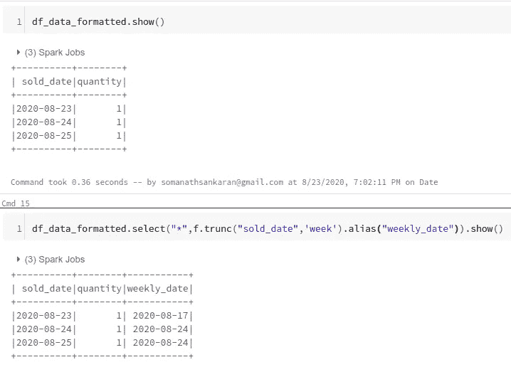
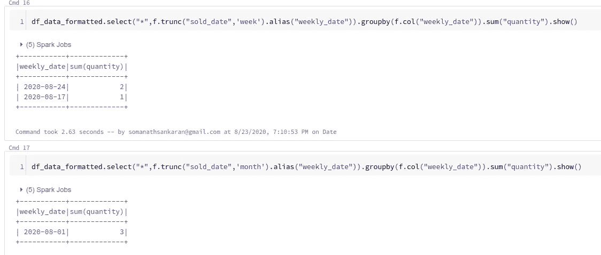

# 在 Pyspark 中处理日期

> 原文：<https://medium.com/analytics-vidhya/dealing-with-dates-in-pyspark-a0f7d789c1fd?source=collection_archive---------5----------------------->

这是我在《火花深潜》中的一个故事

## [https://medium.com/@somanathsankaran](/@somanathsankaran)

作为一名数据工程师，最常见的用例是调整各种来源的数据。

在这篇博客中，我们将看到以下内容

1.  从一种日期形式转换到另一种日期形式
2.  从一种时间戳格式转换为另一种格式
3.  每月、每周汇总数据

> **Spark 默认假设日期为“YYYY-MM-DD”(2020–08–22)**

## 从一种日期形式转换到另一种日期形式。

**第一步:将日期转换成标准格式**

我们从源系统获得的数据可能不符合如下所示的要求格式，这是很常见的，明智的做法是将数据作为字符串加载，因为作为日期加载会导致数据丢失。

无格式日期

> 因此，为了将其转换为标准日期格式，我们必须使用 **to_date** 函数，该函数接受字符串列和日期所在的格式

在我们的例子中是“dd-MM-YYYY”

> *df _ date = df . select(f . to _ date(" dt "，" dd-MM-YYYY ")。别名(" date _ formatted ")*

使用 to_date 转换为 date

## 第二步:转换成想要的格式:

> 我们可以使用 date_format 函数转换到所需的格式，该函数接受 2 个参数的日期字段和需要显示的格式，即“YYYY/MM/dd HH:mm:ss”

> 注意:因为它不是 spark 日期格式，所以它的数据类型是 string

字符串形式的转换日期

**从一种时间戳格式转换为另一种格式**

与 to_date 类似，spark 必须将 to_timestamp 转换成时间戳，然后我们就可以利用日期格式来转换我们需要的任何时间戳格式

转换时间戳

## **每月、每周汇总数据**

这是一个常见的用例，我们可能需要在每月、每周等级别进行聚合，因为我们可以在 spark 中截断函数

> 例如，我们将考虑 8 月 23 日、24 日、25 日这三个日期，其中 23 日、24 日在 8 月 24 日这一周(假设这一周从周一开始)，我们将按周进行求和

使用 trunc 函数将日期转换为周的开始

现在，我们将汇总数据，并创建每月和每周的报告

每周和每月的销售数量

因此，在这篇博客中，我们学习了如何将数据从一种格式转换成另一种格式，以及如何每周进行汇总

Github 链接:[https://github . com/SomanathSankaran/spark _ medium/tree/master/spark _ CSV](https://github.com/SomanathSankaran/spark_medium/tree/master/spark_csv)