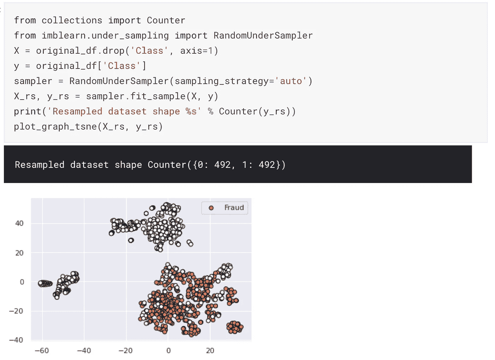
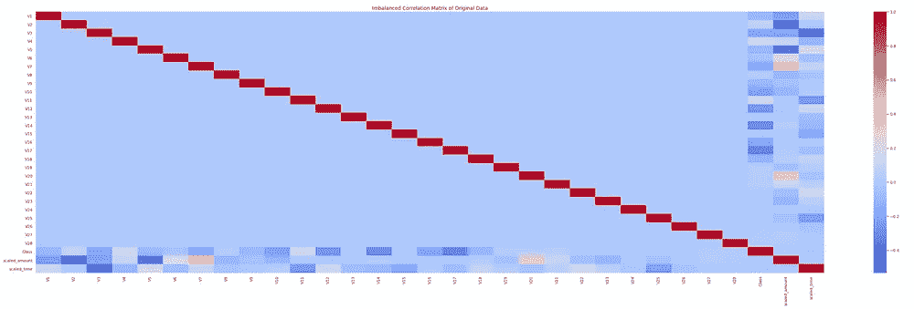
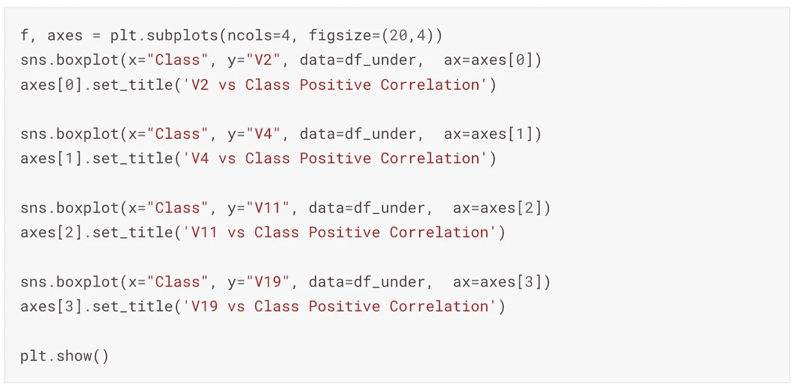

# 处理不平衡数据集(欠采样)

> 原文：<https://medium.com/analytics-vidhya/dealing-with-imbalanced-dataset-undersampling-4e9b488a97c6?source=collection_archive---------4----------------------->


考尔·克里斯詹在 [Unsplash](https://unsplash.com?utm_source=medium&utm_medium=referral) 上拍摄的照片

为了训练一个好的分类模型，我们需要每个类别有几乎相等数量的数据。数据点的数量越多，模型的学习效果就越好。在现实世界中，可能会出现一个类完全支配另一个类的情况。此外，如果我们试图训练，我们的模型可能会偏向一个阶级。因此，在不平衡数据集上训练模型时，我们必须遵循某些非常有用的技术。

**不平衡分类—** 分类预测建模问题，其中样本在类别间的分布不相等。例如，如果我们有 99%的非欺诈交易案例，只有 1%的欺诈交易案例，并且只有这些案例构成我们的训练数据集。如果我们试图在这个数据集上训练一个模型，那么我们的模型将有利于具有最高百分比的类。这意味着，我们的模型看到的高级数据比低级数据多，因此它可以更好地学习高级数据的模式。这代表了不平衡分类问题的一个例子。

我们将进一步展示处理这种不平衡数据集的技巧和技术。我们考虑了来自信用卡欺诈检测挑战的数据集。详情[点击这里](https://www.kaggle.com/mlg-ulb/creditcardfraud)。

整个实现也可以在[这里](https://www.kaggle.com/nvnvashisth/dealing-with-imbalanced-dataset)找到。

我们将继续前进，并遵循一定的步骤来实现我们的目标。

## **1。数据清理、探索和可视化**

我们使用熊猫图书馆阅读了这些数据，并详细研究了这些数据。从这些数据中可以得出几个推论。


使用熊猫图书馆读取信用卡. csv 文件

***观察***

—为了保护用户的身份并生成匿名数据，数据提供商已经执行了 PCA 并给出了需要用于进一步分析的组成变量。

—查看数据后，未对“时间”和“金额”列进行缩放。因此，我们将通过某种缩放算法来缩放数据，使其与其他变量相似。

—类有两个值，即“0”→非欺诈交易和“1”→欺诈交易。

—数据集中不存在空值。

接下来，我们在数据集中寻找可用的类，并计算它们的数量。


***观察***

—可以观察到，与欺诈交易相比，非欺诈交易的数量过多。

—如果我们试图应用机器学习来训练分类算法，那么它将偏向于非欺诈交易。

因此，我们将探讨不同的过采样和欠采样技术。

我们现在将检查数据的偏斜度，这可能会导致整个数据集的缩放。我们可以看到“时间”和“数量”的分布图，看看它们在高斯曲线中是如何分布的。我们可以看到，图表是高度倾斜的。因此，缩放数据变得非常重要。


数量和时间的分布和偏斜度检查

sklearn 包中有各种类型的缩放技术。检查哪种缩放方法可以最好地缩放我们的变量将是有趣的，这将有助于我们的高斯曲线的数据中心。我们测试了各种缩放技术，如 StandardScaler、MinMaxScaler 和 RobustScaler，并决定使用 RobustScaler。鲁棒定标器不容易出现异常值。更多详情请访问此处页面— [其他缩放方法之间的比较。](https://scikit-learn.org/stable/auto_examples/preprocessing/plot_all_scaling.html)


鲁棒定标技术

为了查看我们的数据集，我们需要将维数减少到 2。我们有三种选择:

1.  [主成分分析](https://setosa.io/ev/principal-component-analysis/)
2.  [奇异值分解](https://towardsdatascience.com/svd-8c2f72e264f)
3.  [t 分布随机邻居嵌入(t-SNE)](https://mlexplained.com/2018/09/14/paper-dissected-visualizing-data-using-t-sne-explained/)

我们观察到，tSNE 显示准确，可以清楚地区分欺诈和非欺诈案件。

首先，我们将执行欠采样，并进一步检查我们的模型如何在欠采样数据上执行。对于不同的[欠采样](https://imbalanced-learn.readthedocs.io/en/stable/api.html#module-imblearn.under_sampling)技术，有很大的库可以进一步探索。

我们的目标是从每个类中创建相等的采样数据，以消除数据集中的偏差。正如我们之前所理解的，我们只有 492 类非欺诈样本，那么我们必须只取 492 个欺诈样本。因此，对于 imblearn 库，我们将使用 RandomUnderSampler。



欠采样数据的可视化

## **2。数据优化**

让我们画出不同特征的相关矩阵。我们绘制了欠采样数据和原始数据的相关矩阵。



**相关矩阵左**:欠采样数据，**右**:原始数据

1.  异常检查的负相关性— v3、v9、v10、v12、v14、v16、v17 高度负相关。
2.  异常的正相关 chcek — v2、v4、v11、v19 高度正相关。

我们将继续为上述特征创建箱线图，以寻找可用的异常值。一旦绘制了上述负特征和正特征的箱线图，我们观察到大量可用的异常值(也称为异常检测技术之一)。



高度正相关特征的箱线图

我们还绘制了特征的分布图，看它们偏离正态分布的程度。


**离群点剔除**

为了去除足够数量异常值，我们尝试了 Z 值法和 IQR 法。

1.  Z-score 法:Z-Score 背后的直觉是通过找到它们与该组数据点的标准差和均值的关系来描述任何一个数据点。Z-score 是寻找平均值为 0 且标准差为 1 的数据分布，即正态分布。在大多数情况下，使用阈值 3 或-3，即如果 Z 分值分别大于或小于 3 或-3，
2.  IQR 方法:IQR 在寻找数据分布方面有点类似于 Z-score，然后保留一些阈值来识别异常值。然后，我们乘以阈值(1.5)，并尝试只包括那些值。

我们观察到，IQR 方法往往会删除太多的离群值，因此我们将继续使用 Z-score 方法。


剔除异常值后的欠采样数据

## 3.建模和培训

我们用上述数据训练不同的模型，并进行交叉验证。我们观察到 XGBoost 分类器做得很好。这可能是因为它所遵循的基于随机森林的增强技术。关于模型选择和训练的细节，请访问这里。

```
from sklearn.linear_model import LogisticRegression
from sklearn.model_selection import cross_val_score
from sklearn.metrics import roc_curve, auc, classification_report
from sklearn.naive_bayes import GaussianNB
from sklearn.ensemble import RandomForestClassifier, AdaBoostClassifier
from sklearn.discriminant_analysis import LinearDiscriminantAnalysis
from sklearn.gaussian_process import GaussianProcessClassifier
import xgboost
from sklearn import svm, tree
from sklearn import metrics

classifiers = []
nb_model = GaussianNB()
classifiers.append(("Gausian Naive Bayes Classifier",nb_model))
lr_model= LogisticRegression()
classifiers.append(("Logistic Regression Classifier",lr_model))
# sv_model = svm.SVC()
# classifiers.append(sv_model)
dt_model = tree.DecisionTreeClassifier()
classifiers.append(("Decision Tree Classifier",dt_model))
rf_model = RandomForestClassifier()
classifiers.append(("Random Forest Classifier",rf_model))
xgb_model = xgboost.XGBClassifier()
classifiers.append(("XG Boost Classifier",xgb_model))
lda_model = LinearDiscriminantAnalysis()
classifiers.append(("Linear Discriminant Analysis", lda_model))
gp_model =  GaussianProcessClassifier()
classifiers.append(("Gaussian Process Classifier", gp_model))
ab_model =  AdaBoostClassifier()
classifiers.append(("AdaBoost Classifier", ab_model))

cv_scores = []
names = []
for name, clf **in** classifiers:
    print(name)
    clf.fit(X_train, y_train)
    y_prob = clf.predict_proba(X_test)[:,1] # This will give you positive class prediction probabilities  
    y_pred = np.where(y_prob > 0.5, 1, 0) # This will threshold the probabilities to give class predictions.
    print("Model Score : ",clf.score(X_test, y_pred))
    print("Number of mislabeled points from **%d** points : **%d**"% (X_test.shape[0],(y_test!= y_pred).sum()))
    scores = cross_val_score(clf, X, y, cv=10, scoring='accuracy')
    cv_scores.append(scores)
    names.append(name)
    print("Cross validation scores : ",scores.mean())
    confusion_matrix=metrics.confusion_matrix(y_test,y_pred)
    print("Confusion Matrix **\n**",confusion_matrix)
    classification_report = metrics.classification_report(y_test,y_pred)
    print("Classification Report **\n**",classification_report)
```


XGBoost 分类器统计

如果你喜欢这些技巧和技术，那么请鼓掌，分享和评论反馈。敬请关注更多博客！