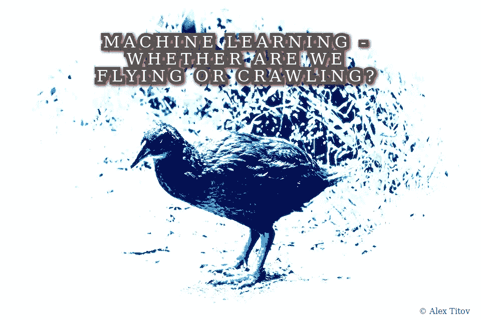
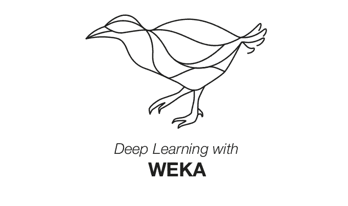

# 基于 WEKA 的 Java 文本分类器

> 原文：<https://medium.com/analytics-vidhya/debit-and-credit-classifier-based-on-java-or-how-non-flying-bird-weka-helps-to-solve-the-problem-428204e5a6d2?source=collection_archive---------9----------------------->

**确定金融服务交易方向的主题已经得到了充分的研究，但是还有新的方法和工具可以在不同的层面上解决这个问题。本文主要研究基于 Java 中 WEKA 框架的事务文本分类器。**



亚历克斯·蒂托夫版权所有

在过去的几十年里，金融服务发展迅速。现代金融包括银行、贷款、税收、投资管理、转账和支付。所有这些组件几乎全部迁移到了虚拟空间。在线办公室和移动客户端为用户提供了对服务的持续访问。这些资源方便实用，提供个人和企业级别的服务，以及持续运行的客户服务系统。这些工具允许进行各种类型的货币交易。电子服务在不断发展，自动化，变得“更智能”

电子金融最基本的技术目标之一是确定物质资源(支出/收入)的流向。如何确定一笔银行交易在某个时间是流入还是流出？

在澳大利亚工具 [WEKA](https://www.cs.waikato.ac.nz/ml/weka/) 的帮助下，这些和其他类似的任务很容易实现自动化。该工具提供了数据分析和机器学习的方法，包括金融文本的处理。

韦卡是一种不会飞的鸟，属于 T4 秧鸡科，是纽西兰特有的鸟类。在新西兰怀卡托大学用 Java 编写并在 GNU GPL 许可下发布的自由软件的作者和开发者选择了这只鸟作为“核心”,并教给了它很多东西。



版权来自 https://deeplearning.cms.waikato.ac.nz/

尽管它的名字奇怪而有趣，但 WEKA 是一种能够解决复杂金融任务的工具。

我们来看看用关键词对一笔金钱交易进行分类的问题。这个目标非常类似于垃圾邮件分类器:如果二进制垃圾邮件分类器被适当地修改，它可能变成借贷分类器。

可以在朴素贝叶斯分类器上开发二元分类器，朴素贝叶斯分类器基于贝叶斯定理及其关于测试独立性的严格(“朴素”)假设。因此，WEKA 为贝叶斯分类器提供了一个强有力的工具。

Java 和 Weka 工具导入

创建一个名为 DebitCreditWekaClassifier.java 的类，该类准备数据集并训练分类器的模型。

```
public class DebitCreditWekaClassifier {...}
```

输入受保护的类变量，即不能从外部访问的类变量。在这种情况下，我们有 FilteredClassifier 过滤器的对象和 logger 类的 Logger。FilteredClassifier 对象是分类器的对象。分类器基于数据通过的过滤器(具有权重或系数的结构)。滤波器的结构及其系数仅基于训练数据集。测试数据将由滤波器处理，而不改变其系数，并且在某些情况下不改变结构。如果在训练后出现不相等的权重或分类错误，则重新处理数据的实例或属性。通常，使用来自原始训练数据集的替代样本。所以所有的过滤器权重在它们被传送到最终的分类器之前被指定(重新配置)。

记录器和其他私有变量

训练数据 *trainData。* txt 将包含一组实例和标签。

属性类是 wekaAttributes。属性一旦创建，就不能更改。可能有以下类型的属性:数字、字符串、日期、关系和名义。最后一种类型是一组固定的标称值。更多关于 WEKA 属性的信息，点击[这里](https://weka.sourceforge.io/doc.dev/weka/core/Attribute.html)。

让我们继续描述基本的类方法。首先，我们将看一下*的 DebitCreditWekaClassifie* r 类构造函数。看起来是这样的:

类的构造函数

该方法包含分类器*分类器*的未训练实例。要确定分类算法，请设置多项式朴素贝叶斯分类器 NaiveBayesMultinomial()(有关详细信息，请参阅)。在 *wekaAttributes* 中定义模型属性。第一个属性是 *attributeText* 。此处将放置培训的标记文本；该模型将处理文本数据。将定型数据的类标签添加到 classAttribute 容器中；在我们的例子中，有两种类型的标签:**借方**和**贷方**。至此，构造函数的形成完成。

现在，我们必须将数据转换成所需的 ARFF ( [属性关系文件格式](https://www.cs.waikato.ac.nz/ml/weka/arff.html))格式。上传并保存 ARFF 格式的数据。

加载训练数据

我们必须创建**一个过滤器，将字典转换成*stringtowordpvector**过滤器*的属性矢量**。属性向量是表示特定对象的数字参数的 n 维向量。

为了获得一组基于文本数据的向量，有必要将训练样本分割成短语。为此，添加一个标记器，将数据分成短语或 N 元语法。N-gram 通常是一个单词范围。对于这个实验，短语的大小被设置为只有一个单词*tokenizer . setngramminsize(1)*。作为分隔符，让我们指定任何非字母数字字符“\\W”。看起来是这样的:*tokenizer . set delimiters(" \ \ W ")*。将指定的标记器应用于 filter.setTokenizer(标记器)。以下是过滤器功能中包含的标准过程—转换为小写*filter . setlowercasetokens(true)*。然后，我们将新配置的过滤器应用于 *classifier.setFilter(filter)。*

现在，让我们继续对准备好的数据进行分类器的训练。

构建模型的分类器

培训在没有错误和记录的情况下进行。之后，必须创建并保存 MODEL = " MODEL/debit _ credit _ MODEL . dat "模型。

运行测试以分析获得的模型，并将结果写入记录器。

```
LOGGER.info("Evaluation Result: \n"+wt.evaluate());
....
Analysis resultCorrectly Classified Instances           8              100      %
Incorrectly Classified Instances         0                0      %
Kappa statistic                          1     
Mean absolute error                      0.2334
Root mean squared error                  0.2456
Relative absolute error                 46.6838 %
Root relative squared error             49.1217 %
Total Number of Instances                8
```

由于测试样本较短，相对和绝对分类误差相当高，需要扩大测试数据集。值得注意的是，所有的测试示例都没有出现错误。因此，我们有一个最小可行的产品( [MVP](https://steelkiwi.com/blog/what-mvp-and-why-it-necessary/) )的交易分类器，它可以成为任何金融服务的核心，用于确定交易的方向。

参见项目[https://github.com/AlexTitovWork/testWekaClassify](https://github.com/AlexTitovWork/testWekaClassify)网站上的完整代码。

祝福你，亚历克斯！

[https://github.com/AlexTitovWork](https://github.com/AlexTitovWork)