# 借助 Tensorboard 调试 DNN

> 原文：<https://medium.com/analytics-vidhya/debugging-dnn-with-help-of-tensorboard-f737b7bc5ed9?source=collection_archive---------0----------------------->

即使对于领域专家来说，调试神经网络也是一项艰巨的工作。数以百万计的参数粘在一起，即使一个小小的变化也可能毁掉你所有的努力。没有调试和可视化，你所有的行为都是在扔硬币，更糟糕的是，它在消耗你的时间。
虽然您可能熟悉 TensorFlow，但还有 TensorBoard，这是一种内置的模型可视化工具和监视器，可让您专注于模型问题。


在对 TensorBoard 的功能产生兴趣后，我想要一个简单但有用的演示来演示如何使用 TensorBoard，但找不到，所以我决定制作一个。在本文中，我将设置一个示例问题，用 TensorBoard 在 TensorFlow 中实现一个简单的模型，并解释为了开始使用 TensorBoard， ***YOU*** 需要了解的细节。

注意，我将假设你熟悉机器学习和 Python(如果你正在寻找一个关于机器学习的轻度非技术介绍，我强烈推荐:[机器学习很有趣](/@ageitgey/machine-learning-is-fun-80ea3ec3c471))。

**那么，什么是 Tensorboard 呢？**

TensorBoard 是一个基于浏览器的应用程序，可以帮助您可视化您的训练参数(如重量和偏差)、指标(如损失)、超参数或任何统计数据。它是一种工具，用于提供机器学习工作流程中所需的测量和可视化。它支持跟踪实验指标，如损失和准确性，可视化模型图，将嵌入投影到低维空间，等等。

# Tensorboard 入门

**步骤 1:-** 如果你正在使用 Jupyter Notebook 并想在其中使用，那么在一个单元格中运行下面的代码。

```
%load_ext tensorboard
```

这将为当前会话初始化笔记本中的 tensorboard。

为了理解它是如何工作的，让我们用一个例子来测试一下，看看它是如何工作的。

**第二步:-** 低载你要处理的数据。
这里我们将使用最著名的 MNIST 数据集，它是数字(0–9)图像的集合。

```
mnist = tf.keras.datasets.mnist

(x_train, y_train),(x_test, y_test) = mnist.load_data()
x_train, x_test = x_train / 255.0, x_test / 255.0
```

**步骤 3:-** 创建模型架构。
我们先用一个非常基础的模型架构做试错。

```
def create_model():
  return tf.keras.models.Sequential([
    tf.keras.layers.Flatten(input_shape=(28, 28)),
    tf.keras.layers.Dense(512, activation='relu'),
    tf.keras.layers.Dropout(0.2),
    tf.keras.layers.Dense(10, activation='softmax')
  ])
```

**第四步:-** 创建一个 Tensorboard 回调函数。
`tf.keras.callback.TensorBoard`回调确保日志被创建和存储。

```
log_dir="logs/fit/" + datetime.datetime.now().strftime("%Y%m%d-%H%M%S")
tensorboard_callback = tf.keras.callbacks.TensorBoard(log_dir=log_dir, histogram_freq=1)
```

这里 log_dir 是我们将要存储所有生成的日志的目录

**第五步:-** 训练模型，通过回调函数。

```
model = create_model()
model.compile(optimizer='adam',
              loss='sparse_categorical_crossentropy',
              metrics=['accuracy'])
model.fit(x=x_train, 
          y=y_train, 
          epochs=5, 
          validation_data=(x_test, y_test), 
          callbacks=[tensorboard_callback])
```

第六步:- 想象张量板。

```
%tensorboard --logdir logs/fit
```

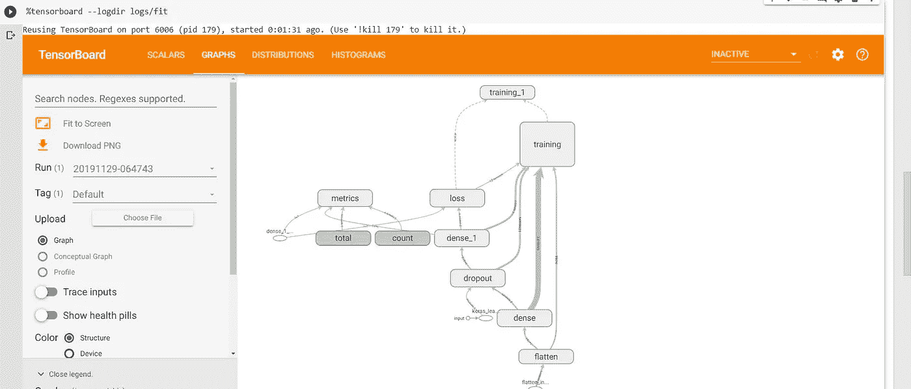

这就是张量板的样子。
现在我们来看看有哪些可用的组件。

# 张量板的组件

**(一)图表:-**

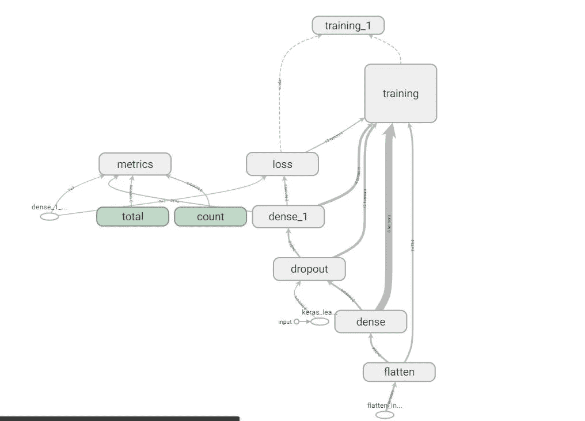

Tensorboard 图是非常复杂的，让它工作的方法给了我们有用的洞察力，我们必须做一些工作来清理结构图。

现在让我们来理解如何解释这个图表。

*   >第一个要点是，具有相同颜色的节点表示它们具有相同的结构，而灰色节点表示每个节点都是唯一的。
*   >您可以单击任何节点，以获取该节点内部的更多详细信息。

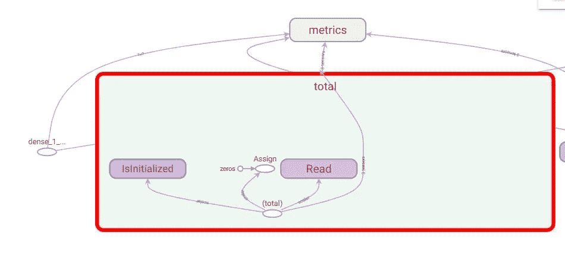

*   >您可以使用 trace_input 按钮，选择任何节点并查看依赖关系。

**(b)摘要:-**

汇总是一种特殊的张量流运算。它将从您的图形中获取常规张量，然后输出包含“汇总”数据的协议缓冲区。
有不同类型摘要-

*   *tf.summary.scalar:-*

这些将写下度量的单个值，如准确性、损失等，它将生成如下输出。

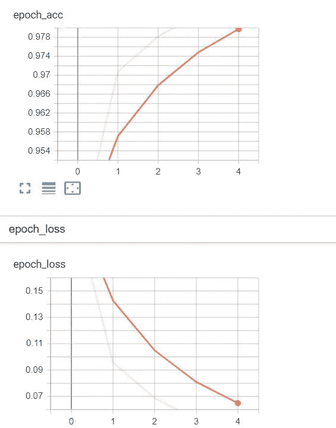

这里，第一个图形表示精度，第二个表示损耗。我们可以观察到该图从 0.954 上升到 0.978，即我们的模型精度逐渐增加。类似地，损失从 0.15 减少到 0.07，即我们的模型正在改进。
但也有一些情况，如下图所示，模型没有学到任何东西，即损失只是在轴上徘徊。这可能表明我们的模型架构可能不好，或者梯度可能太大。这意味着我们的损失不会收敛到全局最小值。

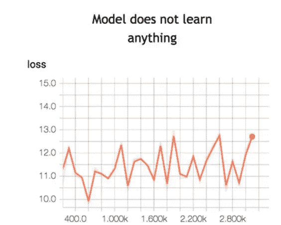

为了最小化这个损失函数，你需要定义一个**学习率。**就是你希望模型学习的速度。如果您将学习速率设置得太高，模型就没有时间学习任何东西。上图就是这种情况。这条线在上下移动，这意味着模型纯粹凭猜测来预测结果。下面的图片显示，损失随着迭代而减少，直到曲线变平，这意味着模型找到了解决方案。

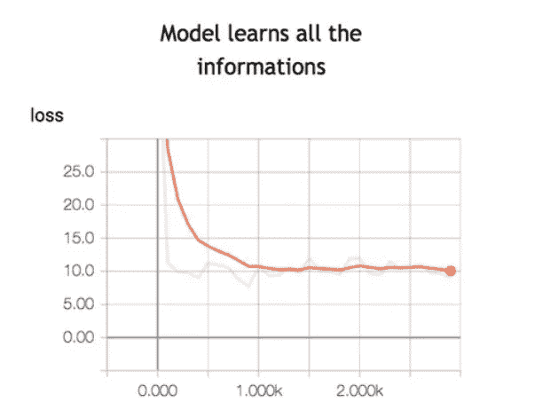

*   *tf.summary.image:-*

这将写出一个图像。例如，它用于查找您是否有生成图像的创成式模型，或者您是否想要查看数据的格式是否正确。


*   *tf.summary.audio:-*

如果您的模型生成音乐进行分析，则可以使用。

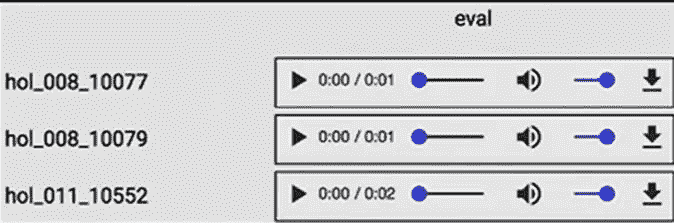

*   *tf.summary.histogram:-*

如果您想观察值随时间或迭代的变化，直方图就派上了用场。它用于绘制非标量张量的直方图。这向您展示了张量值的分布如何随时间或迭代而变化。在 DNN 的情况下，它通常用于检查权重分布和偏差分布。这对于检测网络参数的不规则行为非常有帮助，例如当我们的网络梯度爆炸或收缩时。

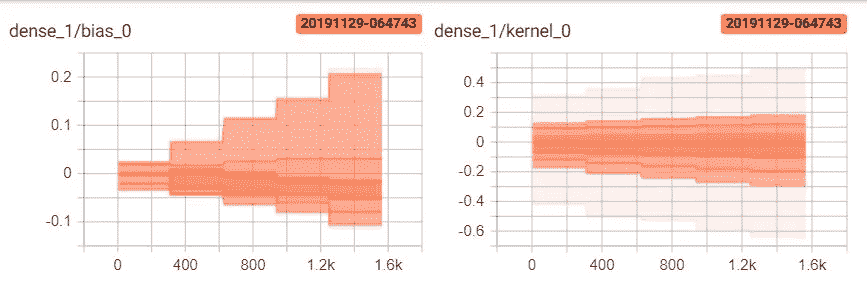

这显示了 dense_1 层的参数分布。

现在让我们来解释直方图。

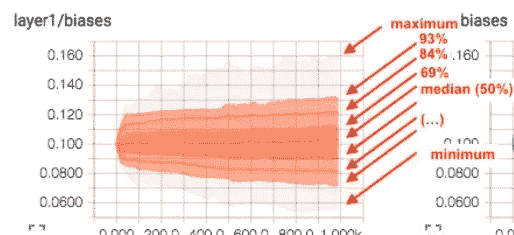

[https://stack overflow . com/questions/38149622/what ' s a-a-good-explain-of-how-to-read-the-histogram-feature-of-tensor board](https://stackoverflow.com/questions/38149622/what-is-a-good-explanation-of-how-to-read-the-histogram-feature-of-tensorboard)

此处标记为 93%的曲线是第 93 个百分位数，这意味着在时间步长 1.00k 时，93%的观察值低于值~0.130。因此，该图给出了 3 项信息，即在神经网络训练计算的每个时间步长，低于某一特定值的观察值百分比(至少在这种情况下，这是这些步骤的含义)。这让你感觉到你的人际网络的价值分布。

这些最小值和最大值也可以给出训练期间值的范围。

> 所以 y 轴告诉你你感兴趣的值，曲线告诉你百分点，x 轴告诉你步长。

让我们了解如何解释梯度:-

关于训练深度模型的问题:

*   重量初始化。如果你用随机的小权重初始化网络，当你观察顶层的梯度时，你会发现它们变得越来越小，然后第一层几乎没有变化，因为梯度太小而不能进行显著的更新。没有机会有效地学习第一层，就不可能更新和学习一个好的深度模型。
*   如果你设置的权重不正确，你的网络会因为零梯度或者所有神经元的相似更新而变得不可训练。你也应该记住，权重是与学习率相关联的，所以大的学习率和大的权重会导致 NaN 问题。
*   非线性激活。当人们用`sigmoid`或`tanh`作为激活函数时，梯度，同上，越来越小。只是提醒公式的参数更新和梯度。

**那么我们怎么知道它的消失梯度问题呢？**如果网络遭受消失梯度问题，那么从顶部传递的梯度应该非常接近零，并且网络的权重几乎不变/更新。

**那么我们怎么知道它的爆炸梯度问题呢？** 这个问题和消失问题一样，只是每一步的梯度变得越来越大。一个主要的解决方法是使用渐变剪辑，基本上是为渐变设置硬限制。

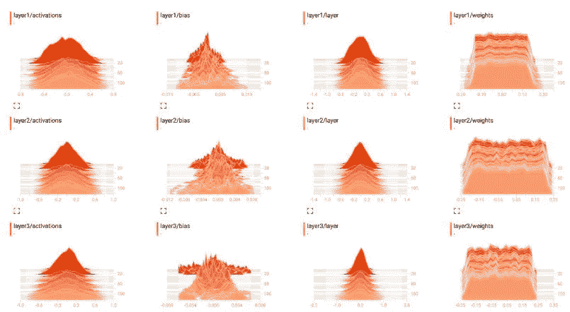

[示例:-](https://stackoverflow.com/questions/42315202/understanding-tensorboard-weight-histograms) 前三层梯度变化不大，这意味着模型在那个时期没有学习。

有了这些知识，你就可以将 TensorBoard 应用到任何其他类型的模型中，以确保**你**在执行模型迭代时优化你的时间。

# 示例:-消失梯度问题

让我们举一个小例子，看看爆炸梯度如何影响我们。我们将使用 scikit_learn 中的 make_circles 数据集。
sci kit-learn 类提供了 [make_circles()函数](http://scikit-learn.org/stable/modules/generated/sklearn.datasets.make_circles.html)，该函数可用于创建具有指定数量的样本和统计噪声的二元分类问题。

每个例子都有两个输入变量，定义二维平面上的点的 *x* 和 *y* 坐标。这两个类的点排列成两个同心圆(它们有相同的中心)。

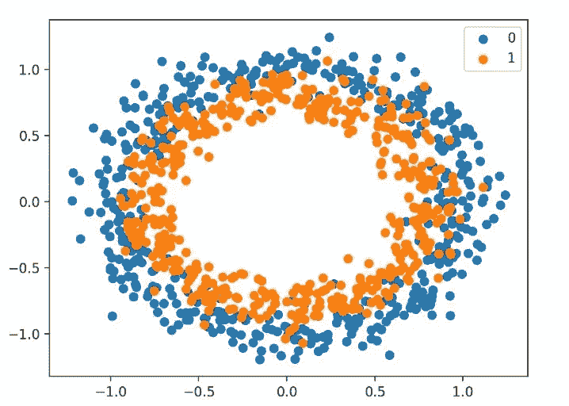

我们知道，梯度消失的问题出现在深层，那里的梯度变得如此之小，以至于两个时期之间的权重相差不大，换句话说，没有学习。
所以一个更深层次的模型和不正确的激活函数可能会遇到这种问题。Sigmoid 压缩 0 和 1 之间的值。因此，sigmoid 函数输入的大变化会导致输出的小变化。因此，导数变小。对于只有几层使用这些激活的浅层网络，这不是一个大问题。然而，当使用更多的层时，它会导致梯度太小而不能有效地进行训练。

小的梯度意味着初始层的权重和偏差不会随着每次训练而有效地更新。由于这些初始层通常对识别输入数据的核心元素至关重要，因此会导致整个网络的整体不准确。

所以现在让我们用一个简单的激活了 **tanh** 的模型来尝试一下。

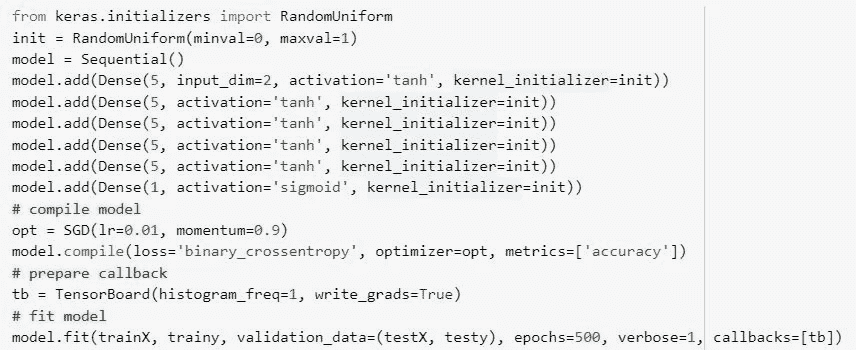

现在让我们检查结果。

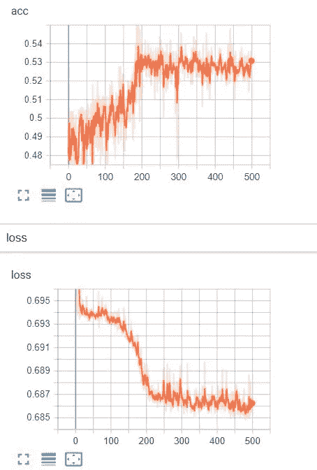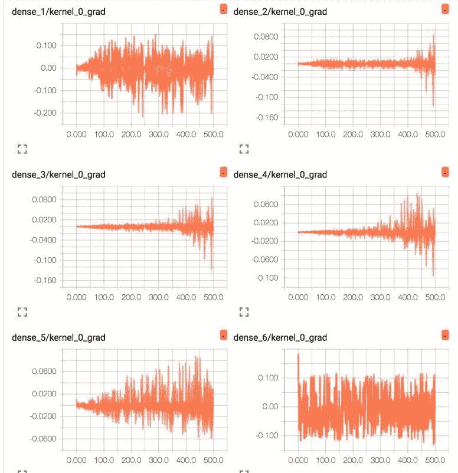

图名表示层，其中“ *dense_1* 表示输入层之后的隐藏层，“ *dense_6* 表示输出层。
我们可以观察到，精度在 54%之后没有增加，损耗停留在 0.687 左右。
如果我们观察梯度的线图，那么我们可以看到输出层在整个运行过程中有很多活动，每个时期的平均梯度在 0.05 到 0.1 左右。我们还可以在第一个隐藏层中看到类似范围的一些活动。 [*因此，渐变正在通过第一个隐藏层，但是最后一个层和最后一个隐藏层看到了大部分的活动。*](http://,)
这基本上意味着内部隐藏层没有学到太多，因为渐变没有流过它。

为了克服这个问题，我们可以使用 **Relu** 函数。当开发多层感知器网络时，校正的线性激活函数已经取代双曲正切激活函数作为新的优选默认。这是因为激活函数看起来和行为像线性函数，使其更容易训练且不太可能饱和，但事实上，它是非线性函数，将负输入强制为值 0。它被认为是在训练更深的模型时解决消失梯度问题的一种可能的方法。有了它，使用 he 权重初始化方案是一个好的实践。

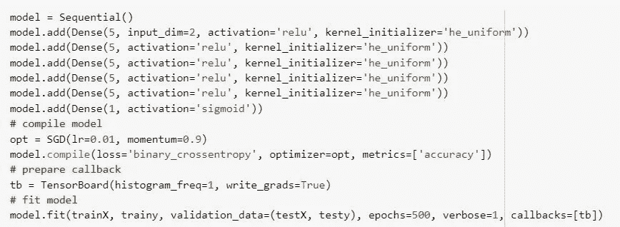

让我们看看结果。

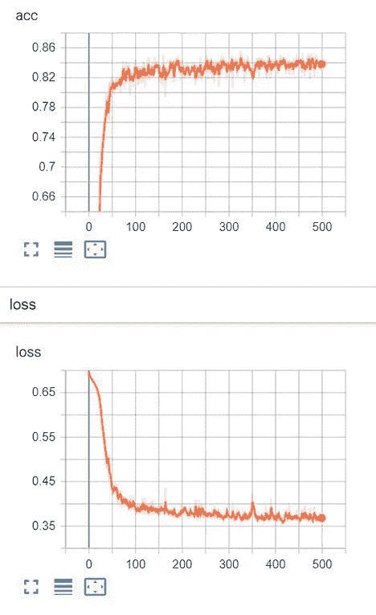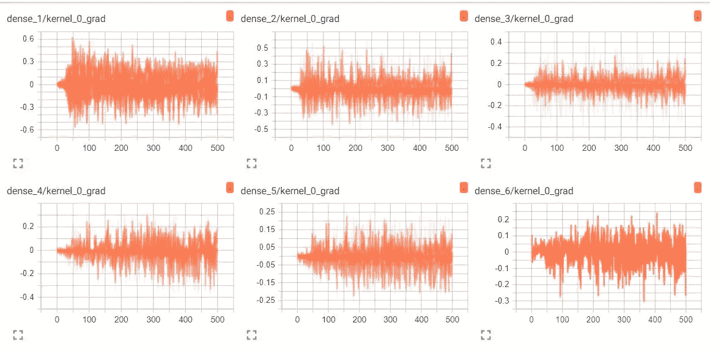

哇，在这种情况下，我们可以看到这个小变化已经允许模型学习问题，实现了大约 84%的准确率，优于使用 tanh 激活函数的单层模型。ReLU activation 函数的使用允许我们为这个简单的问题建立一个更深层次的模型，但是这个功能不能无限扩展。例如，增加层数会导致学习速度变慢，直到大约 20 层时，模型不再能够学习问题。

我们可以看到，第一个隐藏层看到更多的梯度，更一致地具有更大的扩散，可能是 0.2 到 0.4，与 tanh 看到的 0.05 和 0.1 相反。我们还可以看到，中间的隐藏层看到大的梯度。这意味着所有的层都在学习一些东西，否则我们不会得到 84%的**准确率。**

> ReLU 激活功能允许更多的梯度在训练期间通过模型回流，这可能是性能提高的原因。

我们同样可以检测爆炸梯度问题。解决这些问题的其他方法是更高级的激活函数，如 Leaky Relu，使用残差网络，批量标准化(这是一个重大成功),梯度裁剪。

# 参考资料:-

(1)-[https://medium . com/machine-learning-world/how-to-debug-neural-networks-manual-dc2a 200 F10 f 2](/machine-learning-world/how-to-debug-neural-networks-manual-dc2a200f10f2)

(2)-[https://ayearofai . com/rohan-4-the vanishing-gradient-problem-ec68f 76 FFB 9b # . bojpejg 3 o](https://ayearofai.com/rohan-4-the-vanishing-gradient-problem-ec68f76ffb9b#.bojpejg3o)

(3)-[https://machine learning mastery . com/how-to-fix-vanishing-gradients-using-the-corrected-linear-activation-function/](https://machinelearningmastery.com/how-to-fix-vanishing-gradients-using-the-rectified-linear-activation-function/)