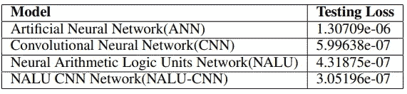
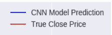
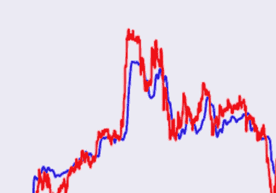
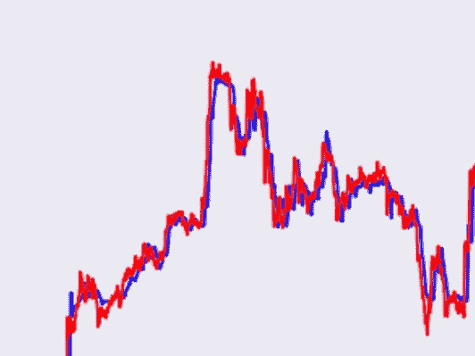
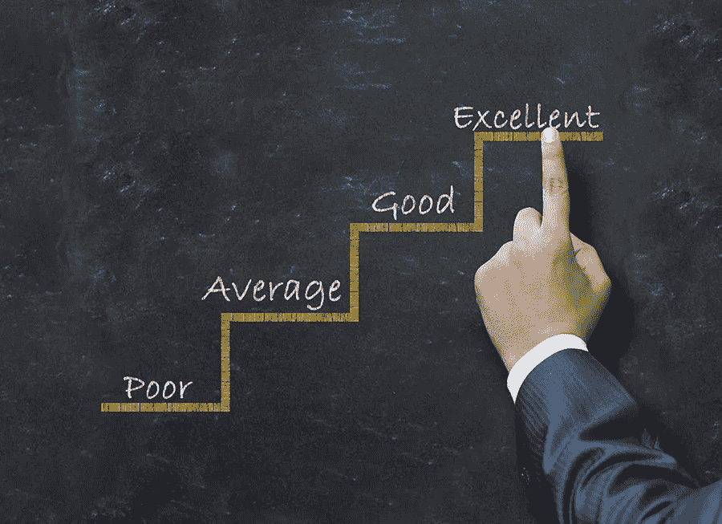

# 深度学习和交易中的欺骗

> 原文：<https://medium.com/analytics-vidhya/deception-in-deep-learning-and-trading-c3ae29cd75f5?source=collection_archive---------19----------------------->

我对深度学习交易感兴趣已经有一段时间了，我注意到声称有办法预测市场的人之间有一个共同的模式。我要讲一篇具体的论文，这似乎是一个很好的证明方法。

https://the savings scientist . com/the-way-to-get-rich-quick-is-to-do-it-slow/。

 [## 用于股票预测的卷积特征提取和神经算术逻辑单元

### 股票预测是一个多年来一直在深入研究的话题。金融专家和数学家已经…

arxiv.org](https://arxiv.org/abs/1905.07581) 

TLDR:论文使用 [NALU](https://arxiv.org/abs/1808.00508) (一种神经网络，在试图学习算术时大受欢迎)来预测股票价格。

现在公平地说(请记住这一点)，他们没有明确地说他们有一个从市场赚钱的系统。但这就是问题所在。

这摘自摘要:

> 在本文中，我们提出了数据驱动的深度学习方法，利用卷积神经网络的特征提取特性和神经算术逻辑单元，用以前的价格预测未来的股票价值。

我不知道你怎么看，但对我来说，他们似乎可以有效地交易市场，我在报纸上没有发现任何反驳。

让我们看看他们的结果:

这里他们向我们展示了一些模型的均方误差损失。他们只是将一个模型与另一个模型进行比较，但没有一个模型显示出实际的投资回报。常识告诉我们，这应该是相关的，所以让我们来看看。

这些部分显示了模型的预测。更多可以在报纸上找到。乍一看我说了两件事:

1.  事实上,**的表现比**要好
2.  哇，预测非常接近

但问题来了。如果你仔细观察，CNN 的行为可以被描述为某种运行平均值，而 CNN 肯定是一种更复杂的获取方式。这可能有一些隐藏的质量，因为在交易中有许多类型的平均线，交易者寻找它们(SMA，EMA，DEMA，TEMA，KAMA，Kijun，SSL，VWAP，TRA，VIDYA，FRAMA 等等)，但你肯定会使用许多其他工具来补充这一点，我们应该期待更多这样的东西。

当然 NALU 更好。嗯，对我来说，它似乎只是给了我们几天的延迟价格。而且在交易中没有比昨天的消息更没用的了。同样，有人可能会找到使用它的方法，但如果它真的做到了它应该做的(根据摘要，它是预测未来价格),那么我们只需要在预测价格高于当前价格时买入(可能至少有一个价差),在预测价格低于当前价格时卖出。如果您打算在这里尝试，我建议您先在演示版上尝试。

旁注:有很多疯狂的想法，利用谷歌搜索关键词和其他内容来击败市场。我确信使用昨天的价格是其中之一(Ichimoku 部分使用了这一点)。但是如果你做了测试，简单的策略是不会长期有效的。如果你愿意，你可以自己做测试，但是一定要有足够大的样本。

沃伦·巴菲特对此不以为然[https://www . CNBC . com/2020/02/21/Warren-Buffett-has-investing-lieutenants-they-they-they-what-they-they-they-being-on . html](https://www.cnbc.com/2020/02/21/warren-buffett-has-investing-lieutenants-who-buy-stocks-for-him-heres-what-they-are-betting-on.html)

现在好了，这可能不是在市场上赚钱的方法，但这篇论文至少完成了其他事情吗？他们没有说他们想赚钱，只是说他们想预测价格和均方差更接近。问题是我认为他们也没有做到。

[https://eige . Europa . eu/gender-mainstreaming/methods-tools/gender-evaluation](https://eige.europa.eu/gender-mainstreaming/methods-tools/gender-evaluation)

选择正确的评估标准并不总是显而易见的。要做到这一点，你应该始终考虑数据集的目的是什么。在股票上，它只是赚钱。我们可以说预测未来价格有点像，但在这种情况下，我们不能接受预测平均值或昨天的价格。那不是有用的深度学习。