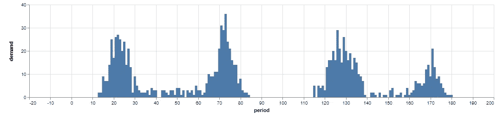
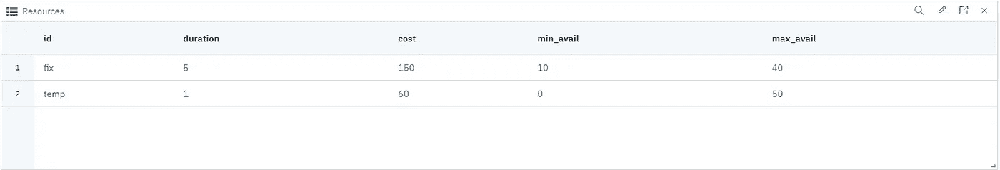
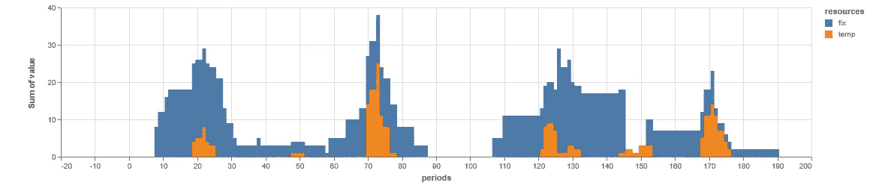
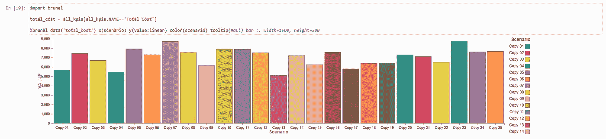
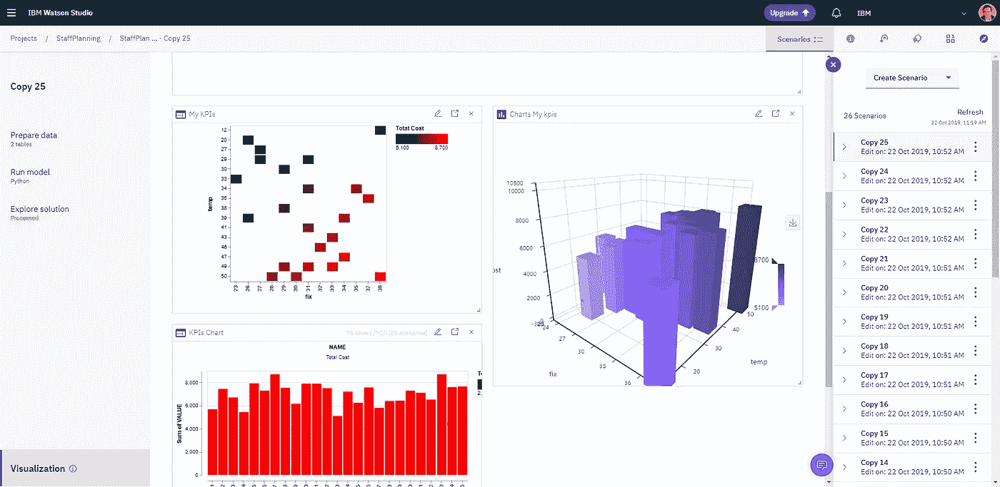

# 决策优化灵敏度分析

> 原文：<https://medium.com/analytics-vidhya/decision-optimization-sensitivity-analysis-d1e4b123732e?source=collection_archive---------6----------------------->

当您开发新的决策优化模型时，您希望了解新的输入数据如何影响解决方案。借助 Watson Studio 的决策优化，您可以轻松生成和解决许多场景，并查看影响。

# 员工规划示例

让我们用一个员工计划的例子。它是我们的示例之一，您可以从这个压缩文件中[创建一个新的模型构建器。问题包括决定你应该雇佣多少固定和临时员工来满足你的商店或餐馆的需求。](https://github.com/IBMDecisionOptimization/DO-Samples/blob/watson_studio_cloud/Model_Builder/StaffPlanning.zip)

随机数据用于表示两天的需求，在午餐和晚餐时有一些峰值。



产生的需求示例

不同的资源被建模为两种简单的类型，每一种都有不同的工作持续时间和每天的成本，具有最小和最大可用性。



资源数据示例

那么优化模型就是简单的覆盖模型。

决策变量包括每种类型的工作资源的数量，以及每种类型的资源在每个时期开始工作和工作的数量。

```
# start[r,t] is number of resource r starting to work at period t
start = mdl.integer_var_matrix(keys1=resources, keys2=periods, name="start")# work[r,t] is number of resource r working at period t
work = mdl.integer_var_matrix(keys1=resources, keys2=periods, name="work")# nr[r] is number of resource r working in total
nr = mdl.integer_var_dict(keys=resources, name="nr")# nr[r,d] is number of resource r working on day d
nrd = mdl.integer_var_matrix(keys1=resources, keys2=days, name="nrd")
```

约束条件包括这些变量之间的联系、最小和最大可用性以及需求的覆盖范围。

```
# available per day
for r in resources:
    min_avail = int(df_resources[df_resources.id == r].min_avail)
    max_avail = int(df_resources[df_resources.id == r].max_avail)
    for d in range(N_DAYS):
        mdl.add( mdl.sum(start[r,t] for t in range(d*N_PERIODS_PER_DAY, (d+1)*N_PERIODS_PER_DAY)) == nrd[r,d])
        mdl.add( nrd[r,d] <= nr[r] )
    mdl.add( min_avail <= nr[r] )
    mdl.add(        nr[r] <= max_avail )

# working
for r in resources:
    duration = int(df_resources[df_resources.id == r].duration)*4
    for t in periods:
        mdl.add( mdl.sum(start[r,t2] for t2 in range(max(t-duration,0), t)) == work[r,t])

# work vs demand
for t in periods:
    demand = int(df_demands[df_demands.period == t].demand)
    mdl.add( mdl.sum( work[r,t] for r in resources) >= demand)
```

最后，添加了一些 KPI 和目标。

```
total_cost = mdl.sum( int(df_resources[df_resources.id == r].cost)*nr[r] for r in resources)
n_fix_used = nr['fix']
n_temp_used = nr['temp']mdl.add_kpi(total_cost   , "Total Cost")
mdl.add_kpi(n_fix_used   , "Nb Fix Used")
mdl.add_kpi(n_temp_used   , "Nb Temp Used")mdl.minimize(total_cost)
```

求解此模型，您将获得为优化成本而雇佣的固定和临时资源的数量，以及每个资源的开始时间，如下图所示:



解决方案示例

使用[模型构建器](/ibm-watson/decision-optimization-model-builder-now-in-open-beta-on-watson-studio-public-45db16628e5b)中可用的可视化工具可以轻松配置所有这些图表。

# 灵敏度分析

下一个问题是:解决方案如何对输入数据敏感？总目标或固定和临时资源之间的划分是否从一种需求分布到另一种需求分布发生了很大变化？根据随机数据的生成方式(例如，我们可以使用历史数据和天气预报……)，以及分析过程中解决方案的哪一部分应被视为不变的(例如，我们可以固定固定员工的数量)，可以采用多种不同的方式进行敏感性分析。

所有这些方法基本上包括(1)生成新的输入数据场景，然后(2)运行优化模型，可选地冻结一些解决方案。

让我们来看一个最简单的例子，您想要运行模型 N 次，每次都有一个新的随机生成的需求。，然后在没有任何冻结决策的情况下求解优化模型。

你可以从 python 笔记本中非常容易地做到这一点，在那里你可以编写如何生成和求解场景的脚本。

您将使用`dd_scenario` python 包，它需要一个`project_context`和一个`apikey`来访问、修改和求解场景。有关如何获取这些的更多详细信息，请参见本[文档](https://dataplatform.cloud.ibm.com/docs/content/DO/DODS_Notebooks/multiScenario.html?audience=wdp&context=wdp)。

首先，您需要从 pip 安装`dd_scenario`包。

```
pip install --user dd-scenario
```

然后使用模型构建器和场景名称导入并创建一个新的`Client`。

```
**from** **dd_scenario** **import** *

*# In order to use the solve() function, you must provide an API key when creating the client*
client = Client(pc=pc, apikey=apikey)
decision = client.get_model_builder(name="StaffPlanning")
scenario = decision.get_scenario(name="Scenario 1")
```

最后，根据您的需要，尽可能多次地复制和求解该场景(这里，使用`random_demand`函数生成新的随机需求)。

代码还创建了一个不同的`my_kpis`输出表，并将它们放在一边。

```
all_kpis = pd.DataFrame()

**for** i **in** range(1, N_SCENARIOS+1):
    sc_name = "Copy **%02d**" % (i)
    print(sc_name) copy = decision.get_scenario(name=sc_name)
    **if** (copy != **None**):
        print(" Deleting old...")
        decision.delete_container(copy) print(" Copying from original scenario...")    
    copy = scenario.copy(sc_name) print(" Generating new demand...")
    df_demands = random_demand(200)
    copy.add_table_data("demands", df_demands, category='input') print(" Solving...")
    copy.solve() print(" Grabbing solution kpis...")
    kpis = copy.get_table_data('kpis')
    kpis['scenario'] = sc_name
    mk = [[ kpis.iloc[0]['VALUE'],  "**%02d**" % (kpis.iloc[1]['VALUE']), sc_name, "**%02d**" % (kpis.iloc[2]['VALUE'])]]
    my_kpis = pd.DataFrame(data=mk, columns=['cost','fix','scenario','temp'])
    copy.add_table_data('my_kpis', data=my_kpis, category='output')
    all_kpis = all_kpis.append(kpis)

print("Done!")
```

# 可视化灵敏度分析结果

例如，您可以使用 Brunel 在笔记本中可视化结果。



显示笔记本中的所有结果。

见完整的笔记本代码[这里](https://dataplatform.cloud.ibm.com/analytics/notebooks/v2/acc1a904-73aa-4fde-bc79-4937ad3ebb39/view?access_token=d84c99c090f66f601f68e8b9e5a96da44758bc3b8433a2ae28d29deea3c064c7)。

但是您也可以在模型构建器中使用可视化效果，并比较多个场景。例如，您可以创建一个 2D 或 3D 视图，显示总成本如何根据所需的固定员工和临时员工的数量而变化。



模型构建器可视化。

# 试试看！

你现在可以使用 Watson Studio 上的模型生成器的[正在进行的测试版](/ibm-watson/decision-optimization-model-builder-now-in-open-beta-on-watson-studio-public-45db16628e5b)来尝试这一切。

**邮件:**alain.chabrier@ibm.com

**领英:**[https://www.linkedin.com/in/alain-chabrier-5430656/](https://www.linkedin.com/in/alain-chabrier-5430656/)

**推特:**https://twitter.com/AlainChabrier