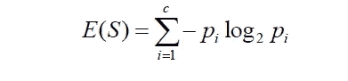
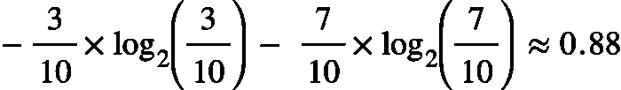
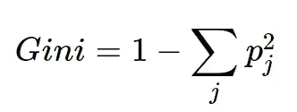
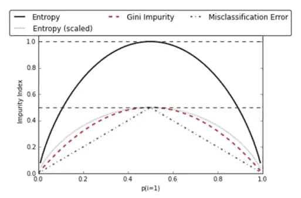

# 决策图表

> 原文：<https://medium.com/analytics-vidhya/decision-tree-2855f7e198f0?source=collection_archive---------18----------------------->

决策树属于监督机器学习技术的范畴，也被称为 **CART** **(分类和回归树)**。它利用一个树形结构 ***来模拟**特征**和**结果**之间的关系*** 。它由代表 ***决策函数*** 的 ***节点和代表*** 决策函数 ***输出的 ***分支*** 组成。因此，这是决定如何对新数据点进行分类的流程图。***

该决策使用属性选择度量(ASM)来选择最佳属性以拆分记录。树标准将数据分成子集，子集又分成更小的子集。当子集内的数据足够相似时 ***算法停止分割数据*** 。决策树分割所有可用变量上的节点，然后选择产生最相似子节点的分割。

## 决策树可用于分类和回归问题，但它们的工作方式不同。

## 分类问题的决策树；

*   所有类别的**后验概率**反映在叶节点中，叶节点属于多数类别。在执行之后，数据点的类别由它到达的叶节点决定。
*   目标是**尽可能减少叶节点处的杂质**。
*   **损失函数是属于父节点的节点**的目标列中的杂质 **的度量。节点处的杂质是节点的目标列中不同类别的混合的度量。**

## 回归问题的决策树；

*   目标属性的**平均值或中间值**被分配给查询变量。
*   目标是**最小化每个节点的目标列中的方差**(数据点与中心值的不相似性)。
*   方差的减少相当于同质性或纯度的增加。

# 分割树的精确度的测量:

## 杂质:

该树将数据分割成不够*同质的子集，称为不纯。*

为什么这很重要？根据使用的杂质测量，树分类结果可能会有所不同。这可能会对您的模型产生或大或小的影响。

## 熵:

熵控制决策树如何决定在哪里分割数据。它*是测量* ***杂质*** *或数据点中的随机性。*

熵是在 0 和 1 之间计算的 ***。******熵值越小*** 越好。

***比如*** ，假设我们只有两个类，一个正类和一个负类。因此' ***i*** '在这里可能是(+)也可能是(-)。因此，如果我们的数据集中总共有 100 个数据点，其中 30 个数据点属于正类，70 个数据点属于负类，那么'***【P+】***'将是 3/10，而' ***P-*** '将是 7/10。因此，在这个例子中使用上面的公式计算类的熵。

这里的熵大约是 0.88。这被认为是一种高熵，一种高水平的无序(意味着低水平的纯度或**高度不纯的分裂**)。

## 信息增益:

信息增益根据给定的属性值计算数据集分割前的熵和分割后的平均熵之差。

*   基于熵的概念，即通过量化 ***杂质*** 的大小来量化哪个特征提供关于分类的最大信息，目的是从根节点到叶节点减少熵**的量。**

我们只需从 Y 的熵中减去给定 X 中 Y 的熵，就可以计算出给定一条关于 Y 的额外信息 X 时，关于 Y 的不确定性的减少，这称为信息增益。这种不确定性减少得越多，从 x 获得的关于 Y 的信息就越多。

## 基尼指数或基尼系数:

它计算随机选择时某个特定要素被错误分类的概率。如果所有的元素都与一个单一的类相联系那么它就可以被称为纯粹的。

其中 Pj 表示元素被分类为不同类别的概率。

*基尼指数* ***在数值 0 和 1*** *之间变化，其中 0 表示分类的纯度或完美分类。*分类和回归树 **(CART)** 算法采用基尼指数的方法来产生二元分裂。

## 基尼指数与信息增益:

*   基尼指数**有利于更大的分布**以便于实施，而信息增益**有利于具有多个特定值的小计数的较小分布**。
*   基尼指数**根据“成功”或“失败”对分类目标变量**进行操作，并且**仅执行二元分裂**，相反，信息增益**计算分裂**之前和之后的熵 **之间的差异，并指示元素类别中的杂质。**

## 使用基尼熵与熵的误差差异:

杂项错误不用于决策树，图只适用于二进制分类。

# 优点和缺点:

## 优势:

*   处理简单快速且有效。
*   对有噪声的数据和丢失的数据处理得很好。
*   处理数字和分类变量。
*   解释结果不需要数学或统计知识。

## 缺点:

*   很容易过度拟合。
*   通常偏向于分裂或具有大量级别(树深度)的特征。
*   训练数据中的小变化会导致逻辑的大变化。
*   大树可能很难解释。

希望这篇博客能帮助你更好地理解决策树。如果你喜欢，请鼓掌支持。 ***【快乐学习……:)***