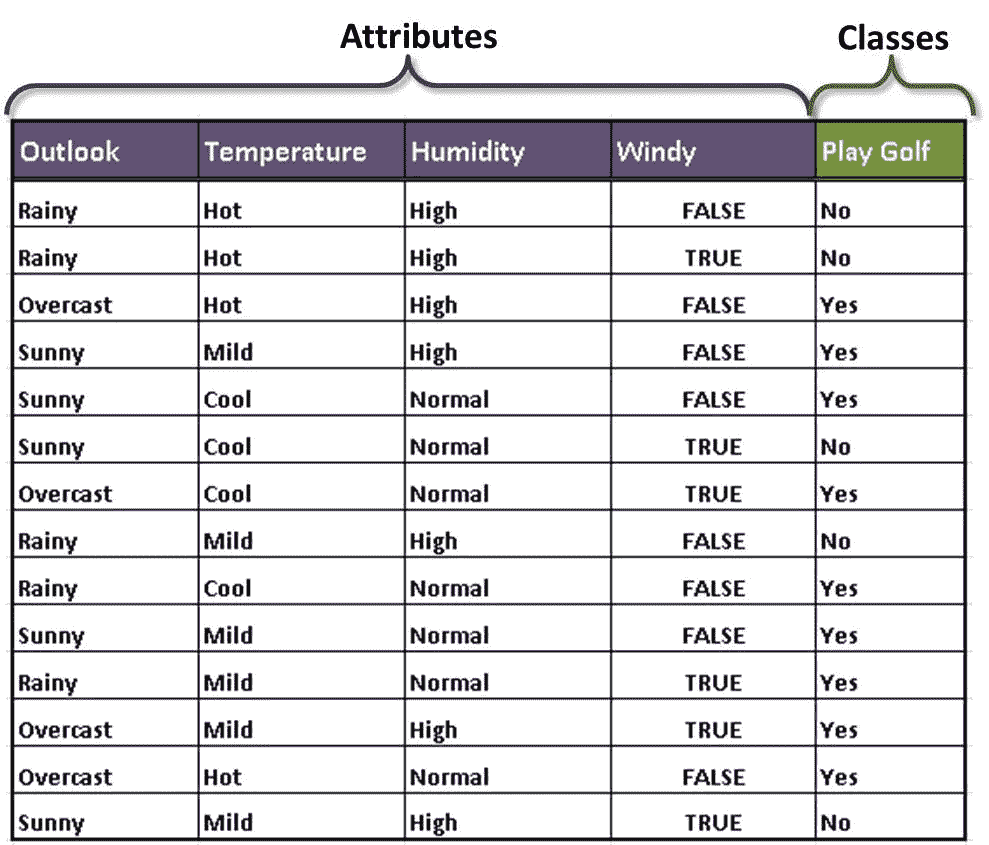
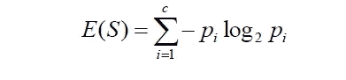
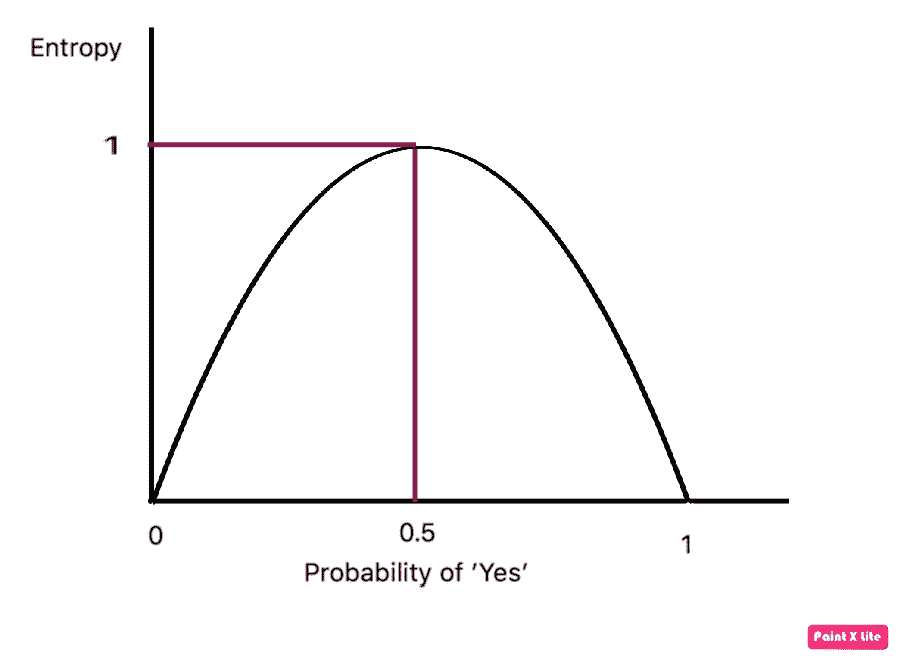
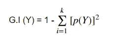
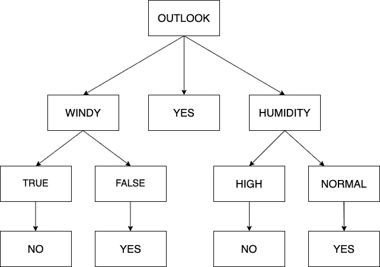

# 决策树算法讲解！

> 原文：<https://medium.com/analytics-vidhya/decision-tree-algorithm-explained-bd6b7b22eab9?source=collection_archive---------3----------------------->

# 简介:

决策树算法是机器学习中使用最广泛的算法之一。这是一种监督机器学习方法，可用于分类和回归。让我们详细讨论一下这个算法。

# 几何表示:

从几何角度理解任何机器学习算法都是非常重要的。从几何上来说，决策树顾名思义是代表一种树状结构。决策树的功能可以想象为“如果-否则”循环的工作。让我们考虑一个数据集，其中结果是一个决定是否玩游戏的变量。决定因素是各种参数，如天气条件、温度等。该数据集被称为“打高尔夫球”数据集，很容易获得。这是数据集的样子。

对于实现，使用 ID3 算法。它使用了熵、信息增益和基尼系数等概念。让我们详细讨论这些。我会尽量保持概念简单。

**熵**:

熵是对数据中无序或不确定性的度量。我们测量 0 和 1 之间的熵。为了理解熵到底是什么，考虑一下上面的例子。总共有 14 个结果的值为“是”或“否”。考虑一种结果是等概率的情况，即它们有相同的概率。因此，“是”值的数量将是 7，“否”值的数量也将是 7。在这种情况下，熵将是 1，即最高的。现在有两个极端。如果这 14 个值都是“是”或“否”，那么这两种情况下的熵都是 0。如果我们想从不确定性的角度来理解这一点，那么在第一种情况下，结果是等概率的，数据包含最高程度的不确定性，因此熵是 1。在下一种情况下，所有的结果要么是“是”要么是“否”，我们知道对于数据集中属性值的任何组合，我们要么是“是”要么是“否”，即结果是确定的。因此，完全没有不确定性。我们的主要重点应该是减少这种不确定性。如果我们想用图形来表示它，它可以表示如下，计算熵的公式是

**信息增益:**

信息增益在数学上表示如下:

> E( Y，X) = E(Y) — E( Y|X)

因此，信息增益是 Y 的熵减去给定 X 的 Y 的熵。这意味着当我们知道一些关于 Y 的额外信息 X 时，我们计算 Y 的不确定性的减少。这种减法导致信息增益。信息增益的值越高，不确定性越低。如前所述，我们的目标是减少不确定性，我们可以说信息增益是衡量不确定性减少的度量。

**基尼杂质:**

这是熵的替代物。基尼系数的数学表达式是

熵和基尼系数的区别在于，与熵的对数计算相比，基尼系数进行平方计算。由于平方计算比对数计算快得多，基尼系数杂质是最受欢迎的。

现在我们知道了这些参数，我们可以开始构建决策树了。首先，我们需要确定决策树的根节点。由于数据集被分为两个子类型-属性和类，我们计算两者的熵，并获得以下熵。

> **E(打高尔夫)**
> 
> **E(打高尔夫，展望)**
> 
> **E(打高尔夫，温度)**
> 
> **E(打高尔夫，湿度)**
> 
> **E(打高尔夫，刮风)**

在计算熵之后，我们计算信息增益。

> **增益(游戏高尔夫，展望)=熵(游戏高尔夫)—熵(游戏高尔夫，展望)**
> 
> **增益(游戏高尔夫，温度)=熵(游戏高尔夫)—熵(游戏高尔夫，温度)**
> 
> **增益(游戏高尔夫，湿度)=熵(游戏高尔夫)—熵(游戏高尔夫，湿度)**
> 
> **增益(PlayGolf，Windy) =熵(PlayGolf) —熵(PlayGolf，Windy)**

现在我们有了所有必要的值，我们可以开始拆分了。第一个分裂，即根节点，是由给我们最高信息增益的属性决定的。在这种情况下，它是 Outlook 属性。进一步的分割将基于哪一个属性给我们同类组来决定。完整的决策树如下所示。

# **过拟合和欠拟合:**

决策树的过拟合和欠拟合是由决策树的长度决定的。如果长度太大，那么有可能模型学习得太多，并且试图适合每一个点，因此长度增加。当模型没有学习很多，因此长度很小时，会出现欠拟合。为了避免这些情况，我们可以引入一个停止标准。有两种方法可以做到。它们是:对树的大小设置约束和树的修剪。简而言之，这两种方法都将使决策树的大小达到最佳值，从而避免过度拟合或欠拟合的情况。

# **优缺点:**

决策树的优点是，它可以用于多类分类。它易于解释，适用于数值和分类数据。一些缺点是数据的微小变化会影响树结构，决策树不适合不平衡的数据集。

# 结论:

这篇文章的目的是解释决策树算法，它的几何表示以及一个例子。希望看完之后概念清晰。以下是我在写这篇文章时参考的资料来源:

1.  [https://www . kindsonthegenius . com/blog/2018/04/how-to-build-A-decision-tree-for-class ification-step-by-step-procedure-using-entropy-and-gain . html #:~:text = A % 20 decision % 20 tree % 20 is % 20a，trees % 20 和%2For%20leaf%20nodes](https://www.kindsonthegenius.com/blog/2018/04/how-to-build-a-decision-tree-for-classification-step-by-step-procedure-using-entropy-and-gain.html#:~:text=A%20decision%20tree%20is%20a,trees%20and%2For%20leaf%20nodes.)
2.  [https://towards data science . com/entropy-how-decision-trees-make-decisions-2946 b 9 c 18 c 8](https://towardsdatascience.com/entropy-how-decision-trees-make-decisions-2946b9c18c8)
3.  【https://towardsdatascience.com/decision-trees-d07e0f420175 

快乐学习！！