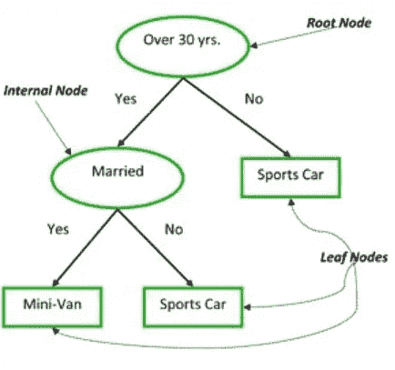
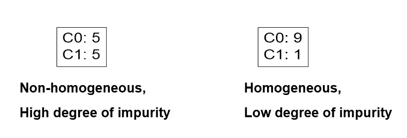
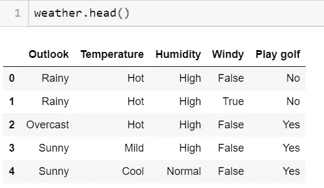
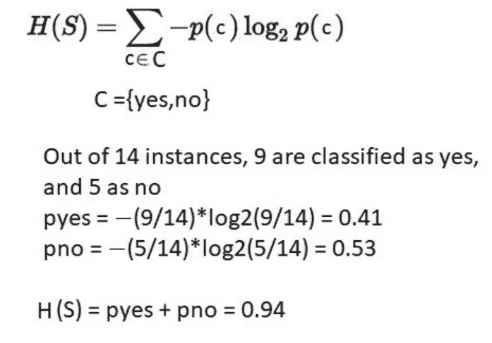
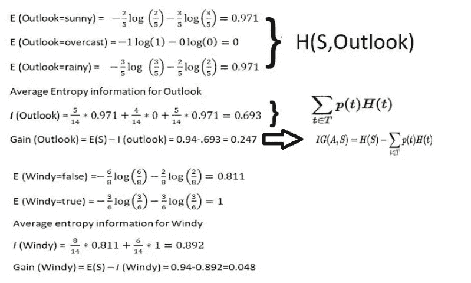
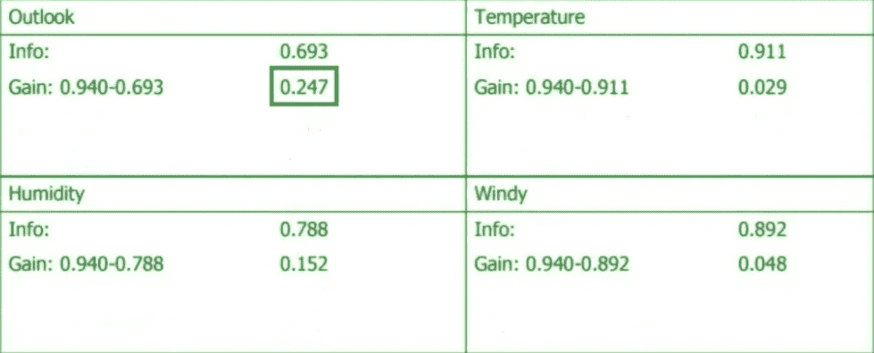
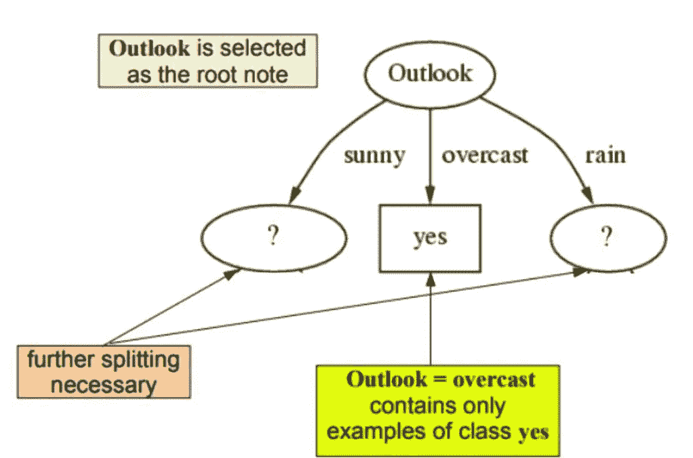
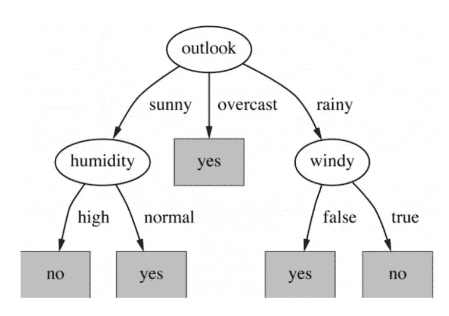
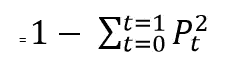
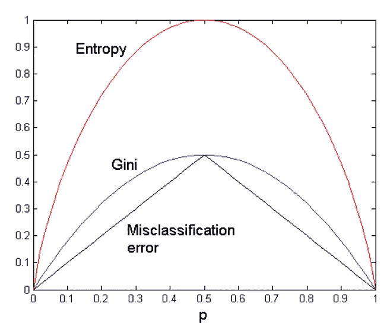

# 决策树算法..

> 原文：<https://medium.com/analytics-vidhya/decision-tree-algorithm-fa4b4d8d5bd7?source=collection_archive---------18----------------------->

决策树是流行的机器学习算法之一，是理解使用树的集成技术的敲门砖。

此外，决策树算法是许多与数据科学领域相关的采访中的热门话题。

**理解决策树..**

决策树更像是一种管理工具，许多专业人员使用它来做出有关资源成本的决策，这些决策是基于所应用的过滤器做出的。

决策树最好的部分是它是一个非参数工具，这意味着没有关于错误或数据分布的潜在假设。它基本上意味着模型是基于观察到的数据构建的。

他们善于解决手边的任何类型的问题(分类或回归)。决策树算法简称为****(分类和回归树)**。**

****决策树常用术语:****

1.  ****根节点:**它代表整个群体或样本，并进一步分成两个或多个同类集合。**
2.  ****拆分:**是将一个节点分成两个或两个以上子节点的过程。**
3.  ****决策节点:**当一个子节点分裂成更多的子节点时，则称为决策节点。**
4.  ****叶/端节点:**不分裂的节点称为叶或端节点。**
5.  ****Max_Depth:** 一棵树从根到叶节点的完整旅程。**
6.  ****分支/子树:**整个树的一个子部分称为分支或子树。**
7.  ****父节点和子节点:**被划分为子节点的节点称为子节点的父节点，而子节点是父节点的子节点。**

****

**演示决策树的经典例子**

**决策树是如何工作的！**

1.  **首先，我们将遍历所有可能的分裂，计算每个分裂的纯度并挑选分裂。**
2.  **对所有标签的纯度进行比较，选择最好的。这使得根节点成为最佳预测器。**
3.  **该算法本质上是递归的，因为形成的组可以被细分，并且重复该过程直到树完全生长。**

****主要决策领域:****

1.  **确定最佳分割:**

**具有同类分布节点是优选的。**

****

**2.节点杂质的测量:下面是杂质的测量**

**(一)。基尼指数**

**(二)。熵**

**(三)。错误分类误差**

****举例理解各术语:****

**让我们来看一个数据集——天气，下面是数据标题的快照:**

****

**现在根据上面写的算法和要考虑的决策点，我们需要具有最大可能信息分割的特征。**

****注:**在根节点处，杂质水平最大，信息增益可以忽略不计。随着我们沿着树往下走，熵随着信息增益的最大化而减少。因此，我们选择增益最大的特性。**

**因此，使用**熵**计算天气数据集的杂质测度:**

****

**对于每个特征，我们将计算熵，例如，outlook 和 windy 计算如下:**

****

**在对所有特征进行计算之后，将为根节点选择具有最大杂质度量(熵)的特定特征。**

**以下是所有功能的摘要:**

****

**所以我们的根节点是**展望。****

****

**对子树重复同样的操作，直到长成完整的树。下面是最终的决策树:-**

****

****基尼指数:****

**在机器学习 sci-kit learn 中，基尼指数被用作评估杂质的默认方法。然而，当使用熵或基尼系数时，在结果中的结果几乎没有任何区别，但是因为有两种不同的度量，所以我们应该知道它们。**

**二元目标变量的基尼指数为:-**

****

**基尼系数通过由分裂产生的两个群体中的阶级混合程度，给出了分裂有多好的概念。完美的分离导致基尼系数为 0，而最糟糕的分离导致 50/50 的等级。**

**我们为每一行计算它，并在二叉树中相应地分割数据。我们递归地重复这个过程。**

**对于二元目标变量，最大基尼指数值:**

**= 1—(1/2)—(1/2)
= 1–2 *(1/2)
= 1-2 *(1/4)
= 1–0.5
= 0.5**

**为了更好地理解，用图展示熵和基尼系数:**

****

# **信息增益:**

**较少不纯的节点需要较少的信息来描述它。并且，更不纯的节点需要更多的信息。信息增益是一种度量，用来定义一个被称为熵的系统中的无序程度。如果样本完全同质，则熵为零，如果样本被等分(50% — 50%)，则熵为 1。它选择与父节点和其他分裂相比具有较低熵的分裂。熵越小越好。**

****注意:-超参数调整是任何决策树算法中非常关键的一步。****

**需要调整的主要超参数:**

1.  ****max_depth:** 定义了一棵树的总深度，一般应该进行调优，否则会导致模型过拟合。**
2.  ****min_samples_leaf:** 叶节点所需的最小样本。如果 min_samples_leaf 留在分支中，将考虑任何深度的分割点。**
3.  ****max_leaf_nodes:** 用 max 个叶节点来生长一棵树，以获得最佳结果。**

**调整这些超参数的主要原因是，如果我们不控制树的生长，那么最后所有的叶节点将具有 1 个具有大深度的样本(在数据集中的大特征的情况下),这可能在很大程度上导致过拟合，并因此降低模型的准确性，同时增加模型的复杂性。**

****决策树的优势:****

*   **决策树很容易解释。**
*   **构建决策树需要用户准备更少的数据，因为不需要标准化或缩放数据。**

****决策树的缺点:****

*   **通常，决策树倾向于过度拟合数据，这导致模型复杂性的增加以及模型中方差的增加。**
*   **决策树也被称为贪婪算法，因为数据集中的小变化会对整个模型产生大的影响。**

**然而，决策树是对所有机器学习专业人员总是有用的基础模型，因为它也有助于可视化数据集分布，并告诉我们数据集中的最佳特征。**

****