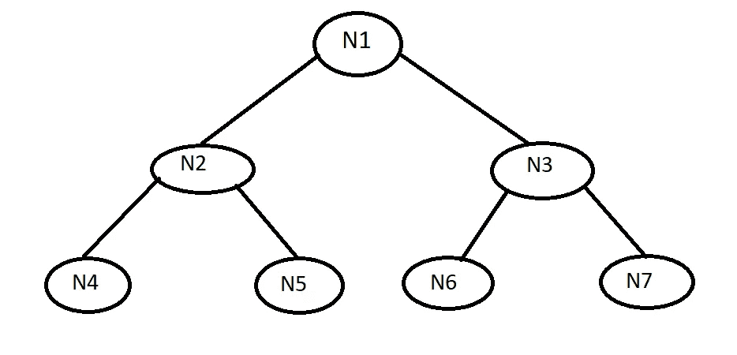
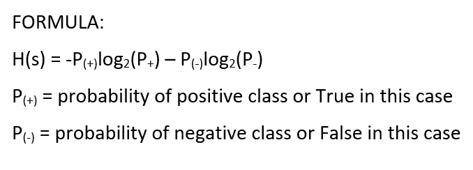
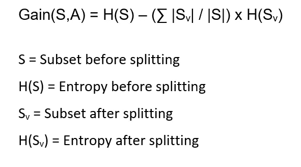
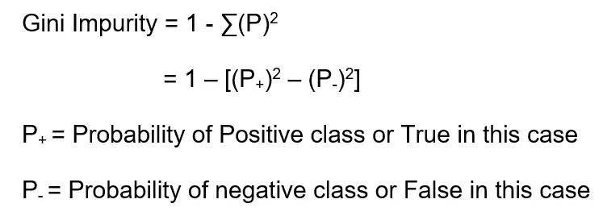
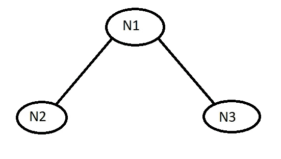
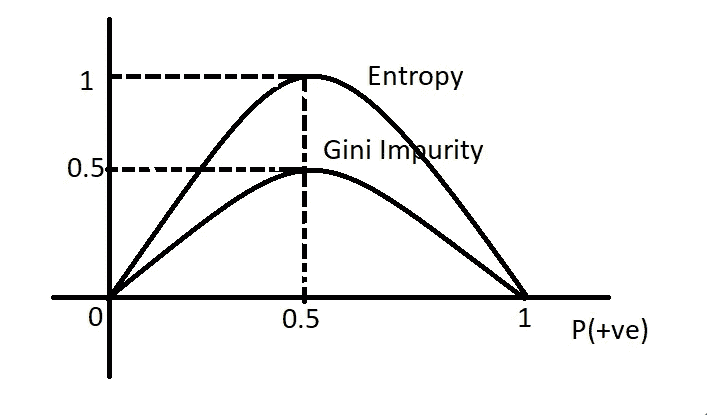

# 决策树——直观的理解

> 原文：<https://medium.com/analytics-vidhya/decision-tree-an-intuitive-understanding-c1873f64081a?source=collection_archive---------23----------------------->

决策树算法是机器学习的有力工具之一。决策树最基本的例子是买车。买车时，会有很多关于里程、气囊数量、价格、防抱死刹车等问题。一旦你得到了所有这些问题的答案，你就有了买哪辆车更方便的决定。

决策树的实际定义应该是，它是一个树形图，用于确定一个行动过程。树的每个分支代表一个可能的决定、事件或行动。

使用决策树算法的一些优点是，它易于解释和可视化，可以处理分类和数字数据，并且在大多数情况下，非线性参数不会影响其性能。

决策树算法可以解决分类或回归问题，但主要用于分类问题陈述。决策树最重要的一步是在特征中选择正确的属性。为此，我们应用:

# **熵**

熵是数据集中随机性或不可预测性的度量。这有助于我们测量分裂的纯度。

这是一棵有 7 个节点的树。考虑一个分类数据集，其输出列为 true 或 false。假设在 N1 节点有 9 个真和 5 个假。在节点 N1 之后，该树被分裂成具有 3 个真和 2 个假的 N2 节点&具有 6 个真和 3 个假的 N3 节点。最后，节点被分成 3 为真的 N4、2 为假的 N5、6 为真的 N6 和 3 为假的 N7。现在，这棵树需要决定是和 N2·斯普利特还是和 N3·斯普利特在一起。为了决定这个熵被计算。让我们来计算熵:

计算完节点 N2 和节点 N3 后，你会注意到熵值在 0 到 1 之间。熵值的范围总是从 0 到 1。以下是熵的最佳和最差情况:

> 想象一个场景，你会得到 3 个真和 3 个假。这个场景是最坏情况的例子，因为这个场景说概率是 50%真，50%假。在这种情况下，熵将总是 1。因此，在最好的情况下，熵将是 0，可能 4 为真，0 为假，因为在这种情况下，输出为真的概率是 100%。因此，简而言之，当熵值接近 0 时，与其他节点相比，树与该特定节点一致。

> 在熵之后，让我们投入一个新的概念，叫做信息增益。

# 信息增益

信息增益是数据集被分割后熵减少的量度。

这是计算信息增益的公式，下面给出的是信息增益公式中的参数。

信息增益帮助你得到决策树的最佳分割。这基本上意味着，如果在一个特定的问题陈述中使用的决策树有两个分支，则计算信息增益值，然后进行比较。较高的值将被使用或认为是最好的。

> 总之熵值少一点，信息增益值多一点就好。

决策树还涉及到一个概念，就是基尼杂质。

# 基尼杂质

基尼杂质和熵做的是一样的工作，但是很多机器学习工程师用基尼杂质代替熵。让我们看看为什么:

这是基尼系数的公式，下面是与公式相关的参数。

考虑:

这是一棵有三个节点的树。考虑一个分类数据集，其输出列为 true 或 false。假设在 N1 节点有 6 个真和 3 个假。在节点 N1 之后，该树被分成具有 3 真 3 假的节点 N2 和具有 3 真 0 假的节点 N3。到目前为止，您已经预测到节点 N3 是叶节点，因为节点 N3 的熵是 0。

如果你仔细观察，你会知道节点 N2 的熵是 1。这是最坏的情况，因为如上所述，在这种情况下，真和假的概率是 50%。但是如果你计算基尼系数，你会发现这个值是 0.25。

让我们画一张图来更好地理解熵和基尼系数:

这个图表显示了熵和基尼系数的不同。当 P(+ve)增加时，熵也增加，在 0.5 处，即在 50%处，熵变为 1。

当 P(+ve)增加时，基尼系数杂质也增加，在 0.5 时，即 50%，也变成 0.5。这表明，与熵相比，基尼系数的值要小得多。

> 使用 Gini 杂质优于熵的优点在于，它比熵更有效，或者说它在计算上更有效。它需要更短的执行时间。这是因为熵包含对数计算，对数计算需要更多的时间，但是基尼系数不包含对数计算，所以需要的时间更少。这就是为什么人们更喜欢基尼不纯而不是熵。

使用决策树的缺点是过拟合问题。过度拟合是指训练数据精度高(低偏差)而测试数据精度低(高方差)的情况。这意味着当算法捕获数据中的噪声时，会出现过拟合情况。

非常感谢你阅读这个博客。如果你喜欢它，请为它鼓掌，并与你的朋友、同事和家人分享。