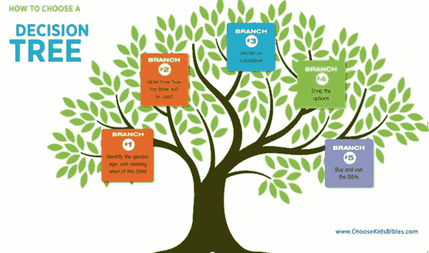
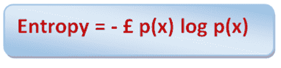
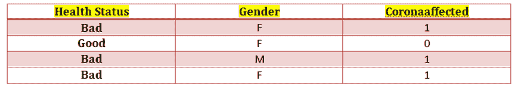
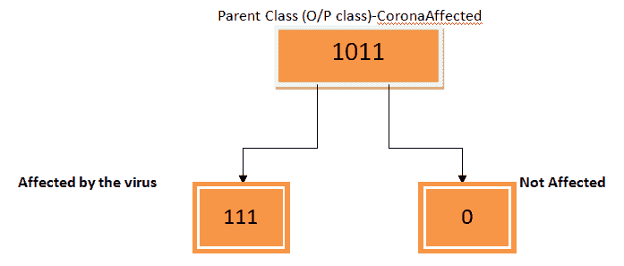
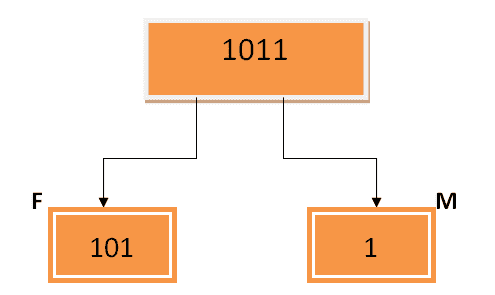
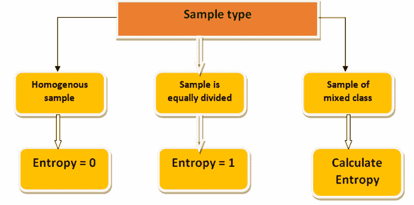
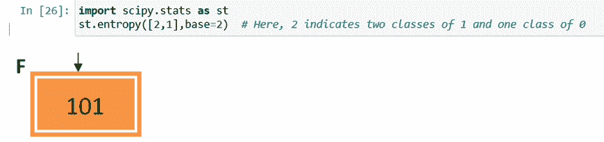
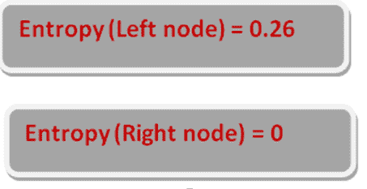
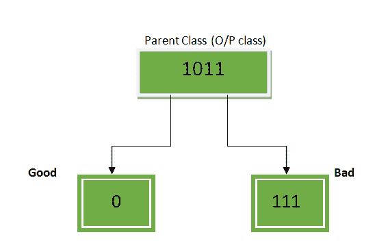
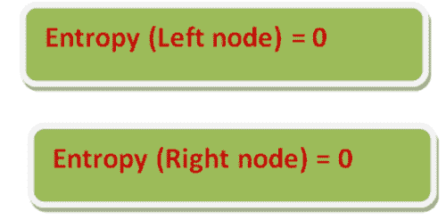

# 决策树及其分裂逻辑-理解熵。

> 原文：<https://medium.com/analytics-vidhya/decision-tree-and-its-split-logic-understanding-entropy-3f262e82258f?source=collection_archive---------5----------------------->

决策树是最简单的机器学习算法之一，也是非常流行的预测学习模型。决策树学习模型对于回归和分类问题都是很好的选择。然而，该模型基于分割逻辑，本质上是分层的。

这里，我们将重点了解决策树的分割标准。

决策树可以使用以下四种算法中的任何一种来决定拆分。

**ID3(迭代二分法)** —该算法使用熵和信息增益的计算作为决定分割的默认方法。

**基尼指数** —当使用 rpart 库构建决策树时，基尼指数被用作计算拆分的默认方法。

**驰方**。

**方差减少**。

**在本文中，我们将重点介绍通过熵值法计算信息增益。**

具有最高信息增益的特征将是决策树将被分割的特征。

熵公式:

其中 p(x)是特征的样本。

信息增益公式:

现在让我们举一个简单的例子:假设我们有两个独立的特征“健康状况”和“性别”，响应变量是“冠状动脉受影响”。

Coronaaffected 二进制类变量(1-受影响，0-不受影响)。

现在我们将试图找出在上述两个独立特征中的哪一个上，决策树应该首先被分裂。

步骤 1:分割输出类 CoronaAffected，其中包含三个 1-受影响的类和一个 0-未受影响的类。

因此，

P (1) =类 1 的值的数量/类的总数。

= 3/4

P (0) =类 0 的值的数量/类的总数。

= 1/4

第二步:计算熵:

熵(母体)= — p(x) log p(x)

= — [P (1) log P (1) + P (0) log P (0)]

= — [3/4 对数(3/4) + 1/4 对数(1/4)]

= — [0.75 对数(0.75) + 0.25 对数(0.25)]

= — [(0.75 * -0.12) + (0.25 * — 0.60)]

= — [-0.09 + (-0.15)]

= — [0.09–0.15]

= — [-0.24]

= 0.24

现在我们将计算每个特征的信息增益，然后检查哪个特征具有最高的信息增益。

信息增益=熵(父项)—[加权平均*熵(子项)]

特点一:性别。

第三步:根据输出类别计算每个性别的熵(M/F)。

从上表中我们可以看出，在 3 名女性中，2 名在 1 级受到影响，1 名在 0 级没有受到影响。

一名男性在 1 班受到影响。

步骤 4:在上图中，我们有一个父节点和两个子节点——左节点(母节点)和右节点(公节点)。

我们需要计算左节点和右节点的熵。

右侧节点熵为 0，因为它具有相同的类别。

如果样本是完全同质的，即属于同一类别，则熵将为 0，如果样本被等分，例如两个 0 类别和两个 1 类别，则熵将为 1。如果样本是混合类，那么我们需要使用下面的方法计算熵。

左侧节点有两个不同的类 0 和 1，因此我们需要计算左侧节点的熵。当节点有混合类时，我们将总是计算子节点的熵。

左侧节点:P (1) = 2/3，P (0) = 1/3

熵(左节点)=-[P(1)log P(1)+P(0)log P(0)]

= — [2/3 对数(2/3) + 1/3 对数(1/3)]

= — [0.67 对数(0.67) + 0.33 对数(0.33)]

= — [((0.67)*(-0.17)) + ((0.33)*(-0.48))]

= — [-0.11–015]

= 0.26

在 python 中，我们可以执行相同的操作，并使用 scipy 库中的 stats 模块计算左侧节点的熵。

第五步:计算孩子(性别)的加权平均值。

(儿童加权平均数(性别)*熵)=[女性性别下总班数/总班数*左节点熵(女性)]+[男性性别下总班数/总班数*右节点熵(男性)]。

= 101/1011 *熵(左节点/母)+ 1/1011 *熵(右节点/公)

= 3/4 * 0.26 +1/4 * 0

= 0.19 + 0

= 0.19

第六步:计算性别的信息增益。

IG(性别)=熵(父母)——(子女加权平均值*熵性别)

= 0.24–0.19

= 0.05

对“健康状态”功能重复上述过程。

特点二:健康状况。

第一步:正如我们在表中看到的，一个健康状况“良好”的人是干净的(0 级)。

在健康状况“糟糕”的三个人中，三个人都受到了影响(1 级)。

步骤 2:在上图中，我们有一个父节点和两个子节点——左节点(好节点)和右节点(坏节点)。

我们需要计算左节点和右节点的熵。

左右节点的熵都是 0，因为它们具有相同的类别。

第五步:计算儿童的加权平均值(健康状况)。

儿童加权平均*熵(健康状况)=[健康状况良好的班级总数/总班级数*左节点熵(好)]+[健康状况不良的班级总数性别/总班级数*右节点熵(差)]。

= 0/1011 *熵(左节点/好)+ 111/1011 *熵(右节点/坏)

= 1/4 * 0 + 3/4 * 0

= 0 + 0

= 0

第六步:计算健康状态的信息增益。

IG(性别)=熵(父母)—子女加权平均值*熵(健康状况)。

= 0.24–0

= 0.24

步骤 7:由于健康状态的信息增益(0.24)>性别的信息增益(0.05)，决策树将首先在健康状态上被分裂。

通常，对所有特征递归执行相同的过程，直到所有数据被分类。

结论:一般情况下，我们不必手动完成所有这些计算。当我们执行决策树模型时，所有这些计算都将由算法在后端完成。