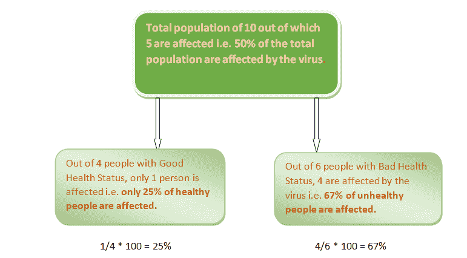

# 决策树及其分裂逻辑-理解基尼。

> 原文：<https://medium.com/analytics-vidhya/decision-tree-and-its-split-logic-understanding-gini-f041cb1fa06b?source=collection_archive---------21----------------------->

在我们之前的文章[决策树-熵中，](/@anjurajbangshi2/decision-tree-and-its-split-logic-understanding-entropy-3f262e82258f)我们通过熵方法关注了决策树的分裂标准。

今天，我们将了解基尼系数法是如何帮助我们决定分割的。

**几个重点:**

正如我们在上一篇文章中所知道的，信息增益越高，特征的纯度就越高，它将首先被分割用于决策树等等。

同样，要素的基尼系数越高，它就越好，基尼系数最高的要素将是发生第一次结点分裂的要素。

每个节点的基尼系数是通过类别概率的平方和来计算的。

通过使用每个节点的加权基尼来计算每个特征的基尼。

多用于 CART(分类和回归树)算法。

。在 R 中，如果决策树是使用 rpart 构建的，则 gini 将作为计算拆分的默认方法。

现在让我们举一个和我之前用的一样的例子，但是记录的数量稍微多一点:假设我们有两个独立的特征“健康状况”和“性别”，响应变量是“冠状动脉受影响”。

Coronaaffected 二进制类变量(1-受影响，0-不受影响)。

首先，我们将尝试根据人口的**健康状况**来分析数据:

**第一步**:计算被病毒感染的健康人的基尼系数:

健康节点的基尼系数通过类别概率的平方和来计算。

基尼=(0.25)*(0.25)+(0.75)*(0.75)= 0.62

**第二步**:计算被病毒感染的不健康人群的基尼系数:

不健康节点的基尼系数通过类概率的平方和来计算。

基尼=(0.67)*(0.67)+(0.33)*(0.33)= . 45+. 11 = 0.56

**步骤 3** :利用每个节点的加权基尼系数计算每个特征的基尼系数。

计算“健康状况”特征的加权基尼= [(健康人口数量/总人口)*健康人口的基尼] + [(不健康人口数量/总人口)*不健康人口的基尼]。

**=(4/10)*(0.62)+(6/10)*(0.56)= 0.25+0.34 = 0.59**

接下来，我们将根据人口的**性别**分析数据:

**步骤 1** :计算感染病毒女性的基尼系数:

女性节点的基尼系数是通过类别概率的平方和来计算的。

基尼=(0.6)*(0.6)+(0.4)* 0(. 4)= 0.36+0.16 = 0.52

**第二步**:计算感染病毒男性的基尼系数:

男性节点的基尼系数是通过类别概率的平方和来计算的。

基尼= (0.4) * (0.4) + (0.6) * (0.6) = 0.52

**步骤 3** :利用每个节点的加权基尼系数计算每个特征的基尼系数。

计算“性别”特征的加权基尼= [(女性人数/总人口)*女性人口的基尼] + [(男性人数/总人口)*男性人口的基尼)。

**=(5/10)*(0 . 52)+(5/10)*(0.52)=(0.26)+(0.26)= 0.52**

**正如我们在上面看到的，健康状况的基尼系数(0.59)高于性别的基尼系数(0.52)，因此，健康状况将是决策树节点分割首先实现的特征。**