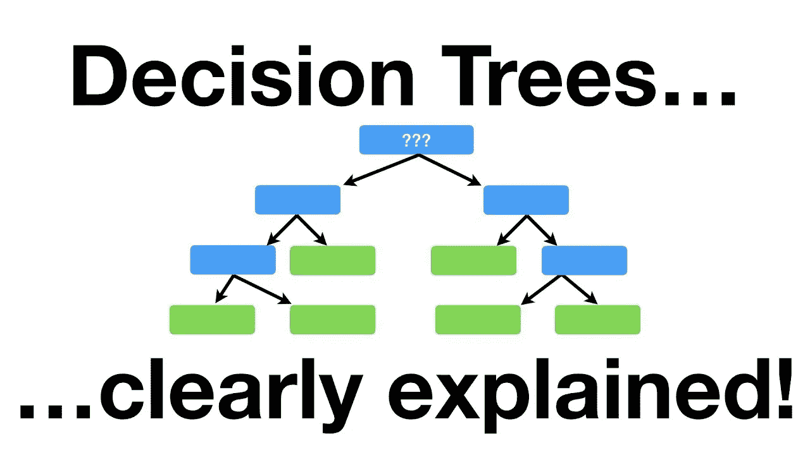

# Python 中的决策树分类:你需要知道的一切

> 原文：<https://medium.com/analytics-vidhya/decision-tree-classification-in-python-everything-you-need-to-know-212160ec03f6?source=collection_archive---------12----------------------->

# 什么是决策树？

决策树是一种决策支持工具，它使用树状图形或决策模型及其可能的结果，包括偶然事件结果、资源成本和效用。这是显示只包含条件控制语句的算法的一种方式。