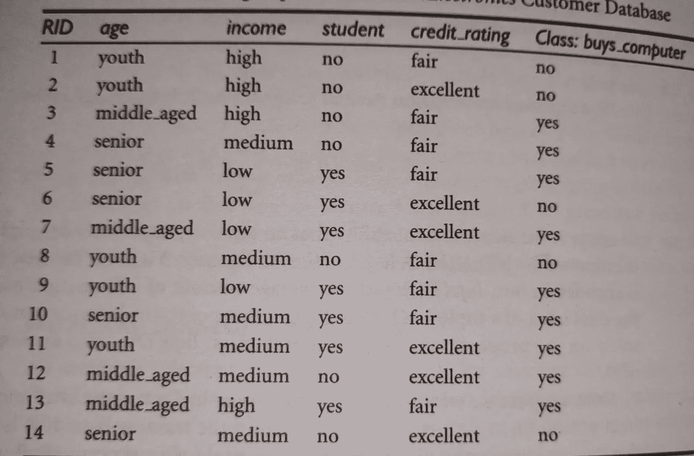
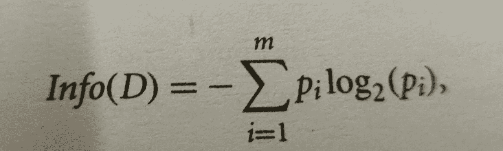
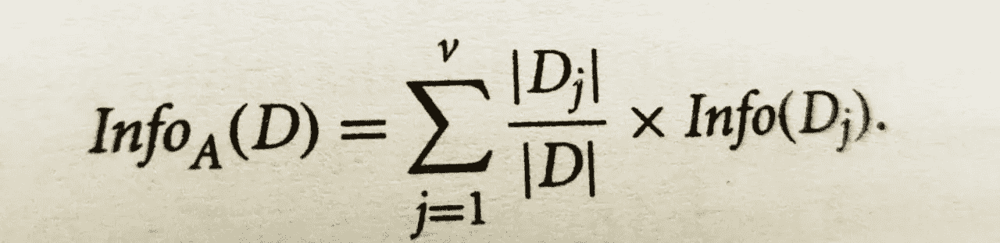
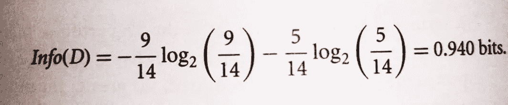
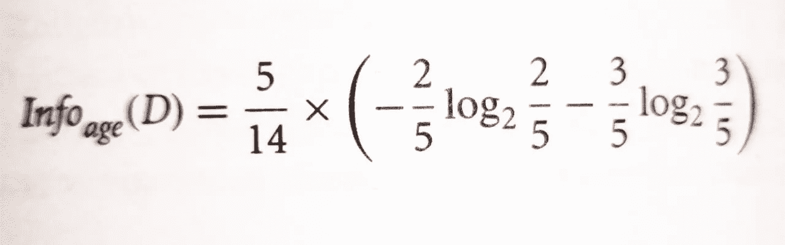
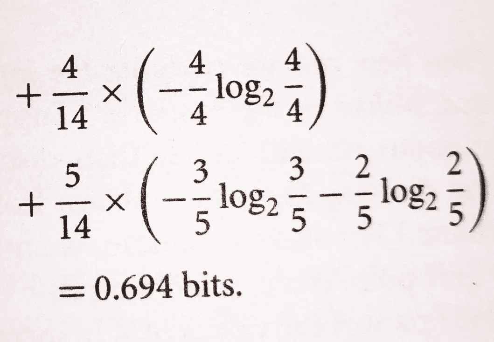
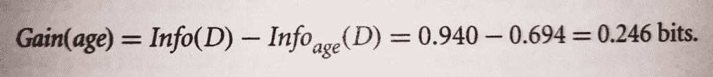
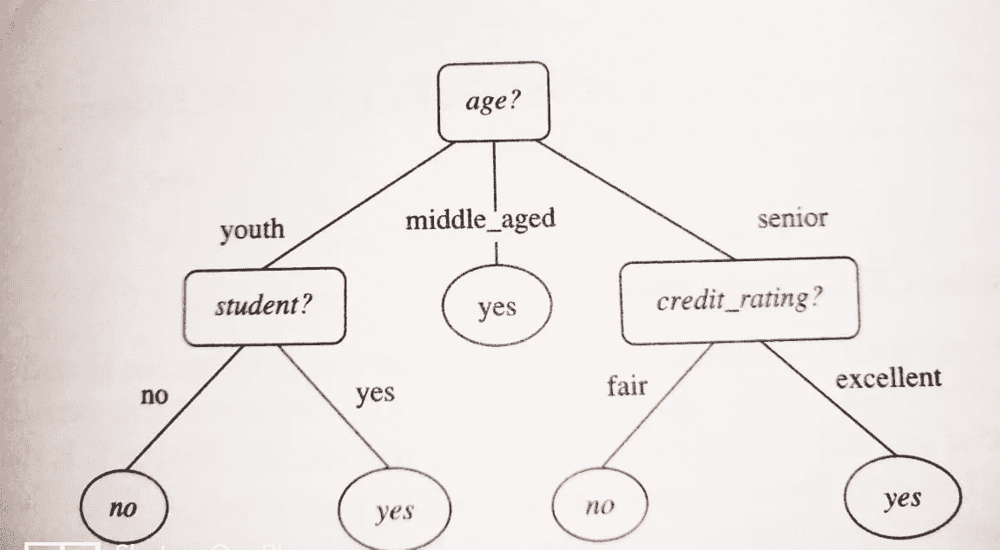
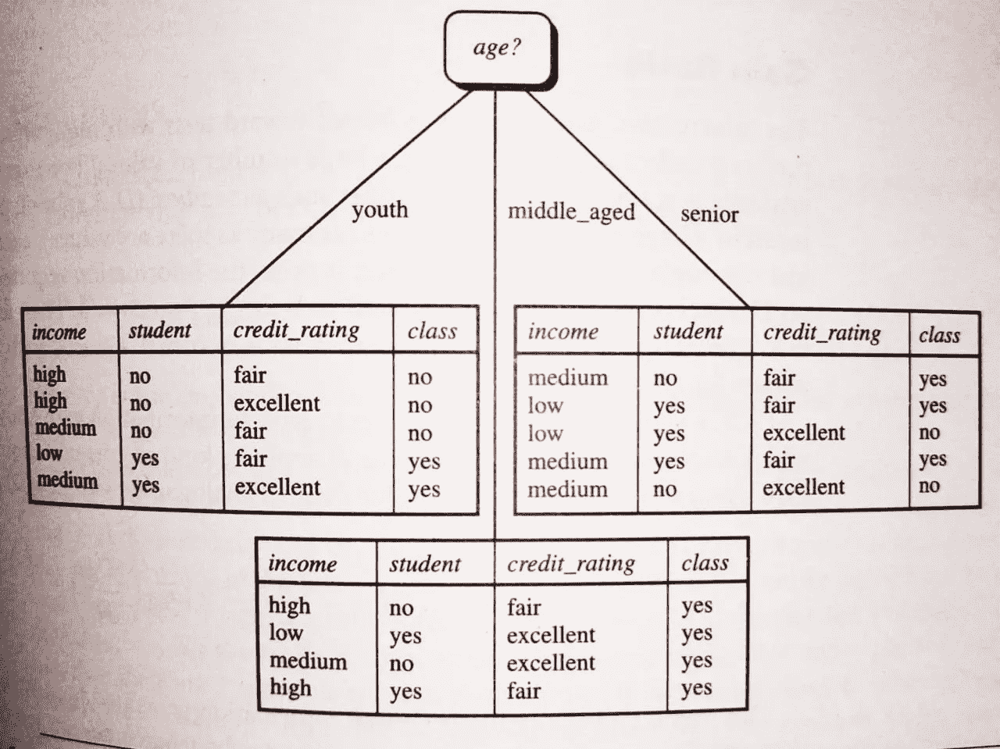

# 决策树分类 _v1(监督学习)

> 原文：<https://medium.com/analytics-vidhya/decision-tree-classification-v1-supervised-learning-30fa28ed2e74?source=collection_archive---------14----------------------->

决策树分析是一种通用的、预测性的建模工具，可以应用于多个不同的领域。一般来说，决策树是通过一种算法方法构建的，这种算法方法根据不同的条件来识别分割数据集的方法。这是监督学习中最广泛使用和最实用的方法之一。

决策树是一个树状图形，节点代表我们选择属性和提出问题的位置；边代表问题的答案，叶子代表实际的输出或类标签。它们用于具有简单线性决策表面的非线性决策。

决策树通过从根到某个叶节点对示例进行排序来对示例进行分类，叶节点为示例提供分类。树中的每个节点都充当某个属性的测试用例，从该节点开始向下延伸的每条边都对应于测试用例的一个可能答案。这个过程是递归的，并且对以新节点为根的每个子树重复进行。

# 让我把它变得更简单:

让我们来看看电子商店数据库的一个数据集，这个数据集告诉我们学生是否会购买电脑。

观察上面的数据库，我们知道类标签属性

buys_computer 有两个截然不同的值(即{Yes，no })；因此，有两个不同的类别(即 m=2)。

有 9 个，有 5 个没有…让我们找出信息增益。

数学上，它表示如下。

因此，计算上述数据集的信息增益

接下来，我们需要计算每个属性所需的预期信息。

先说属性年龄。我们需要看看每个年龄组的是和否元组的分布。

对于年龄类别“青年”，这里有两个是元组和三个否元组。对于“中年”类别，有四元组和零元组。

现在，

因此，从这种划分中获得的信息将是

同样，我们可以计算出 Gain(income) =0.029 位，Gain (student)=0.151 位，gain (credit_rating) =0.048 位。因为年龄在属性中具有最高的信息增益，所以选择它作为分裂属性。

节点 N 标有年龄，每个属性值的分支都在增长。然后元组被相应地分割。

注意，落入 age= middle_aged 分区的元组都属于同一个类。因为它们都属于同一个类“是”，所以叶子应该被创建在这个分支的末端并被标记为“是”。

属性年龄具有最高的信息增益，因此成为决策树根节点处的分裂属性。树枝为年龄的每一个结果而生长。元组被相应地划分。

谢谢大家！