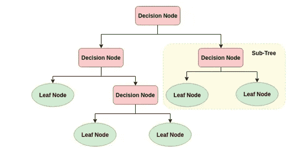
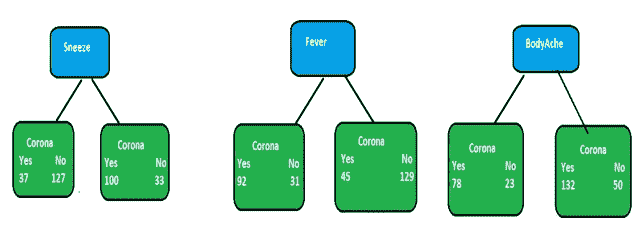
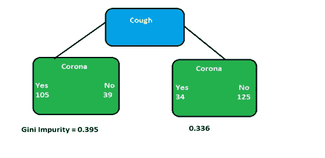
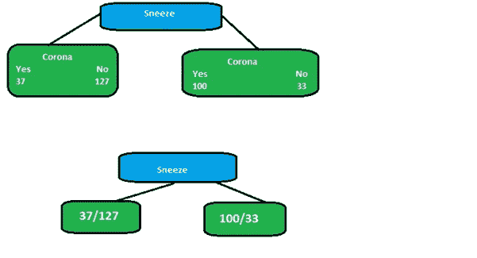
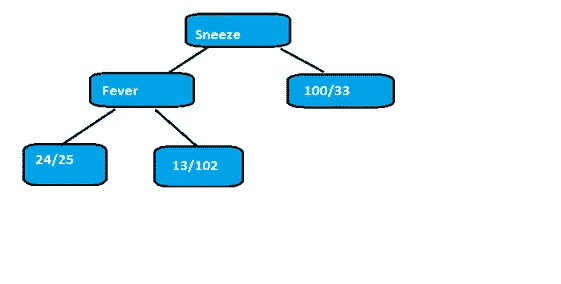
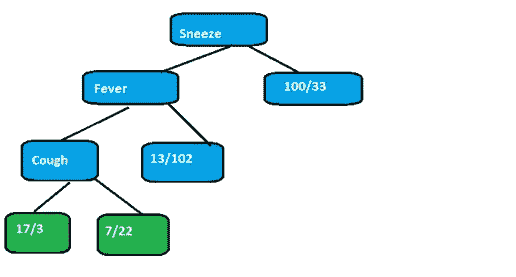

# 决策树分类器

> 原文：<https://medium.com/analytics-vidhya/decision-tree-classifier-5378bff033c5?source=collection_archive---------14----------------------->

有没有想过贷款申请是如何被接受或拒绝的？有没有想过销售团队如何意识到未来对任何产品的需求都会增加，因此我们需要保持仓库有足够的库存？很简单，答案是使用决策树算法分类。

有许多因素会影响输出，因为在我们的案例中，我们将输出视为是否接受贷款申请。这些因素被称为属性。现在出现的下一个问题是，我们将如何得出结论，在 10 个属性或特性中，哪一个最适合作为树的子集。为了实现这一点，我们应用了最少杂质特征子集的概念，在基本的 laymans 术语中，它表示在对输出的贡献方面具有较少不规则性的特征。

**决策树的部分**

决策树是一种类似树的流程图结构，由根节点或决策节点、叶节点和决策规则组成。

决策节点:根据属性进行划分的节点。

决策规则:表示与决策节点对应的属性状态的分支。

叶节点:从决策节点派生的节点，仅由传入的分支组成，没有结果。

**算法是如何工作的？**

-基于基尼杂质法获得最佳属性。

-将其设置为根节点，以及与之关联的数据集中的小记录子集。

-对子节点也重复上述过程，直到满足以下任何条件。

1.数据集的大多数记录都属于一个属性。

2.没有更多的属性需要分类。

**例:**

考虑以下由 331 条以 Covid 症状作为属性的患者记录组成的数据集的情况。我们旨在将患者分为 Covid 阳性或阴性。

在此示例中，我们希望创建一个树，该树使用喷嚏、咳嗽、发烧和身体疼痛状态来预测患者是否患有 Covid。我们开始观察仅咳嗽一项对 Covid 的预测效果。我们跟踪了列表中的所有 331 名患者，并尝试根据是否有咳嗽症状将其映射至 Covid 或非 Covid 患者列表。

同样，我们计算喷嚏、发烧和身体疼痛对电晕病的预测力度。

正如我们所看到的，没有一个叶节点是 100%对“电晕病”是，也没有一个叶节点是 100%对“电晕病”否，因此它们都被视为不纯。为了确定最佳属性，我们需要分离出基于最少杂质的属性。有许多方法可以测量杂质，但在上述情况下，我们可以使用基尼系数法。

现在让我们考虑计算上面图像中所示的咳嗽决策树左叶节点的基尼系数。

对于左节点，基尼杂质

=1-(a)*2-(b)*2

=1-(105/(105+139))*2 -(139/(139+105))*2

在哪里

a =电晕患者类型为“是”的概率

b =电晕患者类型为“否”的概率

左节点的基尼系数= 0.395

右节点的基尼系数= 0.33

现在我们已经计算了两个叶节点的基尼系数，我们可以计算总基尼系数，使用咳嗽来区分冠状动脉疾病患者和非冠状动脉疾病患者。

**咳嗽的基尼系数=叶节点基尼系数的加权平均值**

**=(144/(144+139))* 0.395+(139/(139+144))* 0.336**

**= 0.364**

使用上述方法，我们可以计算打喷嚏、发烧和身体疼痛的基尼系数

咳嗽的基尼系数= 0.364

打喷嚏的基尼系数= 0.360

发热的基尼系数= 0.381

身体疼痛的基尼系数= 0.374

所以我们得出一个结论，决策节点必须打喷嚏属性。

现在我们着重于找出最适合喷嚏决策节点左边节点的属性。正如我们所看到的，在喷嚏树的左节点中有(37+127) = 164 个患者。现在，我们必须计算剩余属性咳嗽、发烧、身体疼痛的基尼系数，将患者分为 covid(37 名患者)和非 covid(127 名患者)。

咳嗽的基尼系数= 0.3

发烧的基尼系数= 0.290

身体疼痛的基尼系数= 0.310

因此，我们得出结论，喷嚏节点的左叶节点将设置为发烧属性。

现在我们把重点放在找出最符合发烧决策节点左边节点的属性上。正如我们可以看到的，在喷嚏树的左侧节点中有(24+25) = 49 个患者。现在，我们必须计算剩余属性咳嗽、发烧、身体疼痛的基尼系数，将患者分为 covid(24 名患者)和非 covid(25 名患者)。

咳嗽的基尼系数= 0.20

身体疼痛的基尼系数= 0.29

因此，我们得出结论，发烧节点的左叶节点将设置为咳嗽属性。

现在考虑咳嗽的左右节点，分别计算这些节点的基尼系数。也算身疼的基尼杂质。可以看出，与体痛杂质相比，节点的基尼杂质非常小。因此它们可以作为单个节点或叶节点存在。

身体疼痛的基尼系数= 0.29

咳嗽左淋巴结基尼系数= 0.12

咳嗽右淋巴结的基尼系数= 0.19

这就是根据杂质从零开始构建决策树的整个过程。

感谢阅读！！

这篇文章的参考文献是:

[https://www.youtube.com/watch?v=7VeUPuFGJHk](https://www.youtube.com/watch?v=7VeUPuFGJHk)

[https://www . data camp . com/community/tutorials/decision-tree-classification-python](https://www.datacamp.com/community/tutorials/decision-tree-classification-python)