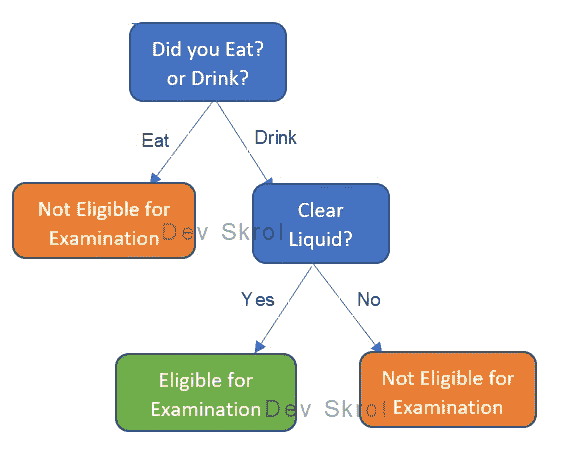
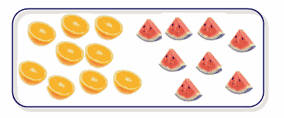
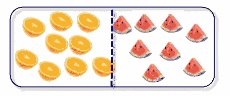
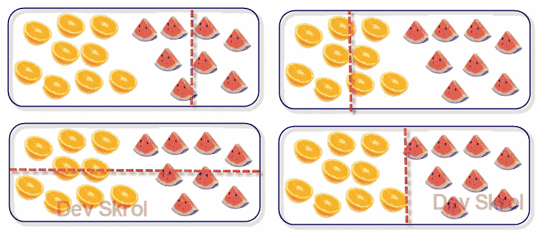
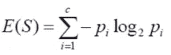
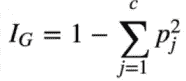
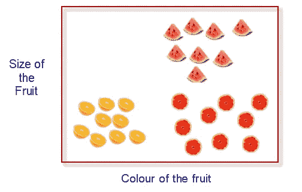
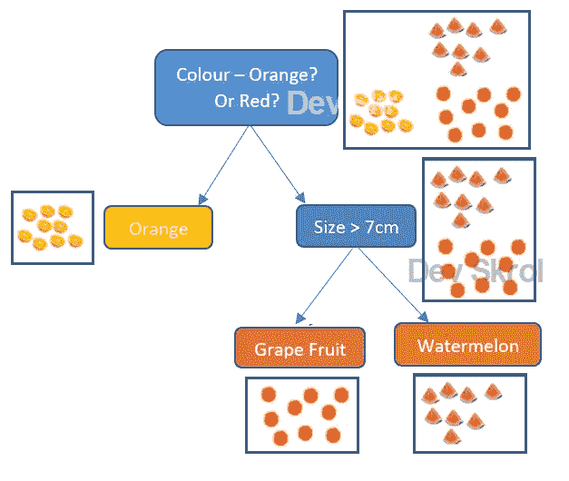
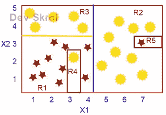

# 决策图表

> 原文：<https://medium.com/analytics-vidhya/decision-tree-ea1ed031d6bc?source=collection_archive---------17----------------------->

在本文中，我们将了解什么是决策树以及它是如何工作的。它如何变得过拟合，以及我们如何解决过拟合。

> 决策树是一种基于规则的算法，在这种算法中，为了预测结果，我们需要回答一系列问题并做出决策。

如果我们用一个每个人都能容易理解的图表来说明这个过程，它就会像一棵树一样出现。

在现实生活中，我们可能会遇到这样的情况:我们进行了一次问卷调查，最后我们得到了一个解决方案。

例如:检查患者是否准备好进行“对比 CT 扫描”。准备好如果 1。在进行 CT 扫描检查前三小时，允许患者饮用清澈的液体，但不允许饮用固体食物。

*   你吃饭了吗？还是喝酒？
*   **如果吃—拒绝**
*   **如果喝酒——你只喝清澈的液体吗？**
*   **如果是——符合检查条件，**
*   **如果否——拒绝。**

符合 CT 检查资格—决策树:作者提供的图片

现在，我们可以清楚地了解到，一份调查问卷是多么有用。

我们将借用这种技术来预测目标变量，我们称之为决策树。

这种技术难道不是在提醒你流程图，并且容易理解吗？

在上面的树中，每个框被标识为一个节点。

第一个节点称为**根节点**。

橙色和绿色的节点是问卷的最终结果。这些节点叫做**终端节点**，有最终答案。

所有剩余的中间节点被称为内部节点。

# 决策树算法的工作原理:

因为提问者知道应该首先考虑什么因素，应该做出什么决定，所以他们很容易做出决定。人类就是这样思考的。

但是机器怎么能对它起作用呢？

## 程序如何识别哪个问题先出现？

在我们之前的“对比 CT 扫描”示例中，我们需要从所有可能的问题中找出哪个问题，制作一份简短的问卷来做出决定。

我们在第一步就把吃东西的人和喝醉的人分开了。所以，我们可以拒绝在第一步中谁吃了固体食物。想一想其他的方法，想出你的步骤。最后你会看到多一步或几步。

在下图中，如果你想用一条水平线或垂直线来区分橙子和西瓜，那么最好的分割线是中间的一条垂直线。同意吗？

作者图片

如果是垂直线，那么存在于 X 轴的特征在这里播放。

也就是说，我们希望两个分开的部分具有相似的类值。这样我们就可以决定左边的类别应该是一个橙子，右边的应该是一个西瓜。

例如，在下面的图片中，您可以看到前三张图片没有很好地分割以隔离项目。在第四张图中，这是最可能的好分割，因此分割的进一步步骤被最小化。

现在划分数据后，两个区域有相同类型的水果(相同的类值)。我们称之为“纯洁”。

## 机器如何找到这个最佳分裂，找到节点的纯度？

要做到这一点，首先我们需要选择第一个根节点，以及在哪里进行分割。

这将使用以下两种方法中的任何一种来完成:

1.  信息增益(使用熵)。
2.  基尼指数。

基尼系数和熵值都谈到了“不确定性的度量”。

在上面的图片中，A 是纯的，因为它只有一个类。b 有杂质，但是它可以给出中等的关于哪个阶级统治这个地区的知识。但是在 C 语言中，太阳和星星的数量相等。我们在这里无法做出任何决定。该节点具有高杂质。

# 信息增益(使用熵):

***信息增益=目标熵—属性熵***

在我们的例子中，目标的熵是水果列的熵。属性的熵只不过是特征(预测值/列)的熵。

让我们来看看，

形状的信息增益=水果的熵—形状的熵= 0.25

颜色的信息增益=水果的熵—颜色的熵= 0.35

这里颜色的信息增益是最高值。

所以，颜色将是根节点。

# 基尼指数:

基尼系数的计算方法是从 1 中减去每一类概率的平方和。

这里 Pj 是物体被分类到特定类别的概率。

让我们来看看，

按形状分列的基尼指数= 0.31

按颜色划分的基尼指数= 0.23

这里基尼系数的颜色是最低值。

所以，颜色将是根节点。

# 基尼指数与信息增益:

基尼指数或信息增益(熵)，两者的工作原理相似，只是公式不同。

> *将提取每个特征并计算基尼系数。给出* ***最低基尼分数的特征被用作根节点或决策节点*** *。*
> 
> *类似地，为每个特征计算熵值，然后为该特征计算信息增益分数。最后给出* ***最高信息增益的特征将作为根节点或决策节点*** *。*

类似地，剩余的内部节点将使用基尼/熵进一步分裂。

但是，我们可以在算法中控制这个参数。

> ***熵是最古老的使用 Log in 计算的方法*** *。所以，它比基尼系数计算要慢。*
> 
> *所以，* ***基尼系数是最常用的方法，因为它比熵值*** *更快。但是这两种方法将提供相同的结果。*

在本文中，我们不深入探讨这个话题。稍后我会发布一篇有好的和简单的例子的新文章，并链接到这里。

即使在分割之后，如果仍然有不同类型的水果，该算法将再次分割不同类型水果存在的区域。这将通过使用给定的特性来完成，并且将终端节点作为纯节点(具有单个类的节点)。

> *决策树也可用于回归问题，以预测连续值。*
> 
> *在分类问题中，通过检查纯度来进行最佳划分。在回归中，通过检查最小方差来完成。*

## 另一个例子:

让我们制作一个模型，用给定的水果大小和颜色来预测这是什么水果。

如果给我们水果的大小和颜色，那么我们可以先根据颜色进行分类。

在上面的图片中你可以看到，首先颜色被用来划分区域，结果是橙色和红色。

其中 Orange 是一个纯节点，这里只存在一个类。

但是红色有杂质，因为在那个区域有两种类型的水果(在那个区域存在两个等级)。

当使用 size 时，我们可以除以，size >一个特定的厘米。应该是 7cm 吧？还是 5cm？哪个会让结果更好？

在内部，机器尝试所有可能的值，并检查结果区域的方差。

对于 7cm 的值，如果纯度良好，则机器会以 7cm 为边界来划分区域。

最后，我们得到了葡萄和西瓜的纯节点。

# 过度拟合:

在前面的例子中，数据中没有噪声。数据本身是干净的，我们通过一次或两次拆分得到纯节点。

如果数据中有很多噪音怎么办？

在上面的例子中，根节点是蓝线。根节点的条件是 X1> 4.3

黄线是第二层。X2 > 3.5

现在 R3 区域是纯的。这个 m =可以是终端节点。

但是 R1 和 R2 地区仍然有杂质。

然后，机器将处理 R1，并使用条件“X1 > 3，X1 < 3.5，X2 < 2.5”导出 R4 地区。可能吧？

以同样的方式，通过衍生 R5 来纯化 R2。

现在所有的终端节点 R1、R2、R3、R4 和 R5 都是纯的。

算法到此结束。

但是你觉得这样好吗？R4 和 R5 中的数据可能是一个噪声。

是啊！此模型对于训练数据来说过拟合。

如果测试数据有一颗红星落在 R4，那么它将以错误告终。R5 区也发生同样的情况。

那我们怎么告诉模型在某个点停止划分区域呢？

# 修剪树:

这是我们通过设置决策树的参数来修剪树的地方。

***Max_depth:*** 该参数帮助设置树的最大深度。如果我们将上面例子中的 max_depth 设置为 3，那么将不会创建 R4 和 R5 区域。

***Min _ sample _ split:***该参数设置进一步拆分所需的最小样本数(行数)。例如，如果一个节点有 4 颗星和 1 颗太阳，并且如果我们将 min_sample_split 设置为 6，那么这个节点不能被进一步划分，因为它只有 5 个样本。

***Min _ samples _ leaf:***该参数可用于提及终端节点(叶节点)应出现的最小样本数。

# 什么时候使用决策树？

我们已经有了用于分类的逻辑算法和用于回归的线性算法。那我们为什么需要决策树呢？以下是您应该使用决策树的原因和情况。

*   如果数据是线性的，那么我们可以使用逻辑回归本身。但是当维度更高时，我们如何知道数据是线性的还是非线性的呢？
*   我们可以开始使用一些基本的分类技术，如逻辑回归。经验法则是使用简单的方法。如果结果不好，那么线性分类方法可能无法解决问题，我们可能需要使用更复杂的非线性分类算法。
*   如果逻辑和 DT 给出相同的结果，那么为什么我们需要一个复杂耗时的算法。
*   如果数据**不平衡**，那么**最佳选择是决策树**。
*   如果**的特征数较高**(例如> 100)且样本较少(数据= 100000)，那么**我们可以使用逻辑回归**，因为当特征数较高时决策树较慢。
*   如果特征的数量高于样本的数量，那么我们就不应该使用逻辑回归。
*   决策树容易过度适应。
*   决策树最大的优点之一是这个算法**不需要缩放**。
*   我们可以看到决策树是如何分割数据的，决策树是一个**白盒算法**。

# 结论:

在这篇文章中，我们学习了决策树。

我将添加一个新帖子来练习 Python 中的决策树。

编程快乐！🙂

喜欢支持？只需点击心形图标❤️.