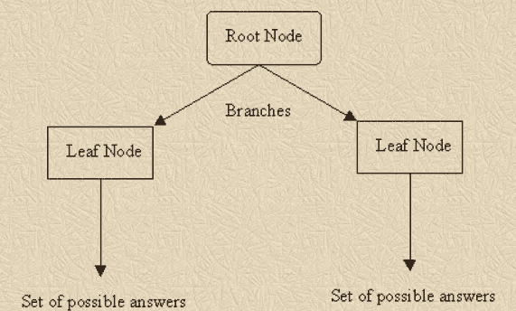
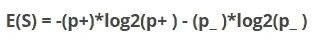
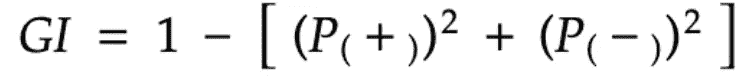
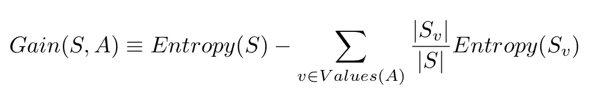
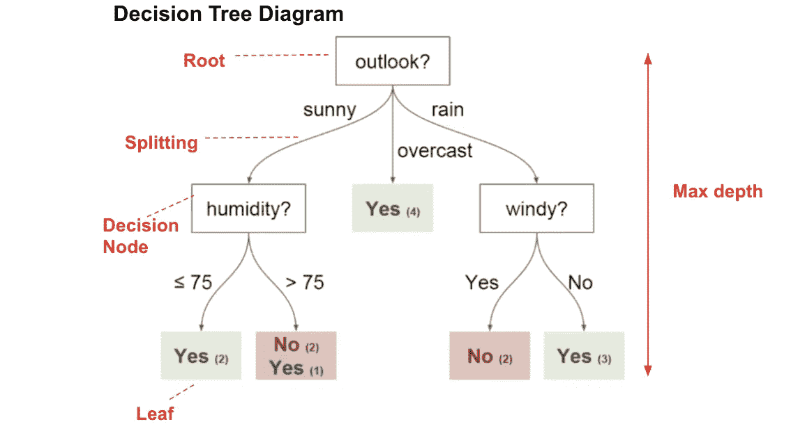

# 决策树解释了…

> 原文：<https://medium.com/analytics-vidhya/decision-tree-explained-6441c7b96ec4?source=collection_archive---------18----------------------->

**决策树(DTs)** 是用于分类和回归的非参数监督学习方法。目标是根据数据特征中的一些决策规则创建模型。它还能够对数据集执行多类分类。

在告诉你决策树算法如何工作之前，我想先给你介绍几个在算法中起重要作用的术语。

决策树的基本结构

1.  **熵:**是杂质的度量。它告诉我们一个特定的节点在分裂之前或之后有多不纯。它的值介于 0 和 1 之间。

0 表示分离是完全纯的，而 1 表示完全不纯的分离。

**熵(E)**

**S =给定属性的样本**

**p+ =正类概率**

**p_ =负类概率**

> 熵值越小，纯分裂越多。

2. **Gini 杂质:**它也是节点中杂质的度量，但与熵相比，发现它要容易得多。它在计算上也比熵有效得多。它的值介于 0 和 0.5 之间

基尼不纯度

3.**信息增益:**它告诉我们一个特定的特征为我们提供了多少“信息”用于拆分。值越大，接收的信息越多。

信息增益

**S(v) =分割后的样本**

**S =分割前的样本**

## 决策树算法如何工作

1.  首先，它将创建深度为 1 的多个决策树，并找出最适合放置在根节点上的特征。这可以通过对每个特征使用信息增益来找到。具有最大信息增益的特征将被选择用于根节点。
2.  在修复根节点之后，我们将再次开始以与我们对根节点所做的相同的方式分割决策树。我们将找到剩余特征的最高信息增益，并将开始放置在内部节点中。
3.  这个分裂过程继续进行，直到我们得到完全纯粹的分裂(或者所有样本都是“是”或者“否”)，或者直到我们已经实现了为我们的决策树选择的最大深度。

> 决策树容易过度拟合数据。为此，我们可以使用在叶节点所需的最小数量的样本或使用树的最大深度来修剪我们的决策树。
> 
> 如果一个类占主导地位，决策树也容易偏向。因此，在拟合决策树之前，需要平衡数据集。

决策图表

## ID3 v/s 推车

这是决策树内部使用的两种算法。

1.  ID3:它使用熵来寻找节点的杂质。
2.  CART:它使用 Gini 杂质来寻找节点的杂质。

决策树很容易解释。它需要较少的数据准备。它可以处理数字和分类特征，尽管在数字特征上它运行缓慢。

有关 DT(s)的更多信息，请查看:[https://www.youtube.com/watch?v=7VeUPuFGJHk](https://www.youtube.com/watch?v=7VeUPuFGJHk)

如果你喜欢这篇文章，别忘了点击拍手图标。

快乐学习。