# 回归决策树——秘诀

> 原文：<https://medium.com/analytics-vidhya/decision-tree-for-regression-the-recipe-74f7628b8a0?source=collection_archive---------11----------------------->

回归是指当因变量连续时，确定因变量和自变量之间的潜在关系。可以使用许多模型来预测连续变量。使用的一些模型是线性回归、决策树、k-最近邻等。

决策树模型本质上是非参数的，即它使用无限的参数来学习数据。它有一棵树的结构。随机森林算法是决策树的改进版本。决策树基本上将数据集分割成许多子集。

*就像切蛋糕一样……*

供图:[https://all time lists . com/you ve-be-cut-the-cake-all-wrong/](https://alltimelists.com/youve-been-cutting-the-cake-all-wrong/)

**决策树的结构**

通常，数据集被分支或切割的节点被称为**决策节点**。分支停止的节点称为**叶节点。**数据集第一次被切割的节点称为**根节点。**从另一个角度来看，数据是根据不同的条件分组的。

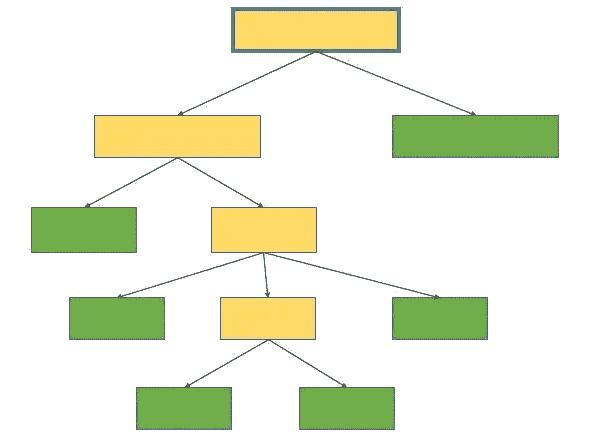

黄色节点-决策节点，绿色节点-叶节点，以蓝色突出显示的节点-根节点

决策树的学习方面指的是识别在数据集的哪里进行这些切割。

我写了一行代码，但它是如何工作的？？？？？

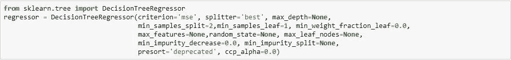

让我们用一个例子来讨论。

假设我们正在解决一个问题，预测我们应该添加到一道菜里的辣椒粉的克数*(因变量)*，给定要考虑的自变量有

I .烹饪类型(印度、中国、泰国)，

二。菜里有新鲜辣椒(0-否，1-是)，

三。这道菜是为孩子们做的吗？(0-否，1-是)，

四。菜肴的基本配料(米饭、面条、蔬菜)，

动词 （verb 的缩写）准备的菜肴的数量(以克为单位)。

可能还有更多的因素需要考虑，但我们仅限于这五个。

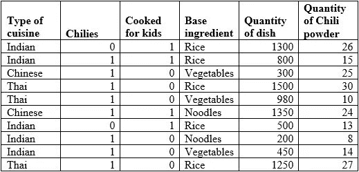

我们的数据集

其他例子也可以用来解释，但是如果你不把它和你熟悉的事物联系起来，那还有什么好激动的。

*(请读者注意，数据集是为了解释的目的而创建的，可能与实际值不匹配)*

通过找到度量(称为“标准”)减少最大的独立变量和阈值，树开始生长。

**步骤顺序:**

1.  计算训练数据中因变量的‘MSE’(均方误差)。这里的“均方误差”解释了平均值的分布(如方差)。*(计算 MSE 是因为在代码中，criterion =‘MSE’)*

我们数据中的“y”值:26，15，25，30，10，24，13，8，14，27

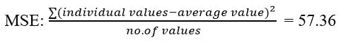

2.接下来，模型通过尝试将每个独立变量和每个可能的阈值作为条件来分割数据集，并在分割数据后计算 MSE。

***数据上有哪些可能的拆分？***

例如，我们试图根据新鲜辣椒的存在来分割数据，

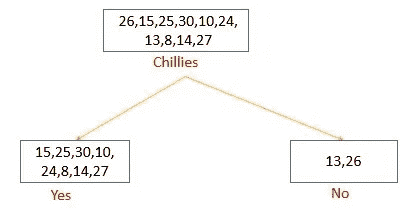

数据——在分开不同的辣椒后

在“辣椒的存在”上分割后计算数据的 MSE:

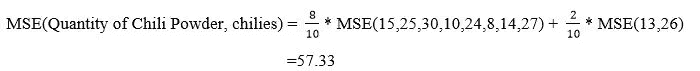

MSE 减少= 57.36–57.33 = 0.03

类似地，让我们试着在变量“这道菜是给孩子们做的吗？”上分割数据

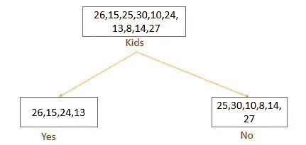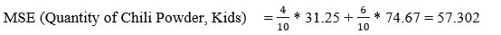

MSE 减少= 57.36–57.302 = 0.058

同样，数据也可以按菜系划分，例如，如果菜系类型为“泰式”等。，并计算 MSE 的相应减少。

***连续变量的情况下会发生什么？？？？？***

“准备菜肴的数量”是我们数据集中的一个变量。

将连续变量的不同值作为阈值来计算 MSE 的减少。

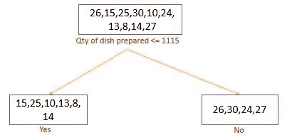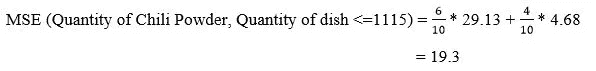

MSE 减少= 57.36–19.3 = 38.06

对于连续变量的不同阈值，重复该过程。

***“MSE 减少”值告诉我们特定变量的数据分割是否有效。*** *用同样的方法，对每一个单一变量都计算出 MSE 的减少量。*

3.给出 MSE 的最大减少的变量因此被选择作为分裂的根节点。*(在代码中我们提到 splitter='best ')。*

*在我们的示例中，变量“准备的菜肴数量”及其阈值 1115 被选为根节点，因为它导致 MSE 的最大减少。*

**因此，用于分割数据的第一个条件是“准备的菜肴数量”< =1115。**

4.为了使树增长，从根产生的节点可以被进一步分割。我们有 2 个从根*分支的节点(一个由端盘数量≤1115 的数据组成，另一个由端盘数量> 1115 的数据组成)*。

这两个节点中哪一个分支更远？基于我们指定的超参数来回答。

超参数'最小杂质分离'，'最小样本叶'，'最小样本分离'和'最小杂质减少'帮助我们决定一个节点是否将分支。一旦选择了可以分支的节点，重复相同的过程，以便找到导致 mse 最大减少的变量和阈值(所选节点中的值的 *mse)。*

重复该过程，直到达到树的最大深度或最大叶节点数。当不可能进一步分裂时，生长也停止。下图是我们训练集的决策树模型。

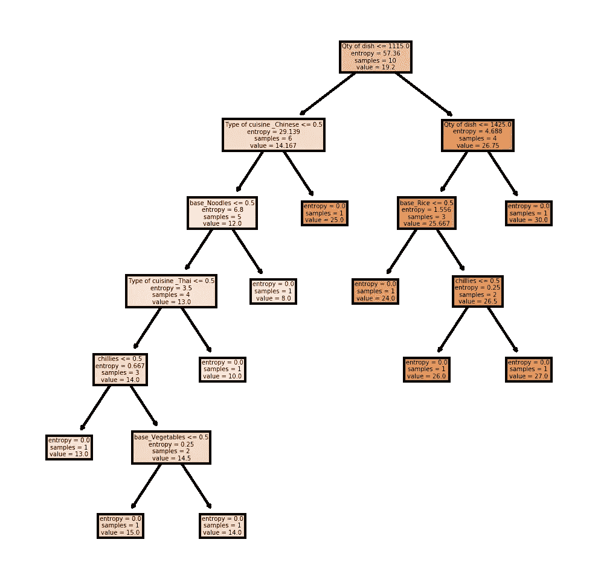

我们数据集的决策树模型

**表现:**

模型中的每个块/节点为我们提供了 4 个方面的见解，

1.该节点中存在的训练数据的样本数(样本)

2.该节点中点的平均值(值)

3.该节点中值的 MSE(熵)

4.进一步拆分节点所基于变量和阈值。

请注意，所有叶节点仅给出洞察 1、2 和 3，因为它们不会再次分支。

我们可以在最终模型中看到 10 个叶节点，因为我们的数据中有 10 个因变量的唯一值。一般来说，完全长大的树不是首选。这样的树会一直生长，直到每个叶节点中只有一个唯一的值。

*(该死…如果训练数据很大，那会导致一棵大树)*。

这也将导致另一个问题，称为模型对我们的训练数据的过度拟合。因此，调整超参数至关重要。有关超参数的更多详细信息，请参考

[https://scikit learn . org/stable/modules/generated/sk learn . tree . decisiontreeregressor . html # sk learn . tree . decisiontreeregressor](https://scikitlearn.org/stable/modules/generated/sklearn.tree.DecisionTreeRegressor.html#sklearn.tree.DecisionTreeRegressor)

**模型建立。接下来呢？？？**

在预测看不见的数据点的过程中，模型使用看不见的数据的独立变量值，并在基于定型数据开发的条件下检查它们。在某一点上，看不见的数据点落在其中一个节点下，并且最终预测作为该节点中训练点的平均值给出。该模型只是返回我们看不见的数据所属的节点的“价值”洞察力。

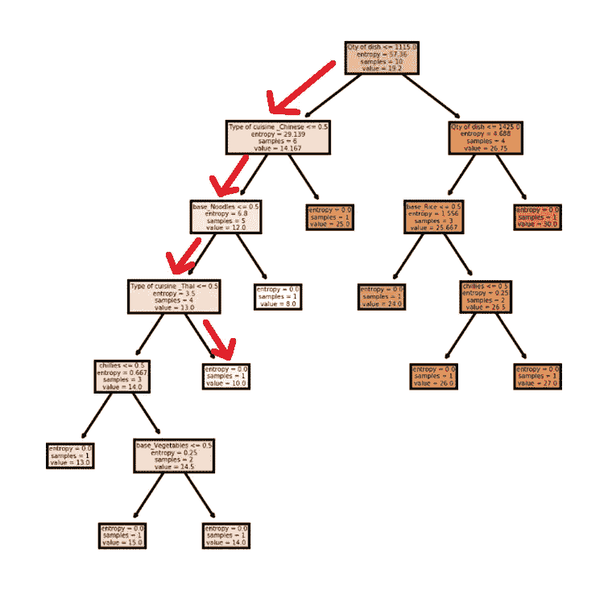

假设我们需要预测具有以下属性的一道菜的辣椒粉数量:[泰国，有辣椒，不是为孩子做的，基本成分:大米，850 克最终菜]，数据点通过红色显示的路径，并在一个节点中结束(除此之外，不检查任何条件)。该节点*(该节点中训练数据点的平均辣椒粉)* = 10，因此，该看不见的数据点的辣椒粉的预测量= 10 克。

供图:[https://www . barnorama . com/20-爆笑-惊讶-猫-照片/](https://www.barnorama.com/20-hilarious-surprised-cats-photos/)

好吧…等等…什么？？平均分？？？k 近邻算法就是这么预测的。是..K-NN 取 k 个“最近点”并返回它们的平均值作为预测值。决策树回归器以同样的方式工作，但是为了知道哪些点需要平均，它使用了分裂技术。

**快乐学习！！！！！！！**

参考资料:

[1][https://saedsayad.com/decision_tree_reg.htm](https://saedsayad.com/decision_tree_reg.htm)

[2][https://scikit-learn.org/stable/modules/tree.html](https://scikit-learn.org/stable/modules/tree.html)