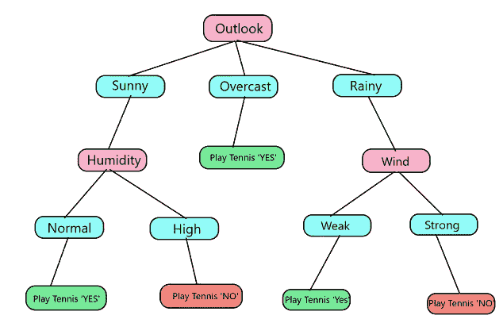
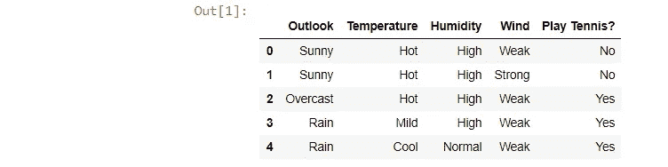

# 决策树直观解释

> 原文：<https://medium.com/analytics-vidhya/decision-tree-intuitive-explanation-7e820b399541?source=collection_archive---------3----------------------->

> *scikit-learn 库中决策树的解释和实现*

感谢托尼·万 [Unsplash](https://medium.com/u/2053395ac335?source=post_page-----7e820b399541--------------------------------)

**什么是决策树？**

让我们从一个简单的例子开始

决策树提出一个问题，并根据答案进行分类，如上图所示。它问**“你累了吗？”**如果**是**则**休眠**否则**播放**。也可以解释为 If-else 条件。这些条件可以进一步扩展为

如果**“想玩吗？”**然后**蟋蟀**其他的**学习**

**决策树**是这种算法的一个非常典型的例子，因为这种算法的基本范例是遵循一组 **if-else** 条件，以便对提供给它的数据产生感觉，并从中学习。

顶层节点称为**根节点**，其后没有**分裂**的节点称为**叶节点**。

现在让我们举一个不太简单的例子并进行分类。

这里给出了 14 天的数据，根据特征**{‘展望’，‘温度’，‘湿度’，‘风’}**我们需要对人是否会打网球进行分类**。**

但是我们如何选择首先分割哪个特征呢？。我们需要**最能分离目标({ '打网球' })的特征。**

但是我们如何知道哪个特征最好地分割目标，为此我们引入了一个术语叫做**‘杂质’**，杂质衡量特征的同质性。衡量杂质最常用的方法是**、【基尼系数】和【基尼熵】。**

让我们用基尼指数来计算杂质，假设有一个类似于 **{“情绪”}** 的特征，如果一个人的情绪很好，他就会不顾其他条件去玩。

那么这将是最好的分割特征。为什么？

如果我们在**情绪**上分裂，那么对于情绪= **【好】**，【打网球】类永远是**【是】**，对于情绪= **【坏】**，永远是**【否】。这变成了一个简单的 **If-else** 条件。这里我们有 14 行，每一行我们保留一个类别标签的记录，即'**是**或'**否**'出现的次数。**

我们的理想特征'**情绪'**有两个值'**好**'和'**坏**'，对于每个值，我们拆分**“打网球”类**并计算 G.I，取它们的**加权平均值**以找到最终的 G.I，表示为 G.I(情绪|打网球)。上述基尼系数公式可以简单地表示为-

**G.I=1- prob('是')- prob('否')**

g1=1-(9/9) -(0/9) = 0，g2 =1-(5/5) -(0/5) = 0

G.我(心情|打网球)= 9/14 * G1+5/14 * G2 = 9/14 * 0+5/14 * 0 = 0

因此，我们得到的杂质为 0，这是理想的，**因此，杂质越低，特征越好地分离目标类。**

# **现在为了决定根节点，我们为四个特征中的每一个计算 G . I-**

g1 = 1- (2/5) - (3/5) = 12/25 = 0.48，

g2 = 1- (0/4) - (4/4) = 0

g3 = 1- (2/5) - (3/5) = 12/25 = 0.48，现在计算 g1、g2、g3 的**加权平均值。**

**G.I(展望|打网球)**= 5/14 * G1+4/14 * G2+5/14 * G3 =**0.342**

g1 = 1- (3/4) - (1/4) = 0.107

g2 = 1- (2/6) - (4/6) = 0.190

g3 = 1- (1/4) - (3/4) = 0.107

**G.I(临时|打网球)**= 4/14 * G1+6/14 * G2+4/14 * G3 =**0.404**

**同理 G.I(湿度|打网球)= 0.367，G.I(风力|打网球)= 0.82。**

在所有的**G . I(Outlook |打网球)中最低的**，所以这是我们的**根节点。**

我们的树看起来像-

重新排列行，我们的桌子变成了

**如前所述，我们将计算{ '温度'，'湿度'，'风' }** 的 G.I

打开**“温度”**

g1 = 1- (2/2) =0

g2 = 1- (1/2) - (1/2) = 0.5

g3 = 1- (1) = 0

现在 **G.I(温度|晴)**= 2/5 * G1+2/5 * G2+1/5 * G3 =**0.2**

打开**“湿度”**

g1 = 1- (2/2) = 0

g2 = 1- (3/3) = 0

G.I **(湿度|晴天)** = 2/5*g1 + 3/5*g2 = **0**

同理 G.I **(风|晴)= 0.466**

因此选择**【湿度】**。

现在我们的树看起来像

**现在，我们将尝试分割“阴天”,以检查我们是否可以减少 G.I**

但是我们观察到，每当**【展望】**是**【阴天】** **打网球？**永远是**‘是’。这意味着我们不需要进一步分割这个节点。**

同样，我们计算-

**G.I(温度|多雨)= 0.466**

**G.I(湿度|多雨)= 0.466**

**G.I(风|雨)= 0**

因此我们在**‘风’**上分开，我们最后的树是-

# **现在我们将看看如何使用 sci-kit 学习库在 Python 中使用决策树进行预测**

首先我们加载数据，我已经将上面的表保存为“table.xlsx”。我们用熊猫来装载。

但是由于我们的数据是分类的，我们不能直接把它输入到 DecisionTreeClassifier()中，首先我们需要**把分类数据编码成数字数据**。因此，我们应用**标签编码**，现在标签编码转换这些数据，因为它为特征中的每个类别分配一个唯一的编号

像**‘展望’**特征有 3 个类别**{‘晴天’，‘阴天’，‘雨天’}**所以这三个类别将被分配唯一的编号 **{ 2，1，0}** ，**这些编号不需要按顺序**。所以我们给我们的数据贴上标签编码-

现在我们可以应用逆变换并验证我们的数据

其他编码也可用于不同类型的编码，参见[这里的](/data-design/visiting-categorical-features-and-encoding-in-decision-trees-53400fa65931)。

我们现在将这些数据分为训练数据和训练目标

现在我们从 sklearn.tree 导入决策树分类器

在决策树分类器中，我们可以改变许多参数

**标准** : *字符串，可选(default="gini")*

衡量分割质量的函数。支持的标准是**“基尼”**用于**基尼杂质**和**“熵”**用于**信息增益**。

**max_depth** : *int 或 None，可选(默认=None)*

树的最大深度。如果没有，则扩展节点，直到所有叶子都是纯的，或者直到所有叶子包含少于 min_samples_split 样本。**最大深度越高，过度拟合的可能性越大。**

**min _ samples _ split**:*int，float，可选(默认值=2)*

分割内部节点所需的最小样本数:

*   如果是 int，那么把 min_samples_split 作为最小数。
*   如果是 float，那么 min_samples_split 是一个分数，ceil(min _ samples _ split * n _ samples)是每次拆分的最小样本数。

**min _ weight _ fraction _ leaf**:*float，可选(默认=0。)*

要求位于叶节点的权重总和(所有输入样本)的最小加权分数。当未提供 sample_weight 时，样本具有相等的权重。

**max_features** : *int，float，string 或 None，可选(默认=None)*

寻找最佳分割时要考虑的特征数量，如果“自动”，那么**max _ features = sqrt(n _ features)**

现在，我们使用刚刚构建的树进行分类

0 代表“否”, 1 代表“是”

# predict_proba 方法如何作用于决策树

这个方法返回一个形状为 **(n_samples，n_classes)** 的数组，包含样本属于哪个类的概率值。

这些概率值有助于我们更好地理解模型，它们有助于我们绘制 ROC-AUC 曲线。

我们现在将看到[***predict _ proba***](https://scikit-learn.org/stable/modules/generated/sklearn.tree.DecisionTreeClassifier.html#sklearn.tree.DecisionTreeClassifier.predict_proba)如何在决策树分类器上工作

首先，让我们将 max_depth 限制为 3，并用 sklearn 的 Graph-Viz 可视化树。

对于每个叶节点，predict_proba 计算每个类标签的样本分数，从而返回两列。这里，第一列表示分类标签“否”的概率，第二列表示“是”的概率。因此，我们需要第二列的值。

进一步的类别概率计算如下-

作者- [里卡多·克鲁兹](https://rpmcruz.github.io/machine%20learning/2018/02/09/probabilities-trees.html)

现在我们用这个公式来计算概率值-

现在让我们试着预测我们的第一行——其中展望=2，温度=1，湿度= 0，风= 1。

这里在**根节点**我们一共拆分了 14 个点，**【5，9】**代表总训练点数， **5** 有目标标签**【0】(【打网球】=否)**和 **9** 有标签**【1】(【打网球】=是)**

类似地，我们看到，在这个叶节点中，所有值都属于**相同的类，即“0”**，因此类为**“0”的概率是 1，而为“1”的概率是 0。**

类似地，如果我们试图计算第四点的概率值，其中**前景=1，温度=2，湿度= 0，风= 1。**

这里，在这个叶节点中有两个值，一个属于**类“0”**，另一个属于**“1”**。现在，属于“0”的**类的概率是 1/(1+1) = 0.5，属于“1”的类的概率是 1/(1+1) = 0.5。类似地，我们可以计算所有点的概率值。**

**参考文献**

*   [应用人工智能课程](https://www.appliedaicourse.com/lecture/11/applied-machine-learning-online-course/3075/regression-using-decision-trees/4/module-4-machine-learning-ii-supervised-learning-models)
*   《StatQuest:决策树》作者:乔希·斯塔默

*感谢阅读，如果您需要代码或数据，请访问我的 github。*