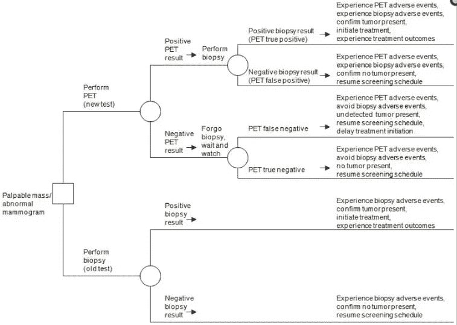

# 决策树机器学习

> 原文：<https://medium.com/analytics-vidhya/decision-tree-machine-learning-7af14b09d412?source=collection_archive---------11----------------------->

*快速浏览伊利亚·格里戈利克的红宝石"* [*决策树*](https://github.com/igrigorik/decisiontree)

*为什么**树**？根据[麻省理工学院机器学习和统计课程](https://ocw.mit.edu/courses/sloan-school-of-management/15-097-prediction-machine-learning-and-statistics-spring-2012/lecture-notes/MIT15_097S12_lec08.pdf)的说法，他们是。。。*

*   *直观，在医疗应用中很受欢迎，因为它们模仿了医生的思维方式*
*   *精确模拟离散结果*
*   *可以非常强大，可以根据您的需要非常复杂*

*什么构成了*决策树*？*

*   ***根节点:**这是树的起点。*
*   ***叶节点:**这些是拆分数据的问题或条件。*
*   ***分支:**这些是指导我们决策的方向。*

*下面是一棵帮助我们决定晚餐吃什么的树。*

**

*与 LucidChart.com 一起做的决策树*

*现在用 ruby gem '决策树'把它翻译成代码。*

> *(旁注)离散与连续标签类型？*
> 
> *离散值是不会改变的布尔值、字符串或一组数字。连续值代表一个范围，在测试过程中可以引入标签的新值。*

**

***标签:**用一个键定义我们训练数据中的每一列。*

***训练:**一个 AoA 的数据来训练我们的数据，每个都包含结果。*

*这将创建一个决策树的新实例。我们将标签列为键值为*离散*或*连续*的键。*

***dec_tree.train :** 这个训练我们的数据。*

***测试:**这是我们希望机器为我们预测答案的单个数据集。*

***#predict(test):** 返回机器认为是真的输出。*

**

## *“决策树”是如何工作的？*

*这个 gem 实现了 *ID3* ，这是一个算法，目的是用数据集创建决策树。在存储第一个数据集之后，下一个数据集的每个属性被用来计算信息增益(或熵)。它继续处理每组数据，计算信息增益并根据结果将它们分成子集，并使用叶节点和分支细化树。与大多数机器学习一样，为训练我们的机器提供的数据越多，它的预测就越准确。*

## *决策树的真实例子。。。*

**

*[决策树在医疗领域的应用(乳腺癌检测)](https://www.ncbi.nlm.nih.gov/books/NBK98235/figure/ch2.f5/)*

**

*[**特斯拉的自动驾驶神经网络**](https://www.tesla.com/autopilotAI) **使用预测熵来确定其传感器中的对象***

*资源:*

*[ID3](https://en.wikipedia.org/wiki/ID3_algorithm) - *迭代二分法 3* 是罗斯·昆兰发明的一种算法。*

*[熵](https://towardsdatascience.com/entropy-how-decision-trees-make-decisions-2946b9c18c8)——决策树如何做决策。*