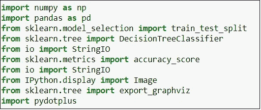
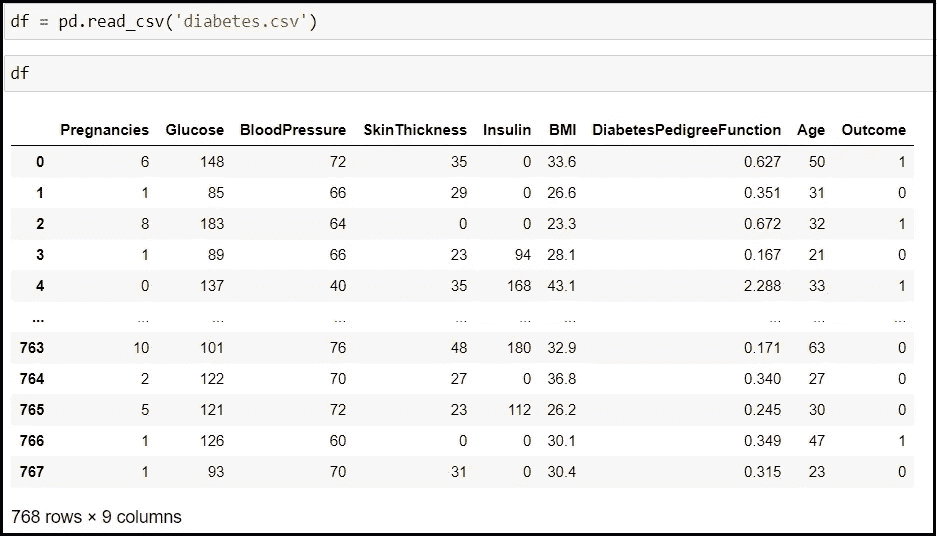
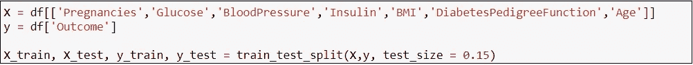
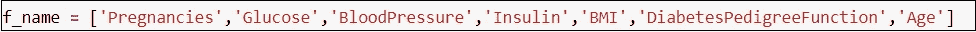
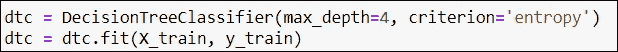
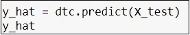
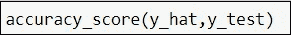
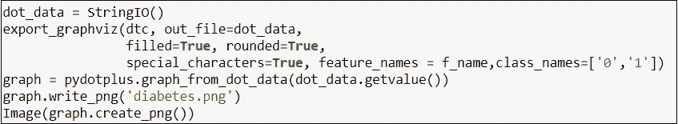
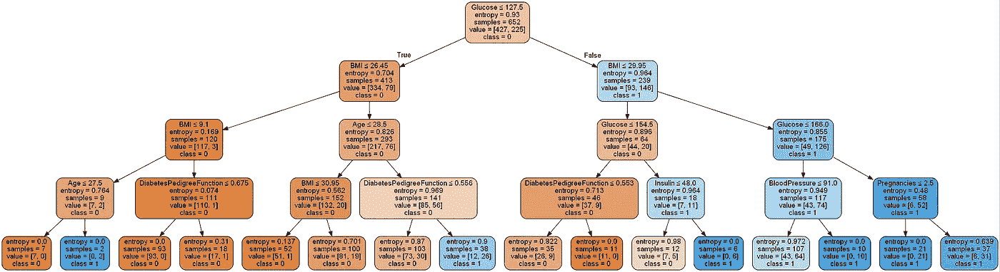

# 糖尿病患者数据集上的决策树

> 原文：<https://medium.com/analytics-vidhya/decision-tree-on-diabetic-patients-dataset-9529c1265ef4?source=collection_archive---------10----------------------->

# 什么是决策树？

```
First we need to understand that what does decision tree means. It means that it is a kind of supportive tool which helps us to understand the possible consequences through tree-like model.
```

# 为什么需要决策树？

```
As it gives tree-like model it descibes every possible solution in algorithm which can easily understandable. It provides very effective and deep knowledge about the situation. That's how decision tree helps in ML.
```

*   在我们的案例中，我使用了糖尿病数据库，该数据库包含 700 多名患者的妊娠、血糖水平、血压、皮肤厚度、胰岛素、身体质量指数、年龄、糖尿病和糖尿病功能及其结果的信息。
*   首先，我们需要理解为什么决策树需要这个数据集，因为我们已经讨论过它的输出带有某种类别。因此，通过生成决策树，我们可以很容易地理解它是如何分类的。
*   所以，我们来深究一下。

# 1)导入库

*   这里，我们需要一些库来执行决策树分类器。



# 2)导入数据集

*   使用熊猫导入数据集。



# 3)分割数据集

*   导入数据集后，我们需要将其分成训练和测试，以便我们可以计算模型的准确性。在这里，我们将数据集分为 85%的训练集，其余的用于测试。



*   这里，我们将列名保存在一个变量中，这样我们可以在以后的决策树图中使用它。我们需要指定它，因为我们还没有使用数据集的所有列。



# 4)训练模型

*   首先，对模型进行分类，然后将数据放入其中。请注意，这里我们使用了决策树分类器的“熵”标准。



# 5)预测

*   现在，我们来预测一下价值。



*   在这里，我们得到了 72%的准确率。



# 6)显示决策树

*   我们可以使用 Graphviz 函数显示决策树。



谢谢你。