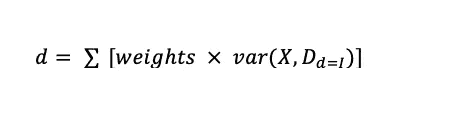

# 决策树—第二部分

> 原文：<https://medium.com/analytics-vidhya/decision-tree-part-2-c6e57a0a2c61?source=collection_archive---------14----------------------->

## 决策树背后的数学是如何处理回归问题的？数学时间！！！

上一篇文章讨论了分类问题的节点分割。现在，让我们来看看目标值连续的回归问题。

## **方差减少**

计算节点的方差:

其中 X =特征中的标签，D=观察总数，
n =实例数

将考虑为分割提供最小值的特征。

为了更好地理解，我们来看一个例子:

**具有连续目标变量和分类特征变量的回归树。**

*   Outlook 列被视为:

对于重量:

1.  阳光= 3/10 = 0.3
2.  阴= 3/10 = 0.3
3.  多雨= 4/10 =0.4

对于方差

1.  快活的

平均值的计算方法是 Hours_played =( 6 + 10 + 20 )/3 = 12

应用差异公式:

var(X，D)=[(6–12)+(10–12)+(20–12)]/(3–1)= 52

然后乘以权重:52 x 0.3 =15.6

2.遮蔽

平均值= (8 + 3+ 12)/3 =7.6

var(X，D)=[(8–7.6)+(3–7.6)+(12–7.6)]/(3–1)= 20.34

乘以权重后:20.34 x 0.3 = 6.102

3.下雨的

平均值= (2 + 14+ 19 + 8)/4 =10.75

var(X，D)=
[(2–10.75)+(14–10.75)+(19–10.75)+(8–10.75)]/(4–1)= 53.91

乘以权重后:53.91 x 0.4 = 21.564

所有值之和就是该列的方差:
15.6 + 6.102 + 21.564 = 43.27

*   考虑湿度列，并以类似方式计算方差:

湿度的方差= 13.16 + 27.78 = 41.54

方差值的比较:

湿度的变化较小，因此考虑了分离。

构建了决策树，并描绘了玩的小时数。

决策图表

(湿度=高&季节=晴朗)= 6

(湿度=高&季节=阴)= (8+12)/2 = 10

(湿度=高&季节=多雨)= 19

(湿度=低&季节=晴朗)= (10+20)/2 =15

(湿度=低&季节=阴)= 3

(湿度=低&季节=多雨)= (2+14+8)/2 = 12

你可以进一步了解随机森林回归，以及它们失败的原因。

 [## 随机森林回归:何时失败，为什么？

### 在本文中，我们将探讨使用随机森林进行回归的一个主要问题，即外推。我们会…

海王星. ai](https://neptune.ai/blog/random-forest-regression-when-does-it-fail-and-why)