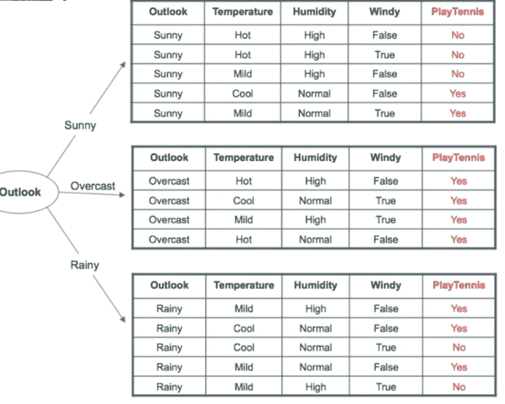

# 决策树系列—第一部分

> 原文：<https://medium.com/analytics-vidhya/decision-tree-series-part-1-5866d683615c?source=collection_archive---------18----------------------->

在这篇博客中，我们将首先触及决策树的历史，我将通过一个直观的例子给你一个完整的指南来理解决策树背后的概念以及它是如何工作的。

**决策树模型的开始**

执行决策树分析的最初模型是由悉尼大学的 [J .罗斯·昆兰](http://en.wikipedia.org/wiki/Ross_Quinlan)创建的，并在 1975 年他的书*机器学习*第 1 卷第 1 号中提出。他的第一个决策树创建算法被称为[迭代二分法 3 (ID3)](http://en.wikipedia.org/wiki/ID3_algorithm) 。该算法是基于奥卡姆剃刀原理创建的，其思想是尽可能创建最小、最有效的决策树。昆兰继续发展这个模型，他创造了 [C4.5 算法](http://en.wikipedia.org/wiki/C4.5_algorithm)，最后是 C5.0 算法。

**什么是决策树？**

决策树是一种监督学习算法。决策树是通过基于条件和阈值分割群体和样本数据来生成的，以这种方式，相同的组彼此相似，而这些组彼此显著不同。决策树主要用于分类问题。但是它对分类数据和数字数据都有效。

**数学概念:**

**熵:**

信息熵是随机数据源产生信息的平均速率。它衡量信息相对于其大小的重要性。熵是状态不可预测性的度量，或者等价地，是其平均信息量的度量。

在决策树的上下文中，熵代表数据的方差。

当数据是异质的(不纯的)时，熵是最大的。当数据是同质的(纯的)时最小。

例如:
如果我们掷硬币，正面的概率与反面的概率相同，那么掷硬币的熵就和两种结果的试验一样高。如果硬币是有偏向的，总是正面朝上，没有反面，熵为零，因为硬币总是正面朝上，结果可以很好地预测。
对于决策树，我们必须计算两种类型的熵:

1.  一个属性的熵 E(S ),其中 S 是当前状态(现有结果), P(x)是该状态 S 的事件 x 的概率:

2.两个属性的熵 *E(S，A)*——*S*和 *A* ，其中 *S* 是属性 *A* 的当前状态， *A* 是选择的属性， *P(x)* 是属性 *A* 的事件 *x* 的概率。

**信息增益:**

它代表熵的变化或熵的减少。它衡量分割的质量和一个特征给我们多少关于类的信息。对于已经完全分割的特征，信息将是最大的。

它也被称为 Kullback-Leibler 散度。它测量关于独立变量的熵的相对变化。用 *IG(S，A)表示。*

**ID3** ( **迭代二分法**)

这是最常见和最古老的决策树算法。决策树工作在分而治之的规则上。这里二分法的意思是分成两个相反的部分。该算法以交互方式将特征分为两组，这两组特征彼此完全独立，并基于分割规则构建一棵树。

**分割标准**

ID3 使用贪婪的自顶向下搜索，在熵和信息增益的帮助下构建树。具有最多信息增益的属性将被认为是分割的最佳属性。

**分类规则**

如果单个特征的熵为 0，这意味着它是同质节点，无需进一步分类。如果熵为 1，则为异构节点，需要进一步分类。

**示例**

使用两周的训练数据，我们需要使用 ID3 算法来决定天气是否适合打板球。

这里输出或目标变量是决策。

决策变量的熵:

> 这里:
> 
> 是' = 9
> 
> 否' = 5
> 
> 总计=14

现在，我们有 4 个输入属性展望，温度，湿度，风。

我们将计算每个变量的信息增益，具有最高信息增益的变量将是根节点。

让我们从 outlook 属性开始:

展望属性有三个变量晴天，阴天和雨天。

> Sunny 已经:
> 
> 2 票赞成，3 票反对
> 
> 阴有 4 是 0 否
> 
> 雨天有 3 是 2 不是。

每个人的计算熵是:

现在，我们将在分解数据后计算加权熵:

最后，outlook 属性的信息增益:

同样，我们可以计算温度、湿度和风属性的 IG。

各个属性的 IG 为:

> IG(S，温度):0.029
> 
> IG(秒，湿度):0.151
> 
> IG(S，有风):0.048

根据以上观察，IG(S，Outlook)具有最高的信息增益 0.246，因此 Outlook 属性将是根节点:

从上面的树观察展望-->阴总是肯定的(阴的熵是 0)。

现在我们还有 3 个属性。

首先，我们将计算当前景晴朗时的决策熵。

> e(决策|展望=晴朗)= 0.96

E(Decision | outlook=sunny)可以表示为 E(S|outlook=sunny)。

现在，我们将以同样的方式计算天气晴朗时温度、湿度和风力属性的信息增益:

> IG(前景=晴朗，温度)= 0.570
> 
> IG(前景=晴朗，湿度)=0.970
> 
> IG(前景=晴朗，有风)=0.019

从上面的输出来看，湿度具有最高的信息增益，同样地，对于(S|outlook=rain ),风也会给我们最高的信息增益。

因此，最终的决策树将是:

**结论**

在 ID3 中，如果一个变量是数值型的，我们必须把它转换成名义变量。数据可能过度拟合或过度分类。J. Ross Quinlan 在 C4.5 和 C5.0 中发现并克服了这些问题。我们将在下一部分看到。