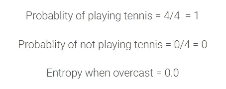

# 带有亚马逊食品评论的决策树

> 原文：<https://medium.com/analytics-vidhya/decision-tree-with-amazon-food-reviews-5639a7b70cef?source=collection_archive---------2----------------------->

由于各种原因，决策树是一种流行的监督学习方法。决策树的好处包括它们可以用于回归和分类，它们易于解释并且不需要特征缩放。它们有几个缺点，包括容易过度拟合。

# 内容

1.  什么是决策树？。
2.  决策树的几何直观。
3.  熵。
4.  信息增益。
5.  基尼杂质。
6.  打网球数据集决策树的例子。
7.  构建决策树的步骤。
8.  决策树回归。
9.  决策树的真实案例。
10.  决策树算法的最好和最坏情况。
11.  带有亚马逊食品评论的决策树。

## 什么是决策树？

决策树是由**利奥·布雷曼**引入的，现在也被称为**分类和回归树(CART)** 来指代决策树算法。它们有一个监督学习算法，该算法有一个预定义的目标变量&它们主要用于带有简单线性决策面的非线性决策。换句话说，它们适用于解决手边的任何类型的问题(分类或回归)。

最好的和最常用的监督学习方法之一是基于树的算法。它们赋予预测建模更高的准确性、更好的稳定性，并提供易于解释的功能。与线性建模技术不同，它们很好地映射了非线性关系。决策树、随机森林、梯度推进等方法在各种数据科学问题中得到了广泛应用。因此，对于每个分析师来说，学习这些算法并在建模时应用它们是很重要的。

## 决策树的几何直觉

下图显示了决策树中不同节点的简单实现。

*   **根节点:**它代表整个群体或样本，并进一步分成两个或多个同类集合。
*   **拆分:**是将一个节点分成两个或两个以上子节点的过程。
*   **决策节点:**当一个子节点分裂成更多的子节点时，则称之为决策节点。
*   **叶(或)端节点:**节点不分裂称为叶或端节点。
*   **剪枝:**当我们删除一个决策节点的子节点时，这个过程叫做剪枝。
*   **分支(或)子树:**整个树的一个子部分称为分支(或)子树。
*   **父节点和子节点:**被划分为子节点的节点称为子节点的父节点，子节点是父节点的子节点。

## 现在让我们看看决策树是如何以几何方式表示的？

构建决策树有多种算法编写，可以根据你要解决的问题特征来使用。当因变量为连续变量时，使用回归树；当因变量为分类变量时，使用分类树。

下面是 IRIS 数据集的一个简单的决策树。 *a & b 分别是萼片、花瓣的长度。*

我们也可以认为决策树是一组**嵌套的 IF-ELSE 条件**，它们可以被建模为一棵树，其中决策在内部节点做出，输出在叶节点获得。

从几何学上讲，我们可以把决策树看作一组轴平行的超平面，它们在推理过程中把空间分成多个超立方体。

我们可以看到，在上面的图像中，决策边界是轴平行的&每个叶节点(Yi)都有一个决策面。

简单的打网球决策树示例看起来像……在任何学习数据具有以下特征的场景中:

*   学习数据具有属性值对，如上例所示:风作为一个属性有两个可能的值-强或弱
*   目标函数有一个离散输出。这里，目标函数是你应该打网球吗？并且到该离散输出的输出是*是*和*否*

当我们将决策树算法应用于数据集时……它看起来像

上面的图像告诉我们根节点，因为前景是阴天，然后我们可以玩，如果前景是晴天，湿度正常，我们可以打网球，但当湿度高，我们不能打网球，同样将被处理。

创建决策树只是选择在树的每个节点上应该测试哪个属性的问题。然而，信息增益是将用于决定在每个节点应该测试哪个属性(或)特征的度量。

信息增益本身是使用称为熵的度量来计算的，我们首先为二元决策问题的情况定义熵，然后为一般情况定义熵。我们首先为二元决策问题定义熵的原因是更容易理解它试图计算什么。

## 熵

汤姆·米切尔说得很好:

> ****为了精确定义信息增益，我们首先定义信息论中常用的一种度量，称为熵，它表征了任意样本集合的(不)纯度。”****

*数学上，熵可以表示为:*

**

***Pj** :特定节点属于 C 类的样本比例。*

***注:**这是所有非空类(p≠0)的熵的定义。如果一个节点上的所有样本都属于同一个类，则熵为 0。*

*这个度量满足我们的标准，因为有了 *-p*log2(p)* 的结构:当 *p* 接近零时(也就是说，这个类别中只有几个例子)，那么 *log(p)* 就变成了一个大负数，但是 *p* 部分在计算中占主导地位，所以熵计算出来接近零。*

*记住，熵计算数据中的无序，这个低分数是好的，因为它反映了我们想要用很少的例子奖励类别的愿望。类似地，如果 *p* 接近 1(即，该类别具有中的大部分示例)，则 *log(p)* 部分非常接近 0，并且“p”再次主导计算，因此整体值接近 0。*

*因此，我们看到，当类别几乎或完全为空时，或者当类别几乎包含或完全包含所有示例时，类别的得分接近于零，这符合我们的期望。注意 ***0*ln(0)按照惯例取为零。****

***熵的图形表示***

**

# *信息增益*

*信息增益基于在属性上分割数据集后熵的减少。构建决策树就是要找到返回最高信息增益的属性(即最相似的分支)。*

**

*换句话说，我们也可以这样定义信息增益:*

**

*信息增益标准有助于做出这些决定。使用独立变量值，创建子节点。我们需要计算父节点和子节点的熵，以计算由于分裂而获得的信息增益。具有最高信息增益的变量被选择用于分割。*

*一般来说，如果所有的结果都有相同的可能性，那么熵是最大的。如果一些结果比另一些更有可能，那么熵就减小。*

## *基尼杂质*

*基尼系数可以作为熵值法的替代方法。Gini 杂质是一种度量，用于衡量从集合中随机选择的元素被错误标记的频率，前提是该元素是根据子集中的标签分布随机标记的。*

*数学上，它可以表示为:*

**

*基尼系数法中熵的计算方式相同，但熵涉及对数计算，基尼系数涉及平方计算。由于计算平方比对数函数更便宜，我们更喜欢基尼系数杂质而不是熵。*

*下图显示基尼指数和熵是非常相似的杂质标准。*

**

*一些比较流行的算法是 ID3、C4.5 和 CART。Scikit-learn 使用 CART 算法的[优化版本。你可以在这里](http://scikit-learn.org/stable/modules/tree.html#tree-algorithms-id3-c4-5-c5-0-and-cart)了解时间复杂度[。](http://scikit-learn.org/stable/modules/tree.html#complexity)*

*我们来理解一下这里的例子。请参考上面粘贴的打网球数据集。*

*我们有 14 天的数据。我们只有两种结果:*

*我们要么打网球，要么不打。*

*在给定的 14 天里，我们打了 9 次网球，有 5 次没有打。*

**

*现在，我们将看到不打网球的概率。*

**

*现在是结果熵，*

**

***所以，在我们提出第一个问题之前，整个系统的熵是 0.940***

*现在，我们有四个特征来做出决定，它们是:*

1.  *观点*
2.  *温度*
3.  *有风的*
4.  *湿度*

*让我们看看，当我们在展望的基础上做第一个决定时，熵发生了什么变化。*

*如果我们基于 outlook 在这个 0 级做一个决策树划分，我们有三个分支可能；要么是晴天，要么是阴天，要么是下雨。*

1.  ***晴天:**给定数据中，有 5 天是晴天。在这 5 天中，有 2 天打了网球，3 天没有打网球。这里的熵是什么？*

**

*2.**阴天**:在给定的数据中，有 4 天都是阴天，四天都在打网球。让*

**

*3.**下雨:**在给定的数据中，有 5 天都是下雨。在这 5 天中，有 3 天打了网球，有 2 天没有打网球。这里的熵是什么？*

**

*三个分支之间的熵:*

**

*作为决策者选择展望，随机性降低了多少？*

**

*这种随机性的降低被称为**信息增益**。可以对其他特征进行类似的计算。*

# *温度*

*信息增益= 0.029*

# *有风的*

*信息增益= 0.048*

# *湿度*

*信息增益= 0.152*

*我们可以看到，随机性的减少，或者说信息增益对前景来说是最大的。所以，我们选择第一决策者作为**展望**。*

## *构建决策树的步骤*

1.  ***创建特征列表，属性列表。***

*示例:功能列表:前景、风、温度和湿度*

*Outlook 的属性包括晴天、阴天和雨天。*

***2。在所有特征中找到最大的信息增益。分配其根节点。***

*Outlook 在我们的示例中有三个分支:晴天、阴天和雨天。*

***3。从特征列表中移除在根节点中分配的特征，并且再次找到每个分支的信息增益的最大增加。将该功能指定为每个分支的子节点，并从该分支的功能列表中删除该功能。***

*outlook 根节点的 Sunny 分支将湿度作为子节点。*

***4。重复第三步，直到你得到只有叶子的树枝。***

*在我们的例子中，要么是，要么不是。*

*更多信息请访问 [**这里**](https://nulpointerexception.com/2017/12/16/a-tutorial-to-understand-decision-tree-id3-learning-algorithm/) 。*

## *停止标准*

*如果我们继续完全增长树，直到每个叶节点对应于最低的杂质，那么数据通常是过度拟合的。*

*如果分割过早停止，训练数据的误差不会足够高，并且性能会由于偏差而受到影响。因此，在对决策树建模时，防止过拟合和欠拟合是至关重要的，这可以通过两种方式来实现。*

1.  ***设置对树大小的限制***

*   *为节点分裂提供最小数量的样本。*
*   *为终端节点(叶子)部署最小数量的样本。*
*   *允许树的最大深度(垂直深度)。*
*   *终端节点的最大数量。*
*   *分割时要考虑的最大特征。*

*2.**树木修剪***

*修剪是机器学习中的一种技术，即*通过移除树的部分来减小决策树*的大小。它还降低了最终分类器的复杂性，并因此通过减少过拟合来提高预测精度。*

*树修剪可以通过两种方式完成:预修剪或后修剪。*

****预修剪:****

*   *如果当前节点没有将熵提高至少某个预设(阈值)值，则停止分裂当前节点。*
*   *如果数据点的数量小于某个预设(阈值)值，则停止分区。*
*   *将树的深度限制在某个预设(阈值)值。*

****后期修剪:****

*   *这可以通过首先允许树增长到其全部潜力，然后在计算每一层的交叉验证准确度之后在每一层修剪树来完成。*

***哪里可以用决策树(哪类问题)？***

*决策树可以用于回归和分类问题。实现方法非常不同，因为回归问题以实数作为目标变量，而分类问题则以二元或离散目标变量作为目标变量。*

## *回归*

*在回归中，进行战略分割的决策会严重影响树的准确性。分类树和回归树的决策标准是不同的。决策树回归通常使用[均方误差(MSE)](https://en.wikipedia.org/wiki/Mean_squared_error) 来决定将一个节点分割成两个或多个子节点。*

*假设我们正在做一个二叉树，算法首先会选择一个值，并将数据分成两个子集。对于每个子集，它将分别计算 MSE。该树选择产生最小 MSE 值的值。*

*让我们更详细地研究一下决策树回归器是如何决定分裂的。创建树的第一步是创建第一个二元决策。你打算怎么做？*

*   *我们需要选择一个变量和值来进行分割，这样两个组就尽可能的不同。*
*   *对于每个变量，对于那个变量的可能值的每个可能值，看看它是否更好。*
*   *如何确定是否更好？取两个新节点的加权平均值(mse*num_samples)。*

*总而言之，我们现在有:*

*   *一个数字，表示创建的两个组的均方误差的加权平均值的拆分效果。*
*   *找到最佳分割的一种方法是**尝试每个变量，尝试该变量的每个可能值**，看看哪个变量和哪个值给我们一个分数最高的分割。*

*这就是创建决策树回归器的全部过程，当满足某个停止条件(由超参数定义)时将停止:*

*   *当您达到请求的限制时(例如`max_depth`)*
*   *当你的叶节点中只有一样东西时(没有进一步分裂的可能，训练的 MSE 将是零，但是对于任何其他集合将是过度拟合的——不是一个有用的模型)*

*简单的图表如下所示。*

****

***数字特征的拆分***

*数字特征的**分裂可以通过按升序对特征进行排序并尝试将每个值作为阈值点并计算每个值作为阈值的信息增益来执行。最后，如果获得的值等于给出最大信息增益值的阈值，则欢呼..！***

***特征缩放:**决策树中不需要执行特征缩放(or)列标准化。因为决策树不像 SVM 那样是基于距离的方法。*

***分类特征:**为了处理决策树中的分类特征，我们决不能对分类变量执行一键编码，即使分类变量是名义变量，因为大多数库可以自动处理分类变量。如果需要，我们仍然可以为每个变量分配一个数字。*

***不平衡数据集:**不平衡类确实对树的结构有不利影响，因此可以根据数据集使用上采样或下采样来避免。*

***多类分类:**决策树自然会进行多类分类，我们也可以使用一种 v/s Rest 方法。*

***决策面:**决策面为轴平行超长方体。*

***相似矩阵:**决策树需要明确的特征，在相似矩阵中不起作用。*

***大维度:**除了偏斜的类之外， ***高维度*** 如果维数非常高，这意味着我们有许多特征，这意味着在每个节点上找到分裂标准将耗费大量时间，那么高维度也会对树的结构产生不利影响。*

***离群值影响:**离群值还会影响树的结构，因为深度增加了树中离群值的机会增加了。*

***特征重要性:**特征重要性可以通过计算每一层的归一化总和来确定，因为我们必须降低熵，然后我们选择有助于大幅降低熵的特征。因此，对于归一化总和最高的特征，我们可以认为它是最重要的特征。类似地，具有第二高归一化总和的特征可以被认为是第二重要的特征。分类树的一个优点是它们相对容易解释。*

# *决策树算法的最佳和最差情况*

1.  *决策树可以固有地执行多类分类。*
2.  *它们提供了大多数模型的可解释性，因为它们只是一系列 if-else 条件。*
3.  *它们可以处理数字和分类数据。*
4.  *特征之间的非线性关系不会影响决策树的性能。*
5.  *数据集中的微小变化会使树结构不稳定，从而导致变化。*
6.  *如果某些类不平衡，决策树学习者创建欠适应树。因此，建议在拟合决策树之前平衡数据集。*

# *带有亚马逊食品评论的决策树*

*让我们将决策树算法应用于来自 Kaggle 的真实数据集 Amazon Fine Food Review 分析。*

***首先我们想知道什么是亚马逊美食点评分析？***

*这个数据集由亚马逊的美食评论组成。这些数据跨越了 10 多年的时间，包括截至 2012 年 10 月的所有约 500，000 篇评论。评论包括产品和用户信息、评级和明文评论。我们也有来自所有其他亚马逊类别的评论。*

*亚马逊评论通常是最公开可见的消费品评论。作为一个经常使用亚马逊的用户，我对检查亚马逊评论的大型数据库的结构和可视化这些信息很感兴趣，以便成为一个更聪明的消费者和评论者。*

***来源:**[**【https://www.kaggle.com/snap/amazon-fine-food-reviews】**](https://www.kaggle.com/snap/amazon-fine-food-reviews)*

***亚马逊美食点评数据集由来自亚马逊的美食点评组成。***

***评论数:568，454
用户数:256，059
产品数:74，258
时间跨度:1999 年 10 月—2012 年 10 月
数据中的属性/列数:10***

***属性信息:***

1.  ***身份***
2.  ***产品 Id —产品的唯一标识符***
3.  ***UserId —用户的唯一标识符***
4.  ***ProfileName***
5.  ***帮助度分子—认为评论有帮助的用户数量***
6.  ***帮助度分母——表示他们认为评论是否有帮助的用户数量***
7.  ***分数—介于 1 和 5 之间的等级***
8.  ***时间—审核的时间戳***
9.  ***摘要—审核的简要摘要***
10.  ***文本—审阅的文本***

# ***目标***

***给出一个评价，确定该评价是正面的(评分为 4 或 5)还是负面的(评分为 1 或 2)。***

# ***数据预处理***

***数据预处理是一种用于将原始数据转换成干净数据集的技术。换句话说，无论何时从不同来源收集数据，都是以原始格式收集的，这对于分析是不可行的。***

******

***要了解亚马逊食品评论数据集和特征的完整概述，请访问我以前的博客链接 [**这里**](/analytics-vidhya/amazon-fine-food-reviews-featurization-with-natural-language-processing-a386b0317f56) **。*****

# ***列车测试分离***

***当机器学习算法用于对不用于训练模型的数据进行预测时，训练-测试分离过程用于估计机器学习算法的性能。***

***如果您有**一个数据集**，您需要首先使用 Sklearn `train_test_split`函数来分割它。***

******

# ***使用单词包的文本特征化***

******

# ***超参数调谐***

***我们希望选择最佳深度和最佳 min_split 以获得更好的模型性能，通过使用网格搜索交叉验证来选择这些。***

***我们已经定义了一个 Grid_search 函数，当我们调用它时，它会给出结果。***

******

***在我们使用网格搜索 CV 找到最佳参数后，我们希望使用测试数据检查性能，在本例研究中，我们使用 AUC 作为性能度量。***

***我们已经定义了一个测试数据的函数，当我们调用它时，它会给出结果。***

******

# ***性能指标***

***绩效指标用于衡量企业的行为、活动和绩效。这应该是在一个范围内测量所需数据的数据形式，允许形成支持总体业务目标实现的基础。***

***要了解机器学习中使用的性能指标的详细信息，请访问我以前的博客链接[**这里**](/@sachin.s1dn/performance-metrics-for-machine-learning-models-80d7666b432e) **。*****

***我们已经为性能指标定义了一个函数，当我们调用它时，它会给出结果。***

******

# ***弓上的特征重要性***

***20 大重要特性***

******

## ***决策树弓形特征的 Graphviz 可视化***

******

***同样，我们用 TFIDF，AvgWord2Vec，TFIDF_AvgWord2Vec 特征构建了一个决策树模型。要了解完整代码，请访问我的 [**GitHub**](https://github.com/Sachin-D-N/Amazon_Food_Reviews/blob/main/07.Decision_Tree_Amazon_Food_Reviews/Decision_Tree_Amazon_Food_Reviews_Assignment_.ipynb) 链接。***

# ***结论***

***为了在表格中写入震荡，我们使用了 python 库 PrettyTable。***

***pretty table 是一个简单的 Python 库，旨在使在视觉上吸引人的表格中表示表格数据变得快速而简单。***

******

# ***观察***

1.  ***与所有其他特征表示相比，深度为 50 且 min_split 为 500 的词袋特征在测试数据上获得了最高的 80.65% AUC 分数。***

***2.Grid_search_CV 中的最佳深度和 Min_split 值因模型而异。***

***要了解亚马逊食品评论数据集和特征的完整概述，请访问我以前的博客链接 [**这里**](/analytics-vidhya/amazon-fine-food-reviews-featurization-with-natural-language-processing-a386b0317f56) **。*****

***要了解机器学习中使用的性能指标的详细信息，请访问我以前的博客链接[**这里**](/@sachin.s1dn/performance-metrics-for-machine-learning-models-80d7666b432e) **。*****

***要了解完整代码请访问我的 [**GitHub**](https://github.com/Sachin-D-N/Amazon_Food_Reviews/blob/main/07.Decision_Tree_Amazon_Food_Reviews/Decision_Tree_Amazon_Food_Reviews_Assignment_.ipynb) 链接。***

# ***参考***

*   ***应用人工智能***
*   ***维基百科(一个基于 wiki 技术的多语言的百科全书协作计划ˌ也是一部用不同语言写成的网络百科全书ˌ 其目标及宗旨是为全人类提供自由的百科全书)ˌ开放性的百科全书***
*   ***Coursera***
*   ***数据营***

***感谢您的阅读和耐心。我希望你喜欢这个帖子，如果我的帖子有错误，请告诉我。如果你发现帖子中有什么错误或者有什么要补充的，就在评论中讨论吧…***

***快乐学习！！***