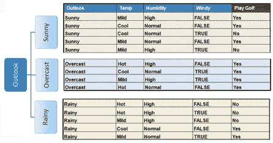

# 决策树分类

> 原文：<https://medium.com/analytics-vidhya/decision-trees-d99d1646de73?source=collection_archive---------13----------------------->

*决策树是最流行的机器学习算法之一。它基本上是基于属性/特征构建的树状结构。决策树是* ***的非参数*** *的监督学习方法。*

决策树以树结构的形式建立分类或回归模型。它将一个数据集分解成越来越小的子集，与此同时，一个相关的决策树被增量开发。

最终的结果是一个有决策节点和叶节点的树，叶节点代表一个决策或分类。树中最顶端的决策节点，对应于称为根节点的最佳预测器。

> *决策树可以处理分类数据和数字数据。*

有不同类型的算法来构建决策树，例如

*   ID3:迭代二分器 3 使用*熵函数*和*信息增益*作为度量。
*   CART : **分类**和回归**树**使用*基尼指数(分类)*作为度量。
*   CHAID:卡方自动交互检测在计算**分类树**时执行多级分裂
*   MARS:多元自适应回归样条

# 决策树算法

ID3(迭代二分法 3)使用*熵函数*和*信息增益*作为度量。

# 熵函数

ID3 算法基本上是说，第一步是为决策树的分裂选择正确的属性，选择哪个特征作为节点。

> *我们使用* ***熵函数*** *来选择分割决策树的特征或属性。熵帮助我们测量分裂的纯度。为了快速获得叶节点，我们必须选择写入功能。*

如果熵值为 1，那么它是最差的分裂，这意味着分裂是完全不纯的

现在，让我们为著名的数据之一“是否数据集”创建决策树(根据“是否”条件玩 Y 或 N 游戏)。

*   天气、温度、湿度和风力是预测因素，或者你可以说是独立因素。
*   打高尔夫球是目标还是从属属性

# 信息增益

信息增益基于在属性上分割数据集后熵的减少。

要创建一棵树，我们首先需要有一个根节点，我们知道节点是特征/属性(展望、温度、湿度和风)，

*   首先我们要计算打高尔夫的熵。

*   然后求所有特征/属性的熵。

*   从分割前的熵中减去得到的熵。结果是信息增加，或者熵减少。

*   选择具有最大信息增益的属性作为决策节点，按分支划分数据集，并在每个分支上重复相同的过程。

因此，Outlook 是最好的预测器，因为它具有最大的信息增益，这意味着它是决策树的根节点。由于阴的熵值是 0，那么阴的叶节点将是 Yes

对子树重复同样的操作，直到得到树。

最后我们得到了这样的树:

# 优势

> *一个* ***决策树*** *的一个显著的* ***优势*** *就是它强制考虑一个* ***决策*** *的所有可能的结果，并追溯每一条路径得出结论。它对每个分支的结果进行综合分析，并确定需要进一步分析的* ***决策*** *节点。*

决策树机器学习算法到此为止。敬请关注更多博客。

*谢谢*

决策树算法在海量数据上的实现

> *数据集:* [*泰坦尼克号*](https://github.com/InternityFoundation/MachineLearning_Navu4/blob/master/Day%208%20:%20Decision%20Tree/titanic.csv) *数据集*

链接:[https://github . com/internity foundation/machine learning _ navu 4/blob/master/Day % 208% 20:% 20 Decision % 20 tree/Decision _ tree _ on _ titanic _ dataset . ipynb](https://github.com/InternityFoundation/MachineLearning_Navu4/blob/master/Day%208%20:%20Decision%20Tree/Decision_tree_on_titanic_dataset.ipynb)