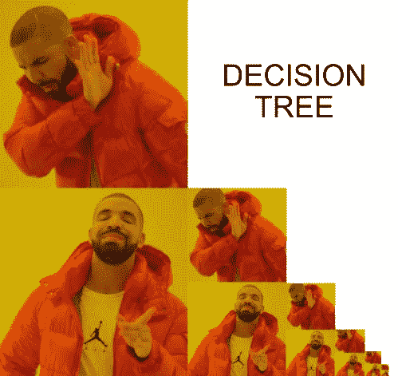
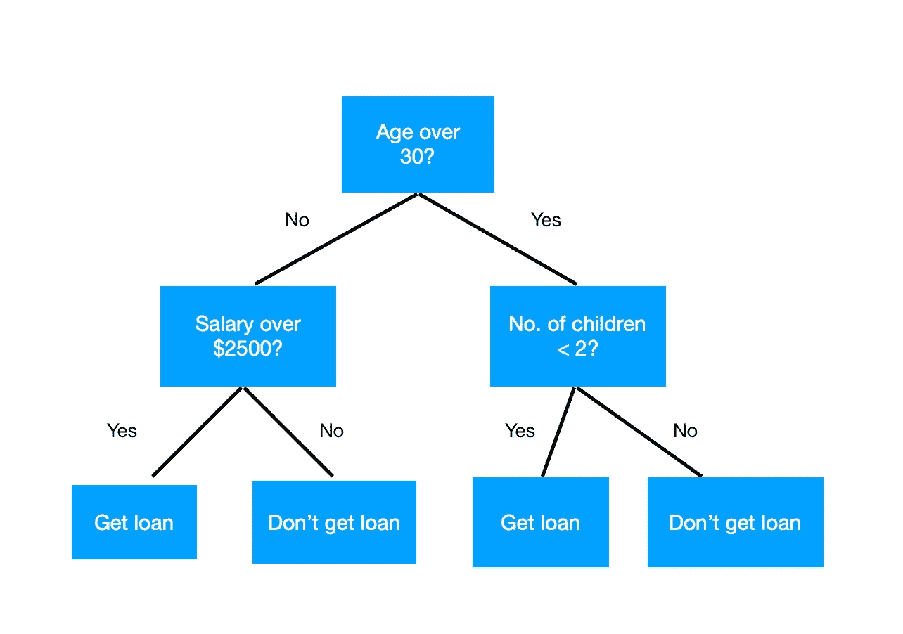
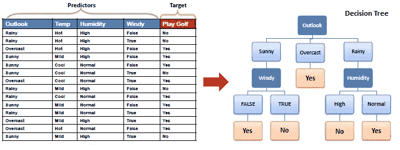
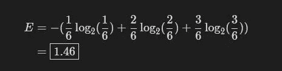
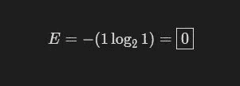
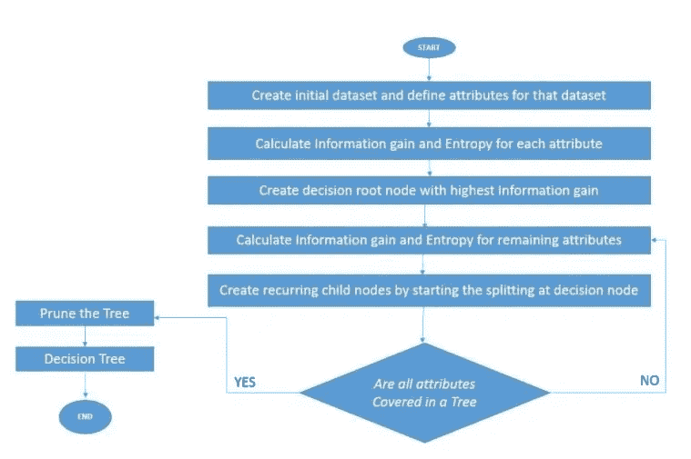

# 决策树:用简单的步骤解释

> 原文：<https://medium.com/analytics-vidhya/decision-trees-explained-in-simple-steps-39ee1a6b00a2?source=collection_archive---------2----------------------->

看不懂这个模因？阅读文章:)

# 1.介绍

与上面的迷因不同，当涉及到现实世界的场景时，基于树的算法非常漂亮。决策树是一种**监督的**(标记数据)机器学习算法，可用于**分类和回归问题**。

它类似于树数据结构，树数据结构有一个根和多个其他类型的节点(父节点、子节点和叶节点)。

> *在下面的例子中，我们必须根据这个人的年龄、工资和孩子的数量来批准贷款。我们在每个节点问一个条件问题，并相应地进行拆分，直到我们在叶节点做出决定(即获得贷款/不获得贷款)。*

简单的决策树

# 2.为什么要用决策树？

## 优势

*   它们有很高的可解释性，这使得它们成为现实世界商业应用的首选算法。它们可以解释为一系列问题/ if-else 语句**。**
*   进行预测所需的**时间非常少**。它只是对给定数据点的一组特定条件的评估。
*   **不需要缺失值插补**，因为算法会相应调整。

## 不足之处

*   他们不稳定。数据中的一个小变化会导致一个非常不同的决策树。
*   它们通常相对不准确，并且**容易过度配合**。这可以通过用**决策树的随机森林**替换单个决策树来纠正。

# 3.基本直觉

让我们试着用一个例子来建立直觉。我们将采用一个非常受欢迎的方法，根据给定的**天气条件(预测因素)**，我们必须决定是否可以在某一天**打高尔夫球(目标)**。

高尔夫和天气示例

在这个例子中，给定的预测值本质上是明确的，目标也是如此。构建决策树的步骤如下-

*   首先，我们选择了 **Outlook** 特性作为我们的节点，并为它的每个值创建了拆分。对于**阴天**类别，玩高尔夫(目标)变量的每个结果都是“是”,这基本上意味着无论何时前景阴天，我们都可以玩高尔夫。我们做了一个最终的**决定**，所以我们把它做成一个**叶节点**。
*   对于其余的类别，结果并不像阴云一样明朗，因为它由是和否的混合组成。我们根据其他列，如风或湿度，进一步划分这些节点，直到我们能够做出决定(例如，我们是否可以打高尔夫球)。

## 看了上面的例子后，可能会出现以下问题:

*   我们应该先选择哪个**特性**？
*   分裂的**顺序应该是怎样的？**
*   我们如何决定子节点的**数量？**
*   我们如何**比较两个特性** w.r.t 哪个更适合拆分？
*   我们如何决定**分割标准**？

这些问题将在下一节中得到回答，在这一节中，我们将看到一个名为 **C4.5** 的算法，它使用了熵和信息增益的概念。

# 4.算法

由[🇸🇮·扬科·菲利](https://unsplash.com/@itfeelslikefilm?utm_source=medium&utm_medium=referral)在 [Unsplash](https://unsplash.com/?utm_source=medium&utm_medium=referral) 上拍摄的照片

有**多种算法**(名字很长，很吓人)用于构建决策树。其中一些是:

*   [**ID3**](https://en.wikipedia.org/wiki/ID3_algorithm)**(迭代二分法 3)**
*   ******(ID3 的继承者)******
*   ********(分类和回归树)********
*   ******[**卡方自动交互检测**](https://en.wikipedia.org/wiki/Chi-square_automatic_interaction_detection) (CHAID)。计算分类树时执行多级拆分。******
*   ****[**MARS**](https://en.wikipedia.org/wiki/Multivariate_adaptive_regression_splines) :扩展决策树，更好地处理数值数据。****

****我们现在将重点放在 **C4.5** 上，因为它很流行，能够处理分类和数字特征。在我们深入算法之前，我们需要知道某些术语的**含义:******

*   *******根节点*** :树中最顶端的节点。****
*   *******叶子/终端节点*** :不分裂的节点称为叶子或终端节点****
*   *******拆分*** :是将一个节点分成两个或两个以上子节点的过程。****
*   *******父子节点*** :一个节点被划分为子节点，称为子节点的父节点，子节点是父节点的子节点。****
*   *******决策节点*** :当一个子节点分裂成更多的子节点时，则称之为决策节点。****

## ****C4.5 算法特有的一些更重要的术语****

# ****熵****

****物理学中的熵只是一种度量系统无序或随机程度的尺度。****

> *****在决策树的上下文中，它可以被认为是预测目标的无序或不确定性的度量。让我们以盒子里的红色、蓝色和绿色的球为例。一个有 6 个蓝色球的盒子将具有非常低(零)的熵，而一个有 2 个蓝色球、2 个绿色球和 2 个红色球的盒子将具有相对高的熵。*****

********

****计算具有 C 个类的数据集的信息熵的公式:****

****其中 **pᵢ** 是随机选取类 **i** 元素的概率(即由类 I 组成的数据集的比例)。****

****让我们举个例子来更好地理解这一点。考虑一个有 1 个蓝色球、2 个绿色球和 3 个红色球的数据集，然后:****

********

****扩展了原始公式以显示数据集中的三个类****

****我们知道 **pb** = 1/6(蓝色)，因为数据集的 1/6 是蓝色的。同样， **pg** = 2/6(绿色)，而 **pr** = 3/6(红色)。因此，****

********

****1 个蓝色球、2 个绿色球和 3 个红色球的熵****

****然而，对于只包含蓝色球的数据集，熵将是:****

********

****只有蓝色球的熵****

# ****信息增益****

****信息增益是一种度量，它帮助我们确定给定的一组训练特征向量中的哪个属性对于区分目标类最有用。我们用它来决定属性在决策树节点中的排序。****

********

****信息增益的公式****

****这个获取信息的公式非常直观。我们来看看父母和孩子的熵之间的差异。熵的大幅减少是好事，因为我们能够更好地区分目标类别。这仅仅意味着我们选择具有最高信息增益的特征。****

# ****C4.5 算法的步骤****

****C4.5 是一种递归算法，因为它递归地选取给出最大信息增益的特征，并使用它来进一步分割树。****

********

****解释算法步骤的简单流程图****

1.  ****选择定义了**特征和目标属性**的初始数据集。****
2.  ******计算每个属性的信息增益和熵**。****
3.  ******挑选信息增益最高的属性**，作为决策根节点。****
4.  ****计算剩余属性的**信息增益。******
5.  ****通过在决策节点开始拆分来创建**循环子节点**(即，对于决策节点的各种值，创建单独的子节点)。****
6.  ******重复这个过程**，直到覆盖所有属性。****
7.  ******修剪圣诞树**以防止过度修剪。****

****这就是 C4.5 算法。****

****这篇文章的内容是互联网上各种来源的信息的混合体，结合了我对它们的理解。****

****参考资料:****

*   ****[https://en.wikipedia.org/wiki/C4.5_algorithm](https://en.wikipedia.org/wiki/C4.5_algorithm)****
*   ****[https://saiconference . com/Downloads/specialissueno 10/Paper _ 3-A _ comparative _ study _ of _ decision _ tree _ ID3 _ and _ c 4.5 . pdf](https://saiconference.com/Downloads/SpecialIssueNo10/Paper_3-A_comparative_study_of_decision_tree_ID3_and_C4.5.pdf)****
*   ****[https://uh . edu/~ smiertsc/4397 cis/c 4.5 _ Decision _ Tree _ algorithm . pdf](https://uh.edu/~smiertsc/4397cis/C4.5_Decision_Tree_Algorithm.pdf)****
*   ****[https://towards data science . com/what-the-C4-5-algorithm-and-how-it-work-2b 971 a9 e 7 db 0](https://towardsdatascience.com/what-is-the-c4-5-algorithm-and-how-does-it-work-2b971a9e7db0)****

****如果你喜欢这篇文章，请给它鼓掌，并确保在评论中留下任何反馈/建议/问题:)****

******长寿兴旺******