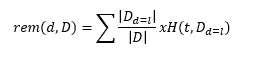

# 决策树变得简单，第一部分

> 原文：<https://medium.com/analytics-vidhya/decision-trees-made-simple-part-i-57673d898705?source=collection_archive---------24----------------------->

*机器学习基础的第一个条目*

Arnaud Mesureur 在 [Unsplash](https://unsplash.com/@tbzr) 上拍摄的图片

决策树是最常见和最广泛使用的机器学习算法之一，对于预测分类(非数字)变量特别有用，使它们成为预测分析的强大工具。

决策树不依赖于决策表，即使是小的玩具数据集也可能运行得难以管理，而是依赖于信息熵的概念，并通过不断选择我们可以获得最多信息的路径来构建其预测路径。

## 这意味着什么呢？

决策树背后的思想是逐步选择最能区分具有不同分类值的观察值的描述性特征。为了实现这一点，通过分析每组观察值的大小和概率分布，通过估计每组实例相对于我们试图预测的目标变量的纯度，来估计变量的区分能力。这种纯度的衡量标准是香农的熵模型。

## 香农的什么？

香农熵模型是一个集合中元素纯度的度量。在这种情况下,“纯度”指的是数据集中元素的同质性，理解为当你从数据集中随机选择时，猜测结果的不确定性。考虑一组卡片，如果你能看到所有的卡片，而且它们都是一样的，那么选择其中一张的不确定性是零，因此熵也是零。然而，如果所有的卡片都不同，并且其中一些被覆盖，那么你将有非常高的不确定性，导致非常高的熵。

卡片集中的熵(来源:预测分析的机器学习基础)

通常，具有大概率的结果将映射到较低的熵值，而具有小概率的结果将映射到较高的熵值。

香农的熵模型，只不过是当我们从一个集合中随机选择时，每个可能结果的概率的对数的加权和:

其中 P(t=i)是随机选择元素 t 的结果是类型 I 的概率，l 是集合中不同类型事物的数量，s 是任意对数底数。对于熵，我们将始终使用 2 作为基数，这意味着我们用**位**来度量熵

## **信息增益**

根据 Shannon 熵模型，我们可以构建一系列测试，将训练集中的数据分成相对于目标特征值逐渐更纯的集合，然后我们可以通过将相同的测试序列应用于查询并使用目标特征值对其进行标记来标记查询。因此，该机器学习模型包括两个主要步骤:

1.  **构建决策树**:我们将训练数据集分成一系列规则，这些规则将逐渐创建更纯(更低熵)的集合，直到我们从原始训练数据中获得最纯、最同质的集合
2.  **然后在树中运行测试查询:**根据查询的描述性特征来评估查询，并且算法基于查询的描述性特征来决定它属于哪个目标特征值。

算法决定如何在决策树中前进的方式是通过使用称为信息增益的概念。信息增益是对一组实例的总体熵减少的度量，这是通过测试我们正在考虑的查询的一个特定描述性特征来实现的。为了计算信息增益，我们:

1.  我们计算整个数据集的熵，记住数据集的熵定义如下:

2.对于每个描述性特征，我们使用每个特征的值域创建分区数据集，然后计算每个分区的熵值。这为我们提供了在使用描述性特征分割实例后，将实例组织到纯集合中所需的信息。

3.从集合的总熵中减去剩余的熵值，获得信息增益(IG)

当我们使用描述性特征 *d* 对数据集 *D* 进行分区时，会为 *d 的每个值创建一个新分区，rem(d，D)* 是我们测试了每个单独的 *d* 的熵之后剩余的熵，定义为每个单独分区的熵的加权和:

## ID3(迭代二分法 3)

实现基于熵的决策树的最常见算法是迭代二分法 3 (ID3)。ID3 以递归的深度优先方式构建决策树，从根节点开始向下到叶节点。该算法首先选择要测试的最佳描述性特征(计算训练数据集中描述性特征的信息增益)。

在选择了特征之后，使用该特征分割训练数据集，并且向树中添加节点，为每个可能的测试结果创建一个分区，该分区包含每个结果的训练实例。然后，重复选择最佳描述性特征的过程，直到分区中的所有实例都具有相同的目标级别，此时，创建叶节点并用该级别进行标记。

尽管算法背后的思想相对简单，但所有关于特征级别和描述性特征的讨论都会令人困惑，这就是为什么实现算法对于真正理解它非常重要，在下一篇文章中，我们将介绍一个简单的 ID3 和一个玩具数据集的实现，目前，主要的要点是:

1.  决策树最适合用于有限且可测量值范围的分类数据。其他算法更适合数值型连续数据类型。
2.  熵是对数据集中纯度水平的一种度量，换句话说，在数据集中随机选择一个观察值，我们对结果有多大把握。
3.  信息增益是对较大数据集的给定分区的总熵减少的度量
4.  ID3 利用信息增益来创建决策树，该决策树基于从给定分区产生最高信息增益的最具描述性的特征