# 马克的决策树！||需要—为什么—何时||快速动手||总结

> 原文：<https://medium.com/analytics-vidhya/decision-trees-on-mark-need-why-when-quick-hands-on-conclude-ce10dac51e3?source=collection_archive---------17----------------------->

# 决策树的直觉！

我妹妹总是说，我很坏…说到撒谎！我问她怎么能得出这样的结论。她引用了以下几点:

*   **嗯，当你撒谎的时候，你在说这句话的时候会露出一丝微笑，这意味着你在积极主动地思考你正在编造的故事。**
*   **然后你突然加深了你的声音，这是一个很大的迹象！…** 等等。

我的目的不是告诉你我是如何撒谎的😅，但是使用这个例子，现在假设**两个特征**为**微笑 _ 而 _ 说谎(**真或假 **)** 和**沉重 _ 声音(**真或假**)**她就能够推断出**目标变量(*说谎或不说谎* )** 。

> 因此，决策树是一种基于*树的算法，它在“if-else”语句逻辑条件下工作。*它既可以用于**分类问题，也可以用于**回归问题。此外，决策树算法的输入可以是连续的，也可以是分类的。

# DT 中涉及的组件:

*   **根节点**:这是任何决策树创建的基础节点。该属性使用通常称为分裂技术的统计方法最终确定，以降低特定特征的数据集中的杂质。
*   **内部节点**:仍在进程中或仍有可能被分裂出去的子节点。
*   **叶节点**:没有更多子节点的最终节点，使得最大杂质已经被模型移除。

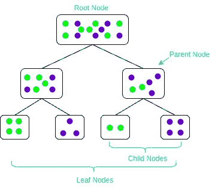

决策树命名法

# DT 中的分裂技术；

*   ID3-->(*迭代二分法 3* )
*   购物车-> ( *分类和回归树*)

这是决定在哪个特征上执行**分割** **的两个主要标准。而且，这一切都归结为 ***分裂*** 时获得的杂质。因此，在分割之后，我们得到一个更加同质的分割，然后为根节点选择的特性就是我们想要的。**

决策树的一般算法可以描述如下:

1.  *挑选最佳属性/特征。最佳属性是能够最好地拆分或分离数据的属性。*
2.  询问相关的问题。
3.  *遵循答案路径。*
4.  继续第一步，直到找到答案。

最好的拆分是将两个不同的标签分成两组。大概是这样的:

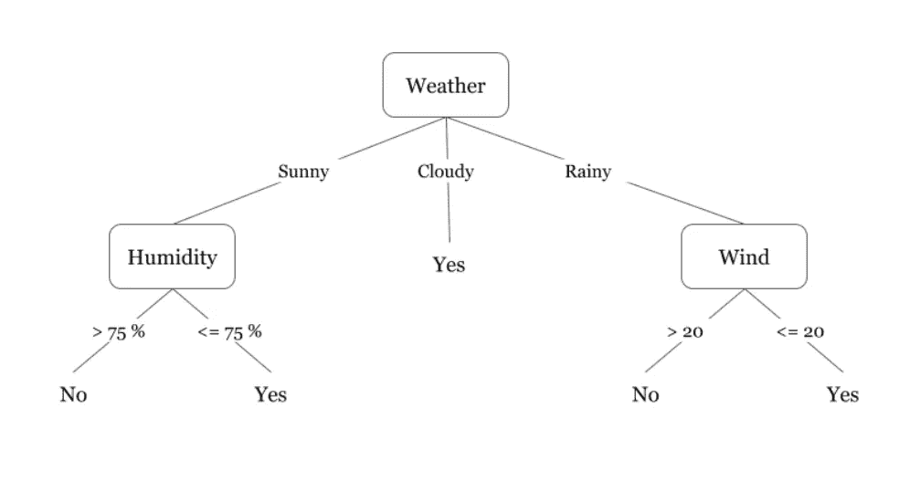

DT 步骤的直观表示

现在，我们如何继续选择**最佳分裂特征**，我如何决定**天气**是导致最低杂质的特征。嗯，我们有两个**指标**来计算。

## 决策树的假设:

*   最初，所有的训练集都被认为是根。
*   特征最好是分类的，如果是连续的，那么它们就是离散的。
*   记录基于属性值递归分布。
*   通过使用*统计* ( ***ID3 或 CART*** )方法来完成在根节点或内部节点中的属性

## 迭代二分法 3:

> ID3 是一种自上而下生长树的贪婪算法，在每个节点选择最能对本地训练示例进行分类的属性。这个过程继续进行，直到树完美地分类了训练样本，或者直到所有属性都被使用。

简而言之，该算法的步骤是:

1.  选择最佳属性→ A。
2.  分配**一个**作为**节点**的决策属性(**测试用例**)。
3.  对于 A 的每个值，创建一个新的**节点**的后代。
4.  将定型示例排序到适当的后代节点叶。如果*示例被完美分类为*，那么**停止**否则迭代新的叶节点。

ID3 使用**信息增益**作为杂质的评估指标。为了精确定义信息增益，我们需要定义一个信息论中常用的叫做*熵* 的**度量，它度量一组例子中*杂质*的水平。数学上，它被定义为:**

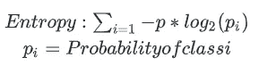

计算杂质的熵

现在，给定熵作为训练样本样本中杂质的度量，我们现在可以将 *i* ***信息增益*定义为属性在分类训练数据**中的有效性的度量。信息增益， ***一个属性 A 的增益(S，A)* ，相对于一个示例的样本 *S*** ，定义为:

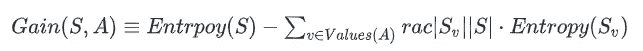

其中*值(A)* 是属性 A 的所有可能值的集合，而 **Sv** 是属性 *A* 具有值 *v* 的 *S* 的子集。所以，简而言之:

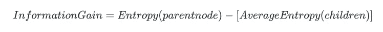

数学示例:**我们想弄清楚， *A1 或 A2* ，哪个属性通过给出最高的信息增益度量来给我们最好的分割！？**

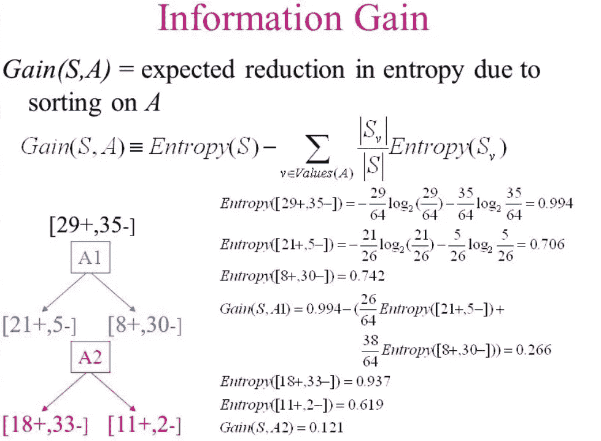

因此， **Gain(S，A1)** 比 **Gain(S，A2)** 具有更高的熵，这表明在**属性 A1** 上发生分裂时获得了更多的同质性。

## CART(分类和回归树):

CART 是将节点分成根/内部节点的另一种技术。它使用实际上是成本函数的 GINI 指数的概念来减少杂质。*就我个人而言，我觉得 GINI 指数/得分比 ID3 或 C4.5/5.0 更友好，也更容易获得*

它被给出为:

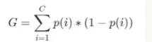

**p(I)**——选择类别为 **i** 的数据点的概率

该算法的工作原理如下:

*   首先，我们使用“ **1-(p +q)”计算子节点的 **Gini 杂质**。**
*   然后，我们使用该分裂的每个节点的**加权基尼系数**来计算分裂的**基尼系数**。

## 快速示例:

因此，如果我们采取同样的上述例子，我想显示如何分裂计算使用 GINI 指数法手工。

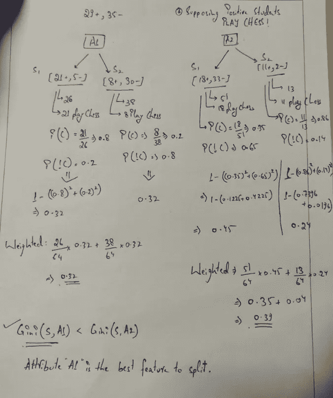

GINI 分数的手工实验

我想到用手做 GINI 计算，这样读者应该能够得到我试图解释和展示的东西！。

所以，我们做了一个主题回顾:

*   决策树介绍和直觉
*   决策树的组成部分
*   决策树的假设
*   拆分方法( *ID3* 和 *CART*
*   分裂技术的解释和数学计算

现在，我最喜欢的部分来了。

# 动手操作:

出于实验和实际操作的目的，我们将使用**天平数据集**，其中目标变量是一个多类标签(L- > **左**，B- > **天平**，R- > **右**)。

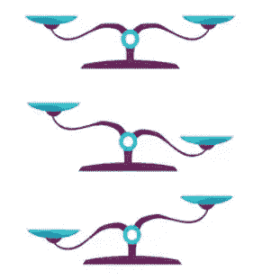

秤

此处，目标是根据*左重量、左距离、右重量、右距离等特征预测天平尖端移动的方向。*

附上[笔记本](https://github.com/mishra-atul5001/Data-Science-Medium-Content/blob/master/Decision%20Trees%20handsOn.ipynb)的链接。这个数据集来自 ***UCI 机器学习知识库。***

我们处理这个问题的方法如下:

1.  最初，我们将尝试查看是否需要进行任何数据插补/检查缺失值/数据类型/信息等。
2.  然后，我们将看到目标变量水平的分布作为一个推论，然后是一些可视化！
3.  接着建模，然后检查作为我们**评估指标的 **F1 分数**！**
4.  然后，我们将使用 **GridSearchCV** 对我们的**决策树模型**进行一点改进，作为超参数调整的一部分，以寻求更好的结果。
5.  然后我们以结果和评论结束。

## 加载/分析和准备数据！：

*   在加载数据时，我们发现缺少列名，这在我们进行任何类型的分析时都是一个问题。因此在熊猫中，如果我们知道序列，我们可以传递一个列名为**的列表**。

```
balance_data = pd.read_csv('[https://archive.ics.uci.edu/ml/machine-learning-'+'databases/balance-scale/balance-scale.data',sep=](https://archive.ics.uci.edu/ml/machine-learning-'+'databases/balance-scale/balance-scale.data',sep=) ',', header = None,
names =**['class_name','left_weight','left_distance','right_weight','right_distance'])**
```

*   我们的数据看起来像这样:

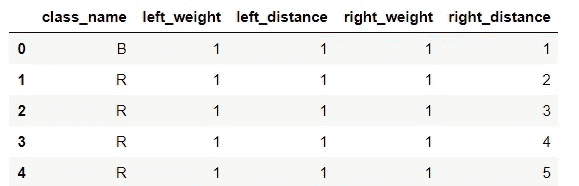

balance_data.head()

*   继续，我们查看了加载的数据集的**形状**和**信息**！

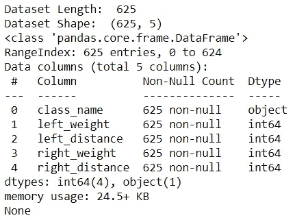

print("数据集长度: "，len(balance_data))
print("数据集形状: "，balance _ data . Shape)
print(balance _ data . info())

*   所以，形状是 **(625，5)** 和**，没有空值，看起来是**。此外，由于这是一个标准数据集，我们的**预测变量**是数字格式并且**目标变量**是一个**多类变量！**
*   让我们看看我们的**目标变量，即 class_name** 中有多少个级别，以及它们的**分布对这 625 行贡献了多少！**

```
# Exploring the Target Variabletarget_var = balance_data.iloc[:,0]
print(target_var.value_counts())# Let's check the Class Name Distributionprint('% i Class L',round(target_var.value_counts()[0]/len(target_var)*100,2))
print('% i Class R',round(target_var.value_counts()[1]/len(target_var)*100,2))
print('% i Class B',round(target_var.value_counts()[2]/len(target_var)*100,2))
```

*   结果:

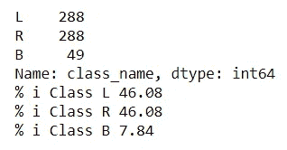

*   实例数: **625** ( *49 平衡，288 左，288 右*)
*   类别分布:

1.  **为 46.08%** 为 L
2.  **为 46.08%** 为 R
3.  **为 7.84%** 为 B

*   所以，我们可以看到 ***天平*** 天平出现的次数非常少。我们应该认为这是**不平衡的情况吗？** *在评论区告诉我和补救方法一样！*
*   既然一切看起来都很好，我们将尝试一个 **pair plot** 来理解特性之间的依赖关系！

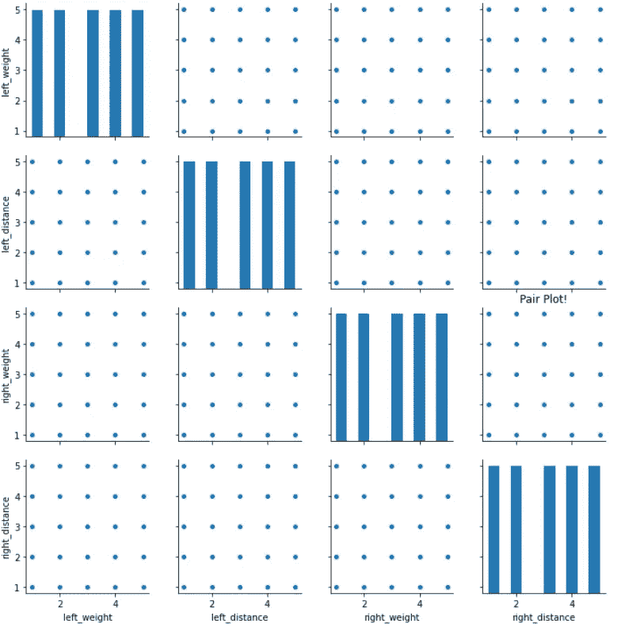

# pair plot
SNS . pair plot(balance _ data)；
plt.title('成对绘图！');

*   显然，我们可以看到特性之间没有依赖关系！。同样，我想*分享一小段代码*，使用它**您可以找到数据框中缺失值的数量，以及缺失值的百分比和该特征的类型！**

```
# Checking for Missing valuesdef check_missing_values_function(df):
    missing_values = df.isnull().sum()
    missing_values_percent =round(100*(df.isnull().sum()/len(df)),2)
    dtype = df.dtypes
    info_df = pd.DataFrame({'Missing Value Count':missing_values,'% of Missing':missing_values_percent,'DTYPE': dtype})
    info_df.sort_values(by = '% of Missing',inplace=True,ascending=False)
    return info_dfcheck_missing_values_function(balance_data) # Calling the function on your DF
```

*   结果:

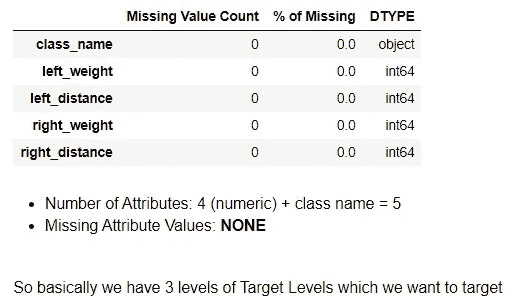

**长得好看呐！！**

*   现在，为了支持我们的 *pairplot 独立结果，我们也用热图绘制了一个关联矩阵！*

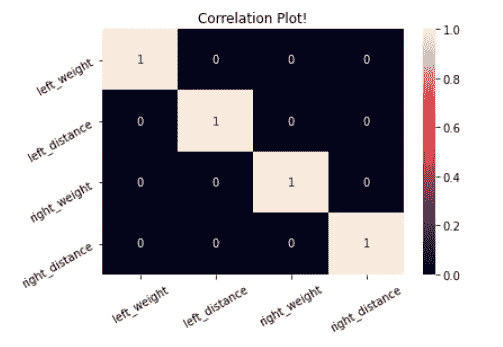

sns.heatmap(balance_data.corr()，annot = True)；
plt.xticks(旋转= 30)
plt.yticks(旋转= 30)
plt.title('相关图！');

## 建模:

*   在建模之前，如果你认为我现在可能已经对数据进行了缩放，那么我就去建模！。好吧，来回答这个: ***决策树和随机森林不受特征量的影响，因此它不是必需的。***
*   为什么？:嗯，**树的一个节点通过比较一个特征**(最好地分割数据集)和一个阈值**将你的数据分割成 2 组。 ***阈值*** 没有规则化(因为要保持树的高度小)，所以不受不同尺度的影响。**
*   **现在，让我们分开我们的数据。让我们按 70:30 的格式来定吧**

```
# Separating the target variable 
predictor_variables = balance_data.values[:, 1:5] 
target_variables = balance_data.values[:, 0]# Splitting the dataset into train and test 
X_train, X_test, y_train, y_test = train_test_split(predictor_variables, target_variables, test_size = 0.3, random_state = 100)
```

*   **让我们开始建立我们的模型！。从**推车/GINI 索引**方法开始。**

```
# Modelling using the GINI INDEX Score methodology
clf_gini = DecisionTreeClassifier(criterion = "gini",
                                  random_state = 100,max_depth=3, 
                                  min_samples_leaf=5)# Performing training 
clf_gini.fit(X_train, y_train)
```

**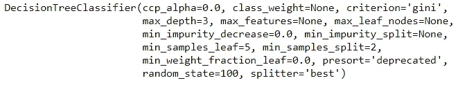**

**GINI 指数 DT 分类器**

*   **为了评估任何一种结果。我们的衡量标准应该是什么！。是的，你答对了！。我们正在讨论将**准确性和 F1 分数**作为我们的评估指标。所以，让我们看看他们如何使用**混淆矩阵**，这样我们就可以得到最终结果的要点！**

```
# Making predictions on the TEST SET
y_pred = clf_gini.predict(X_test)# Since, this is a MultiClass Classification Problem, We need to see the CLASSIFICATION REPORT
print("Confusion Matrix: ")
print(confusion_matrix(y_test, y_pred))
print()
print ("Accuracy : ",accuracy_score(y_test,y_pred)*100) 
print()
print("Report : ", classification_report(y_test, y_pred))
```

*   **结果:**

**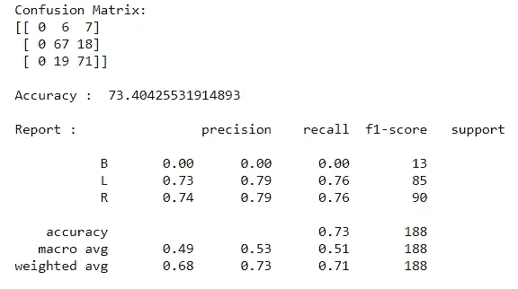**

**混淆矩阵**

*   **所以，我们得到**准确性**在某处 **73%** 和**F1-分数**在 **51%** 左右，这是相当低的！**
*   **让我们试试**熵/ID3** 方法，看看我们是否能得到更好的结果！**

```
# Decision tree with entropy 
clf_entropy = DecisionTreeClassifier(criterion = "entropy", 
                                     random_state = 100,max_depth = 3, 
                                     min_samples_leaf = 5)# Performing training
clf_entropy.fit(X_train, y_train)# Making predcitions on the TEST SET
y_pred = clf_entropy.predict(X_test)
```

**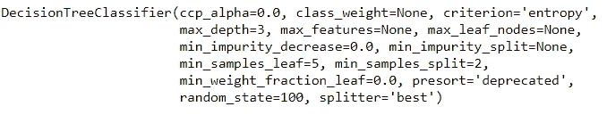**

**熵分裂的 DT 分类器**

*   **测评结果！**

**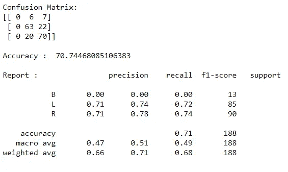**

*   **哦！哦！减少—减少—减少。现在你能想到别的什么，我们能在哪里增加我们的**准确性**。🤔💭**

## **超参数调谐！**

*   **现在，在我们开始构建一个更好的模型之前，我们应该选择哪种 ***分割方法？*** *这是****GINI****方法，因为这是我们的模型分裂得更好的地方，我们能够实现高端结果！***
*   **有多种方法可以执行这种调整。最短和最好的方法之一是使用 **GridSearchCV** 并应用某些参数的值范围。**

**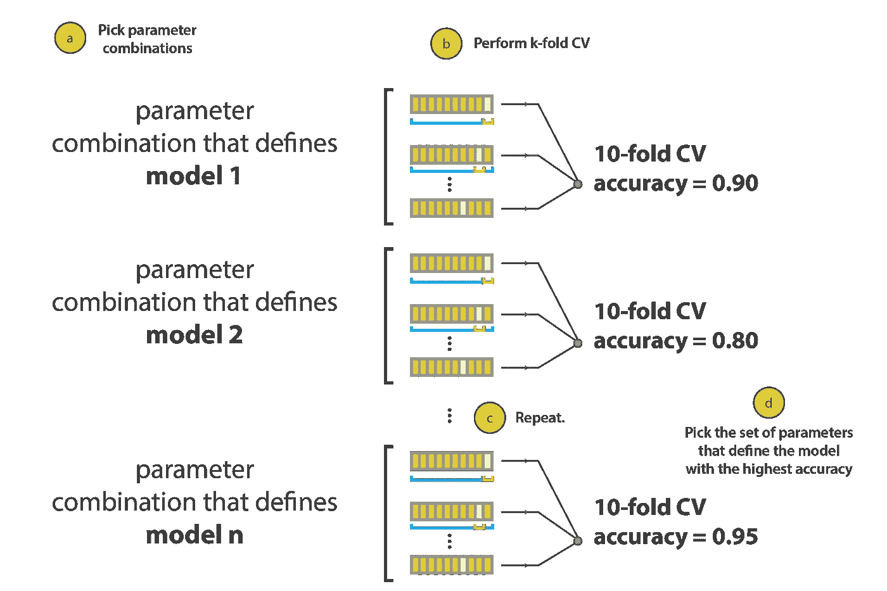**

**CV 方法论的可视化工作！**

*   **这里我们将使用我们的评估指标作为 **F1 分数！**。所以当我们要看最好成绩的时候，我们指的是 F1 的分数，而不是准确性！**

```
param_grid = {
    'max_depth': [2,5,8,11,14,17,20],
    'min_samples_leaf': [5,10,15,20],
    'min_samples_split': [10,20,30],
    'max_features': [1, 4]
}dt_hyper = DecisionTreeClassifier(class_weight='balanced',criterion = "entropy")grid_search = GridSearchCV(estimator = dt_hyper, param_grid = param_grid,refit=['f1_score'] ,
                          cv = 5, n_jobs=-1, return_train_score=True,verbose=1)
grid_search.fit(X_train, y_train)
```

**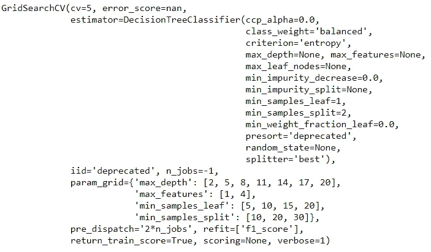**

*   **结果:**

```
print('We can get accuracy of',round(grid_search.best_score_,2),'using',grid_search.best_params_)
```

**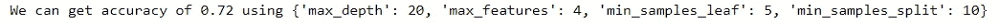**

*   **让我们建立我们的最终模型:**

```
# Modelling using the GINI INDEX Score methodology
dt_final_model = DecisionTreeClassifier(criterion = "gini",random_state = 100,max_depth=11, min_samples_leaf=5,min_samples_split=10,max_features = 4)# Performing training 
dt_final_model.fit(X_train, y_train)# Making predcitions on the TEST SET
y_pred = dt_final_model.predict(X_test)# Since, this is a MultiClass Classification Problem, We need to see the CLASSIFICATION REPORT
print("Confusion Matrix: ")
print(confusion_matrix(y_test, y_pred))
print()
print ("Accuracy : ",round(accuracy_score(y_test,y_pred)*100,2)) 
print()
print("Report : ", classification_report(y_test, y_pred)) 
print()
print('F1 Score: ',round(f1_score(y_test, y_pred, average='micro')*100,2))# 'micro':
# Calculate metrics globally by counting the total true positives, false negatives and false positives.
```

*   **最终混乱矩阵与结果！**

**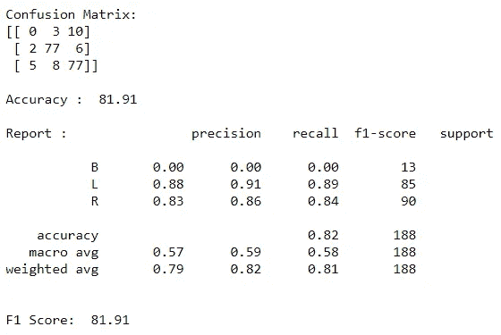**

**太好了！实际上，我们得到了一个更好的工作模型，准确率超过了 81%。现在，如果我们在行数方面有更多的数据，这个复杂的模型可以了解更多！。**

*   **这种超调可以在任何类型的模型上执行，无论是随机森林/逻辑回归/XG Boost 等。**

# **结论**

*   **最后，在我们做 EDA/建模/超调的这个阶段，特性怎么样？**
*   **我们如何知道哪个特性对建模更重要。我们能以某种方式看出**特征的重要性吗？****
*   **是的，使用**T3 . model . feature _ importances _T5****

```
# Creating feature name vs feature value df
features = [dt_final_model.feature_importances_]
feature_names = ['left_weight','left_distance','right_weight','right_distance']
feature_imp_df = pd.DataFrame(columns=feature_names,data= features).reset_index(drop=True)feature_df = pd.DataFrame(feature_imp_df.T.reset_index())
feature_df = feature_df.rename(columns = {'index':'feature_names',0:'feature_imp_value'}).sort_values(by = 'feature_imp_value').reset_index(drop=True)
feature_df
```

**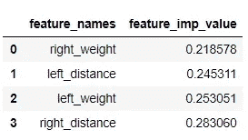**

*   **我们可以看到，建模时最重要的特征是**右 _ 距离**，最不重要的是**右 _ 重量。****
*   **让我们计划一下吧！**

```
plt.figure(figsize=(12,8))
sns.barplot(x = feature_df.feature_names,y = feature_df.feature_imp_value);
plt.rcParams.update({'font.size': 22})
```

**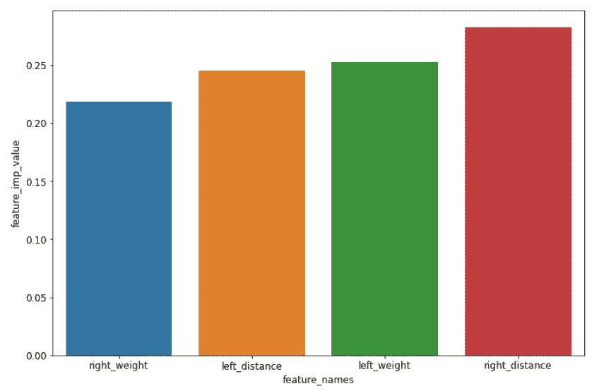**

**特征重要性图！**

*   **您可以看到，当我们使用**熵值法**时，存在 **3%** 的精确度差异，但是，F1 分数，也就是我们应该寻找的权衡，似乎更适合每个职业！**
*   **我们尝试了网格搜索，然后使用 GINI 方法，找到最好的超参数！**
*   **在这里，我们的超参数调整更侧重于获得更好的宏观 F1 分数！-> **总体 72%****

# **DT 的优点:**

1.  **决策树需要较少的数据准备工作。**
2.  **如上所述，决策树不需要数据的标准化/缩放。**
3.  **数据中缺少的值也不会在很大程度上影响构建决策树的过程。**
4.  **他们不受离群值的影响！。这是一个很大的安慰。**
5.  **决策树模型非常直观，易于向技术团队和利益相关者解释。**
6.  **人们可以得到特征重要性作为结果来解释模型的驱动因素并得出结论性的结果。**

# **DT 的缺点:**

1.  **数据的微小变化会导致决策树结构的巨大变化，从而导致不稳定。**高方差！****
2.  **决策树训练相对昂贵，因为复杂性和花费的时间更多。**
3.  **决策树算法不适用于应用回归和预测连续值。**
4.  **决策树有时倾向于**过度拟合**，因此我们需要对多个 DT 的结果进行平均，这导致了**随机森林的概念！****

*   **大部分**面试问题**仅从*正反*中提到的几点提出。像**从 CART 和 ID3 中拆分节点这样的技术问题请解释！****

**我希望你喜欢这篇带有简要解释的日志，并能快速掌握决策树算法的要点！**

**如果你相信的话，请鼓掌，在那之前请保持关注，保持安全，保持微笑。！**

**给我接通电话:**

*   **[Github](https://github.com/mishra-atul5001)**
*   **[领英](https://www.linkedin.com/in/atul-mishra-5001/)**

# **快乐学习🌟**