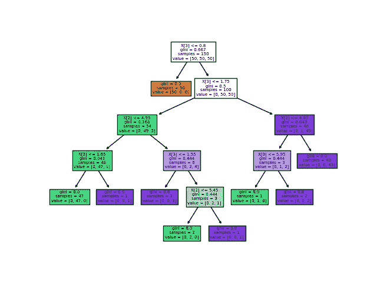
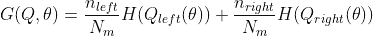
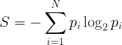
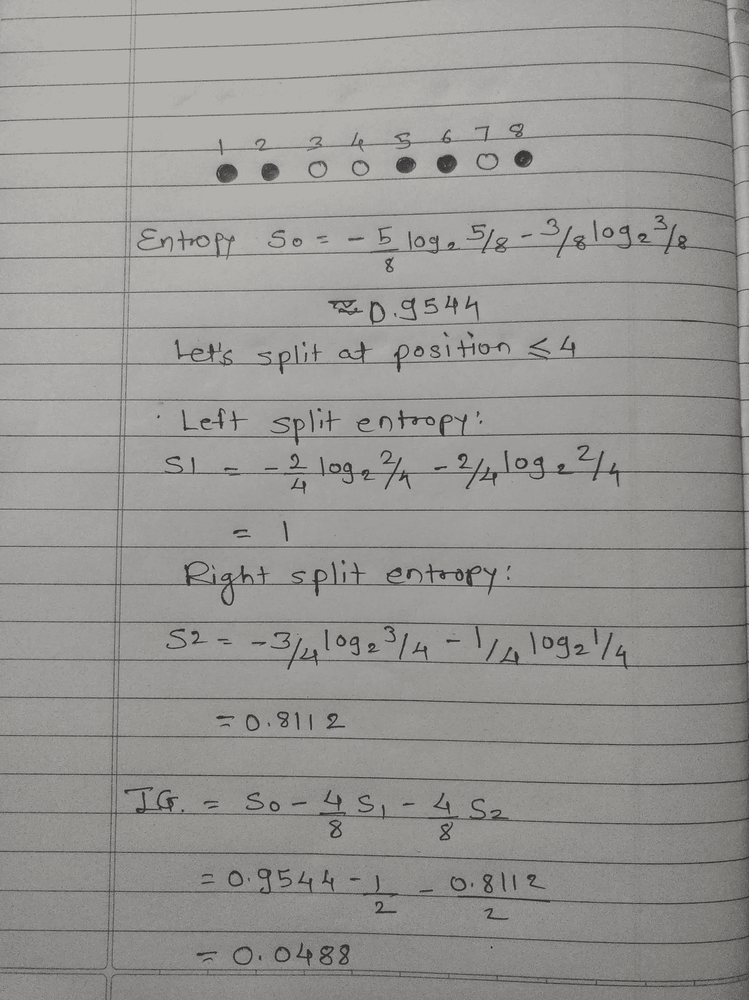
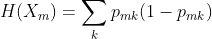
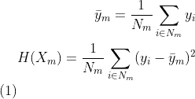
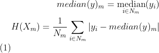

# 决策树——简单易懂的算法。

> 原文：<https://medium.com/analytics-vidhya/decision-trees-simple-and-interpret-able-algorithm-c1c154b6a347?source=collection_archive---------17----------------------->

杰里米·毕晓普在 [Unsplash](https://unsplash.com?utm_source=medium&utm_medium=referral) 上的照片

我决定用 NumPy 实现一些传统的机器学习算法来理解它们。这里可以找到[的储存库](https://github.com/nachiket273/ML_Algo_Implemented)。这将是一系列关于这些算法的文章，从决策树开始，主要是我自己的理解。

决策树是用于分类和回归任务的最简单和流行的方法之一。决策树是一种监督学习方法。其想法是创建一个模型(树),根据从训练数据集中学习到的简单决策规则来预测目标。决策树是非参数方法。

参考:[https://sci kit-learn . org/stable/auto _ examples/tree/plot _ iris _ DTC . html](https://scikit-learn.org/stable/auto_examples/tree/plot_iris_dtc.html)

# **决策树中使用的重要术语**

**根节点:**树的最顶端节点。
**拆分:**根据某种拆分标准将节点划分为一个或多个子节点的过程。
**父节点:**被拆分成一个或多个节点的节点。
**子节点:**拆分生成的子节点。
**叶/端节点:**不进一步拆分的节点。决策树具有与作为类值/回归值的叶节点相关联的样本。
**决策节点:**根据某种决策拆分成一个或多个子节点的节点。

# 创建决策树时的假设

*   在开始，整个数据集被认为是在根，递归分裂，以创建树。
*   要素最好是分类的，连续值要素在创建模型之前被离散化。
*   通过使用一些统计方法来完成将属性放置为树的根或内部节点的顺序。

# 递归二进制分裂

为了形成决策树，所有的特征被考虑用于分裂，并且不同的分裂点被尝试以决定最佳分裂。允许最大信息增益(最小化杂质)的特征和值被用于分割节点。

可以使用不同的标准来计算信息增益。让我们来看一个最常见的标准——熵。

## 熵:

熵代表信息系统中的随机性。熵越高，随机性越大，对系统做出任何决定就越困难。因此，对于分割，可以选择最大程度地降低熵的特征和值。

n 态系统的香农熵定义为:

让我们考虑一个简单的例子，8 个球，5 个实心，3 个空心。我们需要根据球的位置找到一个分割点。

当在位置 4 分裂时，以熵作为标准的信息增益计算。

从上图可以看出，在 4 号位拆分时，信息增益为 0.0488，大大降低了熵，稳定了系统，所以这是一个很好的拆分。

重复该过程，直到达到停止标准。

熵标准可用于分类。可用于分类的另一个标准是基尼指数。

# 基尼指数。

基尼指数是从 1 中减去每一类概率的平方和。它喜欢更大的分区。对于二进制分割，公式如下:

# 回归标准

类似于分类，如果目标是连续值，我们需要不同的标准来最小化距离。最常见的标准是均方误差(MSE)和平均绝对误差(MAE ),前者使用叶节点的平均值来最小化 L2 误差，后者最小化 L1 损耗。

## MSE:

## 梅:

# 什么时候停止分裂？

对于包含大量特征的数据集，分割可能会持续很长时间，这将导致复杂的树，并且树可能会过度适应数据。所以需要有停止标准来避免这些问题。可以使用不同的停止标准，例如

*   叶节点中的最小样本数。
*   树的最大深度。

# 修剪

修剪包括除去利用不太重要特征的树枝。这降低了树的复杂性，并且可以避免过度拟合。修剪可以从根或叶开始。最简单的修剪方法是从叶子开始。**减少错误修剪**包括移除该节点的子树，使其成为叶子，并在该节点分配最常见的类。如果结果树在验证集上的表现不比原始树差，则移除节点。该过程迭代地继续，修剪节点的移除给出了最大的优势。当进一步修剪会降低性能时，修剪会停止。

# **决策树的优势**

*   易于理解、解释和想象。
*   需要最少的数据预处理，如删除空白、一键编码。
*   能够处理数字和分类数据
*   即使其假设与生成数据的真实模型有些冲突，也能表现良好。

# 决策树的缺点

*   过度拟合-会创建复杂的树，不能很好地概括。
*   对数据变化不稳定。像随机森林这样的集合方法有助于避免这个问题。
*   阶级不平衡会造成有偏见的树。

这只是决策树的一个基本介绍。这里的库[包含了带有 NumPy 的决策树的最小实现。**注意，这是一个非常简单的实现，不需要太关注性能。(对于大型数据集，拟合函数可能非常慢)**](https://github.com/nachiket273/ML_Algo_Implemented/tree/master/DecisionTree)

**参考文献:**

*   [https://scikit-learn.org/stable/modules/tree.html](https://scikit-learn.org/stable/modules/tree.html)

如果你喜欢这篇文章，请一定给我一个掌声，并关注我以获取我未来文章的更新。

*还有，随时在*[*LinkedIn*](https://www.linkedin.com/in/nachikettanksale/)*上联系我或者在*[*Twitter*](https://twitter.com/nachiket273)*上关注我。*

如果你喜欢我的作品，请考虑赞助我，它会帮助我推出更多这样的作品。