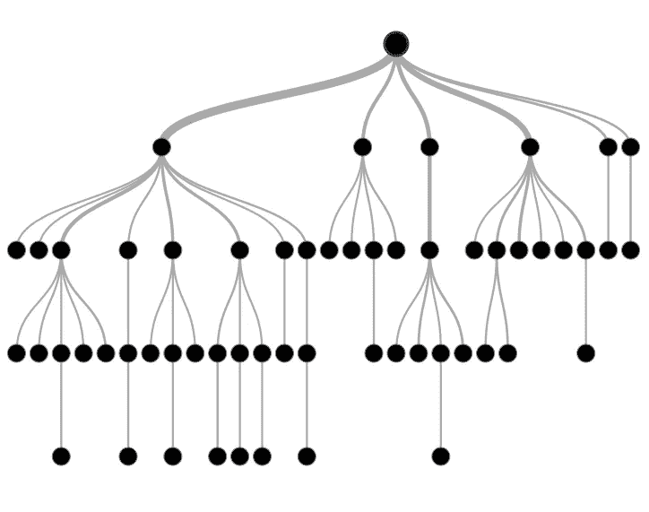

# 决策树:在哪个特征上分裂？

> 原文：<https://medium.com/analytics-vidhya/decision-trees-which-feature-to-split-on-91083fc32279?source=collection_archive---------0----------------------->

决策树分类可能是我们今天拥有的最直观和最容易解释的分类算法之一。它可以很容易地模拟非线性关系，并产生相当准确和稳定的预测模型。

[决策树分类中的学习](https://courses.analyticsvidhya.com/courses/applied-machine-learning-beginner-to-professional?utm_source=medium&utm_medium=DecisionTreesWhichFeatureToSplitOn)具有以下**的关键特征:**

*   我们递归地**将**人口一分为二或者…