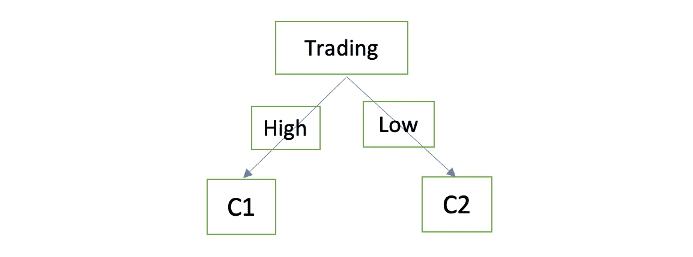

# 决策树背后的数学是如何处理分类问题的？数学时间！！！

> 原文：<https://medium.com/analytics-vidhya/decisiontree-57a90d266995?source=collection_archive---------20----------------------->

## 决策树—第 1 部分

什么是决策树？
决策树是一种监督学习方法，具有较好的准确性和自解释模型。这种方法是自上而下的，是一种贪婪的算法。它可以应用于分类和回归问题。


图片来源:[https://images . idgesg . net/images/article/2018/10/ai _ robotics _ mathematics _ equation _ analytics _ virtual-screen-100777425-large . jpg](https://images.idgesg.net/images/article/2018/10/ai_robotics_mathematics_equation_analytics_virtual-screen-100777425-large.jpg)

## 决策树术语

1.  有三种类型的节点，即:

*   根节点:最顶端的节点由整个数据集或样本部分组成。这将分为两个子节点。
*   子节点:父节点的子节点。
*   终端节点:不能再分割的底层节点。

2.分割:使用基尼指数、信息增益或卡方方法将节点分割成子节点，这将在后面的章节中讨论。

## 决策树的类型

决策树适用于两种类型的输入
1。分类输入
2。连续输入变量

基于目标变量，有两种类型的决策树
1。*分类变量决策树:*计算并赋值一个变量属于一个类别的概率。
2。*连续变量决策树:*找到变量最近的类别并分类。

# 分类问题如何拆分节点？

## 1.基尼指数和基尼系数

***基尼指数*** 可以定义为标签从特征中随机选取时被错误分类的概率。

> 基尼指数= 1 — ∑(p)，其中 p 是从特征中选择的标签。

基尼指数只做二元分割，结果不是成功就是失败。

指数值越高，均匀度越高。因此，选择具有最小基尼指数的特征作为根节点。

***基尼系数*** 告诉我们，如果按照与分布相同的方式分类，新随机变量将被错误分类的度量。

> 基尼杂质=σp(I)*(1—p(I))，I 是数字的范围

听起来很复杂，不是吗！！

让我们用一个例子来理解…

**基尼系数和基尼不纯交易栏**

1.  P(交易=高)=**6/10**P(交易=低)= **4/10**
2.  相对于目标列，在交易列中标记“高”。

```
For Increase label in Bitcoin values
P(Trading = High & Bitcoin values = Increase ) = 3/6 For Decrease label in Bitcoin values
P(Trading = High & Bitcoin values = Decrease ) = 3/6Gini Index for Label 'High' = 1 — [(3/6)²+ (3/6)²] = **0.5**
```

3.相对于目标列，在交易列中标记“低”。

```
For Increase label in Bitcoin values
P(Trading = Low & Bitcoin values = Increase) = 3/4For Decrease label in Bitcoin values
P(Trading = Low & Bitcoin values = Decrease) = 1/4Gini Index for Label 'Low*'* = 1 — [(3/4)² + (1/4)²] = **0.375**
```

`Gini Index`交易栏目

```
( 6/10 * 0.5 ) + ( 4/10 * 0.375 ) = 0.45 
```

`Gini Impurity` 交易栏目

```
[ (6/10) * (1–6/10) ] + [ (4/10) * (1–4/10) ] = 0.48
```

交易栏上的新随机数据有 48%的几率分类不正确。

**基尼系数和基尼系数趋势栏**

1.  P(趋势= +) = **7/10**
    P(趋势= -) = **3/10**
2.  趋势列中相对于目标列的标签“+”

```
For Increase label in Bitcoin values
P(Trend = + & Bitcoin values = Increase ) = 4/7For Decrease label in Bitcoin values
P(Trend = + & Bitcoin values = Decrease ) = 3/7*Gini Index for Label ‘+’* = 1 — [(4/7)²+ (3/7)²] = **0.492**
```

3.相对于目标列，交易列中的标签为“-”

```
For Increase label in Bitcoin values
P(Trend = - & Bitcoin values = Increase ) = 2/3For Decrease label in Bitcoin values
P(Trend = - & Bitcoin values = Decrease ) = 1/3Gini Index for Label ‘-’ = 1 — [(2/3)² + (1/3)²] = **0.554**
```

趋势列的`Gini Index`

```
( 7/10 * 0.492 ) + ( 3/10 * 0.552 ) = 0.51
```

趋势列的`Gini Impurity`

```
[ (7/10) * (1–7/10)] + [ (3/10) * (1–3/10)] = 0.42
```

交易栏上的新随机数据有 42%的几率分类不正确。

用于比较的基尼系数和基尼系数杂质表

我们应该选择基尼系数最小的那一栏。因此，交易是拆分的最佳选择。

## 2.信息增益

熵是系统中不同种类数据的数量。

*   完全同质数据的熵 E=0
*   具有恰好一半同质数据的数据集具有熵 E=1。


计算目标列的熵，以获得从每个特征获得的信息。

信息增益=熵(目标)-熵(特征)

具有较高信息增益的特征将被选择用于分割。

让我们做一些数学计算来更好地理解:

从上述数据集中可以看出:

1.  熵(目标)

```
P(Increase)= 6/10
P(Decrease)=4/10Entropy(Bitcoin values)= — [ (6/10) log(6/10) + (4/10) log(4/10)] = 0.292
```

2.熵(特征)

*   贸易



```
P(High) = 6/10
P(Low) = 4/10
```

计算 C1 的熵:

```
P(Increase) = 3/6 = 0.5
P(Decrease) = 3/6 = 0.5Entropy(C1) = — [0.5 log(0.5) + 0.5 log(0.5)] = 0.301
```

计算 C2 的熵:

```
P(Increase) = 3/4 = 0.75
P(Decrease) = 1/4 = 0.25Entropy(C1) = — [0.75 log(0.75) + 0.25 log(0.25)] = 0.243
```

加权熵(交易)=[(6/10)* 0.301]+[(4/10)* 0.243]= 0.277

```
Information gain(Trading) 
= Entropy(Bitcoin values) —  Weighted Entropy(Trading)
= 0.292–0.277
= 0.0142 
```

*   趋势


```
P(+) = 6/10
P(-)= 4/10
```

计算 C3 的熵:

```
P(Increase) = 4/7 = 0.571
P(Decrease) = 3/7 = 0.428Entropy(C1) = — [0.571 log(0.571) + 0.428 log(0.428)] = 0.295
```

计算 C4 的熵:

```
P(Increase) = 2/3 = 0.667
P(Decrease) = 1/3 = 0.334Entropy(C1) = — [0.667 log(0.667) + 0.334 log(0.334)] = 0.276
```

加权熵(趋势)=[(7/10)* 0.295]+[(3/10)* 0.276]= 0.2893

```
Information gain(Trend) 
= Entropy(Bitcoin values) —  Weighted Entropy(Trend)
= 0.292–0.2893
= 0.0027
```

列的信息增益比较

交易的信息增益最高，因此应该选择它进行分割。

## **3。卡方**

卡方检验作为测量单位来发现特征的重要性。如果测试值较高，则统计显著性较高。

> 卡方= **√((实际—预测)/预测)**

与基尼指数不同，它可以进行多重分割。

这里有一个例子:

对衰退列进行卡方检验:

*   过去的卡方(增加数)=ì((3–2)/2)= 0.707
*   当前的卡方(减少量)=ì((1–1.5)/1.5)= 0.407

所有标签的卡方计算方法相同。

```
Chi-Square(Recession)= 0.707+0.707+0.407+0.407+0.407+0.407 = 3.042
```

交易的卡方检验:

```
Chi-Square(Recession) = 0 + 0 + 0.707 + 0.707 = 1.414
```

趋势的卡方检验:

```
Chi-Square(Recession) = 0.266 + 0.266 + 0.408 + 0.408 = 1.348
```

卡方检验的比较

衰退特征具有最高的卡方检验值，因此具有最高的统计显著性。

我将张贴决策树-第 2 部分关于分裂回归问题的节点。