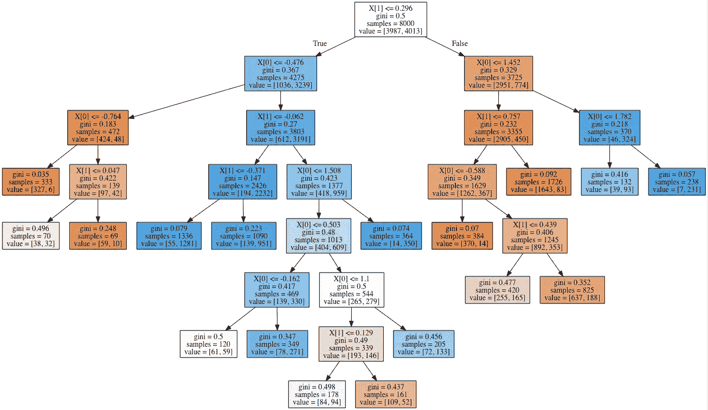

# 决策树分类器—使用 GridSearchCV 处理 Moons 数据集，以找到最佳超参数

> 原文：<https://medium.com/analytics-vidhya/decisiontree-classifier-working-on-moons-dataset-using-gridsearchcv-to-find-best-hyperparameters-ede24a06b489?source=collection_archive---------4----------------------->

决策树是一种很好的分类方法，不像随机森林，它们是透明的或白盒分类器，这意味着我们可以找到决策树分类背后的逻辑。

我还将向您展示一种从模型创建决策树的. png 文件的快速方法，这将解释我所说的透明性，它看起来像这样(代码如下)



卫星数据集的决策树

我们是怎么做到的？

我们会谈到这一点，但首先让我们读一读我们的数据集。

[](https://scikit-learn.org/stable/modules/generated/sklearn.datasets.make_moons.html) [## sk learn . datasets . make _ moons-sci kit-learn 0 . 21 . 3 文档

### 将两个交错的半圆制作成一个简单的玩具数据集，以可视化聚类和分类算法。阅读…

scikit-learn.org](https://scikit-learn.org/stable/modules/generated/sklearn.datasets.make_moons.html) 

现在，我们将首先将数据集加载到对象中，然后将其拆分为训练数据集和测试数据集

```
from sklearn.datasets import make_moonsdataset=make_moons(n_samples=10000, shuffle=True, noise=0.4, random_state=42)X,y=datasetX_train,X_test,y_train,y_test = train_test_split(X,y,test_size=0.2,random_state=42) 
```

接下来，我们将初始化我们的分类器和 GridSearchCv，它是帮助我们找到最佳超参数的主要组件。

我们简单地创建一个超参数的元组(一种非编辑列表),我们希望机器用它来测试，并把它们保存为参数。

然后，我们将分类器和参数列表作为 gridsearchcv 的参数。

```
from sklearn.tree import DecisionTreeClassifier
from sklearn.model_selection import GridSearchCVparams = {'max_leaf_nodes': list(range(2, 100)), 'min_samples_split': [2, 3, 4]}
grid_search_cv = GridSearchCV(DecisionTreeClassifier(random_state=42), params, verbose=1, cv=3)grid_search_cv.fit(X_train, y_train)
```

一旦我们用训练数据拟合了网格搜索 cv 模型，我们将简单地问什么对你最有效，它会回答，类似于-

```
grid_search_cv.best_estimator_
```

我们得到了一个答案，下面这些参数是这个算法的最佳超参数

```
GridSearchCV(cv=3, error_score='raise-deprecating',
       estimator=DecisionTreeClassifier(class_weight=None, criterion='gini', max_depth=None,
            max_features=None, max_leaf_nodes=None,
            min_impurity_decrease=0.0, min_impurity_split=None,
            min_samples_leaf=1, min_samples_split=2,
            min_weight_fraction_leaf=0.0, presort=False, random_state=42,
            splitter='best'),
       fit_params=None, iid='warn', n_jobs=None,
       param_grid={'max_leaf_nodes': [2, 3, 4, 5, 6, 7, 8, 9, 10, 11, 12, 13, 14, 15, 16, 17, 18, 19, 20, 21, 22, 23, 24, 25, 26, 27, 28, 29, 30, 31, 32, 33, 34, 35, 36, 37, 38, 39, 40, 41, 42, 43, 44, 45, 46, 47, 48, 49, 50, 51, 52, 53, 54, 55, 56, 57, 58, 59, 60, 61, 62, 63, 64, 65, 66, 67, 68, 69, 70, 71, 72, 73, 74, 75, 76, 77, 78, 79, 80, 81, 82, 83, 84, 85, 86, 87, 88, 89, 90, 91, 92, 93, 94, 95, 96, 97, 98, 99], 'min_samples_split': [2, 3, 4]},
       pre_dispatch='2*n_jobs', refit=True, return_train_score='warn',
       scoring=None, verbose=1)
```

现在回到用这个模型制作一个树模型图像，简单地复制下面的代码-

```
from sklearn.tree import export_graphvizexport_graphviz( 
 grid_search_cv.best_estimator_,
 out_file=(“moons_tree.dot”),
 feature_names=None,
 class_names=None,
 filled=True,
)
```

一旦你运行了这个，你的代码目录将显示 moons_tree.dot 为一个新文件，只需在终端中运行这个文件就可以把它转换成。png

```
$ dot -Tpng moons_tree.dot -o moons.png
```

瞧，你的文件夹里有一棵树，它解释了这个模型是如何工作的。

这就是决策树的魅力所在，要查看我的代码，您可以访问>

[](https://github.com/Madmanius/DecisionTreeClassifier_GridSearchCv) [## madmanius/decision tree classifier _ GridSearchCv

### 决策树是一种很好的分类方法，不像随机森林，它们是透明的或白盒…

github.com](https://github.com/Madmanius/DecisionTreeClassifier_GridSearchCv)