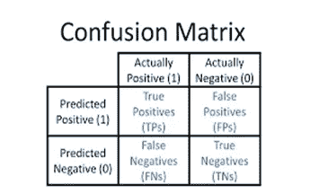
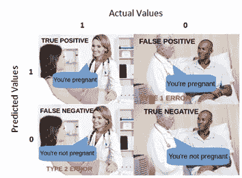

# 解码混淆矩阵

> 原文：<https://medium.com/analytics-vidhya/decoding-confusion-matrix-2b5912cabc6a?source=collection_archive---------23----------------------->

预测建模的完整生命周期包括数据清理、预处理和数据争论。现在到了我们尝试适应模型的阶段，最终目标是实现低偏差和低方差。最重要的步骤是模型创建后的模型评估。我们经常无法理解由此产生的绩效评估指标。

让我们知道通过混乱矩阵-

监督分类问题是评估的帮助下，混淆矩阵。

今天我们就来一劳永逸的了解一下混淆矩阵。

这是一个 2x2 的表格，包含实际值和预测值的组合。

它也有助于评估其他性能值，如精确度、召回率和准确度。

让我们用简单的术语来理解这个-

**真阳性(TP)** —你预测一个女人怀孕了，而她在现实中怀孕了

**真阴性(TN)-** 你预测一个男人不会怀孕，他实际上也没有。

**假阳性(FP)-** 你预测一个男人怀孕了，但他并不在现实中。它也被称为 I 型误差。

**假阴性(FN)-** 你预测一个女人没有怀孕，但实际上她怀孕了。它也被称为第二类错误。

**召回-** 又称为敏感度和真阳性率。

**召回(TPR)= TP/(TP+FN)**

它表明，在所有积极的多少，我们的模型能够纠正直接。

当假阴性对我们非常重要时，我们应该专注于增加回忆。举个例子，

一个人得了癌症，我们预测他没有得癌症。

**精度-** 也称为阳性 Pred 值和假阳性率。这是我们混淆矩阵中的第一类错误。

**精度(FPR) = TP/(TP+FP)**

它指出，在所有积极的预测类中，有多少实际上是积极的。

当假阳性具有更高的重要性时，我们通常专注于提高精确度。例如，一封邮件不是垃圾邮件，但我们预测它是垃圾邮件。

**精度-** 是我们正确预测值的矩阵由矩阵的所有值组成。

**精度= TP+TN/(TP+FP+FN+TN)**

我希望我已经给了你一些关于混淆矩阵的基本理解。如果你喜欢这个帖子，请鼓掌👏来激励。

让我们连接:

https://www.linkedin.com/in/prerna-nichani

感谢您的阅读！