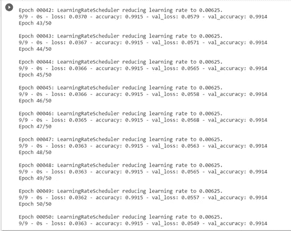

# 解码学习率衰减..！！(包括代码)

> 原文：<https://medium.com/analytics-vidhya/decoding-learning-rate-decay-code-included-fd60c727ceb9?source=collection_archive---------16----------------------->

**嘿 ML 爱好者。！！**我敢肯定，当你第一次浏览互联网试图学习机器学习背后的数学时，你肯定遇到过这个等式——


**梯度下降**

今天，让我们深入了解这个等式的一个组成部分。从标题中有任何猜测吗？

是的。！如果你在考虑**学习率**，你绝对是正确的。在我们继续之前，简单回顾一下-

# 什么是学习率？

简单地说,**学习速度**是一个基本上帮助我们**调整学习速度**的值。现在在机器学习中，机器将要学习什么？ ***权重当然*** 。！！因此，使用学习率，我们可以控制我们将要相对于损失梯度调整多少权重，并最终学习。现在谁来决定价值。

嗯，这是一个**超参数**，这意味着我们将决定这个值。看起来是个艰巨的任务，不是吗？我们将如何决定？


让我们逐一探索可供选择的不同方案。

## 首先让我们看看如果我们选择非常低的学习率值会发生什么？

嗯，问题是**需要很多时间来收敛，因为你的学习会非常慢。**


**学习率太小的问题**

看看要达到最小值需要多少步骤。

## 现在如果我们选择高学习率呢？

好吧，在那种情况下，你可能**错过最小值**而**继续围绕它切换**或者你**甚至可能发散**。因此，你将无法收敛。


**学习率过高的问题**

下图总结了可能出现的不同情况


**不同学习率值的损失-时期图**

因此，你意识到选择正确的学习速度非常重要！！现在如何找到学习率的最佳值？我们能做的是，我们可以从一开始就用一个**较高的学习率值，因为这将帮助我们快速收敛**，然后随着训练的进行，我们可以**继续降低学习率**。因此，总结一下

***1。以较大的学习率开始***

**2*。在训练过程中减少它(这样才能达到你的最佳领域)***

# 这被称为学习率衰减..！！

让我们实现一个代码来更好地理解 LR 衰减的概念！！我们将研究一个基于电离层数据集的简单二元分类问题。链接如下:-

dataset:[https://drive . Google . com/file/d/19 evwjpmofmzjtd 6 dvyfdwysnbwrt 9g 4 u/view？usp =共享](https://drive.google.com/file/d/19EVWjpMofMZJTd6dVyfDwysnBWrT9g4u/view?usp=sharing)

首先你需要**导入必要的模块**:

```
import pandas as pd from keras.models import Sequentialfrom keras.layers import Densefrom keras.optimizers import SGDfrom sklearn.preprocessing import Label Encoder
```

现在让我们**加载数据集:**

```
df = pd.read_csv(“/content/ionosphere_csv.csv”) 
```

现在，如果你看一下数据集，你会看到**目标特征列在对象数据类型**中。所以我们需要做**编码**它。为此，我们将使用**标签编码器**。如果你想了解更多关于标签编码器的信息，你可以查看这个链接:[https://sci kit-learn . org/stable/modules/generated/sk learn . preprocessing . Label Encoder . html](https://scikit-learn.org/stable/modules/generated/sklearn.preprocessing.LabelEncoder.html)

```
# Split data input (X) and output (Y) variablesX = df.drop('class',axis=1).astype(float)Y = df['class'] #Target feature# encode class values as integersencoder = LabelEncoder()encoder.fit(Y)Y = encoder.transform(Y)
```

现在让我们**创建模型**:

```
# create modelmodel = Sequential()model.add(Dense(34, input_dim=34, activation='relu'))model.add(Dense(1, activation='sigmoid'))
```

## 这里我们将使用 SGD 作为我们的优化器。

## 现在让我们首先从一个恒定的学习速率开始:

```
epochs = 50  #mention the number of epochslearning_rate = 0.1 # declare constant learning rate# Declaring the optimizer that we are going to use specifying the learning ratesgd = SGD(lr=learning_rate, momentum=0, decay=0, nesterov=False)model.compile(loss='binary_crossentropy', optimizer=sgd, metrics=['accuracy']) #Specify the loss, optimizer and metric # Fit the modelhistory=model.fit(X, Y, validation_split=0.33, epochs=epochs, batch_size=28, verbose=2)
```

现在你可以看到，我们将**衰变和动量保持为零，因为我们希望学习率保持不变**。**衰变帮助我们降低学习率**，我们很快就会看到。动量和内斯特洛夫都有助于更快的收敛。

现在回到恒定学习率实现，让我们看看我们的模型可以达到什么精度:


**使用恒定学习速率训练 50 个周期后获得的精度**

嗯，我们得到了相当好的精确度。如果您想要一个**直观的表示精度是如何随时期变化的**，您可以尝试下面几行代码:

```
import matplotlib.pyplot as pltplt.title('Classification Accuracy')plt.plot(history.history['accuracy'], color='blue', label='train')plt.plot(history.history['val_accuracy'], color='orange', label='test')
```


**恒定学习速率的训练和验证精度与时期**

嗯，你可以看到曲线是崎岖不平的，这可能是由于**在最小值附近来回切换，并且由于后面时代的高学习率而无法快速收敛**。此外，大约需要 50 个历元才能达到这个精度。让我们看看我们是否能改善这一点。

现在，我们将尝试在代码中实现学习率衰减。在我们进入编码部分之前，让我们讨论一下不同种类的衰变

1.  基于时间的衰减
2.  基于阶跃的衰减
3.  指数式衰减

## 基于时间的衰减:

顾名思义，基于时间的衰减意味着久而久之，也就是说，随着时代的增加，我们的学习率会因某种因素而改变。这个因素被称为**衰变**。

**lr = lr0/ (1。+ k*t))**

**lr0:初始学习率**

**k:衰变率**

**t:迭代/历元数(注意:虽然我们有从 1 开始的历元，但是这个函数考虑从索引=0 开始的历元)**

让我们看看如何在代码中实现它:

像我们在前面的案例中所做的那样创建模型，现在指定优化器的细节:

```
# Compile modelepochs = 50learning_rate = 0.1  #initial learning ratedecay_rate = learning_rate / epochs      #defining decay ratemomentum = 0.8sgd = SGD(lr=learning_rate, momentum=momentum, decay=decay_rate, nesterov=False)model.compile(loss='binary_crossentropy', optimizer=sgd, metrics=['accuracy'])# Fit the modelhistory=model.fit(X, Y, validation_split=0.33, epochs=epochs, batch_size=28, verbose=2)
```

您可以看到我们如何**定义衰变率，然后在声明优化器**时传递衰变率和动量的值。这段代码将实现基于时间的衰减。


**在执行基于时间的衰减时，训练 50 个时期后获得的精度**

很明显，训练的准确性有所提高。使用与上面相同的代码来显示图形。让我们看一下图表:


**基于时间衰减的学习率的训练和验证精度与时期**

现在注意两件事:

1.  **曲线平滑**
2.  **在第 20 个历元左右已经达到高精度，这意味着您甚至不需要运行 50 个历元。这证明了更快的收敛并节省了计算时间和功率。**

当然这比恒定的学习速率要好。现在让我们来看看另外两种类型的衰变

## 阶跃衰减:

在这种类型的衰减中，每隔几个时期后，学习率就会降低一定的系数。通常，每过 10 个周期，我们的学习率就会减半。让我们来看看这个表达-

**lr = lr0 * drop^floor(epoch /纪元 _ 丢弃)**

**lr0:初始学习率**

**下降:我们想下降多少**

**epochs_drop:多少个 epochs 之后我们想要降低学习率**

**纪元:纪元编号**

为了应用这个，我们还需要一个叫做**学习率调度器的东西。**

## 学习率计划程序:

用于在根据预定义的时间表进行训练时调整学习率。

这样你**就定义了你想要改变你的学习率**的函数，通过**学习率调度器**(这会创建一个**回调**)然后**在训练**时传递那个回调。

**回调是在每个训练时期应用的一组函数。**

让我们首先定义函数:

```
from keras.callbacks import LearningRateScheduler# learning rate scheduledef step_decay(epoch):initial_lrate = 0.1drop = 0.5epochs_drop = 10.0lrate = initial_lrate * math.pow(drop, math.floor((epoch)/epochs_drop))return lrate
```

因此，纪元编号被传递，这返回该纪元的学习率。**注:虽然我们有从 1 开始的时期，但学习率调度程序认为时期从 index=0 开始**

因此，**对于第一个历元，*历元=0，(历元/历元 _ 丢弃)=0，因此 floor 返回 0，lrate = initial _ lrate*T3。对于 9 之前的所有下一个值，学习率保持初始学习率不变。 ***现在是第 11 个历元，当历元变为 10 时，底值变为 1，学习率变为= initial_lrate*0.5，即学习率减半。*** 这个过程还在继续。**

现在像以前一样创建模型，现在将优化器定义为:

```
import math# Compile modelsgd = SGD(lr=0.0, momentum=0.9)model.compile(loss='binary_crossentropy', optimizer=sgd, metrics=['accuracy'])# learning schedule callback
# Mentioning verbose=1 helps you visualize what is the learning rate at each epoch while traininglrate = LearningRateScheduler(step_decay,verbose=1) callbacks_list = [lrate] #Creating a list of callbacks# Fit the modelhistory=model.fit(X, Y, validation_split=0.33, epochs=50, batch_size=28, callbacks=callbacks_list, verbose=2) #Pass the callbacks list while training the model
```

你一定想知道，如果我们把 lr=0.0，然后再次定义学习率，我们的模型将考虑哪一个。嗯，**如果你定义了一个学习率调度器，那么它总是考虑你在学习率调度器**中定义的内容，并忽略 lr=0.0

让我们看看训练结果-


使用基于步长的衰减进行训练

注意**学习率如何在历元=11 时减半(因为现在在学习率调度器内历元值=10)** 。这个过程还在继续。让我们看看精确度和图表:



**执行基于步长的衰减时，训练 50 个时期后的精度**

嗯，**训练准确率和验证准确率都挺高的。**

让我们看一下图表:


**基于步长衰减的学习率的训练和验证精度与时期**

这比前一个更加平滑，这里你也达到了接近第 20 个纪元的精度。

## 指数衰减:

在指数衰减中，学习率根据以下等式指数下降:

**lr = lr0 * e^(−kt)**

**lr0:初始学习率**

**k:衰变率**

**t:纪元编号**

在这种情况下，我们还将**定义一个函数**返回学习率，**使用学习率调度器**定义一个回调，然后**在训练时传递回调。**

让我们看一下代码:

```
def lr_exp_decay(epoch):initial_learning_rate = 0.01    #lr0k = 0.01    #decaylrate=initial_learning_rate * math.exp(-k*epoch)return lrate
```

现在创建与之前相同的模型，并在编译时进行以下更改:

```
# Compile modelsgd = SGD(lr=0.0, momentum=0.9)model.compile(loss='binary_crossentropy', optimizer=sgd, metrics=['accuracy'])# learning schedule callbacklrate = LearningRateScheduler(lr_exp_decay,verbose=1) #verbose=1 helps you visualize the learning rate while trainingcallbacks_list = [lrate] #create a list of the callback# Fit the modelhistory=model.fit(X, Y, validation_split=0.33, epochs=50, batch_size=28, callbacks=callbacks_list, verbose=2) 
```

让我们来看看学习率是如何随着时代的变化而变化的


**使用指数衰减进行训练**

对于第一个历元，经过的历元值=0 **(记住学习速率调度器中的历元号从 0 开始)**，学习 rate=0.01*e^(-0.01*0)，即学习速率=0.01。现在对于纪元 1，学习 rate=0.01*e^(-0.01*1)，学习率=0.0099。因此，对于每个时期，你可以看到学习率是如何指数下降的。

现在让我们看看最终精度:


**使用学习率指数衰减训练 50 个时期后获得的准确度**

让我们看一下图表:


**具有指数衰减的学习速率的训练和验证精度与时期的关系**

**你可以自己比较每种情况下的表现，我们可以得出结论，使用 LR 衰变我们可以实现更快的收敛，从而加快我们的训练。**

希望这对您有所帮助。请不要在评论区留下任何问题或建议，如果你觉得这很有帮助，请“鼓掌”。

祝你愉快..！！