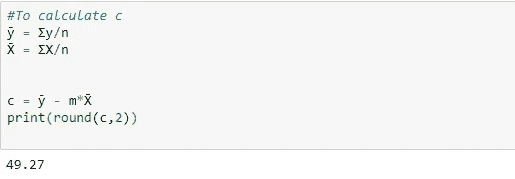

# 简单线性回归

> 原文：<https://medium.com/analytics-vidhya/decoding-simple-linear-regression-b3f5528e54b7?source=collection_archive---------9----------------------->

## 解码:

## 公式和计算

我们都知道统计学和机器学习模型中最简单的等式；线性回归方程。在这篇文章中，我的目标是阐明如何手工计算直线方程的公式。公式如下:

*y = mx + c，*其中 *m* 是斜率， *c* 是 y 截距。

首先，让我们看看一个简单的一元线性方程的计算，下面是学龄儿童的年龄和体重的例子。这里，年龄是预测因子【T6(X)】，体重是 *(y)* ，它是根据年龄来预测的。

**注意:**对于简单的线性回归，X 和 y 变量本质上需要是数字。

手动创建的数据帧(d ),描述学校/学院中学生的年龄和体重。

我们在这里不会查看数据的分布，因为我们的目的是为了理解计算，所以让我们快速进入工作状态。为此，我们需要以下信息:

n —记录的数量

σX——X 的和

σy——y 之和

σxy—X * y 之和

σx2——X 的平方和

σy2——y 的平方和

所需信息

我们现在将继续寻找 *m* ，它是直线的斜率，也称为系数。这仅仅意味着，对于 X 的单个单位变化，y 将变化*m。*这显示了 X 和 y 之间的相关性。

一旦我们找到 *m，*我们将计算 *c* 的值，它是 y 轴截距处的常数值。这意味着，即使方程中不存在 X，也可以在 *y* 轴上获得最小的 *c* 。例如，如果我们试图找出工作经验和薪水之间的线性关系，那么不管工作经验有多少年，公司提供的最低薪水将是一个恒定值。

请注意:这些陈述实际上并不总是在所有情况下都成立，但逻辑上是成立的。 *c* 的值在某些情况下也可以是负值，不要与图中没有自变量的 *y* 的最小值相混淆。

类似地， *m* 的值也可以是负值，这仅仅意味着 *X* 和 *y* 之间的负相关性。 *X 每增加一个单位，y* 减少 *m* 。

计算斜率/系数 *m* :

系数的值(m)

因此我们的值为 *m = 0.21* 经过四舍五入。我们现在将使用 X̄的平均值 *X 和ȳ的平均值*和 *y 来计算 c 的值*

c = ȳ — m*X̄

常数的值(c)

我们现在有了这条线的方程式:

***y = 0.21*X + 49.27***

假设对于一个给定的 15 岁的年龄，我们需要计算我们在上面的等式中简单计算的体重:

年龄= 15 岁时 y 的计算。

让我们使用 sklearn 库中内置的线性回归函数来快速确认这一点

sklearns 的线性回归

我们看到结果和手工计算的完全一样。

总结:

在本文中，我们研究了只有一个因变量的简单线性回归方程背后的计算。m 是直线的斜率，c 是总常数。

下一篇文章，我们将看看多元线性方程的计算。

这是我正在尝试做的名为“解码”的系列文章的第一篇。我对这个系列的想法是理解机器学习的最基本概念的公式。下次当您应用它们时，您肯定会对后端发生的事情有更好的了解。

欢迎任何反馈。如果你喜欢这篇文章，请给我鼓掌。