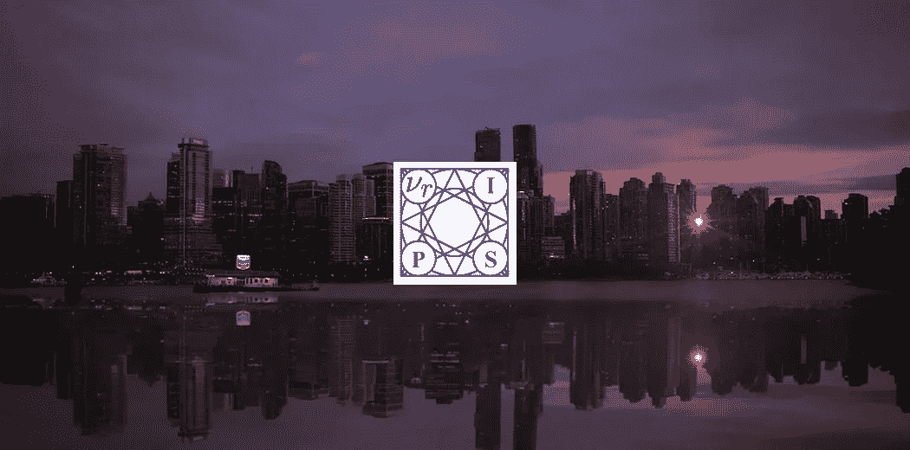
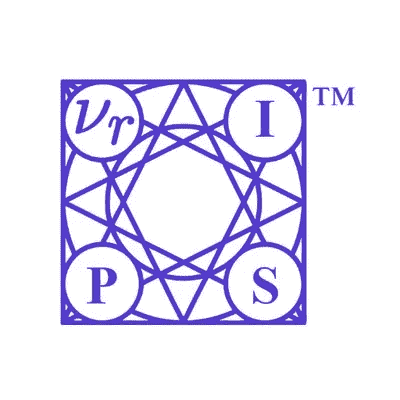
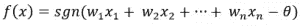
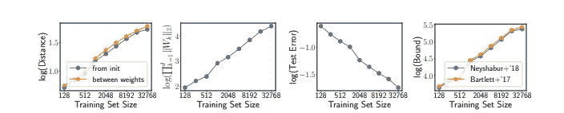
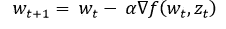
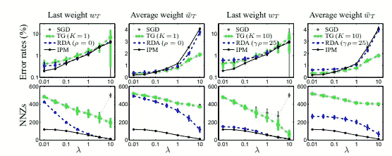

# 解码 NeurIPS 2019 最佳机器学习论文

> 原文：<https://medium.com/analytics-vidhya/decoding-the-best-machine-learning-papers-from-neurips-2019-7d2effdcc5ac?source=collection_archive---------16----------------------->

# 介绍

NeurIPS 是世界上最重要的机器学习会议。没有其他的研究会议能在一个地方吸引超过 6000 人——这是真正的精英会议。如果你想沉浸在最新的机器学习研究进展中，你需要关注 NeurIPS。

[NeurIPS 2019](https://nips.cc/) 是第 33 届会议，于 12 月 8 日至 14 日在加拿大温哥华举行。我每年都会虔诚地关注这次会议，今年也不例外。

每年，NeurIPS 都会为机器学习领域的顶级研究论文宣布一个奖项类别。鉴于这些论文的高级水平，大多数人可能很难理解。

但是不用担心！我把这些牛逼的论文都翻了一遍，总结了这篇文章的重点！我的目的是通过为我们的社区将关键的机器学习概念分解成易于理解的比特来帮助你理解每篇论文的本质。

以下是我将介绍的三个 NeurIPS 2019 最佳论文类别:

*   最佳论文奖
*   杰出方向论文奖
*   测试时间论文奖

让我们开始吧！

# NeurIPS 2019 最佳论文奖

NeurIPS 2019 最佳论文奖将授予:

## 具有 Massart 噪声的半空间的分布无关 PAC 学习

这真是一篇伟大的论文！这让我想到了机器学习中的一个基本概念:**噪声和分布**。这也需要对论文本身进行大量的研究，我会尽量解释论文的主旨，而不会使其变得复杂。

先把标题改一下。本文研究的是一种在带 **Massart 噪声的**分布独立 PAC 模型**中学习**半空间**的算法。该算法是该领域迄今为止最有效的算法。**

让我们理解这里的关键术语。

回想一下布尔函数和二进制分类的概念。基本上，

> *半空间是一个布尔函数，其中两个类(正样本和负样本)被一个超平面分开。由于超平面是线性的，所以又称为****【LTF】****。*

从数学上讲，线性阈值函数或半空间是一种阈值函数，它可以由某个阈值 *T* 所限定的输入参数的线性方程来表示。如果布尔函数 f(x)具有以下形式，则它是线性阈值函数:

其中:

我们也可以把 LTFs 称为感知器(在这里利用你的[神经网络的](https://www.analyticsvidhya.com/blog/2018/10/introduction-neural-networks-deep-learning/?utm_source=blog&utm_medium=neurips-2019-best-papers)知识！).

PAC(可能近似正确)模型是二元分类的标准模型之一。

> *Massart 噪声条件，或者仅仅是 Massart 噪声，是当每个样本/记录的标签以学习算法未知的某个小概率翻转时。*

翻转的概率受到某个因子 *n* 的限制，该因子总是小于 1/2。由于主要目标是找到具有小的错误分类误差的假设，在以前的论文中已经进行了各种尝试来限制误差和与数据中的噪声相关联的风险。

在这项研究中，虽然样本复杂性得到了很好的确定，但证明了多项式时间(1/ε)的超额风险等于 Massart 噪声水平加上ε。

这篇论文是朝着实现仅ε的超额风险迈出的一大步。你可以在这里阅读全文[。](https://papers.nips.cc/paper/8722-distribution-independent-pac-learning-of-halfspaces-with-massart-noise)

## NeurIPS 对杰出论文奖的其他荣誉奖包括:

1.  [*非参数密度估计【Besov IPM 损失下 GANs 的收敛速度*](https://papers.nips.cc/paper/9109-nonparametric-density-estimation-convergence-rates-for-gans-under-besov-ipm-losses)
2.  [*快速准确的最小均方解算器*](https://papers.nips.cc/paper/9040-fast-and-accurate-least-mean-squares-solvers)

# NeurIPS 2019 上的杰出新方向论文

NeurIPS 2019 今年还有一个新的获奖论文类别，称为**杰出新方向论文奖。**用他们的话说:

> 该奖项旨在表彰为未来研究开辟新道路的杰出工作。

而这个奖项的获得者是——**“一致收敛可能无法解释深度学习中的泛化”**。

今年我最喜欢的论文之一！本文继续从理论和经验证据两方面解释，当前的深度学习算法不能声称解释深度神经网络中的泛化。让我们更详细地理解这一点。

## 一致收敛可能无法解释深度学习中的泛化

大型网络对看不见的训练数据进行很好的概括，尽管被训练成完全适合随机标记的数据。但是当特征的数量大于训练样本的数量时，这些网络应该不会工作得很好，对吗？

然而，它们仍然为我们提供了最先进的性能指标。这也表明，这些过度参数化的模型过度依赖于参数计数，并且没有考虑可变的批量大小。如果我们按照概括的基本等式:

测试误差—训练误差<= Generalisation bound

For the above equation, we take the set of all hypotheses and attempt to minimize the complexity and keep these bounds as tight as possible.

The previous and current research so far has focused on tightening these bounds by concentrating on taking a relevant subset of the hypothesis class. There has also been a lot of pathbreaking research on refining these bounds, all based on the concept of **一致收敛**。

然而，本文解释说，这些算法要么是:

*   太大，并且它们的复杂性随着参数计数而增加，或者
*   很小，但是是在一个改进的网络上开发的

> *该论文定义了一组泛化界限的标准，并展示了一组实验来证明一致收敛如何不能完全解释深度学习中的泛化。*

概化界限:

1.  必须是理想的<1 (vacuous)
2.  Become smaller with increasing width
3.  Apply to the network learned by [SGD(随机梯度下降)](https://www.analyticsvidhya.com/blog/2017/03/introduction-to-gradient-descent-algorithm-along-its-variants/?utm_source=blog&utm_medium=neurips-2019-best-papers)
4.  随着随机翻转的训练标签的比例而增加
5.  应与数据集大小成反比

我前面提到的实验是在 MNIST 数据集上进行的，有三种过度参数化的模型(都是在 SGD 算法上训练的):

1.  线性分类器
2.  一种带 ReLU 的宽神经网络
3.  具有冻结隐权的无限宽神经网络

该论文继续展示了不同训练集大小的不同超参数设置。

> 我看到的一个非常有趣的观察结果是，尽管测试集误差随着训练集大小的增加而减小，但推广范围实际上却在增加。

如果网络只是记住我们不断添加到训练集中的数据点，会怎么样？

我们举一个研究人员给出的例子。对于具有 1000 个维度的数据集上的分类任务，使用 SGD 训练具有 1 个隐藏层 ReLU 和 100k 个单元的过参数化模型。增加训练集大小可以提高泛化能力并减少测试集错误。

然而，尽管一般化，他们证明决策边界是相当复杂的。这就是他们违背一致收敛思想的地方。

因此，即使对于线性分类器，一致收敛也不能完全解释泛化。事实上，当增加样本量时，它实际上可以被认为是导致边界增加的一个因素！

虽然以前的研究已经将开发深度网络的方向推向了算法相关(为了坚持一致收敛)，但本文提出了开发算法无关技术的需求，这些技术不会将自己限制为一致收敛来解释泛化。

我们可以清楚地看到为什么这篇机器学习研究论文在 NeurIPS 2019 上获得了杰出新方向论文奖。

研究人员表明，仅仅一致收敛不足以解释深度学习中的泛化。此外，不可能实现满足所有 5 个标准的小范围。这开启了一个全新的研究领域，探索可能解释泛化的其他工具。

你可以访问和阅读全文[在这里](https://papers.nips.cc/paper/9336-uniform-convergence-may-be-unable-to-explain-generalization-in-deep-learning)。

## NeurIPS 颁发的杰出新方向论文奖的其他荣誉奖包括:

1.  [*端到端的终结:表征的梯度隔离学习*](https://papers.nips.cc/paper/8568-putting-an-end-to-end-to-end-gradient-isolated-learning-of-representations)
2.  [*场景表示网络:连续 3D 结构感知神经场景表示*](https://papers.nips.cc/paper/8396-scene-representation-networks-continuous-3d-structure-aware-neural-scene-representations)

# 2019 年 NeurIPS 的时间测试奖

每年，NeurIPS 还为 10 年前在会议上发表的论文颁奖，该论文对该领域的贡献产生了持久的影响(也是一篇广受欢迎的论文)。

今年，名副其实的时间检验奖授予了林晓的“正则化随机学习和在线优化的双重平均方法”。这项研究是基于基本概念，正如我们所知，这些概念奠定了现代机器学习的基础。

## 正则化随机学习和在线优化的双重平均方法

让我们来分解这篇精彩论文中的四个关键概念:

**1 —随机梯度下降:** [随机梯度下降](https://www.analyticsvidhya.com/blog/2017/03/introduction-to-gradient-descent-algorithm-along-its-variants/?utm_source=blog&utm_medium=neurips-2019-best-papers)已经被正式确立为机器学习中的优化方法。这可以通过下面的随机优化来实现。回想一下 SGD 和针对非常大样本的随机优化方程，这里，w 是权重向量，z 是输入特征向量。对于 t = 0，1，2…

**2 —在线凸优化:**又一项开创性的研究。这被模拟为一个游戏，玩家将试图预测一个重量向量，并在每个 *t* 计算最终的损失。主要目的是最小化这种损失——结果非常类似于我们如何使用随机梯度下降进行优化

**3 —压缩学习**:这包括[拉索回归](https://www.analyticsvidhya.com/blog/2017/06/a-comprehensive-guide-for-linear-ridge-and-lasso-regression/?utm_source=blog&utm_medium=neurips-2019-best-papers)、L1 正则化最小二乘法和其他混合正则化方案

**4——近似梯度法:**与早期技术相比，这是一种更快的方法，可减少损失并保持凸性

虽然以前的研究开发了一个收敛到 O(1/t)的有效算法，但数据的稀疏性是一个被忽略的因素。**提出了一种新的正则化技术，称为正则化对偶平均法(RDA ),用于求解在线凸优化问题。**

当时，这些凸优化问题效率不高，尤其是在可伸缩性方面。

本研究提出了一种新颖的 [**批量优化方法**](https://www.analyticsvidhya.com/blog/2018/11/neural-networks-hyperparameter-tuning-regularization-deeplearning/?utm_source=blog&utm_medium=neurips-2019-best-papers) 。这意味着最初只有一些独立的样本可用，并且权重向量是基于那些样本计算的(在当前时间 *t* )。相对于当前权重向量的损失与次梯度一起计算。这在迭代中再次使用(在时间 t+1)。

具体来说，在 RDA 中，考虑的是平均次梯度，而不是当前次梯度。

> 当时，该方法对于稀疏 MNIST 数据集已经取得了比 SGD 和其他流行技术好得多的结果。事实上，随着稀疏度的增加，RDA 方法也有明显更好的结果。

这被授予时间测试论文的原因在进一步研究上述方法的不同论文中是显而易见的，如流形识别、加速 RDA 等。

你可以在这里找到完整的论文。

# 结束注释

NeurIPS 2019 又是一次极具教育意义和启发性的会议。我对新方向论文奖以及它如何解决深度学习中的泛化问题特别感兴趣。

哪篇机器学习研究论文引起了你的注意？除了你想尝试的或者真正给你灵感的论文，你还喜欢其他的吗？请在下面的评论区告诉我。

所有的演讲，包括聚光灯和展示，都由 NeurIPS 团队现场直播。你可以在这里找到[的链接。](https://slideslive.com/neurips)

*原载于 2019 年 12 月 17 日*[*https://www.analyticsvidhya.com*](https://www.analyticsvidhya.com/blog/2019/12/neurips-2019-best-papers/)*。*