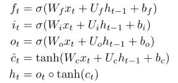
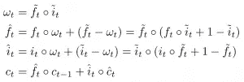
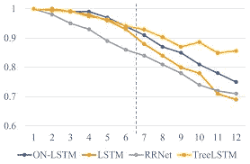
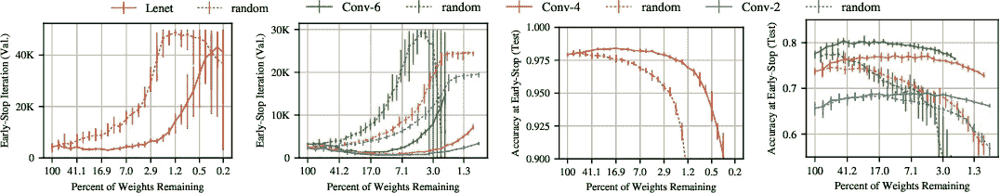
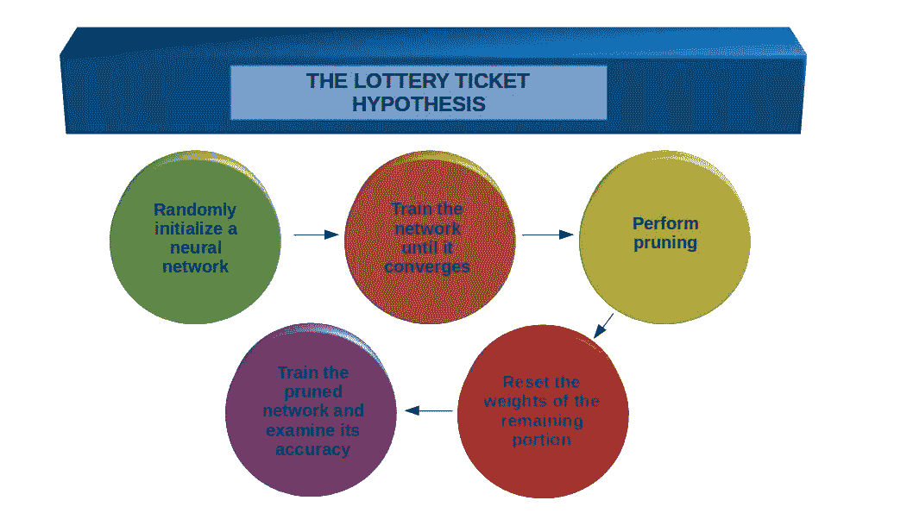

# 解码 ICLR 2019 年的最佳论文-神经网络在这里统治

> 原文：<https://medium.com/analytics-vidhya/decoding-the-best-papers-from-iclr-2019-neural-networks-are-here-to-rule-28d213cd38ab?source=collection_archive---------2----------------------->

# 介绍

我爱读解码[机器学习](https://courses.analyticsvidhya.com/courses/applied-machine-learning-beginner-to-professional?utm_source=blog&utm_medium=best-papers-iclr-2019)研究论文。有太多难以置信的信息需要解析——这是我们数据科学家的金矿！当无与伦比的 ICLR 2019(国际学习代表大会)会议的最佳论文公布时，我激动不已。

我迫不及待地想得到它们。

然而，大多数研究论文都很难理解。它们是针对特定的读者(研究员)编写的，因此它们假定读者具有一定的知识水平。


当我第一次涉足这些研究论文时，我也面临着同样的问题。我竭尽全力去分析它们，并领会其中的技术。这就是为什么我决定帮助我的数据科学家同事理解这些研究论文。

这些天有太多令人难以置信的学术会议发生，我们需要让自己跟上最新的机器学习发展。这篇文章是我回报给我这么多的社区的方式！

在这篇文章中，我们将看看 ICLR 2019 会议的两篇最佳论文。*这里非常强调神经网络，所以如果你需要复习或介绍，可以查看下面的资源:*

*   [*深度学习和神经网络入门指南*](https://www.analyticsvidhya.com/blog/2018/10/introduction-neural-networks-deep-learning/?utm_source=blog&utm_medium=best-papers-iclr-2019)
*   [*深度学习基础——递归神经网络(RNNs)简介*](https://www.analyticsvidhya.com/blog/2017/12/introduction-to-recurrent-neural-networks/?utm_source=blog&utm_medium=best-papers-iclr-2019)
*   [*使用深度学习的计算机视觉 2.0*](https://courses.analyticsvidhya.com/courses/computer-vision-using-deep-learning-version2?utm_source=blog&utm_medium=best-papers-iclr-2019)

# 2019 年 ICLR 最佳论文奖将授予:

*   有序神经元:将树形结构集成到递归神经网络(RNNs)中
*   彩票假说:寻找稀疏、可训练的神经网络

让我们分解这两篇不可思议的论文，了解它们的做法。

# [有序神经元:将树形结构整合到递归神经网络中](https://openreview.net/pdf?id=B1l6qiR5F7)

自然语言的结构是分层的。这意味着较大的单元或成分由较小的单元或成分(短语)组成。这种结构通常是树状的。

虽然标准的 LSTM 体系结构允许不同的神经元在不同的时间尺度上跟踪信息，但它并不明显偏向于对单元的层次进行建模。**本文提出通过对神经元进行排序来增加这样一种诱导偏差。**

# 本文的目的

研究人员旨在将树形结构整合到神经网络语言模型中。这样做的原因是通过更好的归纳偏差来提高泛化能力，同时潜在地减少对大量训练数据的需求。

# 之前的技术水平如何？

*   预测相应的潜在树结构的一种方式是通过受监督的句法分析器。由这些解析器产生的树已经被用来指导单词语义到句子语义的合成。这也有助于在给定先前单词的情况下预测下一个单词。
*   然而，有监督的解析器由于几个原因而受到限制:
*   很少有语言拥有用于监督解析器训练的全面注释数据
*   语法规则在某些领域往往会被打破(例如在 tweets 中)，并且
*   随着时间的推移，语言会随着使用而变化，所以语法规则也会随之演变
*   递归神经网络(RNNs)已被证明在语言建模任务中非常有效。rnn 明确地对数据施加链结构。这种假设似乎与语言潜在的无序结构不一致。
*   这可能给用深度学习方法处理自然语言数据带来若干困难，引起诸如捕捉长期依赖、实现良好的概括、处理否定等问题。同时，一些证据表明，具有足够容量的 LSTMs 潜在地通过隐式编码树结构来实现句法处理机制

**如果你想了解更多关于 LSTM 的申请，你可以阅读我们的指南:**

*   [深度学习精要:长短期记忆介绍(LSTM)](https://www.analyticsvidhya.com/blog/2017/12/fundamentals-of-deep-learning-introduction-to-lstm/?utm_source=blog&utm_medium=best-papers-iclr-2019)
*   [py torch 中使用深度学习(CNN 和 LSTM)的自动图像字幕](https://www.analyticsvidhya.com/blog/2018/04/solving-an-image-captioning-task-using-deep-learning/?utm_source=blog&utm_medium=best-papers-iclr-2019)

如果你更喜欢通过视频学习，你可以参加下面的课程，其中有健康剂量的 LSTM:

[使用 Python 的自然语言处理(NLP)](https://courses.analyticsvidhya.com/courses/natural-language-processing-nlp?utm_source=blog&utm_medium=best-papers-iclr-2019)

# 本文提出的新方法

这是事情变得非常有趣的地方(对你们这些书呆子来说非常酷！).

> *提出有序神经元。这是 RNN 的一种新的诱导偏差，它迫使神经元在不同的时间尺度上表现信息。*

这种感应偏差有助于将长期信息储存在长期神经元中。短期信息(可能很快被遗忘)保存在低级神经元中。

**一个新的 RNN 单元——在 LSTM——被提议**。新型号使用类似于标准 LSTM 的架构:



> *不同之处在于单元状态 ct 的更新函数被替换为新的函数 cumax()。*

可能很难辨别神经元之间的信息层次，因为 LSTM 中的门独立作用于每个神经元。因此，研究人员提出，通过强制神经元更新的顺序，使每个神经元的门都依赖于其他神经元。

很迷人，对吧？

**ON-LSTM 包括新的门控机制和新的激活函数 cumax()。将 cumax()函数和 LSTM 结合在一起，创建了一个新的 LSTM 模型。这解释了为什么这个模型偏向于执行类似树的合成操作。**

# 激活函数:cumax()

我想花点时间讨论一下 cumax()函数。这是解开这篇了不起的论文中提出的方法的关键。

引入这个 cumax()激活函数是为了强制命令更新频率:

```
g^= cumax(…) = cumsum(softmax(…)),
```

这里，cumsum 表示累积和。“g^”可以看作是一个二进制门“g”的期望，它将单元状态分成两段:

因此，该模型可以在每个片段上应用不同的更新规则来区分长/短信息。

# 结构化门控机制

本文还介绍了一种新的主遗忘门 ***ft*** 和一种新的主输入门 ***it*** 。这些实体也基于 cumax()函数。

通过遵循 cumax()函数的属性，主机遗忘门的值从 0 到 1 单调递增。类似的事情发生在主输入门中，值从 1 到 0 单调递减。

这些门用作单元状态更新操作的高级控制。我们可以使用主门定义新的更新规则:



# 实验和结果

研究人员在四项任务中评估了他们的模型:

*   语言建模
*   无监督选区分析
*   目标句法评估
*   逻辑推理

以下是最终结果:



横轴表示序列的长度，纵轴表示相应测试集上模型性能的准确性。在长于 3 的序列上，ON-LSTM 模型给出了令人印象深刻的性能。

在面对不同长度的结构化数据时，LSTM 模型表现出更好的泛化能力。树结构模型可以在这个数据集上实现相当强的性能。

# 论文总结

*   介绍了一种新的用于 RNN 的感应偏置有序神经元
*   基于这一思想，提出了一种新的循环单元——开 LSTM，它包括一种新的门控机制和一种新的激活函数 cumax()
*   这有助于 RNN 执行树状合成操作，通过分别分配长期和短期信息的隐藏状态神经元。
*   模型性能表明，ON-LSTM 以与人类专家注释一致的方式归纳自然语言的潜在结构
*   归纳偏差也使得 ON-LSTM 在语言建模、长期依赖和逻辑推理任务上取得了良好的成绩

# [彩票假说:寻找稀疏、可训练的神经网络](https://openreview.net/pdf?id=rJl-b3RcF7)

这是 2019 年我最喜欢的论文之一。让我们把它分解成容易消化的部分！

修剪是从神经网络中移除不必要的权重的过程。这一过程潜在地将参数计数减少了 90%以上，而不影响精度。它还减少了训练网络的规模和能量消耗，使我们的推断更有效。

> *然而，如果一个网络可以缩小规模，我们为什么不训练这种更小的架构，反而让训练更有效率呢？*
> 
> *这是因为通过修剪暴露的架构从一开始就很难训练，并且会显著降低准确性。*

# 本文的目的

本文旨在表明存在从一开始就训练的更小的子网络。**这些网络的学习速度至少与规模更大的网络一样快，但测试精度却不相上下。**

例如，我们从 MNIST 的全连接网络和 CIFAR10 的卷积网络中随机采样和训练子网络:



虚线描绘了最小验证损失的迭代以及在该迭代中跨越各种稀疏水平的测试精度。网络越稀疏，学习越慢，最终的测试精度越低。

这就是研究人员陈述他们的 ***彩票假说的地方。***

# 彩票假说

随机初始化的密集神经网络包含一个子网络，标记为中奖票。这被初始化，使得当被隔离训练时，在最多相同次数的迭代训练之后，它可以匹配原始网络的测试精度。

以下是彩票假设概念的绝佳例证:



# 识别中奖彩票

> 我们通过训练它的网络和修剪它的最小权重来识别一张票。剩下的未修剪的连接构成了中奖彩票的架构。

然后，每个未布线连接的值被重置为其在被训练之前从原始网络进行的初始化。

这样做的过程包括智能训练和修剪的迭代过程。我把它总结为五个步骤:

1.  随机初始化神经网络
2.  训练网络，直到它收敛
3.  执行修剪
4.  要提取中奖票，请将网络剩余部分的权重重置为步骤 1 中的值

修剪是一个镜头，这意味着它只做一次。

> *但在本文中，研究人员专注于* **迭代剪枝** *，它在地上反复训练、剪枝、重置网络。每一轮修剪掉 p^(1/n)前一轮留下的 90%的权重.*

结果，与一次修剪相比，这种迭代修剪以较小的尺寸找到匹配原始网络的准确度的获胜标签。

# 应用程序

当阅读这些研究论文时，每个人都会想到一个问题——我们在世界上的什么地方可以应用这个？这是一个很好的实验，并且用一种新的方法来解决问题。但是最大的收获是将它转化为现实世界的应用。

这张纸对计算中奖彩票非常有用。彩票假设可以应用于在 MNIST 上训练的全连接网络和 CIFAR10 上的卷积网络，增加了学习问题的复杂性和网络的规模。

关于神经网络修剪的现有工作表明，神经网络所学习的功能通常可以用较少的参数来表示。修剪通常通过训练原始网络、移除连接和进一步微调来进行。

实际上，初始训练初始化修剪后的网络的权重，以便它可以在微调期间孤立地学习。

# 中奖票初始化的重要性

> *一张中奖票随机重新初始化时，学习速度更慢，测试准确率更低。这表明初始化对其成功很重要。*

# 中奖彩票结构的重要性

产生中奖票的初始化被安排在特定的稀疏体系结构中。由于我们通过大量使用训练数据发现了中奖彩票，我们假设中奖彩票的结构编码了一种为手边的学习任务定制的归纳偏差。

# 局限性和未来工作

研究人员意识到这还不是最终产品。当前的方法有一些限制，这些限制可以在将来解决:

*   不调查更大的数据集。只考虑较小数据集上以视觉为中心的分类任务。
*   **这些研究人员打算探索更有效的发现中奖彩票的方法，这将使在更多资源密集型环境中研究彩票假说成为可能**
*   稀疏剪枝是我们找到中奖彩票的唯一方法。
*   研究人员打算从大量的当代文献中研究其他修剪方法，如结构化修剪(这将产生针对当代硬件优化的网络)和非数量级修剪方法(这可以产生较小的中奖彩票或更早找到它们)
*   找到的中奖票具有初始化，这允许它们在尺寸太小的情况下匹配未修剪网络的性能，对于随机初始化的网络来说无法做到这一点。
*   研究人员打算研究这些初始化的属性，这些属性与修剪网络架构的归纳偏差一致，使这些网络特别擅长学习

# 结束注释

在这篇文章中，我们彻底讨论了在 ICLR 发表的两篇最好的研究论文。我在浏览这些论文和了解这些研究专家的思维过程时学到了很多东西。一旦你完成这篇文章，我鼓励你自己浏览这些论文。

很快会有几个更侧重于研究的会议。机器学习国际会议(ICML)和计算机视觉和模式识别(CVPR)会议将在未来几个月举行。敬请期待！

你也可以在分析 Vidhya 的 Android 应用上阅读这篇文章


*原载于 2019 年 5 月 29 日*[*【https://www.analyticsvidhya.com*](https://www.analyticsvidhya.com/blog/2019/05/best-papers-iclr-2019/)*。*