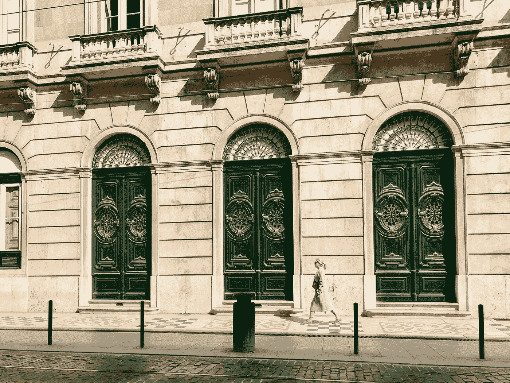

# 解码蒙蒂·霍尔问题

> 原文：<https://medium.com/analytics-vidhya/decoding-the-monty-hall-problem-f2b604083393?source=collection_archive---------23----------------------->

## 以及为什么这对统计学家来说是一种享受。

爱丽丝·布滕科在 [Unsplash](https://unsplash.com?utm_source=medium&utm_medium=referral) 上拍摄的照片

# **问题陈述**

这个问题出现在 60 年代的一个流行游戏节目中，该节目由蒙蒂·霍尔主持，名为“*让我们做个交易*”，因此得名。

游戏很简单，但最后有了一个转折:

1.  有三个门。一扇门后放一个有价值的奖励(一般是一辆车)，其余两扇门后放一只山羊。
2.  参赛者可以**选择一扇门**。
3.  然后蒙蒂会**打开**剩下的两扇门中的一扇门，里面总会露出一只山羊(*蒙蒂知道哪扇门后面有什么*)。
4.  接下来是*转折，*蒙蒂会问参与者是否愿意**将**切换到另一扇关闭的门。

如果参赛者选对了门，他们将获得奖励。那么，参与者现在应该做什么？用第一个选择还是换到另一个关闭的门？

> ***答案是肯定的！参与者应该转换。***

现在，让我解释一下为什么？

# 理由

让我们根据我们掌握的信息量来解决这个问题:

## **初始情况**:

三扇门。一辆车后面是珍贵的财产，另外两辆车后面是山羊，假设一个正常人想要这辆车:)

参赛者选择后面有车的门的概率(可自圆其说): **1/3**

> *这样，最初参赛者有 1/3***的机会选择正确的门。**

## *扭转后:*

*为了更好地理解它，让我们稍微修改一下规则，以演示与之前完全相同的情况:*

1.  *有三个门。一扇门后放一个有价值的奖励(一般是一辆车)，其余两扇门后放一只山羊。*
2.  *参赛者可以**选择一扇门**。*
3.  *然后蒙蒂**不是打开剩余两扇门中的一扇门**，而是询问参与者是否愿意**放弃他们没有选择的剩余两扇门**的初始选择(获得正确门的机会变成 **2/3** )。*
4.  *然后他打开其中一扇门，露出一只山羊。*

*我敢打赌你现在一定明白了什么。如果没有，那就跟着做。*

> *有趣的是，在这两种情况下(改革规则之前和之后)，蒙蒂·霍尔都在做与规则完全相同的事情。*

*这样想吧，在任何情况下，为了另外两扇门而放弃一扇门总是合理的，对吧，因为这增加了获胜的几率。而每一次，你选择的两扇门后，都会有一只山羊。这就是蒙蒂·霍尔打开其中一扇门时向你展示的。*

> *所以，从本质上来说，他向你展示在其中一扇门后有一只山羊，并不会缩小你获胜的机会。如果你换了，获胜的机会仍然是 **2/3** *。**

*现在必须非常清楚，为什么在最初的情况下，在蒙蒂给你看了那扇关着一只山羊的门之后，你必须总是切换。*

> *原因是，现在你可以选择两扇门而不是一扇门。*

*自己玩游戏验证:【https://www.mathwarehouse.com/monty-hall-simulation-online/】T4*

*你会注意到，当你选择转换时，你赢的几率更大，在玩了一段时间后，如果你转换，赢的几率会集中在 67% **(2/3 的几率)**左右，而如果你不转换，赢的几率会集中在 33% **(1/3 的几率)**。*

***喜欢这篇文章？**分享一下，为之鼓掌，关注我更多分析这类耐人寻味的问题。*

***想多读书？查看我以前的一些文章。***

* [## 使用 Python 装饰器的有用技巧

### 当我开始学习 python 的时候，我曾经对每一个新的概念，或者黑客，或者你知道的方式感到兴奋…

medium.com](/analytics-vidhya/useful-tips-for-using-python-decorators-fb0d6daec7c9)*