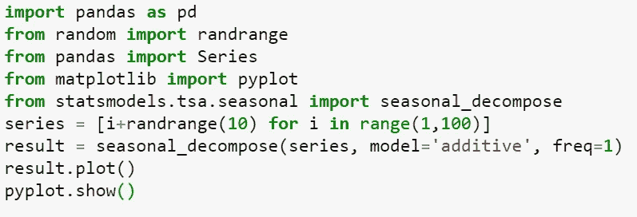
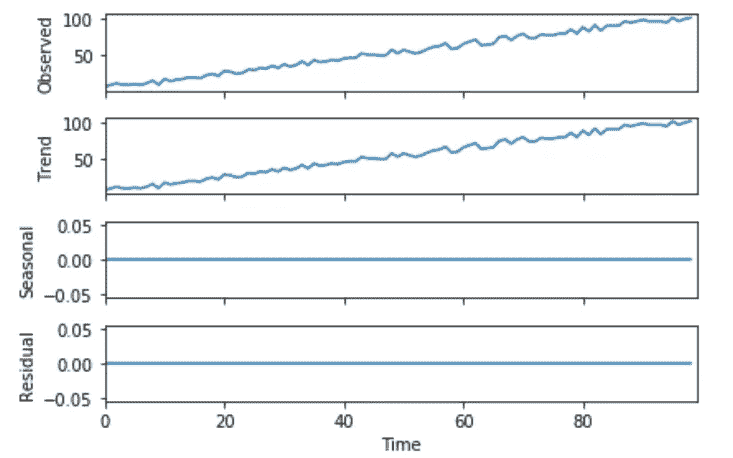
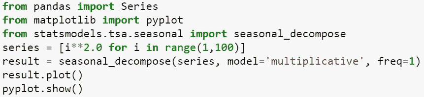
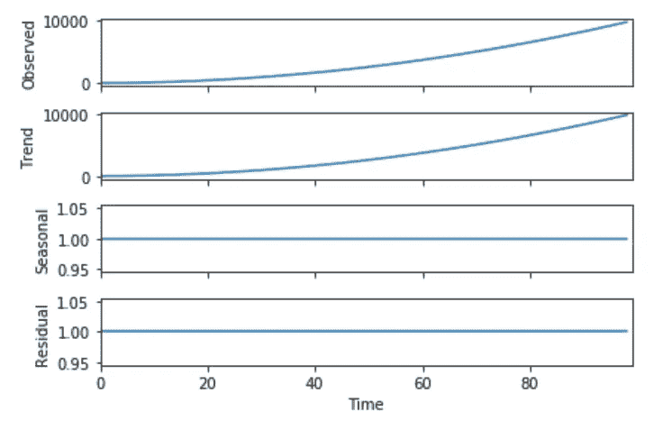
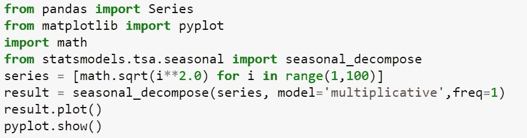
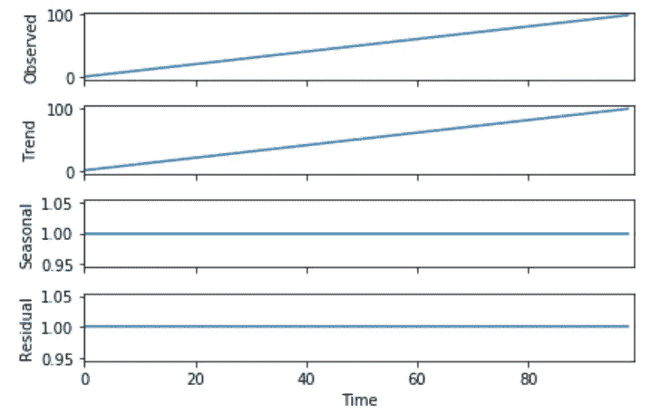
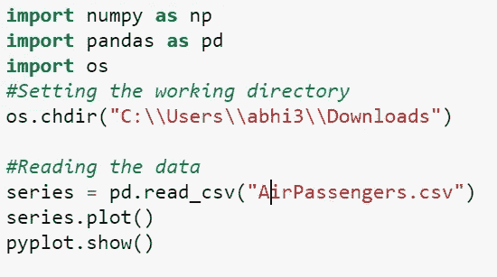
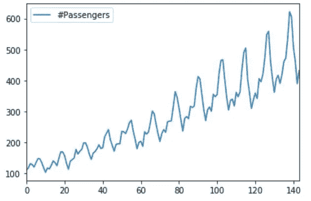
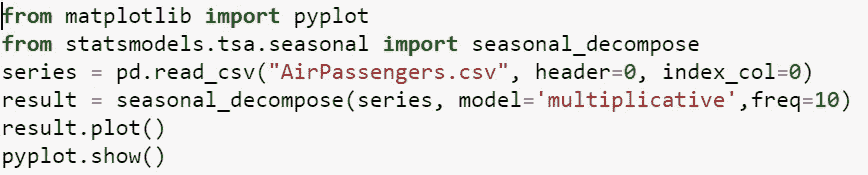
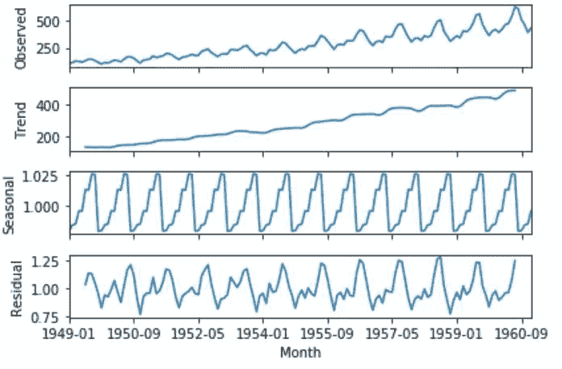

# 时间序列数据的分解

> 原文：<https://medium.com/analytics-vidhya/decomposition-in-time-series-data-b20764946d63?source=collection_archive---------4----------------------->

**时间序列数据的分解**

由[斯蒂芬·道森](https://unsplash.com/@srd844?utm_source=medium&utm_medium=referral)在 [Unsplash](https://unsplash.com?utm_source=medium&utm_medium=referral) 上拍摄的照片

分解是一项统计任务，将时间序列数据分解成几个部分，或从序列数据中提取季节性、趋势性。这些组件定义如下:

*   级别:系列中的平均值。
*   趋势:系列中增加或减少的值。
*   季节性:系列中重复的短期周期。
*   噪声:序列中的随机变化。

时间序列数据是这些成分的组合。所有系列都有电平和噪声。趋势和季节性组件是可选的。

在时间序列数据中，这些组成部分要么相加，要么相乘。

**添加型号:**

可加模型是指数据的方差在时间序列的不同值上保持不变的模型。系统成分是预测因子个体效应的算术和。

加法模型是线性的，这里的趋势线是一条直线，季节性具有相同的频率和幅度(分别是周期的高度和宽度)。

𝒴(𝑡)=𝑆t +𝑇 t + Rt

其中𝑆t =季节性成分，

𝑇t =趋势周期成分和

Rt =剩余部分

**乘法模型:**

乘法模型是这样一种模型，随着数据的增加，季节性模式或方差也会增加。这里，趋势和季节分量相乘，然后加到误差分量上。

乘法模型是非线性的，例如二次或指数，趋势是曲线，季节性随着时间的推移具有增加或减少的频率和幅度。

𝒴(𝑡)=𝑆t x 𝑇t x Rt

**经典分解**

分解用于时间序列分析。其结果可用于根据问题通知预测模型。它向我们简要介绍了模型复杂性方面的预测问题，以及如何最好地捕捉模型中的这些组件。

时间序列数据可以具有乘法或加法成分。可以是先上升后下降趋势，或者可以是具有重复季节性成分的非重复周期。

分解有助于我们更好地分析数据和探索解决问题的不同方法。

Python 提供了 statsmodels 库，可以帮助将一系列数据分解成组件。使用的函数是 seasonal_decompose()。该功能要求将模型指定为“加法”或“乘法”。

该函数的输出是存储在数组中的趋势和季节序列。残差是从数据中去除趋势和季节成分后的值。此外，原始的观察数据被存储。

**添加剂分解**

让我们使用函数 seasonal_decompose()来看看加法分解是如何工作的。

让我们用一些随机噪声生成 1 到 100 之间的数字。这一系列包括线性增长的趋势。应用加法分解后获得的结果是:

从绘制的图表中我们可以看到，整个系列被视为系列，没有季节性。

正如我们所见，也没有残差，这意味着分解无法将我们添加到序列中的噪声与线性趋势分开。它使用经典或简单的方法进行分解。

因为简单分解是一种简单的方法，所以有更高级的分解可用，例如使用黄土(STL)分解的季节和趋势分解。

**乘法分解**

让我们使用函数 seasonal _ decompose()来看看乘法分解是如何工作的。

让我们用一些随机噪声生成 1 到 100 之间的时间平方。应用乘法分解后获得的结果是:

从图表中我们可以看出，趋势线是二次曲线。指数变化可以通过数据转换转化为线性变化。

让我们来看看数据转换后图表是如何变化的:

从上图可以看出，通过对数据进行平方根运算，图形是如何从二次型变为线性型的。

时间序列数据集的分解

*数据集描述:*

数据集:航空乘客数据集

行数 X 列数= 144 X 2

列:月份、乘客数量

我们可以看到图表也有季节性和趋势性。分解它可以让我们清楚地了解这个系列中的所有组件。

让我们使用乘法分解，看看结果图。

从图中我们可以清楚地看到，即使残差在早些年和晚些年表现出很高的方差，但该序列的趋势和季节性也有一定的模式。

**席位分解**

这里的“SEATS”代表“ARIMA 时间序列中的季节性抽取”。这里的系列数据要么是季度的，要么是月度的。

**座位优势**

*   基于模型的
*   平滑趋势估计
*   允许在终点进行估计
*   允许改变季节性
*   为经济数据开发

**STL 分解**

这里“STL”代表“使用黄土的季节和趋势分解”。它是用于分解的更健壮和通用的方法。黄土是一种估计非线性关系的方法。

**STL 的优势**

*   可以应对任何类型的季节性
*   季节性成分允许随时间变化，变化率由用户控制。
*   趋势周期的平滑度也由用户控制。
*   对非交易日或日历调整的异常值稳健。
*   只有添加剂。
*   取对数得到乘法分解。
*   使用 Box-Cox 变换获得其他分解。

**分解预测**

我们分别预测季节性成分和季节性调整成分(趋势和残差),以预测分解后的序列数据。

假设季节性成分随时间变化非常缓慢或不变，因此可以采用估计成分的去年数据进行预测。

简而言之，我们用简单的方法计算季节性因素。

任何非季节性预测方法，如带漂移模型的随机游走或霍尔特方法或非季节性 ARIMA 方法，都可以用于预测季节性调整成分。

**总结**

从上面，我们了解到:

*   为什么时间序列数据的分解很重要。
*   分解时间序列数据的各种方法。
*   如何通过分解来预测时间序列数据？

*在班加罗尔 Praxis 商学院从事学术工作。