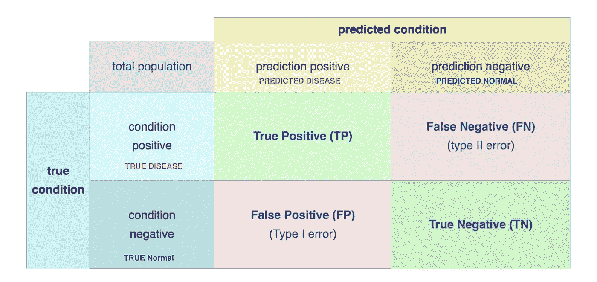

# 去融合混淆矩阵

> 原文：<https://medium.com/analytics-vidhya/deconfusing-the-confusion-matrix-81dba9679981?source=collection_archive---------27----------------------->

混淆矩阵是一种查看不同分类指标的方法，如准确度、精确度、召回率等。我将首先尝试解释混淆矩阵，然后我们将学习灵敏度、特异性、准确性和其他模型评估指标。

在分类问题测试后，我们得到两类结果:

真实条件

预测条件。

例如，如果我们有机器学习的疾病诊断测试。所以机器学习模型会分两节课进行预测。

我们来做如下定义:

*   “病”是一个**阳性类**。
*   “正常”是一个**负类**

我们可以使用一个 2x2 混淆矩阵来总结我们的“疾病预测”模型，该矩阵描述了所有四种可能的结果:

在这种情况下，混淆矩阵将会是这样的。

一个**真阳性(TP)** —当模型正确*预测*阳性类(有疾病)。

A **真阴性** **(TN)** —当模型*正确*预测到*阴性*类时(无疾病-正常)。

一个**假阳性** **(FP)** —当模型*错误地*预测到*阳性*类别时。它也被称为 l 型误差。

一个**假阴性(FN)** —当模型*错误地*预测了*阴性*类别。它也被称为 ll 型误差。

**评估指标**

1.  **精度**

它可以用正确预测的观测值与观测值总数的比率来衡量。

准确度=正确预测的样本/样本总数

例如，如果我们有 10 组测试样本，其中有疾病(2 例)和正常(8 例)。

绿色表示正常(无疾病)，红色表示阳性(有疾病)。在这种情况下，模型 1 和模型 2 都具有相同的准确性，如下所示，因为正确预测的样本(TP+TN)在两个模型中是相同的。

准确度=正确预测的样本/样本总数

=TP + TN/(TP+FP+TN+FN)

=8/10=0.8

我们可以感觉到模型 2 可能比模型 1 更有用，因为它至少试图区分健康和疾病患者。

因此，我们不应该总是假设高精度的模型是最好的。准确性是一个很好的衡量标准，但只有当您拥有对称的数据集，并且假阳性和假阴性的值几乎相同时才是如此。因此，如果您有不对称数据集，我们应该查看其他参数来评估我们模型的性能。

**2。灵敏度(检测概率)**

也称为回忆或真阳性率(TPR)。它是正确预测的阳性观察值与真实阳性类别中所有观察值的比率。对于疾病预测模型，我们可以定义它，如果病人患有疾病，模型预测阳性的概率是多少。

灵敏度=σ真阳性/σ条件阳性

=TP/TP+FN

**3。精度**

也称为阳性预测值(PPV)。它由正确预测的正观测值与总预测正观测值的比率来描述。这个指标回答的问题是，如果模型预测是肯定的，那么患者患病的概率是多少。

精度=σ真阳性/σ预测阳性

=TP/ TP+ FP

**4。F1 得分**

F1 分数是精确度和召回率的调和平均值。如果你有一个不均匀的类分布，F1 通常比准确性更有帮助。

F1 得分= 2 *召回率*精确度/(召回率+精确度)

**5。特异性**

该指标回答了“如果患者正常，模型预测为阴性的概率是多少”这一问题。它也被称为选择性或真正的负利率(TNR)。

特异性=σ真阴性/σ条件阴性

**参考文献:**

1.  [https://blog . ex silio . com/all/accuracy-precision-recall-f1-score-interpretation-of-performance-measures/](https://blog.exsilio.com/all/accuracy-precision-recall-f1-score-interpretation-of-performance-measures/)
2.  [https://www.coursera.org/learn/ai-for-medical-diagnosis](https://www.coursera.org/learn/ai-for-medical-diagnosis/lecture/z4U4m/accuracy-in-terms-of-conditional-probability)
3.  [https://en.wikipedia.org/wiki/F1_score](https://en.wikipedia.org/wiki/F1_score)