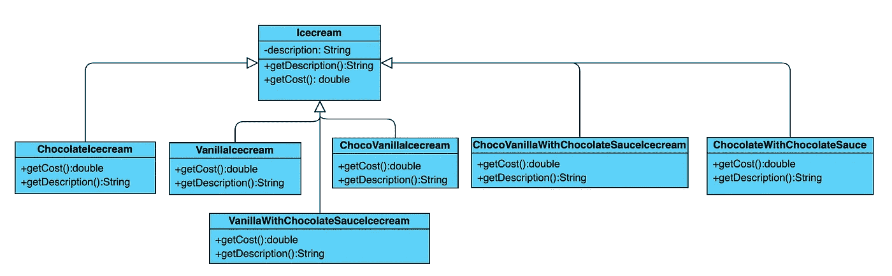
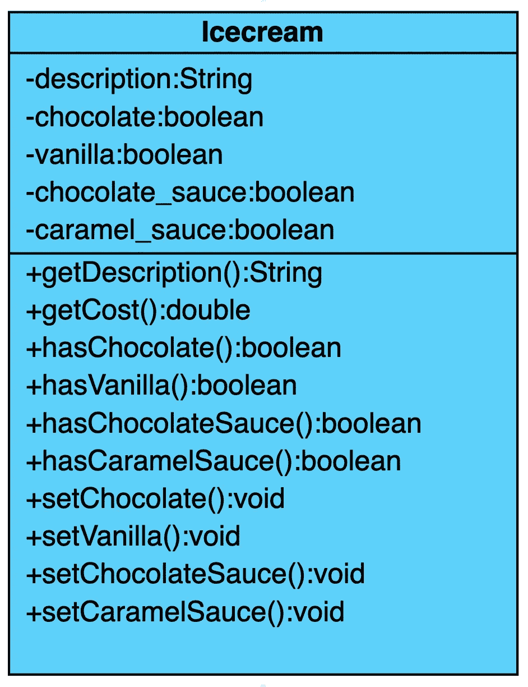
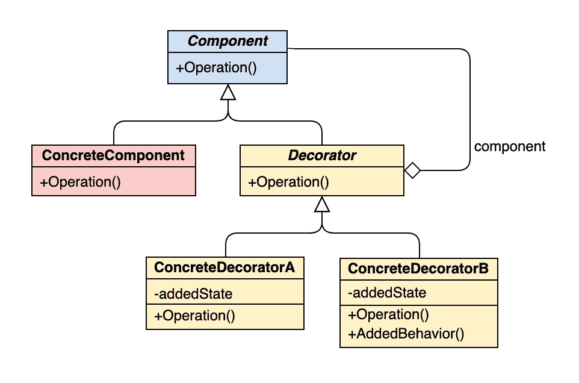
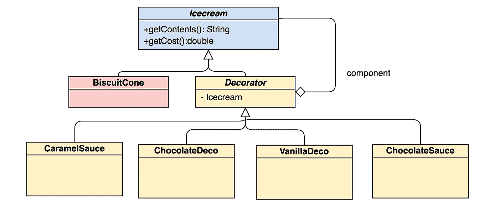
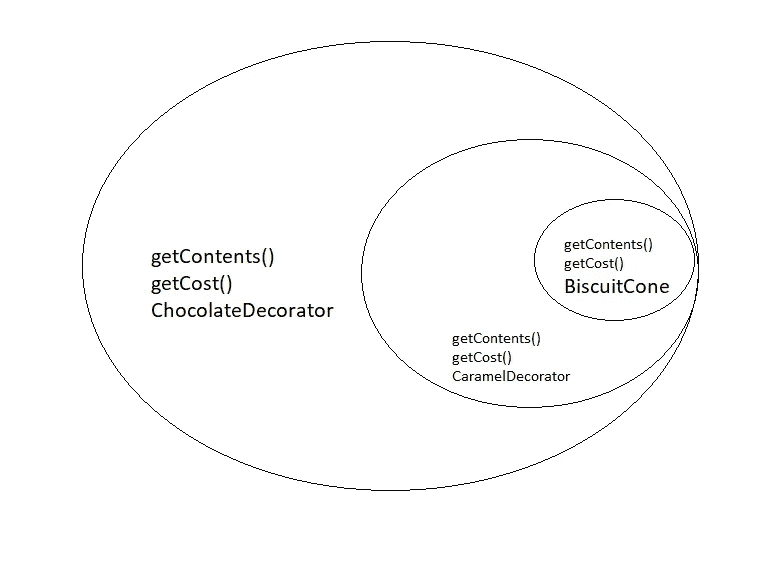

# 装饰设计模式——miraf

> 原文：<https://medium.com/analytics-vidhya/decorator-design-pattern-miraf-d978735df38c?source=collection_archive---------13----------------------->

装饰者设计模式的目标是实现这样的原则:
*【开放用于扩展，封闭用于修改】*

因为在软件开发领域，我们唯一确定的和唯一不变的是“变化”，一个好的设计模式应该可以扩展。但是当新的需求出现时，我们不应该不修改已经实现的类，因为我们已经花了很多时间来纠正它的代码。我们需要在不修改已经实现的类的情况下改变行为(或者扩展它们)。

正如我们所知，有一种方法可以扩展一个类的功能，这就是继承。但是继承并不总是解决问题的答案，也不是解决问题的有效方法。

*让我们开始思考一个问题来知道“为什么？”以及“怎么做？”*

假设你开了一家自己的冰激凌店，你打算卖不同口味和配料的冰激凌。首先，你有圆锥。然后有许多口味的冰淇淋可供选择:巧克力、香草、芒果等。你可以吃混合口味的冰淇淋。

## 尝试 1:

实现这一点的一种方法是为巧克力冰淇淋、香草冰淇淋、巧克力和香草冰淇淋、巧克力冰淇淋和巧克力酱等创建类..



Icecream 类是一个抽象类，包含抽象方法。

这些方法在子类中实现和定义

每种成本()方法计算冰淇淋的成本+每种配料的成本。

我们很容易看到，当我们将有很多成分时，我们会遇到“班级爆炸”，因为我们将有大量的班级！

假设巧克力的价格发生了变化，在这种情况下，你必须去上每一堂有巧克力味道的课并改变价格。
或者想象一下，你的餐厅决定创造一种新口味，因此我们必须实现所有口味的组合。

## 尝试 2:

你能想到的另一个实现选择是创建一个名为“Icecream”的抽象类，但是你在其中放入每种配料的“实例变量”,就像这样:



```
public class Icecream {
    // declare instance vars for ingredients as well getters and setters

    public double cost(){
        double c=2;
        if(hasChocolate()){
            c+=5;
        }
        if(hasVanilla()){
            c+=5;
        }
        if(hasChocolateSauce()){
            c+=3;
        }
        if(hasCaramelSauce()){
            c+=3;
        }
        return c;
    }
}
```

可能会出现一些问题和需求变化，并影响设计:

***如果一种成分的价格发生变化怎么办？***
我们将被迫修改现有代码

***添加了新的成分怎么办？*** 我们将被迫添加新方法和改变成本()方法

假设你想在你的餐厅增加一种新的食物，比如同样口味的蛋糕？
…..

***如果顾客想要双份巧克力酱怎么办？*** *…..*

## 继承 vs 组合

上面的例子表明，继承可能既不“可维护”，也不“灵活”。行为和子类是在编译时静态设置的，它们都继承了相同的行为。
组合帮助我们继承行为，并在运行时动态扩展它们。

这里是如何！

# 装饰模式来了。

在装饰模式中:
1-任何“可选地添加”在冰淇淋蛋筒上的东西，都被称为“装饰者”。
2-这里的圆锥体将是“装饰”对象。



从 https://online.visual-paradigm.com[获得的装饰设计模式通用类图](https://online.visual-paradigm.com)

我们将修改上面的类图来解决我们的问题，因此我们将有:



使用装饰模式的冰淇淋问题的类图

当然,“Decorator”类从 Icecream 接口继承方法，Decorator 从“Decorator”类继承“Icecream”实例变量。

一些重要注意事项:

*   每个装饰者都有一个组件。
*   每个组件都实现相同的接口或抽象类(在这种情况下不会有很大的不同，只是一种设计选择)。

BiscuitCone 类如下所示:

```
public class BiscuitCone implements IcecreamInterface {private String Contents;
    private double Cost;public BiscuitCone() {
        this.Contents = "Simple Cone";
        this.Cost = 1;
    }[@Override](http://twitter.com/Override)
    public String getContents() {
        return Contents;
    }[@Override](http://twitter.com/Override)
    public double getCost() {
        return Cost;
    }
}
```

界面 IceCreamI:

```
public interface IcecreamInterface {public double getCost();public String getContents();
}
```

装饰超类:

```
public abstract class Decorator implements IcecreamInterface {IcecreamInterface I;public Decorator(IcecreamInterface I) {
        this.I = I;
    }}
```

Chocolate Decorator:
注意:因为“Decorator”类实现了 IcecreamInterface，所以 Chocolate Decorator 不需要显式地实现它。

```
public class ChocolateDeco extends Decorator {public ChocolateDeco(IcecreamInterface I) {
        super(I);
    }[@Override](http://twitter.com/Override)
    public double getCost() {
        return I.getCost() + 2;
    }[@Override](http://twitter.com/Override)
    public String getContents() {
        return I.getContents()+", Chocolate";
    }}
```

焦糖装饰课:

```
public class CaramelDeco extends Decorator {public CaramelDeco(IcecreamInterface I) {
        super(I);
    }[@Override](http://twitter.com/Override)
    public double getCost() {
        return I.getCost() + 4;
    }[@Override](http://twitter.com/Override)
    public String getContents() {
        return I.getContents() + ", Caramel";
    }}
```

我们为另外两个装饰者做同样的事情。

## 现在，奇迹发生了😄

```
public class Decorator_icecream {public static void main(String[] args) {
        IcecreamInterface II = new BiscuitCone();
        II = new CaramelDeco(II);
        II = new ChocolateDeco(II);
        System.out.println(II.getContents());}}
```

下面是所发生的事情，BiscuitCone 的一个实例被创建，然后用 CaramelDecorator 修饰，再用 ChocolateDecorator 修饰。



当创建 II.getContents()时，它首先调用 ChocolateDecorator 类的 getContents()方法(作为 II ChocolateDecorator 类的一个实例)。
在 CaramelDecorator 类内部 getContents 的实现中，调用了它通过构造函数得到的 IcecreamInterface 的引用的 getContents()方法，这个构造函数是 CaramelDecorator 类的一个对象。

**这里的输出将是:**

```
*Simple Cone, Caramel, Chocolate*
```

## 参考资料:

[](https://refactoring.guru/design-patterns/decorator) [## 装饰者

### Decorator 是一种结构设计模式，它允许您通过将这些对象放入…

重构大师](https://refactoring.guru/design-patterns/decorator) [](https://dzone.com/articles/decorator-design-pattern-in-java) [## Java 中的装饰设计模式——DZone Java

### 今天，我将讨论一种广为人知且经常使用的模式，称为装饰设计模式。的…

dzone.com](https://dzone.com/articles/decorator-design-pattern-in-java) [](https://www.oreilly.com/library/view/head-first-design/0596007124/) [## 头先设计模式

### 设计模式有什么特别之处？在任何给定的时刻，都有人在为同样的软件设计问题而挣扎…

www.oreilly.com](https://www.oreilly.com/library/view/head-first-design/0596007124/) 

*原载于 2020 年 4 月 2 日 https://mirafblog.com*[](https://mirafblog.com/decorator-design-pattern/)**。**