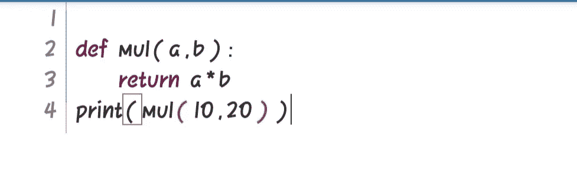
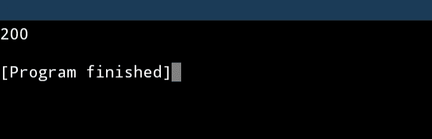
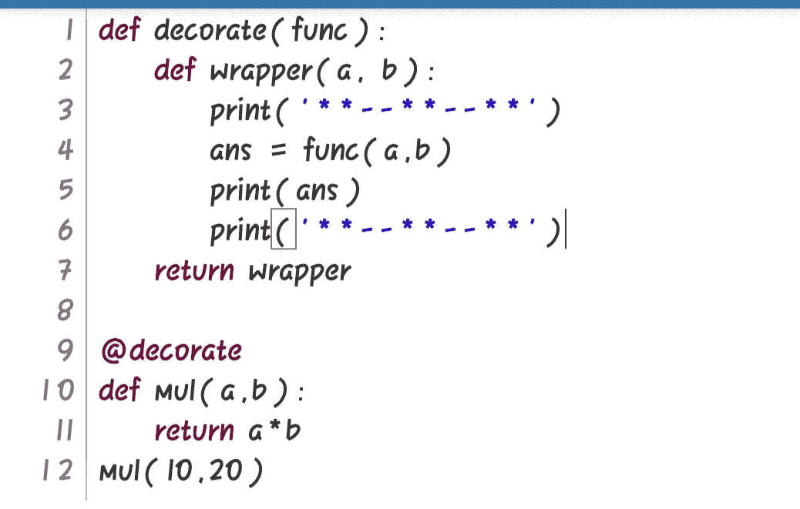
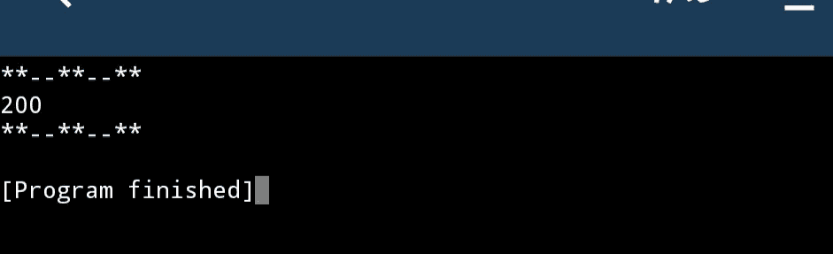
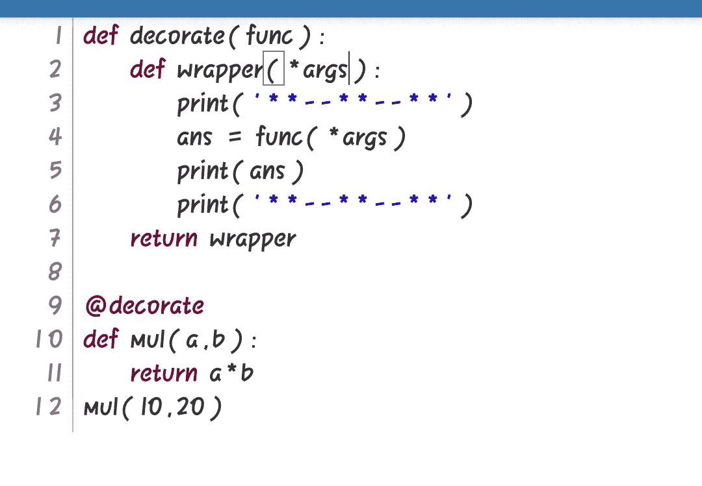

# Python 中的装饰者

> 原文：<https://medium.com/analytics-vidhya/decorators-in-python-33af58b3be32?source=collection_archive---------21----------------------->

如果你正在学习 python 或者你已经完成了 python 的基础，你一定在考虑学习“装饰”。大多数 python 程序员觉得这很难理解，对我来说这也是一个很难理解的概念。

在理解 decorator 的概念之前，让我们先了解一下 python 中 decorator 的威力。

*   Decorators 允许我们根据自己的需要修改函数，而不用永久地修改它。
*   更简单地说，decorators 允许我们在调用函数之前和之后进行修改。

> 为了学习装饰，你必须理解以下两个概念。

## 1.函数是对象，它们可以赋给变量，传递给其他函数，也可以从其他函数返回。

## 2.函数可以在其他函数中定义，子函数可以捕获父函数的本地状态(词法闭包)。

现在我们来了解一下装修工。

基本上，decorators 将 callable 作为一个参数，做一些修改并返回另一个 callable。

Callable 是实现特殊方法 __call__()的任何对象

> 具有双下划线的方法，如 __call__()也称为 dunders。

让我们实现装饰器。

下面，函数 mul 是一个普通的函数，它返回两个数的乘积。

让我们在装饰者的帮助下做一些改变。

在上面的例子中，函数“装饰”是一个装饰器。它接受 func 函数作为参数。

每个装饰者都应该有包装功能。我们可以给包装函数取任何名字。在上面的例子中,‘wrapper’是包装函数。

在包装函数内部，我们做所有的修改。正如你在上面的例子中看到的，我们在调用函数之前和之后只添加了两个 print()语句。

除非我们调用包装函数，否则我们所做的任何更改都不会实现。为了调用包装函数，我们使用 return 语句。

现在，我们装饰人员可以使用了。

要对函数应用 decorator，我们必须使用@ decorator_name。您可以在上面程序的第 9 行看到这一点。

@符号只是一个句法糖。实际上，我们如下调用 decorator:

> 装饰(mul(a，b))

现在让我们看看输出:

敏锐的观察者一定注意到了装饰器中包装函数的参数和它所装饰的函数的参数是一样的。

为了克服这个限制并使装饰器更通用，可以处理任意数量参数，我们可以使用，

> 函数(*args，**kwargs)

关键要点:

> 1.装饰者接受 function 作为参数，并返回另一个函数。
> 
> 2.Decorator 必须有包装函数，并且应该返回它。
> 
> 3.修改应该在包装函数内部完成。
> 
> 4.要将 decorator 应用于函数，请在定义函数之前使用@ with decorator name。

快乐的蟒蛇。