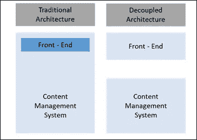
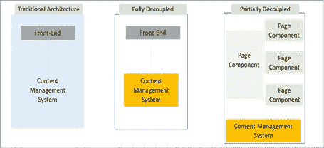

# 解耦 Drupal 作为解决方案

> 原文：<https://medium.com/analytics-vidhya/decoupled-drupal-as-a-solution-bd0ec25f39cf?source=collection_archive---------34----------------------->

今天的驱动力是创新而不是定制。有很多数字趋势比其他趋势传播得更快，其中 Drupal 的分离架构现在已经成为新的流行词。如今，网站必须更具动态性和互动性。因此，迁移到解耦架构可能对企业非常有益。

这些年来，内容表示层(网页)已经发生了很大的变化和发展。内容作者的工作不仅仅是创建吸引人的内容，还要确保它可以在不同的渠道获得，当然，还要让它完全用户友好。

虽然分离架构消除了许多与传统 Drupal 架构相关的问题，但每个企业都有必要分析其网站的核心目的，将其映射到当前的架构，并确定需要实现的未来数字和 it 目标。这有助于有意识地识别要分离的场景。

架构解耦的主要目的围绕着这样一个事实，即前端开发人员将拥有完全控制应用程序的能力。(即)不同的内容层可以用完全不可知的表示层单独管理。前端呈现层和后端 CMS 通过 API 连接，因为一些前端组件是由 Drupal 之外的系统呈现的。

**Drupal 以两种方式提供解耦:**

在分析和理解一个网站的需求(开发者和编辑)之后，最合适的架构就可以实现了。一家拥有大量内容网站的全球 CPG 巨头最近完成了品牌重塑计划，希望重新构建其当前的生态系统，以支持无缝内容更新和第三方集成。Ameex 建议，对于希望轻松创建/更新内容以及提供动态用户体验的企业来说，渐进分离架构是一种令人信服的方法。这将提高整体性能和上市时间。多亏了 Drupal 核心中提供的基于拖放面板的模型，团队喜欢在简化的工作流程中工作，公司的投资回报率也显著提高。

另一家制造企业希望改造其当前的生态系统，使其更加动态和用户友好，为未来的数字化转型奠定坚实的基础。他们想要现代化 web 应用程序的简洁感觉。他们目前的网站有很多静态内容和非常少的内容工作流程。他们还需要大量的前端支持(管理表示层的支持),因此，Ameex 建议他们继续采用完全解耦的架构方法，这将有助于他们使自己的网站更加动态，并轻松处理前端。这种方法确实有助于提高网站参与度，缩短上市时间，并为无缝的未来数字增强铺平了道路。

1.逐步解耦

2.完全去耦

去耦架构的类型

**逐步解耦:**

两全其美；渐进分离允许同时使用 Drupal 的渲染系统和 JavaScript 框架，如 Angular 和 React，以提供丰富的用户体验。JavaScript 用于通过单独呈现各种块组件来提供高度交互式的用户体验。这创造了更加动态的用户体验。

这种架构对于内容编辑和开发人员都非常有效，因为 Drupal 的许多核心特性，如内容工作流、站点预览等。保持可用。

**逐步解耦的一些好处包括:**

内容联合:一次编写，随处发布(全渠道用户体验)

层与层之间的分离:(表示层和后端呈现层——给予前端开发人员更多的控制)

以用户为中心的用户体验:交互式 JavaScript 层

保留核心 Drupal 特性

**完全解耦:**

这使得表示层和 CMS 的其他方面完全分离。这对于喜欢完全控制前端系统(即内容如何出现以及出现在哪里)的开发人员来说很有吸引力。但是这种方法的主要缺点是大部分开箱即用的特性，如就地编辑、布局管理等。需要从头开始重建，不能利用 Drupal。主题层的很多重要方面会因为前端的解耦而丢失。

**完全解耦的一些好处包括**:

易于与第三方解决方案集成

无缝互动

高度动态的网站用户体验

**这种架构的一些缺点包括:**

将涉及多个技术堆栈(体系结构中的额外故障点)

安全和输入净化

布局和预览管理

表演

**结论**:

今天的客户，寻找一个高度互动的网站，在瞬间显示结果。解耦架构是基于必须强调客户端渲染的理论而构思的。去耦架构并不适合所有的网站，尽管它有自己的优点和缺点。对许多网站来说，理想的解决方案是适应逐渐分离的架构，因为它结合了两个世界的优点——保留 Drupal 的内容管理功能，而不损害客户端框架。对于业务领导来说，理解分离架构的含义，从而理解反映业务优先级的站点架构是很重要的。