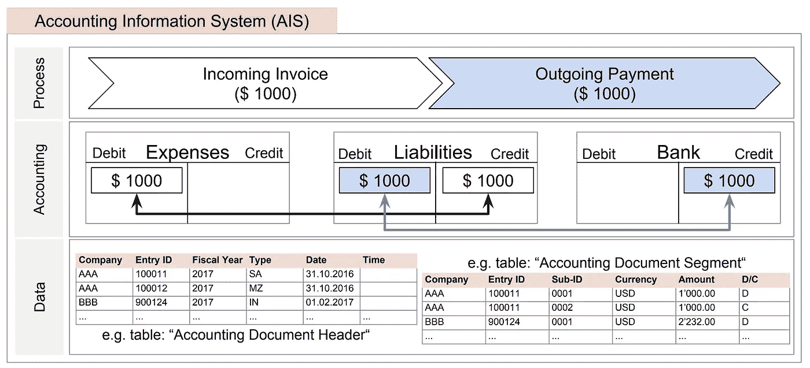
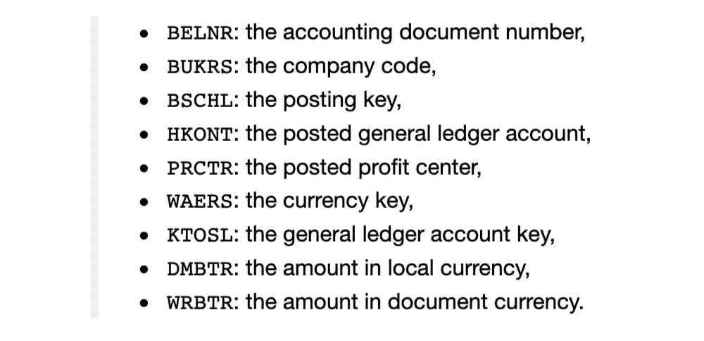
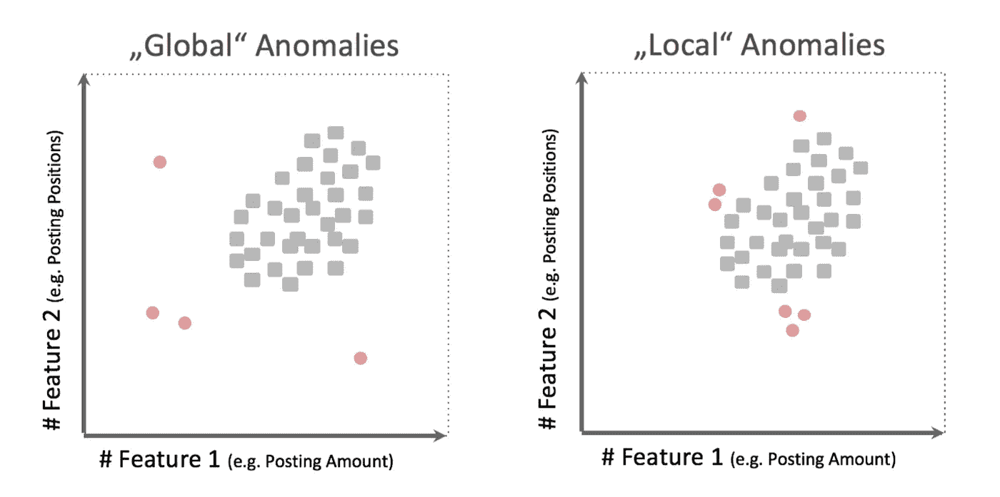
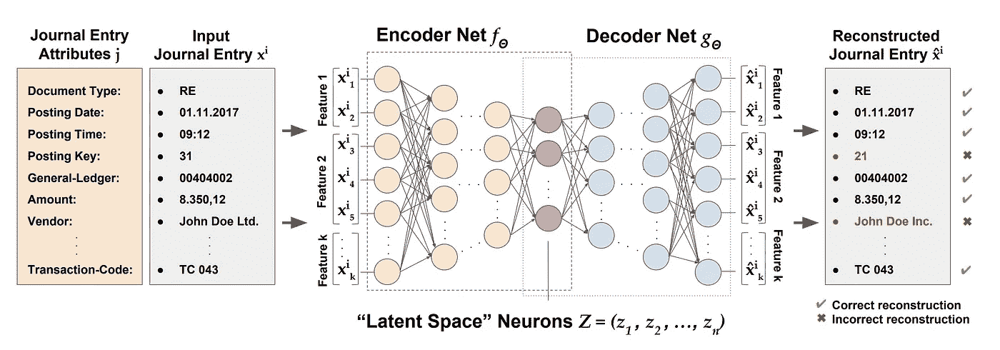
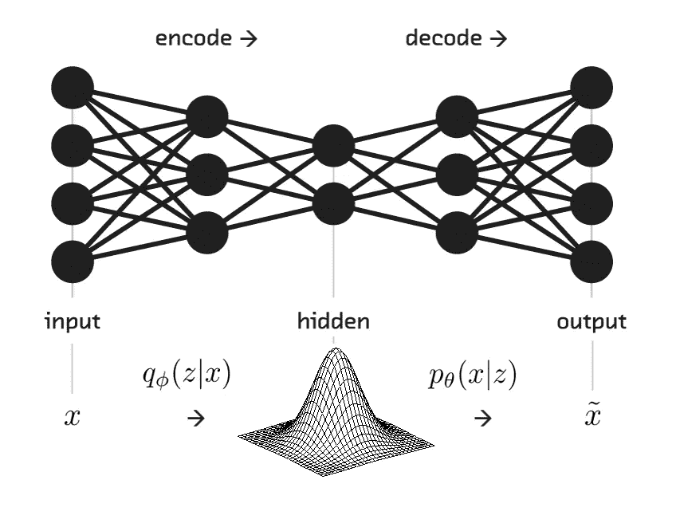
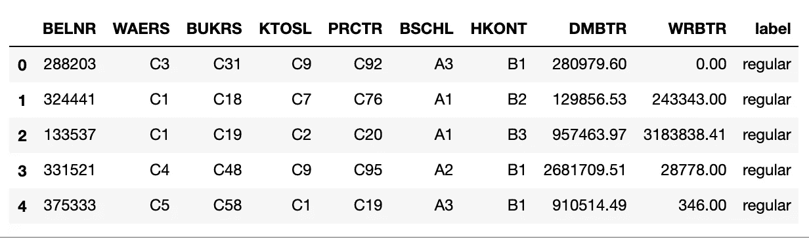
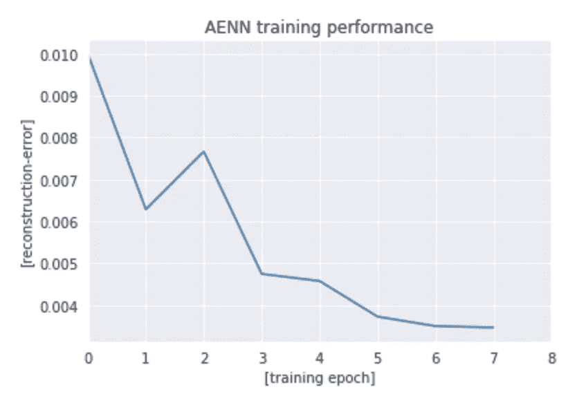
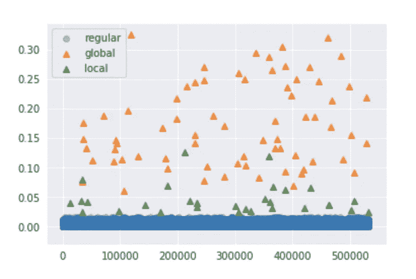

# 大规模企业数据的深度异常检测

> 原文：<https://medium.com/analytics-vidhya/deep-anomaly-detection-9f19896c8b2?source=collection_archive---------0----------------------->


图片来源:lynda.com

## 基于深度学习的自动编码神经网络异常检测

一般来说，[异常检测](https://www.sciencedirect.com/topics/computer-science/anomaly-detection)旨在帮助区分非常罕见和/或偏离正常的事件。这对于金融行业非常重要，就像在个人银行业务中一样，异常可能是至关重要的事情——就像[信用卡欺诈](https://www.sciencedirect.com/science/article/pii/S1877050915007103)。在其他情况下，异常可能是公司寻求利用的东西。其他一些应用包括通信网络入侵、假新闻和误传、医疗保健分析、工业损害检测、制造、安全和监控等。

本文中展示的用例来自 [SAP](https://www.sap.com/index.html) 领域，尤其是金融领域。业务目标是发现金融交易中的异常行为。

在会计信息系统中，一个典型的金融交易会是这样的。



大多数此类条目属于正常交易，但也有相当一部分显示出恶意行为，结果证明是异常行为。每个金融领域中最广泛使用的用例是检测欺诈，异常检测方法可以在需要大量手动工作的情况下大大有助于检测欺诈。

在本文中，我将讲述一种使用 [Autoencoder 神经网络](http://ufldl.stanford.edu/tutorial/unsupervised/Autoencoders/) (AENN)的前沿异常检测方法。这是一种基于深度学习的异常检测方法。

# 嗯，关于数据集

用于这个用例的数据集可以在提供的 GitHub 链接中找到。这是一个由财务数据组成的合成数据集，经过修改后看起来更类似于人们通常在 SAP-ERP 系统(尤其是财务和成本控制模块)中观察到的真实数据集。

数据集包含 FICO BKPF 表(包含已过帐日记帐分录标题)和 BSEG 表(包含已过帐日记帐分录段)中可用的 7 个分类属性和 2 个数值属性。



> 在数据中还可以找到另一个属性“标签”,它解释了事务的真实性质是正常的还是异常的。这是为了验证模型而提供的，不会在培训部分使用。

**异常分类:**

通常，在行业中，异常根据用例以多种方式分类。当对通常记录在大规模 AIS 或 ERP 系统中的真实日志条目进行详细检查时，可以观察到两个普遍的特征:

*   特定交易属性展示**各种不同的属性值**，例如客户信息、过账子分类账、金额信息以及
*   交易显示出特定属性值之间的**强依赖性，例如客户信息和支付类型、过账类型和总账之间的依赖性。**

从这一观察中，可以区分两类异常日志条目，即**【全局】**和**【局部】异常。**



**全局会计异常**是显示不寻常或罕见的单个属性值的日志条目。此类异常通常与扭曲的属性有关，例如很少使用的分类账或不寻常的过账时间。传统上，审计师在年度审计期间进行的“危险信号”测试旨在捕捉这种异常情况。但是，此类测试通常会导致大量误报警报，因为诸如反向过账、准备金和年终调整等事件通常与低欺诈风险相关。此外，在咨询审计师和法务会计师时，“全球性”异常通常是指“错误”而不是“欺诈”。

**本地会计异常**是表现出异常或罕见的属性值组合的日志条目，而它们的属性值经常出现，例如异常会计记录、总账账户的不规则组合、几个会计部门使用的用户账户。这种类型的异常明显更难检测，因为犯罪者试图通过模仿常规的活动模式来掩饰他们的活动。因此，此类异常通常会带来很高的欺诈风险，因为它们对应的流程和活动可能不符合组织标准。

> 先决条件:观众应该熟悉神经元和神经网络在深度学习中如何工作的基本知识。[这里](http://neuralnetworksanddeeplearning.com/)是一个很好的教程，给你一个对神经网络的精确理解。

# 使用自动编码器神经网络的异常检测——理论

自动编码器已经广泛应用于计算机视觉和语音处理。但鲜为人知的事实是，它们也可以用于异常检测。在本节中，我们将介绍自动编码器神经网络的主要元素。



一个典型的自动编码器由两个非线性映射函数组成，称为**编码器** -f(x)和**解码器** -g(x)神经网络。编码器通常遵循神经元减少的漏斗状范例，解码器通常是编码器的对称镜像。存在被称为较低维度的**潜在层**的隐藏中心层，其将是输入数据的压缩丰富表示，足以重构它，将最小化**重构误差**。



使用这种算法范式进行异常检测的思想包括两个主要步骤:学习系统的正常行为(基于过去的数据)和实时检测异常行为(通过处理实时数据)。

由于异常数据集的本质是高度偏向于规则的，网络学习如何重建规则的事务，而对于异常却不能这样做。基于如此高的重构误差，我们可以识别交易是正常的还是异常的。这里我们的损失函数是重建误差本身。

```
Loss function(reconstruction error) = arg **min** || x — g(f(x)) ||
```

在这个用例中，我们使用了由给出的二元交叉熵损失。

```
−(xlog(x’)+(1−x)log(1−x’))
```

x 是输入数据，x '是 g(f(x))。这是测量给定的两个分布有多相似。损失越低，输入及其重建就越相似。

# 履行

> 注意:这里有点技术性，所以我建议所有非技术人员跳过这一部分。你可以经历它，但不要被它吓倒:)

导入必要的库并设置一些参数。

```
# importing utilities
import os
import sys
from datetime import datetime# importing data science libraries
import pandas as pd
import random as rd
import numpy as np# importing pytorch libraries
import torch
from torch import nn
from torch import autograd
from torch.utils.data import DataLoader# import visualization libraries
import matplotlib.pyplot as plt
from mpl_toolkits.mplot3d import Axes3D
import seaborn as sns
from IPython.display import Image, display
sns.set_style('darkgrid')# ignore potential warnings
import warnings
warnings.filterwarnings("ignore")
```

设置随机种子，如果可以的话使用 GPU。

```
rseed = 1234 
rd.seed(rseed)
np.random.seed(rseed)
torch.manual_seed(rseed) 
if (torch.backends.cudnn.version() != None and USE_CUDA == True):
    torch.cuda.manual_seed(rseed)USE_CUDA = True
```

将数据导入熊猫数据框。

```
ad_dataset = pd.read_csv('./data/fraud_dataset_v2.csv')
ad_dataset.head()
```



看形状，标注 value_counts。

```
ad_dataset.shapeOut[#]: (533009, 10)ad_dataset.label.value_counts()
Out[#]: regular    532909
         global         70
         local          30
         Name: label, dtype: int64
```

如您所见，这是一个高度偏向的数据集，对于大多数真实世界的数据来说都是如此。异常占总数据的 0.018%。在这种情况下，任何典型的机器学习算法都不会表现得很好。但是本文中展示的方法是一个巧妙的技巧，可以利用自动编码器来发现异常。

因为 autoencoder 是一种无人监管的技术，所以让我们移除标签以进行进一步处理。

```
label = ad_dataset.pop('label')
```

现在让我们把分类属性和数字属性分开。将一键编码添加到分类属性中以对其进行矢量化。对数值变量应用对数比例和最小-最大比例。

```
categorical_attr = ['KTOSL', 'PRCTR', 'BSCHL', 'HKONT', 'WAERS', 'BUKRS']
ad_dataset_categ_transformed = pd.get_dummies(ad_dataset[categorical_attr])numeric_attr_names = ['DMBTR', 'WRBTR']# add a small epsilon to eliminate zero values from data for log scaling
numeric_attr = ad_dataset[numeric_attr] + 1e-7
numeric_attr = numeric_attr.apply(np.log)ad_dataset_numeric_attr = (numeric_attr - numeric_attr.min()) / (numeric_attr.max() - numeric_attr.min())
```

连接数字和类别属性。

```
ad_subset_transformed = pd.concat([ad_dataset_categ_transformed, ad_dataset_numeric_attr], axis = 1)ad_subset_transformed.shape
Out[#]: (533009, 618)
```

现在我们来实现编码器网络(618–512–256–128–64–32–16–8–4–3)。

```
# implementation of the encoder network
class encoder(nn.Module):def __init__(self):super(encoder, self).__init__()# specify layer 1 - in 618, out 512
        self.encoder_L1 = nn.Linear(in_features=ori_subset_transformed.shape[1], out_features=512, bias=True) # add linearity 
        nn.init.xavier_uniform_(self.encoder_L1.weight) # init weights according to [9]
        self.encoder_R1 = nn.LeakyReLU(negative_slope=0.4, inplace=True) # add non-linearity according to [10]# specify layer 2 - in 512, out 256
        self.encoder_L2 = nn.Linear(512, 256, bias=True)
        nn.init.xavier_uniform_(self.encoder_L2.weight)
        self.encoder_R2 = nn.LeakyReLU(negative_slope=0.4, inplace=True)# specify layer 3 - in 256, out 128
        self.encoder_L3 = nn.Linear(256, 128, bias=True)
        nn.init.xavier_uniform_(self.encoder_L3.weight)
        self.encoder_R3 = nn.LeakyReLU(negative_slope=0.4, inplace=True)# specify layer 4 - in 128, out 64
        self.encoder_L4 = nn.Linear(128, 64, bias=True)
        nn.init.xavier_uniform_(self.encoder_L4.weight)
        self.encoder_R4 = nn.LeakyReLU(negative_slope=0.4, inplace=True)# specify layer 5 - in 64, out 32
        self.encoder_L5 = nn.Linear(64, 32, bias=True)
        nn.init.xavier_uniform_(self.encoder_L5.weight)
        self.encoder_R5 = nn.LeakyReLU(negative_slope=0.4, inplace=True)# specify layer 6 - in 32, out 16
        self.encoder_L6 = nn.Linear(32, 16, bias=True)
        nn.init.xavier_uniform_(self.encoder_L6.weight)
        self.encoder_R6 = nn.LeakyReLU(negative_slope=0.4, inplace=True)# specify layer 7 - in 16, out 8
        self.encoder_L7 = nn.Linear(16, 8, bias=True)
        nn.init.xavier_uniform_(self.encoder_L7.weight)
        self.encoder_R7 = nn.LeakyReLU(negative_slope=0.4, inplace=True)# specify layer 8 - in 8, out 4
        self.encoder_L8 = nn.Linear(8, 4, bias=True)
        nn.init.xavier_uniform_(self.encoder_L8.weight)
        self.encoder_R8 = nn.LeakyReLU(negative_slope=0.4, inplace=True)# specify layer 9 - in 4, out 3
        self.encoder_L9 = nn.Linear(4, 3, bias=True)
        nn.init.xavier_uniform_(self.encoder_L9.weight)
        self.encoder_R9 = nn.LeakyReLU(negative_slope=0.4, inplace=True)# init dropout layer with probability p
        self.dropout = nn.Dropout(p=0.0, inplace=True)

    def forward(self, x):# define forward pass through the network
        x = self.encoder_R1(self.dropout(self.encoder_L1(x)))
        x = self.encoder_R2(self.dropout(self.encoder_L2(x)))
        x = self.encoder_R3(self.dropout(self.encoder_L3(x)))
        x = self.encoder_R4(self.dropout(self.encoder_L4(x)))
        x = self.encoder_R5(self.dropout(self.encoder_L5(x)))
        x = self.encoder_R6(self.dropout(self.encoder_L6(x)))
        x = self.encoder_R7(self.dropout(self.encoder_L7(x)))
        x = self.encoder_R8(self.dropout(self.encoder_L8(x)))
        x = self.encoder_R9(self.encoder_L9(x))return x
```

实例化编码器并放入 on

```
# init training network classes / architectures
encoder_train = encoder()# push to cuda if cudnn is available
if (torch.backends.cudnn.version() != None and USE_CUDA == True):
    encoder_train = encoder().cuda()
```

现在，解码器网络实现是编码器的对称镜像。(3–4–8–16–32–64–128–256–512–618)

```
# implementation of the decoder network
class decoder(nn.Module):def __init__(self):super(decoder, self).__init__()# specify layer 1 - in 3, out 4
        self.decoder_L1 = nn.Linear(in_features=3, out_features=4, bias=True) # add linearity 
        nn.init.xavier_uniform_(self.decoder_L1.weight)  # init weights according to [9]
        self.decoder_R1 = nn.LeakyReLU(negative_slope=0.4, inplace=True) # add non-linearity according to [10]# specify layer 2 - in 4, out 8
        self.decoder_L2 = nn.Linear(4, 8, bias=True)
        nn.init.xavier_uniform_(self.decoder_L2.weight)
        self.decoder_R2 = nn.LeakyReLU(negative_slope=0.4, inplace=True)# specify layer 3 - in 8, out 16
        self.decoder_L3 = nn.Linear(8, 16, bias=True)
        nn.init.xavier_uniform_(self.decoder_L3.weight)
        self.decoder_R3 = nn.LeakyReLU(negative_slope=0.4, inplace=True)# specify layer 4 - in 16, out 32
        self.decoder_L4 = nn.Linear(16, 32, bias=True)
        nn.init.xavier_uniform_(self.decoder_L4.weight)
        self.decoder_R4 = nn.LeakyReLU(negative_slope=0.4, inplace=True)# specify layer 5 - in 32, out 64
        self.decoder_L5 = nn.Linear(32, 64, bias=True)
        nn.init.xavier_uniform_(self.decoder_L5.weight)
        self.decoder_R5 = nn.LeakyReLU(negative_slope=0.4, inplace=True)# specify layer 6 - in 64, out 128
        self.decoder_L6 = nn.Linear(64, 128, bias=True)
        nn.init.xavier_uniform_(self.decoder_L6.weight)
        self.decoder_R6 = nn.LeakyReLU(negative_slope=0.4, inplace=True)

        # specify layer 7 - in 128, out 256
        self.decoder_L7 = nn.Linear(128, 256, bias=True)
        nn.init.xavier_uniform_(self.decoder_L7.weight)
        self.decoder_R7 = nn.LeakyReLU(negative_slope=0.4, inplace=True)# specify layer 8 - in 256, out 512
        self.decoder_L8 = nn.Linear(256, 512, bias=True)
        nn.init.xavier_uniform_(self.decoder_L8.weight)
        self.decoder_R8 = nn.LeakyReLU(negative_slope=0.4, inplace=True)# specify layer 9 - in 512, out 618
        self.decoder_L9 = nn.Linear(in_features=512, out_features=ori_subset_transformed.shape[1], bias=True)
        nn.init.xavier_uniform_(self.decoder_L9.weight)
        self.decoder_R9 = nn.LeakyReLU(negative_slope=0.4, inplace=True)# init dropout layer with probability p
        self.dropout = nn.Dropout(p=0.0, inplace=True)def forward(self, x):# define forward pass through the network
        x = self.decoder_R1(self.dropout(self.decoder_L1(x)))
        x = self.decoder_R2(self.dropout(self.decoder_L2(x)))
        x = self.decoder_R3(self.dropout(self.decoder_L3(x)))
        x = self.decoder_R4(self.dropout(self.decoder_L4(x)))
        x = self.decoder_R5(self.dropout(self.decoder_L5(x)))
        x = self.decoder_R6(self.dropout(self.decoder_L6(x)))
        x = self.decoder_R7(self.dropout(self.decoder_L7(x)))
        x = self.decoder_R8(self.dropout(self.decoder_L8(x)))
        x = self.decoder_R9(self.decoder_L9(x))

        return x
```

实例化解码器，放到 GPU 上。

```
# init training network classes / architectures
decoder_train = decoder()# push to cuda if cudnn is available
if (torch.backends.cudnn.version() != None) and (USE_CUDA == True):
    decoder_train = decoder().cuda()
```

现在设置损失函数和一些超参数。

```
# define the optimization criterion / loss function
loss_function = nn.BCEWithLogitsLoss(reduction='mean')# define learning rate and optimization strategy
learning_rate = 1e-3
encoder_optimizer = torch.optim.Adam(encoder_train.parameters(), lr=learning_rate)
decoder_optimizer = torch.optim.Adam(decoder_train.parameters(), lr=learning_rate)# specify training parameters
num_epochs = 8
mini_batch_size = 128
```

将数据加载到张量和 GPU 上。

```
# convert pre-processed data to pytorch tensor
torch_dataset = torch.from_numpy(ad_subset_transformed.values).float()# convert to pytorch tensor - none cuda enabled
dataloader = DataLoader(torch_dataset, batch_size=mini_batch_size, shuffle=True, num_workers=0)
# note: we set num_workers to zero to retrieve deterministic results# determine if CUDA is available at compute node
if (torch.backends.cudnn.version() != None) and (USE_CUDA == True):
    dataloader = DataLoader(torch_dataset.cuda(), batch_size=mini_batch_size, shuffle=True)
```

现在开始我们的训练。(注意:我建议不要复制粘贴下面的代码，因为格式可能会出错。请从下面提到的 [GitHub 链接](https://github.com/gotorehanahmad/anomaly_detection)获取代码。)

```
# init collection of mini-batch losses
losses = []# convert encoded transactional data to torch Variable
data = autograd.Variable(torch_dataset)# train autoencoder model
for epoch in range(num_epochs):# init mini batch counter
    mini_batch_count = 0

    # determine if CUDA is available at compute node
    if(torch.backends.cudnn.version() != None) and (USE_CUDA == True):

        # set networks / models in GPU mode
        encoder_train.cuda()
        decoder_train.cuda()# set networks in training mode (apply dropout when needed)
    encoder_train.train()
    decoder_train.train()# start timer
    start_time = datetime.now()

    # iterate over all mini-batches
    for mini_batch_data in dataloader:# increase mini batch counter
        mini_batch_count += 1# convert mini batch to torch variable
        mini_batch_torch = autograd.Variable(mini_batch_data)# =================== (1) forward pass ============================# run forward pass
        z_representation = encoder_train(mini_batch_torch) # encode mini-batch data
        mini_batch_reconstruction = decoder_train(z_representation) # decode mini-batch data

        # =================== (2) compute reconstruction loss ======# determine reconstruction loss
        reconstruction_loss = loss_function(mini_batch_reconstruction, mini_batch_torch)

        # =================== (3) backward pass ====================# reset graph gradients
        decoder_optimizer.zero_grad()
        encoder_optimizer.zero_grad()# run backward pass
        reconstruction_loss.backward()

        # =================== (4) update model parameters =========# update network parameters
        decoder_optimizer.step()
        encoder_optimizer.step()# =================== monitor training progress ===================# print training progress each 1'000 mini-batches
        if mini_batch_count % 1000 == 0:

            # print the training mode: either on GPU or CPU
            mode = 'GPU' if (torch.backends.cudnn.version() != None) and (USE_CUDA == True) else 'CPU'

            # print mini batch reconstuction results
            now = datetime.utcnow().strftime("%Y%m%d-%H:%M:%S")
            end_time = datetime.now() - start_time
            print('[LOG {}] training status, epoch: [{:04}/{:04}], batch: {:04}, loss: {}, mode: {}, time required: {}'.format(now, (epoch+1), num_epochs, mini_batch_count, np.round(reconstruction_loss.item(), 4), mode, end_time))# reset timer
            start_time = datetime.now()# =================== evaluate model performance ================

    # set networks in evaluation mode (don't apply dropout)
    encoder_train.cpu().eval()
    decoder_train.cpu().eval()# reconstruct encoded transactional data
    reconstruction = decoder_train(encoder_train(data))

    # determine reconstruction loss - all transactions
    reconstruction_loss_all = loss_function(reconstruction, data)

    # collect reconstruction loss
    losses.extend([reconstruction_loss_all.item()])

    # print reconstuction loss results
    now = datetime.utcnow().strftime("%Y%m%d-%H:%M:%S")
    print('[LOG {}] training status, epoch: [{:04}/{:04}], loss: {:.10f}'.format(now, (epoch+1), num_epochs, reconstruction_loss_all.item()))# =================== save model snapshot to disk ================

    # save trained encoder model file to disk
    encoder_model_name = "ep_{}_encoder_model.pth".format((epoch+1))
    torch.save(encoder_train.state_dict(), os.path.join("./models", encoder_model_name))# save trained decoder model file to disk
    decoder_model_name = "ep_{}_decoder_model.pth".format((epoch+1))
    torch.save(decoder_train.state_dict(), os.path.join("./models", decoder_model_name))
```

绘制损失图。

```
# plot the training progress
plt.plot(range(0, len(losses)), losses)
plt.xlabel('[training epoch]')
plt.xlim([0, len(losses)])
plt.ylabel('[reconstruction-error]')
#plt.ylim([0.0, 1.0])
plt.title('AENN training performance')
```



我们的训练到此结束。现在让我们看看如何利用我们的模型来获得预测。

加载预先训练的模型。

```
# restore pretrained model checkpoint
encoder_model_name = "ep_8_encoder_model.pth"
decoder_model_name = "ep_8_decoder_model.pth"# init training network classes / architectures
encoder_eval = encoder()
decoder_eval = decoder()# load trained models
encoder_eval.load_state_dict(torch.load(os.path.join("models", encoder_model_name)))
decoder_eval.load_state_dict(torch.load(os.path.join("models", decoder_model_name)))
```

对整个数据进行重建。

```
# convert encoded transactional data to torch Variable
data = autograd.Variable(torch_dataset)# set networks in evaluation mode (don't apply dropout)
encoder_eval.eval()
decoder_eval.eval()# reconstruct encoded transactional data
reconstruction = decoder_eval(encoder_eval(data))
```

获得整个数据的重建损失。

```
# determine reconstruction loss - all transactions
reconstruction_loss_all = loss_function(reconstruction, data)
print(reconstruction_loss_all)reconstruction loss: 0.0034663924
```

确定个别交易的重建损失。

```
# init binary cross entropy errors
reconstruction_loss_transaction = np.zeros(reconstruction.size()[0])# iterate over all detailed reconstructions
for i in range(0, reconstruction.size()[0]):# determine reconstruction loss - individual transactions
    reconstruction_loss_transaction[i] = loss_function(reconstruction[i], data[i]).item()
```

根据贴有标签的重建损失绘制数据点。

```
# prepare plot
fig = plt.figure()
ax = fig.add_subplot(111)# assign unique id to transactions
plot_data = np.column_stack((np.arange(len(reconstruction_loss_transaction)), reconstruction_loss_transaction))# obtain regular transactions as well as global and local anomalies
regular_data = plot_data[label == 'regular']
global_outliers = plot_data[label == 'global']
local_outliers = plot_data[label == 'local']# plot reconstruction error scatter plot
ax.scatter(regular_data[:, 0], regular_data[:, 1], c='C0', alpha=0.4, marker="o", label='regular') # plot regular transactions
ax.scatter(global_outliers[:, 0], global_outliers[:, 1], c='C1', marker="^", label='global') # plot global outliers
ax.scatter(local_outliers[:, 0], local_outliers[:, 1], c='C2', marker="^", label='local') # plot local outliers# add plot legend of transaction classes
ax.legend(loc='best')
```



重建错误与交易

该图显示了所选择的方法如何从高度有偏差的数据集中优雅地发现异常。让我们看看有多少异常被发现。

```
ad_dataset['label'] = label
ad_dataset[reconstruction_loss_transaction >= 0.1].label.value_counts()Out[#]: global    59
        local      2
        Name: label, dtype: int64ad_dataset[(reconstruction_loss_transaction >= 0.018) & (reconstruction_loss_transaction < 0.05)].label.value_counts()Out[#]: local   23
        Name: label, dtype: int64
```

如您所见，在 70 个全球项目中，检测到 59 个，占 84%，在 30 个本地项目中，检测到 23 个，占 76.6%。考虑到离群值仅占整个数据的 0.018%，这比任何其他旧技术都要好得多。

这里是用于代码实现的 [Github 链接](https://github.com/gotorehanahmad/anomaly_detection)以及数据集。

我希望这能让您清楚地理解这种方法以及如何实现它。

# 结论

这得出结论，如果设计得好，将深度学习算法应用于经典的结构化数据机器学习问题将会给出有希望的结果。识别正确的算法、适当的损失函数和理想的数据集可以帮助数据科学家利用深度学习，并利用其功能来提高古老方法的性能。本文中提到的用例是关于金融交易的，但深度异常检测的概念可以扩展到其他领域，如制造和营销。

# 参考

[使用深度自动编码器网络检测大规模会计数据中的异常](https://arxiv.org/abs/1709.05254)

[金融领域异常检测技术综述](https://www.researchgate.net/publication/270968895_A_survey_of_anomaly_detection_techniques_in_financial_domain)

[用于异常检测的深度学习:综述](https://arxiv.org/abs/1901.03407)

> *关于我*

我是 [Wavelabs.ai](https://wavelabs.ai/?source=post_page---------------------------) 的资深 AI 专家。我们 Wavelabs 帮助您利用人工智能(AI)来彻底改变用户体验并降低成本。我们使用人工智能独特地增强您的产品，以达到您的全部市场潜力。我们试图将尖端研究引入您的应用中。

欢迎访问 [Wavelabs.ai](https://wavelabs.ai/?source=post_page---------------------------) 了解更多信息。

嗯，这都是在这个职位。感谢阅读:)

保持好奇！

你可以在 [LinkedIn](https://www.linkedin.com/in/rehan-a-18675296?source=post_page---------------------------) 上联系我。