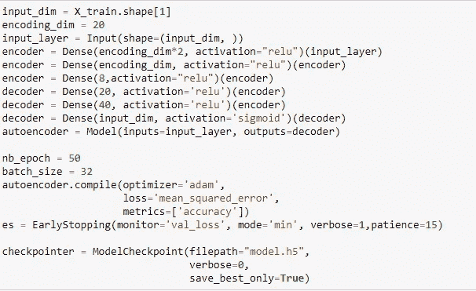

# 深度自动编码器网络:张量流异常检测完全指南

> 原文：<https://medium.com/analytics-vidhya/deep-auto-encoder-network-a-complete-guide-for-anomaly-detection-in-tensorflow-92f025e2c48d?source=collection_archive---------10----------------------->

[图像来源](https://www.researchgate.net/profile/Jeremie_Sublime/publication/333038461/figure/fig3/AS:757767321169921@1557677216019/Basic-architecture-of-a-single-layer-autoencoder-made-of-an-encoder-going-from-the-input.ppm)

想象一下，一个架子上整洁地摆放着几瓶爱尔兰威士忌，你看到那里有一个牛奶瓶:p。啊…这太奇怪了。不是吗？所以奇怪的是，我们称之为异常。

在现实生活中，我们会遇到各种异常场景，其中某些实体偏离了它们应该遵循的实际模式。异常现象的一个重要例子是我们今天要分析的假信用卡交易。在现实生活中，异常检测还有更多的应用实例，如[入侵检测](https://en.wikipedia.org/wiki/Intrusion_detection)、[欺诈检测](https://en.wikipedia.org/wiki/Fraud_detection)、故障检测、系统健康监控、传感器网络中的事件检测以及检测生态系统干扰。

# **数据:**

我们分析的是包含持卡人交易细节的信用卡交易数据。它包含交易是正常交易还是欺诈交易的详细信息，我们可以将这些信息用作模型的依赖数据。数据的来源是 [Kaggle](https://www.kaggle.com/mlg-ulb/data) 。在搬家之前，你们中的许多人一定有一个想法，为什么它不能被归类为一个分类问题？当然，它可能是，但我们将它作为异常情况处理的主要原因是，几乎 82%的交易是正常的，18%的交易偏离了实际的正常交易。由于类之间的分布显然是不对称的，并且一个类几乎占据了大部分数据，因此我们可以将另一个类描述为需要异常检测问题的异常。

# **预处理:**

在将数据输入任何机器学习模型之前，预处理是一个重要的步骤。我们需要理解这些数据。我们要处理多少列？所有的列都包含数值吗？有没有我们需要转换成数值的分类文本值？是否有任何缺失值？在我们继续前进之前，必须考虑所有这些检查。

幸运的是，我们拥有的数据绝对是一组干净的数据。如您所见，根本没有空值。

包括“类别”在内的 31 个字段用于通知交易是正常交易还是欺诈交易。您可以摆弄数据来研究更多相关信息。让我们看看该集合中有多少正常交易和欺诈交易。

它明确表示，超过 80%的数据属于正常类，剩余的 20%是欺诈。我们对数据进行了更深入的研究，将正常交易和欺诈交易分开，并对两个类别的金额字段进行了评估。通过查看细节，你显然不能说是否有一些差异。

# **可视化:**

让我们直观地看看某些字段的值是如何分布的。如果我们考虑像 V4、V7、V9 和 V10 这样的字段，我们可以看到如下分布。

现在，如果我们单独查看正常交易和欺诈交易的 V4 或 V10 字段的分布，我们会发现以下结果。

绿色分布属于正常交易，有一个属于欺诈。在这里，我们可以看到正常交易的 V10 值为-20 比 3，但大多数欺诈交易的 V4 值接近于零。这是一个有趣的发现。不是吗？您可以分析更多字段的详细信息并了解趋势。

# **自动编码器:**

现在让我们了解一下什么是 Autoencoder。

Autoencoder 是一种基于无监督学习技术重建输入值的神经网络架构。简而言之，我们以最小的误差重建给神经网络的输入值 X。下图更好地解释了这一点。

[图片来源](https://www.jeremyjordan.me/autoencoders/)

在 autoencoder 中，我们给出的输入数据基本上是通过架构中的瓶颈压缩的，因为我们在隐藏层中施加了较少数量的神经元。如上图所示，网络将一个未标记的数据作为输入 x，并通过将其构建为一个监督问题来学习输出 X̂原始输入的重构。网络的主要思想是最小化重构误差 **L** (X，X̂)，该误差基本上是原始输入与重构输出之间的差异。

当我们限制隐藏层中的层数时，有限数量的信息可以流过网络，否则，如果我们给定隐藏层中相同数量的神经元，模型将记住输入数据以及网络，而不学习关于输入的重要属性。限制隐层中的神经元将迫使网络通过根据重构误差进行有效惩罚来更新权重。编码器状态(如上图所示)实际上有助于网络理解输入数据的基本模式，并在稍后的解码器层学习如何从压缩的细节中重建原始数据。

# **如何？**

一个简单的问题。设计用于重建输入值的模型如何用作分类器来检测任何异常，如欺诈交易？

所以答案是，重建误差帮助我们达到同样的效果。如果我们训练一个模型来重建非欺诈性交易，网络会针对非欺诈性交易调整其权重。当欺诈交易的数据被输入到网络时，输出的均方误差(MSE)将相对较高。如果 MSE 高于设定的阈值，那么我们可以很容易地将该输入归类为异常。我希望这有意义。

但是等等…！！！现在这个门槛是什么？我们如何知道一个完美的阈值？

让我们找出答案😊

# **训练和测试的数据准备:**

在将数据输入模型之前，我们采取了简单的三个步骤。

1.用最小-最大缩放器标准化数据

2.保留 90%的非欺诈交易用于培训

3.将 10%的正常交易和整个欺诈交易结合起来，创建我们的验证和测试数据。

# **型号:**

在所有必要的预处理之后，我们最终将创建自动编码器模型。我们已经使用 Tensorflow 2.0 创建了我们的模型。如果你不熟悉 Tensorflow 架构，我建议从 Tensorflow 官方产品开始[ [此处](https://www.tensorflow.org/tutorials/quickstart/beginner) ]。

如果你不精通 TensorFlow，一开始看起来可能有点吓人，但相信我，这不是。我们已经使用均方误差损失函数来计算上面讨论的重建误差。对于我的设计决策，我使用了 ***Relu*** 和 ***Sigmoid*** 作为激活函数。您可以完全自由地为您的模型试验超参数选择。

# **培训:**

经过所有的设置，我们现在准备训练我们的模型。在 50 个时期之后，我们可以看到该模型具有 99%的准确度，并且损失非常小。

# **右阈值:**

一旦我们的模型得到训练和保存，我们将使用我们的验证集来验证我们的数据表现如何。

最初，我们已经完成了数据分割，并准备好了验证测试数据。如果我们将数据注入到训练好的模型中，我们会看到如下结果。

如果您还记得，在我们的验证数据集中，我们既有正常交易，也有欺诈交易。让我们看看 MSE 是如何被模型计算出来的。

正常交易的错误详细信息

在这里，如果你看到，非欺诈交易的平均误差是 0.000372。50%的值是中间值，值是 0.000235。随后，如果我们看到上(75)百分位值接近 0.0004。描述正常交易的 MSE 非常小。

欺诈交易的错误详细信息

然而，如果我们看到欺诈交易的细节，我们可以清楚地标记错误几乎是正常交易的 10 倍。在这里，误差值的下百分位数是 0.003，因此我们可以猜测任何高于 0.001 的值都可能是欺诈交易，因为正常交易中超过 75%的值的 MSE 小于 0.001。

请注意，确定阈值可以是一种试错法。我们可以一直玩这个值。但在这种情况下，我们的初始点是 0.001。

对欺诈和正常交易的重构误差值如何分布的直观解释。

两个类别的误差分布[红色]:欺诈-[绿色]:正常

# 下一步是什么？

因此，通过利用错误细节，我们获得了 MSE 的阈值，这表明如果任何交易的错误超过阈值，则该交易将被视为欺诈交易。

现在，让我们计算在同一个数据集上，我们成功地正确分类了多少交易。

将误差与阈值进行比较后，下面是我们得到的结果的混淆矩阵。这表明我们对大多数正常交易和欺诈交易进行了正确分类，但如果我们想尽量减少错误选择的欺诈交易的数量，可以尝试相应地设置阈值，并观察其表现。

分类的混淆矩阵

# 评估:

现在让我们根据前面的分类来绘制 ROC 曲线。

分类的 ROC 曲线

如果你看到 ROC 曲线，它的 AUC 为 0.9560，这表明我们的模型在细节分类方面做得很好。

# 结论:

对于任何问题解决者来说，发现异常都是一项有趣的任务，行业中有大量的模型用于这项任务。在这里，我们已经看到了自动编码器如何也可以用作分类器，它可以在数据集中挑选出任何偏离常规的混乱。我希望你今天学到了一些重要的东西。我已经在我的 Git [ [链接](https://github.com/aryamohapatra/Machine-Learning-Projects)中发布了完整的代码。如需参考，请参考同。

# 参考资料:

【1】:【https://www.jeremyjordan.me/autoencoders/ 

[2]:[https://www . ka ggle . com/rohandx 1996/v-auto-encoder-vs-frauds-on-balanced-data-wins/notebook](https://www.kaggle.com/rohandx1996/v-auto-encoder-vs-frauds-on-imbalance-data-wins/notebook)